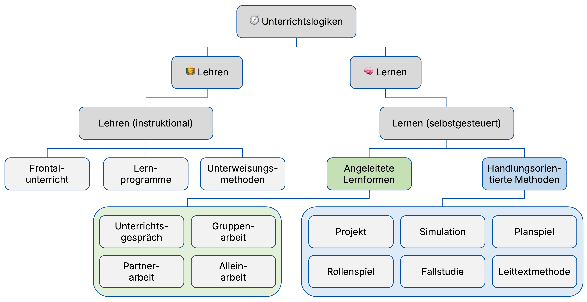

  <button id="md-copy-btn" title="Markdown kopieren (ohne Bilder)">📑</button>
  <button onclick="triggerPrint()" title="Blog speichern">📥</button>
  <button onclick="location.href='/iWIP/praesentation/fortbildung/lerntypen_lernformen_pruefungsformen/'" title="Zur Präsentationsansicht">🖥️</button>
  <button class="iwip_help_btn"
        type="button"
        aria-haspopup="dialog"
        aria-controls="iwip_help_overlay"
        aria-expanded="false"
        title="Hinweise zur Nutzung">
  ⓘ
  </button>



---

## 🧭 Hintergrund

Dieser Beitrag dokumentiert eine 90-minütige Online-Lehrkräftefortbildung mit rund 12 Teilnehmenden zu den Themen **Lerntypen**, **Lernformen** und **Prüfungsformen** 👥.

Die Fortbildung fand an einer Schule statt, die ihren Unterricht bewusst in Richtung **moderner, kompetenzorientierter Lehr-Lern-Arrangements** weiterentwickelt. Der Workshop versteht sich als kleiner Beitrag zu diesem laufenden Schulentwicklungsprozess 🤝🎨.

Leitidee der Veranstaltung ist eine **evidenzinformierte Perspektive** auf Unterricht: Forschung kann Orientierung geben und hilfreiche Einsichten liefern 🧠 – sie bietet jedoch keine einfachen Patentrezepte. Empirische Befunde müssen immer in konkrete Unterrichtssituationen und schulische Kontexte übersetzt werden 🪞.

Studien zeigen zudem, dass evidenzinformierte Schulentwicklung nicht allein durch Forschung entsteht, sondern vor allem durch **professionelle Gespräche, geeignete Strukturen und unterstützendes Leitungshandeln** ([Brown & Zhang 2017](#literatur)).  

Die Fortbildung setzt deshalb bewusst auf einen **dialogischen, partizipativen Ansatz**, der kurze, fokussierte Inputs mit Diskussion und Transfer verbindet und dabei auf **wenige, klare Formate statt vieler Methodenwechsel** setzt 🤝.

Zu jedem Themenfeld gibt es daher zunächst einen kurzen Input zu **Theorie und Empirie**, der anschließend gemeinsam diskutiert und auf Fragen der Unterrichts- und Schulentwicklung übertragen wird 💬.

> [!IMPORTANT]
> Evidenzinformierung bedeutet hier **begründete professionelle Entscheidungen im jeweiligen Schulkontext**.

---

## 💭 Ausgangsfrage

> [!TIPP]
> Was können aktuelle wissenschaftliche Erkenntnisse zu Lerntypen sowie zu Lernformen und Prüfungsformen für die Weiterentwicklung von Unterricht und Schule beitragen? 🪞

---

## 🎯 Lernziele

Die Teilnehmenden können nach der Fortbildung 🧠:

- den Lerntypen-Mythos wissenschaftlich einordnen und konstruktiv für die Unterrichtsgestaltung nutzen,
- Vor- und Nachteile zentraler Lernformen begründet vergleichen,
- die Passung von Lernzielen und Prüfungsformen systematisch prüfen und
- eine konkrete Änderung für die eigene Praxis planen.

> [!TIPP]
> Ziel ist nicht nur Verstehen, sondern handlungsfähige didaktische Entscheidungssicherheit im Alltag 🌱.

---

## 🧭 Aufbau & Ablauf 👥

**Gesamtdauer:** ca. 90 Minuten ⏱️

<!-- markdownlint-disable MD033 -->

| Phase | Inhalt | Ziel | Zeit |
| :---- | :----- | :--- | :--: |
| **1️⃣ Einstieg 💭** | Leitfrage, Rahmen, gemeinsame Orientierung | Arbeitsbündnis und Fokus 🧭 | ⏱️ 5 Min |
| **2️⃣ Lerntypen 🧠** | Evidenzlage und konstruktive Einordnung | Mythen klären, Handlungsoptionen öffnen 🪞 | ⏱️ 25 Min |
| **3️⃣ Lern- formen 🧩** | Didaktische Entscheidungslogik | Formate begründet wählen 🎯 | ⏱️ 25 Min |
| **4️⃣ Prüfungsformen 🎯** | Constructive Alignment und Passung | Kompetenzen angemessen sichtbar machen 👥 | ⏱️ 30 Min |
| **5️⃣ Transfer 🌱** | Take-aways und 14-Tage-Commitment | Umsetzung im Alltag sichern 🧭 | ⏱️ 5 Min |

<!-- markdownlint-enable MD033 -->

---

## Lerntypen 🧠

> [!TIPP]
> Welcher Lerntyp dominiert bei Ihren Schüler:innen?

Lerntypen

<figure class="figure-frame">
  
</figure>

Bildquelle: Eigene Darstellung · Illustration: erstellt mit Unterstützung von ChatGPT · Lizenz: <a href="https://creativecommons.org/licenses/by-sa/4.0/" target="_blank" rel="noopener">CC BY-SA 4.0</a>

- **Lerntypen** sind populäre, aber empirisch nicht belastbare Konstrukte, die Lernende in **feste Kategorien einteilen** ([Brand, 2025](#literatur); [Daumiller & Wisniewski, 2022](#literatur); [Menz et al., 2021](#literatur)) 🧠.

- Die Annahme, Lernen werde wirksamer, wenn Unterricht auf **stabile Lerntypen abgestimmt** wird („Matching-Hypothese“), lässt sich **empirisch nicht bestätigen** ([Newton & Salvi, 2020](#literatur)) ☝️.

- Gleichzeitig kann die Einteilung in Lerntypen das Risiko bergen, Lernende zu **etikettieren** und damit ihre **Entwicklungsmöglichkeiten zu begrenzen** ([Sun et al., 2023](#literatur)) 🪞.

- **Konstruktiv gewendet** kann die Kritik am Lerntypen-Konzept jedoch dazu anregen, **Methoden zu variieren** 🧩 und **Lernstrategieberatung gezielt einzusetzen**, um individuelle Lernpräferenzen zu berücksichtigen – **ohne diese als feste Kategorien zu verstehen** ([Daumiller & Wisniewski, 2022](#literatur)).

---

## Lernformen 🧩

- Lernformen beschreiben, **wie Lernen im Unterricht organisiert ist** – sie entstehen aus dem Zusammenspiel von Methoden 🧩, Sozialformen 👥 und der konkreten Aufgaben- und Steuerungsstruktur.
- [Euler & Hahn (2014)](#literatur) systematisieren Methoden entlang von 🎙️ Aktionsformen und 👥 Sozialformen.

Methoden in Abhängigkeit von Aktions- und Sozialform

| Aktions-/Sozialform: | 👥 Plenum | 👥 Gruppe | 👥 Partner | 👤 Einzeln |
| --- | --- | --- | --- | --- |
| 🎨 Selbst Darbieten | Vortrag / Vorführung | Instruktion | Instruktion | Instruktion |
| 💬 Im Dialog entwickeln | Lehrgespräch | Beratung / Moderation | Beratung / Moderation | Beratung / Moderation |
| 🌱 Erarbeiten & entdecken lassen | angeleitete Einzelarbeit | Gruppenarbeit | Partnerarbeit | Einzelarbeit |

Quelle: Eigene Darstellung in Anlehnung an <a href="#literatur">Euler & Hahn (2014, 319)</a> · Lizenz: <a href="https://creativecommons.org/licenses/by-sa/4.0/" target="_blank" rel="noopener">CC BY-SA 4.0</a>

- Während [Euler & Hahn (2014)](#literatur) Methoden als **Kombination von Aktions- und Sozialformen** fassen, ordnet [Bonz (2006, 339)](#literatur) das Methodenspektrum entlang grundlegender Unterrichtslogiken zwischen 👩‍🏫 Lehren und 🧠 Lernen:

Spektrum der Methoden beruflicher Schulen nach Bonz (2006)

<figure class="figure-frame">
  
</figure>

Bildquelle: Eigene Darstellung in Anlehnung an <a href="#literatur">Bonz (2006, 339)</a> · Lizenz: <a href="https://creativecommons.org/licenses/by-sa/4.0/" target="_blank" rel="noopener">CC BY-SA 4.0</a>

- Empirische Befunde zeigen, dass Unterrichtsmethoden **nicht per se überlegen sind**, sondern ihre Wirksamkeit von Lernzielen 🎯, Lernvoraussetzungen 👥 und der konkreten Umsetzung abhängt ([Nickolaus, 2018](#literatur); [Seifried & Sembill, 2010](#literatur)).
- Dabei zeigen sich jedoch **differenzielle Tendenzen**: Instruktional geprägte Lehrformen 👩‍🏫 können insbesondere den Erwerb von Fachkompetenz im Sinne deklarativen Wissens 📚 unterstützen, während stärker handlungsorientierte Lernformen 🧠 eher mit der Förderung von Sozial- und Selbstkompetenz 👥 in Verbindung gebracht werden.
- Die Perspektiven von [Euler & Hahn (2014)](#literatur) und [Bonz (2006)](#literatur) sowie die empirischen Erkenntnisse machen deutlich: Lernformen sind **keine festen Kategorien**, sondern Ergebnis didaktischer Entscheidungen entlang von Lernzielen 🎯, Inhalten 📚, Lernvoraussetzungen 👥 und notwendigem Scaffolding 🪜 (z. B. durch strukturierende Hinweise, Hilfen und Feedback).

---

## Prüfungsformen 🎯

- Prüfungen erfüllen mehrere Funktionen 🛠️:
  - **Diagnose und Rückmeldung** über erreichte Kompetenzen 🧠  
  - **Steuerung von Lernprozessen** 🪜  
  - **Selektion und Zertifizierung** im Bildungssystem 📊 ([Wilbers, 2025](#literatur))

- Daraus ergeben sich Anforderungen an die Gestaltung: Prüfungen sollen **lernförderlich 🧠** sowie **objektiv, reliabel und valide** sein.

- **Fehlpassungen** entstehen insbesondere dann, wenn **Handlungskompetenz 🤝 aufgebaut**, aber lediglich **Reproduktion von Wissen 📚 geprüft** wird. In solchen Fällen werden zentrale Kompetenzen **nicht angemessen erfasst**, wodurch Prüfungen ihre **diagnostische und steuernde Funktion** nur eingeschränkt erfüllen ([vgl. Deutscher et al., 2023](#literatur); [Wilbers, 2025](#literatur)).

- Empirische Analysen zeigen zudem, dass Prüfungsaufgaben häufig **wenig problemhaltig und authentisch** sind und damit **berufliche Handlungskompetenz 🤝 nur eingeschränkt erfassen** ([Wuttke et al., 2022](#literatur)).

- Prüfungen beeinflussen zugleich die **Ausrichtung von Lernprozessen 🧠** („assessment drives learning“): Lernende orientieren ihr Lernen an **wahrgenommenen Prüfungsanforderungen 🎯**. Empirische Studien zeigen, dass Prüfungsformate **Lernstrategien, Lernaufwand und die Qualität des Lernens 🧠** maßgeblich beeinflussen können ([Gibbs & Simpson, 2005](#literatur)).

- Prüfungen in der beruflichen Bildung sollten sich daher an **beruflicher Handlungskompetenz 🤝** orientieren und **praxisnah, authentisch und prozessorientiert** gestaltet sein ([Wilbers, 2025](#literatur)).

- Die Lernziel-Taxonomie nach [Anderson & Krathwohl (2001)](#literatur) bietet eine Möglichkeit, Prüfungsaufgaben systematisch entlang unterschiedlicher **kognitiver Anforderungen 🧠** zu gestalten:

Lernziel-Taxonomie nach Anderson & Krathwohl (2001)(Mouseover zeigt die Tabelleneinträge)

<table>
  <thead>
    <tr>
      <th rowspan="2">Wissensdimensionen:</th>
      <th colspan="6" style="text-align:center;">Kognitive Prozessdimensionen:</th>
    </tr>
    <tr>
      <th>🔁 Erinnern</th>
      <th>💡 Verstehen</th>
      <th>⚙️ An- wenden</th>
      <th>🔍 Ana- lysieren</th>
      <th>⚖️ Bewerten</th>
      <th>🛠️ Erschaffen</th>
    </tr>
  </thead>
  <tbody>
    <tr>
      <td>📚 Fakten- wissen</td>
      <td>Begriffe und Fakten erinnern</td>
      <td>Definitionen und Bedeutungen erklären</td>
      <td>Regeln und Formeln in vertrauten Situationen anwenden</td>
      <td>Elemente unterscheiden und zuordnen</td>
      <td>Richtigkeit von Ergebnissen überprüfen</td>
      <td>eigene Beispiele für Begriffe entwickeln</td>
    </tr>
    <tr>
      <td>🧠 Begriffliches Wissen</td>
      <td>Kategorien und Prinzipien benennen</td>
      <td>Zusammenhänge und Prinzipien erklären</td>
      <td>Konzepte auf neue Situationen anwenden</td>
      <td>Strukturen und Beziehungen analysieren</td>
      <td>Ansätze und Modelle vergleichen und beurteilen</td>
      <td>Modelle und Strukturen entwickeln</td>
    </tr>
    <tr>
      <td>🛠️ Verfahrensorientiertes Wissen</td>
      <td>Abläufe und Verfahren erinnern</td>
      <td>Vorgehensweisen und Regeln erklären</td>
      <td>Verfahren in Aufgaben ausführen</td>
      <td>Vorgehen in Einzelschritte zerlegen und analysieren</td>
      <td>Angemessenheit von Verfahren beurteilen</td>
      <td>neue Lösungswege und Verfahren entwickeln</td>
    </tr>
    <tr>
      <td>🪞 Metakognitives Wissen</td>
      <td>eigene Lernstrategien benennen</td>
      <td>Lernstrategien und deren Einsatz erklären</td>
      <td>geeignete Strategien zielgerichtet einsetzen</td>
      <td>eigenes Lernen und Vorgehen analysieren</td>
      <td>Lernprozesse und Strategien bewerten</td>
      <td>neue Lernstrategien entwickeln</td>
    </tr>
  </tbody>
</table>

Bildquelle: Eigene Darstellung in Anlehnung an <a href="#literatur">Anderson & Krathwohl (2001)</a> · Lizenz: <a href="https://creativecommons.org/licenses/by-sa/4.0/" target="_blank" rel="noopener">CC BY-SA 4.0</a>

- Entscheidend ist die **Passung zwischen Lernzielen 🎯, Lernaktivitäten 🧩 und Prüfungen** (Constructive Alignment). Prüfungen sind damit Teil eines **abgestimmten didaktischen Gesamtsystems** ([Anderson & Krathwohl, 2001](#literatur)).

---

## Nachhaltige Unterrichts- und Schulentwicklung 🗺️

Welche Schlüsse können aus den Erkenntnissen zu **Lerntypen**, **Lernformen** und **Prüfungsformen** gezogen werden, um Unterricht und Schule weiterzuentwickeln?

> [!IMPORTANT]
> Didaktische Entscheidungen stehen in **enger Wechselwirkung**:
> Weder Lerntypen 🧠, Lernformen 🧩 noch Prüfungen 🎯 entfalten für sich genommen Wirkung, sondern erst im Zusammenspiel innerhalb eines **kohärenten didaktischen Arrangements**.
>
> Empirische Befunde 🧠 liefern dabei **Orientierung**, müssen jedoch stets mit **konzeptionellen Überlegungen** und den **konkreten Rahmenbedingungen der Schule** verbunden werden 🪞.
>
> Erst wenn sich solche Arrangements in **Unterrichtspraxis und Schulkultur** niederschlagen, entsteht nachhaltige **Unterrichts- und Schulentwicklung im Sinne moderner beruflicher Bildung** 🤝.

---

## 📚 Literatur

Anderson, L. W., & Krathwohl, D. R. (2001). *A taxonomy for learning, teaching, and assessing*. Longman. 

Bonz, B. (2006). Methoden in der schulischen Berufsbildung. In R. Arnold & A. Lipsmeier (Hrsg.), *Handbuch der Berufsbildung* (S. 328-341). VS Verlag für Sozialwissenschaften.  

Brand, A. (2025). Der Lerntypen-Mythos und seine Folgen. *Deutsches Schulportal der Robert Bosch Stiftung*. <a href="https://deutsches-schulportal.de/bildungsforschung/der-lerntypen-mythos-und-seine-folgen/" target="_blank" rel="noopener noreferrer">https://deutsches-schulportal.de/bildungsforschung/der-lerntypen-mythos-und-seine-folgen/</a>

Brown, C., & Zhang, D. (2017). How can school leaders establish evidence-informed schools: An analysis of the effectiveness of potential school policy levers. *Educational Management Administration & Leadership, 45*(3), 382-401. 

Daumiller, M., & Wisniewski, B. (2022). Lerntypen - Warum es sie nicht gibt und sie sich trotzdem halten. *In-Mind, 3*. <a href="https://de.in-mind.org/article/lerntypen-warum-es-sie-nicht-gibt-und-sie-sich-trotzdem-halten" target="_blank" rel="noopener noreferrer">https://de.in-mind.org/article/lerntypen-warum-es-sie-nicht-gibt-und-sie-sich-trotzdem-halten</a>

Deutscher, V., Seifried, J., & Rausch, A. (2023). Digitales Prüfen prozess- und stakeholderorientiert denken mit der LUCA Office Simulation. *BWP Berufsbildung in Wissenschaft und Praxis, 52*(3), 21-25. <a href="https://www.bwp-zeitschrift.de/dienst/publikationen/download/19050" target="_blank" rel="noopener noreferrer">https://www.bwp-zeitschrift.de/dienst/publikationen/download/19050</a>

Euler, D. &amp; Hahn, A. (2014). <em>Wirtschaftsdidaktik.</em> Haupt Verlag.   

Gibbs, G., & Simpson, C. (2005). Conditions Under Which Assessment Supports Students’ Learning. Learning and Teaching in Higher Education, (1), 3–31. <a href="https://eprints.glos.ac.uk/3609/1/LATHE%201.%20Conditions%20Under%20Which%20Assessment%20Supports%20Students%27%20Learning%20Gibbs_Simpson.pdf" target="_blank" rel="noopener noreferrer">https://eprints.glos.ac.uk/3609/1/LATHE%201.%20Conditions%20Under%20Which%20Assessment%20Supports%20Students%27%20Learning%20Gibbs_Simpson.pdf</a>

Menz, C., Spinath, B., & Seifried, E. (2021). Misconceptions die hard: Prevalence and reduction of wrong beliefs in topics from educational psychology among preservice teachers. *European Journal of Psychology of Education, 36*(2), 477-494. 

Newton, P. M., & Salvi, A. (2020). How common is belief in the learning styles neuromyth, and does it matter? A pragmatic systematic review. *Frontiers in Education, 5*, 602451. 

Nickolaus, R. (2018). Orientierungspotenziale von Befunden empirischer Berufsbildungsforschung und Herausforderungen in Rezeptions- prozessen. In T. Tramm, M. Casper, & T. Schlömer (Hrsg.), Didaktik der beruflichen Bildung – Selbstverständnis, Zukunftsperspektiven und Innovationsschwerpunkte (S. 23–50). <a href="https://www.agbfn.de/dokumente/pdf/BIBB_111_092_AGBFN_Nickolaus.pdf" target="_blank" rel="noopener noreferrer">https://www.agbfn.de/dokumente/pdf/BIBB_111_092_AGBFN_Nickolaus.pdf</a>

Reinmann, G. (2013). Didaktisches Handeln. Die Beziehung zwischen Lerntheorien und didaktischem Design. In M. Ebner & S. Schön (Hrsg.), *L3T. Lehrbuch für Lernen und Lehren mit Technologien*. 

Seifried, J., & Sembill, D. (2010). Empirische Erkenntnisse zum handlungsorientierten Lernen in der kaufmännischen Bildung. *lernen & lehren, 25*(98), 61-66. <a href="http://lernenundlehren.de/heft_dl/Heft_98.pdf" target="_blank" rel="noopener noreferrer">http://lernenundlehren.de/heft_dl/Heft_98.pdf</a>

Sun, X., Norton, O., & Nancekivell, S. E. (2023). Beware the myth: Learning styles affect parents', children's, and teachers' thinking about children's academic potential. *npj Science of Learning, 8*(1), 46. 

Wilbers, K. (2025). *Wirtschaftsunterricht gestalten* (735 S.). epubli. 

Wuttke, E., Seeber, S., Geiser, C. & Turhan, L. (2022). Zur Problemhaltigkeit von Aufgaben in kaufmännischen Abschluss- und Zwischenprüfungen – Ergebnisse aus Aufgabenanalysen. Zeitschrift für Berufs- und Wirtschaftspädagogik, 118(1), 25–52. 
