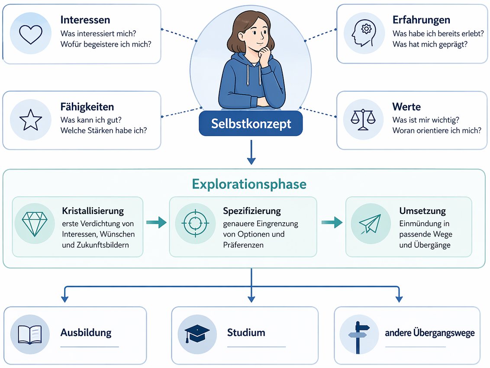
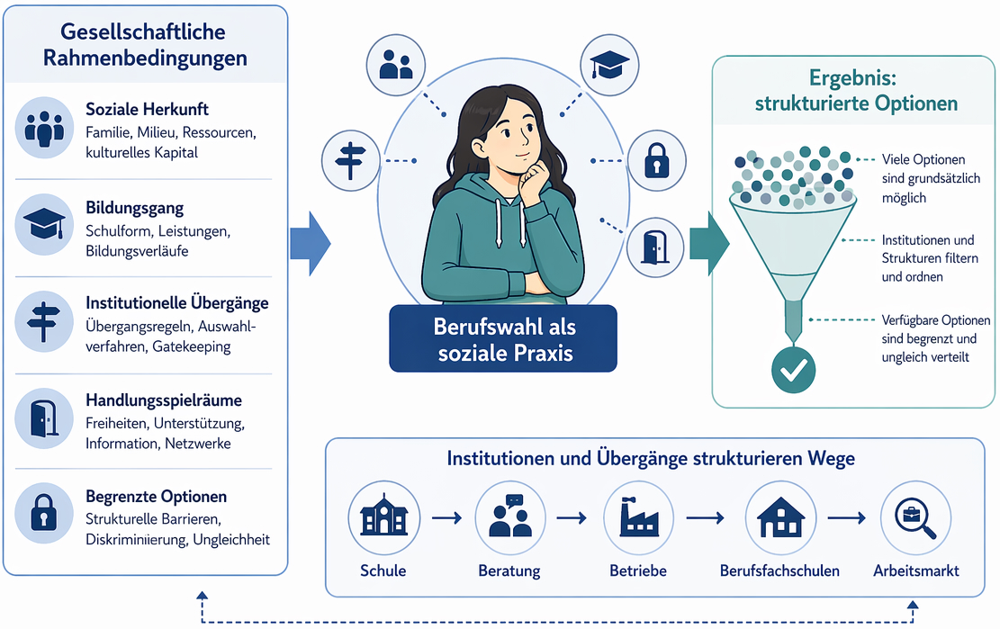
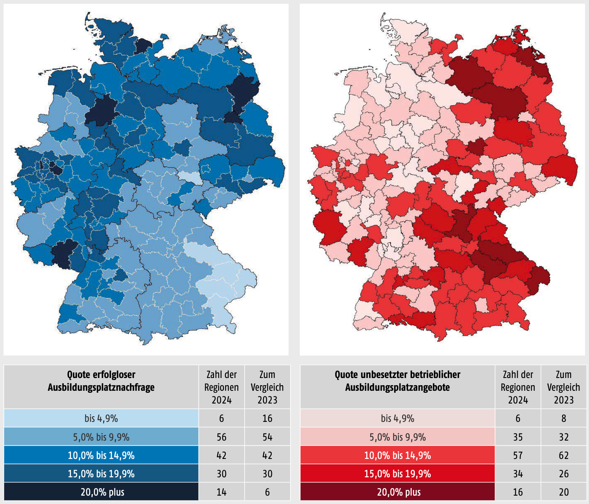
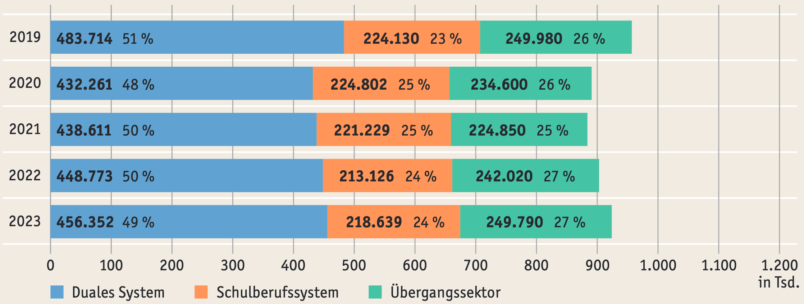

  <button id="md-copy-btn" title="Markdown kopieren (ohne Bilder)">📑</button>
  <button onclick="triggerPrint()" title="Blog speichern">📥</button>
  <button onclick="location.href='/iWIP/praesentation/lehre/bisy/berufswahl_erste_schwelle/'" title="Zur Präsentationsansicht">🖥️</button>
  <button class="iwip_help_btn"
        type="button"
        aria-haspopup="dialog"
        aria-controls="iwip_help_overlay"
        aria-expanded="false"
        title="Hinweise zur Nutzung">
  ⓘ
  </button>



---

# 📚 Gegenstand

Diese dritte Veranstaltung im Modul **Bildungssysteme** fragt danach, wie Menschen ihren Weg in den Beruf finden. Ausgangspunkt ist die Beobachtung, dass Berufswahl oft wie eine **individuelle Entscheidung** erscheint, tatsächlich aber in **biografische Erfahrungen**, **soziale Erwartungen** und **institutionelle Strukturen** eingebettet ist.

Die Sitzung verbindet deshalb einen **fallbezogenen Einstieg** über vier Personas mit einer systematisierenden Einführung in **Berufswahl**, **Berufswahltheorien**, **Berufsorientierung** und das **Übergangssystem**. Damit knüpft sie an die vorangegangene Veranstaltung zum deutschen Bildungssystem an und verschiebt den Fokus von der Systemstruktur stärker auf die **erste Schwelle** zwischen Schule und Beruf.

# 💭 Leitfrage

> [!TIPP]
> Wie entsteht **Berufswahl** zwischen **subjektiver Passung**, **sozialer Einbettung** und **institutioneller Steuerung**?

# 🎯 Lernziele

Die Studierenden lernen, ...

- 🧠 an Fallbeispielen Faktoren zu analysieren, die Berufswahlentscheidungen an der ersten Schwelle prägen.
- 🧭 Berufswahl als biografischen, sozialen und institutionell gerahmten Prozess zu definieren und einzuordnen.
- ⚖️ mit <a href="#literatur">Super (1990)</a> und <a href="#literatur">Wehking (2020)</a> einen psychologischen und einen soziologischen Zugang zur Erklärung von Berufswahl zu vergleichen.
- 💬 Möglichkeiten und Grenzen von Berufsorientierung vor dem Hintergrund ungleicher Übergangschancen zu beurteilen.

Die Sitzung vermittelt bewusst **Grundlagen**. Ziel ist eine **tragfähige erste Systematisierung**.

---

# 🧭 Aufbau & Ablauf

**Gesamtdauer:** ca. 90 Minuten ⏱️

| Phase | Inhalt | Ziel | Zeit |
|:------|:--------|:------|:------:|
| **1. Einstieg 👥** | Arbeit mit vier Personas zur Berufseinmündung | Berufswahl als konkreten Fall analysieren | ⏱️ 25 Min |
| **2. Begriff & Überblick 🧭** | Berufswahl definieren und Theoriegruppen systematisieren | begriffliche und analytische Ordnung schaffen | ⏱️ 10 Min |
| **3. Theorievergleich 🧠** | <a href="#literatur">Super (1990)</a> und <a href="#literatur">Wehking (2020)</a> kontrastiv einführen | individuelle und gesellschaftliche Perspektive unterscheiden | ⏱️ 20 Min |
| **4. Berufsorientierung 🔎** | Definition, Ziele und Maßnahmen mit Rückbezug auf MV | Unterstützungslogiken sichtbar machen | ⏱️ 15 Min |
| **5. Kritische Zuspitzung ⚠️** | Matching-Probleme, drei Sektoren und Übergangssystem | Grenzen gelingender Einmündung diskutieren | ⏱️ 20 Min |

---

# 1. Einstieg – Berufswahl an der ersten Schwelle 👥

Die **erste Schwelle** zwischen **Schule und Beruf** ist ein zentraler Moment der beruflichen Entwicklung. Sie ist geprägt von der Suche nach **Orientierung**, der Auseinandersetzung mit **eigenen Interessen** und der Einmündung in unterschiedliche **berufliche Tätigkeiten**.

Erste Schwelle des Bildungssystems in Deutschland



Bildquelle: Eigene Darstellung in Anlehnung an <a href="#literatur">KMK (2023)</a> · Lizenz: <a href="https://creativecommons.org/licenses/by-sa/4.0/" target="_blank" rel="noopener noreferrer">CC BY-SA 4.0</a>

Der Einstieg erfolgt über vier kurze Personas, die **unterschiedliche Formen der Berufseinmündung** repräsentieren: Studium, duale Ausbildung, schulische Berufsausbildung und geschützter Arbeitsplatz.

Vier Personas zur Berufswahl an der ersten Schwelle

<figure class="figure-frame">
  
</figure>

Bildquelle: Eigene Darstellung (erstellt mit ChatGPT) · Lizenz: <a href="https://creativecommons.org/licenses/by-sa/4.0/" target="_blank" rel="noopener noreferrer">CC BY-SA 4.0</a>

## Arbeitsauftrag in Partnerarbeit

Lesen Sie sich Ihre <a href="/iWIP/blog/lehre/bisy/berufswahl_erste_schwelle_bsp/">Persona</a> aufmerksam durch und analysieren Sie gemeinsam:

- Welche biografischen Hinweise deuten auf Interessen, Selbstbilder, Erfahrungen und wahrgenommene Stärken der Person hin?
- Welche sozialen Kontexte und institutionellen Erfahrungen scheinen die Entscheidung mitzuprägen?
- Welche Erwartungen an Arbeit, Beruf und Zukunft werden sichtbar?
- Wie lässt sich vorläufig erklären, warum diese Einmündung für die Person plausibel oder attraktiv erscheint?

> [!TIPP]
> Entwickeln Sie eine kurze Erklärung von maximal zwei Minuten, warum sich die jeweilige Person für diesen Weg in den Beruf entschieden hat.

## Funktion des Einstiegs

Die Personas erzeugen einen doppelten Erkenntnisgewinn:

- Sie machen sichtbar, dass Berufswahl immer eine **biografische Geschichte** hat.
- Sie eröffnen zugleich den Blick dafür, dass diese Geschichten unter **ungleichen sozialen und institutionellen Bedingungen** entstehen.

Dadurch wird sichtbar, dass Berufswahl weder auf „Interesse“ noch auf „freie Wahl“ reduziert werden kann. Dieser Einstieg bereitet auf die Kategorien vor, die im weiteren Verlauf mit Theorien und Strukturbegriffen präzisiert werden.

---

# 2. Berufswahl definieren und systematisieren 🧭

Berufswahl lässt sich für diese Sitzung sinnvoll als **wiederkehrender Lern-, Such- und Entscheidungsprozess** verstehen. Sie ist in eine **längere berufliche Entwicklung** eingebettet und steht unter **gesellschaftlichen Bedingungen**.

In der deutschsprachigen Diskussion wird dafür häufig eine Perspektive genutzt, die auf <a href="#literatur">Bußhoff (1989)</a> zurückgeführt wird: 

> [!QUOTE]
> Berufswahl ist eine interaktive Lern- und Entscheidungsphase, die in lebenslange berufliche Entwicklung eingebunden ist, sich wiederholt und zur Einmündung in unterschiedliche berufliche Tätigkeiten beiträgt.

In dieser Veranstaltung betrachten wir drei Perspektiven: **Person**, **soziales Umfeld** und **reale Entscheidungsoptionen**.

## Ein knapper Überblick über Berufswahlansätze

Bevor einzelne Theorien vertieft werden, hilft eine grobe Systematisierung:

- **Entscheidungstheoretische Ansätze** rücken den konkreten individuellen Entscheidungsprozess ins Zentrum, etwa rationales, kriterienorientiertes Entscheiden oder schrittweises „muddling through“.
- **Psychologische Ansätze** fragen nach Interessen, Selbstkonzept, Entwicklung und wahrgenommener Passung zwischen Person und Beruf.
- **Soziologische Ansätze** thematisieren soziale Herkunft, Milieu, Sozialisation, Bildungswege, institutionelle Selektionsmechanismen und ungleiche Chancen.

---

# 3. Zwei Zugänge zur Berufswahl: <a href="#literatur">Super (1990)</a> und <a href="#literatur">Wehking (2020)</a> 🧠

## <a href="#literatur">Super (1990)</a>: Berufswahl als Entwicklung des Selbstkonzepts

<a href="#literatur">Super (1990)</a> versteht berufliche Entwicklung als Teil eines **lebenslangen Entwicklungsprozesses**. Entscheidend ist, dass Menschen im Verlauf ihrer Biografie ein berufliches **Selbstkonzept** ausbilden, erproben und umsetzen. Für die erste Schwelle ist vor allem die **Explorationsphase** anschlussfähig.

Diese Phase lässt sich vereinfacht in drei Schritte fassen:

- **Kristallisierung:** erste Verdichtung von Interessen, Wünschen und Zukunftsbildern  
- **Spezifizierung:** genauere Eingrenzung von Optionen und Präferenzen  
- **Umsetzung:** Einmündung in Ausbildung, Studium oder andere Übergangswege  

Die Personas lassen sich mit <a href="#literatur">Super (1990)</a> gut lesen, weil sie Hinweise auf **Interessen**, **Selbstbilder**, **Erfahrungen**, **Unterstützung** und **erste Zukunftsentwürfe** sichtbar machen. Besonders anschlussfähig sind hier Praktikum, FSJ, Gespräche mit Eltern oder Ausbilder:innen sowie die Frage, welche Tätigkeiten als passend erlebt werden.

> [!IMPORTANT]
> Bei <a href="#literatur">Super (1990)</a> ist Berufswahl nicht nur Auswahl, sondern die **Umsetzung eines beruflichen Selbstkonzepts im Verlauf der Lebensspanne**.

Folgende Grafik fasst die zentralen Elemente von <a href="#literatur">Supers (1990)</a> Ansatz didaktisch reduziert zusammen:

Berufswahl als Entwicklung des Selbstkonzepts nach <a href="#literatur">Super (1990)</a>

<figure class="figure-frame">
  
</figure>

Bildquelle: Eigene Darstellung (erstellt mit ChatGPT) · Lizenz: <a href="https://creativecommons.org/licenses/by-sa/4.0/" target="_blank" rel="noopener noreferrer">CC BY-SA 4.0</a>

## <a href="#literatur">Wehking (2020)</a>: Berufswahl unter gesellschaftlichen Bedingungen

<a href="#literatur">Wehking (2020)</a> akzentuiert stärker, dass Berufswahl nicht allein individuell erklärbar ist. Berufswahl entsteht vielmehr im Zusammenspiel von **sozialer Herkunft**, **Bildungsgang**, **institutionellen Übergängen**, **Handlungsspielräumen** und **begrenzten Optionen**.

Didaktisch lässt sich diese Perspektive in Anlehnung an <a href="#literatur">Bußhoff (1989)</a> in drei Richtungen zuspitzen:

- **Allokation und Ungleichheit:** Nicht alle Jugendlichen verfügen über die gleichen Chancen und Zugänge.
- **Sozialisation und Rollenbilder:** Familie, Geschlecht, Milieu und Anerkennungserfahrungen prägen Berufswahl mit.
- **Übergänge und Institutionen:** Schule, Beratung, Betriebe, Berufsfachschulen und Arbeitsmarkt ordnen Optionen nicht neutral, sondern strukturieren sie mit.

Gerade die vier Personas zeigen, dass Berufswahl deshalb nie nur eine Frage der „richtigen“ Entscheidung ist. Sie ist immer auch davon abhängig, welche Wege gesellschaftlich nahegelegt, ermöglicht oder erschwert werden.

Folgende Grafik verdichtet <a href="#literatur">Wehkings (2020)</a> Perspektive auf Berufswahl unter gesellschaftlichen Bedingungen:

Berufswahl unter gesellschaftlichen Bedingungen nach <a href="#literatur">Wehking (2020)</a>

<figure class="figure-frame">
  
</figure>

Bildquelle: Eigene Darstellung (erstellt mit ChatGPT) · Lizenz: <a href="https://creativecommons.org/licenses/by-sa/4.0/" target="_blank" rel="noopener noreferrer">CC BY-SA 4.0</a>

## Kontrastive Zuspitzung

Der Vergleich beider Perspektiven hilft, Übervereinfachungen zu vermeiden:

- **<a href="#literatur">Super (1990)</a>** erklärt gut, warum **Berufswahl biografisch plausibel** und **subjektiv stimmig** erscheinen kann.
- **<a href="#literatur">Wehking (2020)</a>** erklärt besser, warum **Berufswahl** unter **ungleichen Voraussetzungen** stattfindet und **institutionell gerahmt** ist.

Erst in der Zusammenschau wird sichtbar, dass Berufswahl weder rein frei noch vollständig strukturell determiniert ist.

---

## Weitere Zugänge zur Berufswahl

Im Kontext von Berufswahl können auch die Theorie von <a href="#literatur">Holland (1997)</a> und die Social Cognitive Career Theory (SCCT) von <a href="#literatur">Lent et al. (1994)</a> genannt werden: **<a href="#literatur">Holland (1997)</a>** steht stärker für **Interessen- und Passungslogiken**, **<a href="#literatur">Lent et al. (1994)</a>** stärker für **Selbstwirksamkeit, Ergebniserwartungen und Kontextbedingungen**. Vertieft werden in dieser Veranstaltung jedoch <a href="#literatur">Super (1990)</a> und <a href="#literatur">Wehking (2020)</a>, weil sie für die Leitfrage den größten Erklärungsgewinn bieten.

---

# 4. Berufsorientierung als Unterstützung von Berufswahl 🔎

Berufsorientierung lässt sich als Prozess verstehen, in dem Individuen ihre Interessen, Wünsche, Kenntnisse und Fähigkeiten mit Möglichkeiten, Anforderungen und Bedarfen der Arbeits- und Berufswelt in Beziehung setzen.

<a href="#literatur">Deeken und Butz (2010)</a> beschreiben Berufsorientierung als einen **lebenslangen Prozess der Annäherung und Abstimmung** zwischen Person und Berufswelt. Für die Lehre ist daran vor allem anschlussfähig, dass Berufsorientierung nicht nur Information, sondern die Entwicklung von **Berufswahlkompetenz** meint.

## Rückbezug auf die letzte Vorlesung und auf Mecklenburg-Vorpommern

Die letzte Vorlesung hat bereits gezeigt, dass Bildungssysteme auch über Länderregelungen, Rechtsrahmen und institutionelle Ausgestaltung funktionieren. Daran kann hier angeknüpft werden: In Mecklenburg-Vorpommern wird schulische Berufsorientierung im Konzept „Alle werden gebraucht! Schulische Berufliche Orientierung für einen guten Übergang in Ausbildung und Beruf“<a href="#literatur">(BM o. J. 1).</a> konkretisiert.

Maßnahmen in Mecklenburg-Vorpommern sind bspw. <a href="#literatur">(BM o. J. 2).</a>:

- **Praxislerntag** als verbindlicher praxisnaher Orientierungsbaustein
- **Schülerbetriebspraktika** und weitere Formen praxisnaher Erkundung
- **Beratung, Begleitung und Materialien** wie BOje, Berufswahlpass oder Kooperationen mit der Bundesagentur für Arbeit

Damit wird deutlich: **Berufsorientierung** ist **pädagogisch gewollt** und **institutionell organisiert**. Sie soll unterstützen, kann aber ungleiche Startbedingungen nicht einfach aufheben.

---

# 5. Wenn Orientierung nicht reicht: Matching-Probleme und Übergangssystem ⚠️

> [!IMPORTANT]
> Wenn Berufsorientierung gut funktioniert, warum münden dann nicht alle Jugendlichen direkt in Ausbildung ein?

Diese Frage öffnet den Blick auf ein **zentrales Spannungsfeld** des **Ausbildungsmarktes**: Auch dann, wenn Jugendliche suchen und Betriebe ausbilden wollen, kommt es nicht automatisch zu passenden Einmündungen.

## Matching- und Passungsprobleme

Ein analytischer Schlüsselbegriff ist das **Matching- bzw. Passungsproblem**. Es verweist darauf, dass Angebot und Nachfrage nicht einfach zueinanderfinden. Gründe dafür können regional, beruflich, sozial oder qualifikationsbezogen sein.

Anteile erfolgloser Marktteilnahmen in den Regionen im Jahr 2024

<figure class="figure-frame">
  
</figure>

Bildquelle: <a href="#literatur">Bundesinstitut für Berufsbildung (2025, 26)</a> · Ausschnitt · Lizenz: <a href="https://creativecommons.org/licenses/by-sa/4.0/" target="_blank" rel="noopener noreferrer">CC BY-SA 4.0</a> · <a href="https://www.bibb.de/dienst/publikationen/de/20621" target="_blank" rel="noopener noreferrer">Quelle aufrufen</a>

Am Beispiel der regionalen Gegenüberstellung von **erfolgloser Ausbildungsplatznachfrage** und **unbesetzten Ausbildungsstellen** lässt sich zeigen: Es gibt zugleich unversorgte Jugendliche und unbesetzte Stellen in Ausbildungsunternehmen. Das verweist auf ein **strukturelles Passungsproblem** und **nicht nur auf individuelles Scheitern**.

## Die drei Sektoren des beruflichen Ausbildungssystems

Verteilung der Neuzugänge auf die 3 Sektoren  des beruflichen Ausbildungssystems 2019 bis 2023

<figure class="figure-frame">
  
</figure>

Bildquelle: <a href="#literatur">Autorengruppe Bildungsberichterstattung (2024, 177)</a>  · Ausschnitt · Lizenz: <a href="https://creativecommons.org/licenses/by-sa/3.0/de/" target="_blank" rel="noopener noreferrer">CC BY-SA 3.0 DE</a>

Die integrierte Ausbildungsberichterstattung unterscheidet drei Sektoren:

- **Duales System**
- **Schulberufssystem**
- **Übergangssektor**

Gerade der Übergangssektor ist für die Sitzung zentral, weil er sichtbar macht, dass **Einmündungen an der ersten Schwelle** nicht nur in **vollqualifizierende Ausbildung** führen, sondern häufig zunächst in **vorbereitende oder kompensatorische Angebote**.

## Das Übergangssystem definieren und problematisieren

Das <a href="#literatur">Konsortium Bildungsberichterstattung (2006)</a> definiert das **Übergangssystem** als Gesamtheit jener Bildungsangebote,

> [!QUOTE]
> „die unterhalb einer qualifizierten Berufsausbildung liegen bzw. zu keinem anerkannten Ausbildungsabschluss führen, sondern auf eine Verbesserung der individuellen Kompetenzen von Jugendlichen zur Aufnahme einer Ausbildung oder Beschäftigung zielen und zum Teil das Nachholen eines allgemein bildenden Schulabschlusses ermöglichen.“

Das Übergangssystem soll demnach den Übergang in Ausbildung oder Beschäftigung ermöglichen. Allerdings ist die **„Systematik“ fragwürdig**, weil die Angebote **heterogen**, **regional verschieden**, **politisch unterschiedlich motiviert** und **rechtlich uneinheitlich geregelt** sind.

Für die Diskussion in der Vorlesung lassen sich daraus drei Lesarten ableiten:

- Das Übergangssystem ist **Unterstützung**, weil es Qualifizierung, Orientierung und Nachqualifizierung ermöglichen kann.
- Das Übergangssystem ist **Sortierung**, weil sich in ihm soziale Ungleichheiten und Selektionsprozesse bündeln.
- Das Übergangssystem ist teilweise **Warteschleife**, weil Einmündungen verzögert und nicht immer in vollqualifizierende Ausbildung überführt werden.

An dieser Stelle kann auch die Debatte um **Ausbildungsreife** aufgegriffen werden. Der Begriff individualisiert Probleme schnell, obwohl Passungs- und Strukturprobleme mitwirken. Für eine Grundlagenveranstaltung ist es didaktisch sinnvoll, diesen Punkt eher diskursiv zu öffnen als mit weiteren Grafiken zu überfrachten.

---

# 💬 Abschluss und Rückbindung an die Leitfrage

Berufswahl entsteht weder als rein freier individueller Akt noch als bloßes Produkt gesellschaftlicher Struktur. Sie entsteht im Zusammenspiel von **Interessen**, **Erfahrungen**, **Selbstkonzepten**, **sozialen Einflüssen**, **institutionellen Angeboten** und **ungleichen Einmündungschancen**.

## Literatur und Quellen

Autorengruppe Bildungsberichterstattung. (2024). Bildung in Deutschland 2024: Ein indikatorengestützter Bericht mit einer Analyse zu beruflicher Bildung. wbv Publikation.

BM (Ministerium für Bildung und Kindertagesförderung Mecklenburg-Vorpommern) (o. J. 1). Konzept „Alle werden gebraucht! Schulische Berufliche Orientierung für einen guten Übergang in Ausbildung und Beruf“. <a href="https://www.bildung-mv.de/unterricht/berufliche-orientierung/praxislerntag/" target="_blank" rel="noopener noreferrer">https://www.bildung-mv.de/unterricht/berufliche-orientierung/praxislerntag/</a>.

BM (Ministerium für Bildung und Kindertagesförderung Mecklenburg-Vorpommern) (o. J. 2). Berufliche Orientierung – Der Wegweiser in die berufliche Zukunft. <a href="https://www.bildung-mv.de/unterricht/berufliche-orientierung/" target="_blank" rel="noopener noreferrer">https://www.bildung-mv.de/unterricht/berufliche-orientierung/</a>

Bundesinstitut für Berufsbildung. (2025). Datenreport zum Berufsbildungsbericht 2025. Informationen und Analysen zur Entwicklung der berufl ichen Bildung. https://www.bibb.de/dienst/publikationen/de/20621

Bußhoff, L. (1989). Berufswahl: Theorien und ihre Bedeutung für die Praxis der Berufsberatung. Kohlhammer.

Deeken, S. & Butz, B. (2010). Berufsorientierung. Beitrag zur Persönlichkeitsentwicklung. <a href="https://www.bibb.de/dienst/publikationen/download/6544" target="_blank" rel="noopener noreferrer">https://www.bibb.de/dienst/publikationen/download/6544</a>

Holland, J. (1997). Making vocational choices. A theory of vocational personalities and work en-vironments. Odessa: Psychological Assessment Resources.

Konsortium Bildungsberichterstattung (2006). Bildung in Deutschland: Ein indikatorengestützter Bericht mit einer Analyse zu Bildung und Migration. Bertelsmann.

KMK (Kultusministerkonferenz). (2023). Grundstruktur des Bildungswesens in der Bundesrepublik Deutschland [Diagramm]. <a href="https://www.kmk.org/fileadmin/Dateien/pdf/Dokumentation/de_2023.pdf" target="_blank" rel="noopener noreferrer">https://www.kmk.org/fileadmin/Dateien/pdf/Dokumentation/de_2023.pdf</a>

Lent, R. W., Brown, S. D., & Hackett, G. (1994). Toward a Unifying Social Cognitive Theory of Career and Academic Interest, Choice, and Performance. Journal of Vocational Behavior, 45(1), 79–122. <a href="https://doi.org/10.1006/jvbe.1994.1027" target="_blank" rel="noopener noreferrer">https://doi.org/10.1006/jvbe.1994.1027</a>

Super, D. E. (1990). A Life-Span, Life-Space Approach to Career Development. In D. Brown & L. Brooks (Hrsg.), Career choice and development. Applying contemporary theories to practice (2. Aufl., S. 197–261). San Francisco & Oxford: Jossey-Bass.

Wehking, K. (2020). Berufswahl und Fluchtmigration: Berufspragmatismus im Kontext von Übergängen. Wiesbaden: Springer VS.