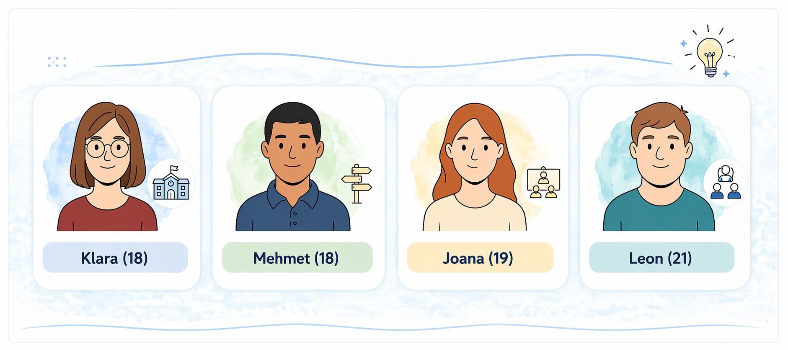

  <button id="md-copy-btn" title="Markdown kopieren (ohne Bilder)">📑</button>
  <button onclick="triggerPrint()" title="Blog speichern">📥</button>
  <button class="iwip_help_btn"
        type="button"
        aria-haspopup="dialog"
        aria-controls="iwip_help_overlay"
        aria-expanded="false"
        title="Hinweise zur Nutzung">
  ⓘ
  </button>



---

# 👥 **Personas – Berufswahl an der ersten Schwelle**

Vier Personas zur Berufswahl an der ersten Schwelle

<figure class="figure-frame">
  
</figure>

Bildquelle: Eigene Darstellung (erstellt mit ChatGPT) · Lizenz: <a href="https://creativecommons.org/licenses/by-sa/4.0/" target="_blank" rel="noopener noreferrer">CC BY-SA 4.0</a>

## 👥 **Gruppe 1 – Klara (18 Jahre)**

Klara hat im letzten Herbst ein Studium der Geschichte an einer Universität begonnen. Sie lebt inzwischen in einer WG in Leipzig und schreibt nebenbei Artikel für einen kleinen Online-Blog. Im Studium liebt sie die Archivarbeit, ist aber manchmal von der Theorie überfordert. Die Entscheidung fürs Studium traf sie nach einem langen Gespräch mit ihrer Mutter. Ihr Vater war skeptisch, hat sich aber mittlerweile arrangiert. Klara sagt selbst, dass sie „zwar keine Karriereplanung“ habe, aber einfach das machen wollte, was sie begeistert.

## 👥 **Gruppe – Mehmet (18 Jahre)**

Mehmet hat vor drei Monaten seine Ausbildung als Mechatroniker begonnen. Er arbeitet in einem mittelständischen Betrieb und ist dort besonders für die Wartung von Anlagen zuständig. Er berichtet, dass ihm die Arbeit Spaß macht, weil sie „handfest“ sei – und weil er direkt sieht, was er geschafft hat. Die Entscheidung zur Ausbildung fiel nach einem Praktikum und einem Gespräch mit dem Ausbildungsleiter – statt Fachabi war für ihn der schnellere Weg in den Beruf attraktiver. Seine Eltern sind stolz und unterstützen ihn weiterhin.

## 👥 **Gruppe – Joana (19 Jahre)**

Joana ist im zweiten Ausbildungsjahr zur Erzieherin an einer Fachschule. Sie arbeitet im Wechsel in Theoriephasen und in einer inklusiven Kita. Sie sagt, sie habe „nie so richtig geplant“, in dem Beruf zu landen, aber das FSJ habe ihr „die Augen geöffnet“. Die Arbeit sei anstrengend, aber sinnstiftend. Besonders stolz ist sie, wenn sie sieht, dass Kinder durch ihre Unterstützung Fortschritte machen. Die Berufswahl wurde von ihrer Mutter positiv begleitet – ihr Vater fand das anfangs „nichts für eine mit Abi“, hat aber seine Meinung geändert.

## 👥 **Gruppe – Leon (21 Jahre)**

Leon arbeitet seit sechs Monaten in einem Logistikzentrum als Aushilfe auf einem geschützten Arbeitsplatz. Er sortiert Pakete und kümmert sich um einfache Lagertätigkeiten. Er sagt, er sei „sehr zufrieden“, weil er weiß, was von ihm erwartet wird. Die Aufgabe gebe ihm Sicherheit und Selbstvertrauen. Die Entscheidung fiel gemeinsam mit seinem Betreuer und seiner Mutter. Ein Job mit Verantwortung wäre für ihn aktuell zu viel, aber er fühlt sich gebraucht – und das sei das Wichtigste.
