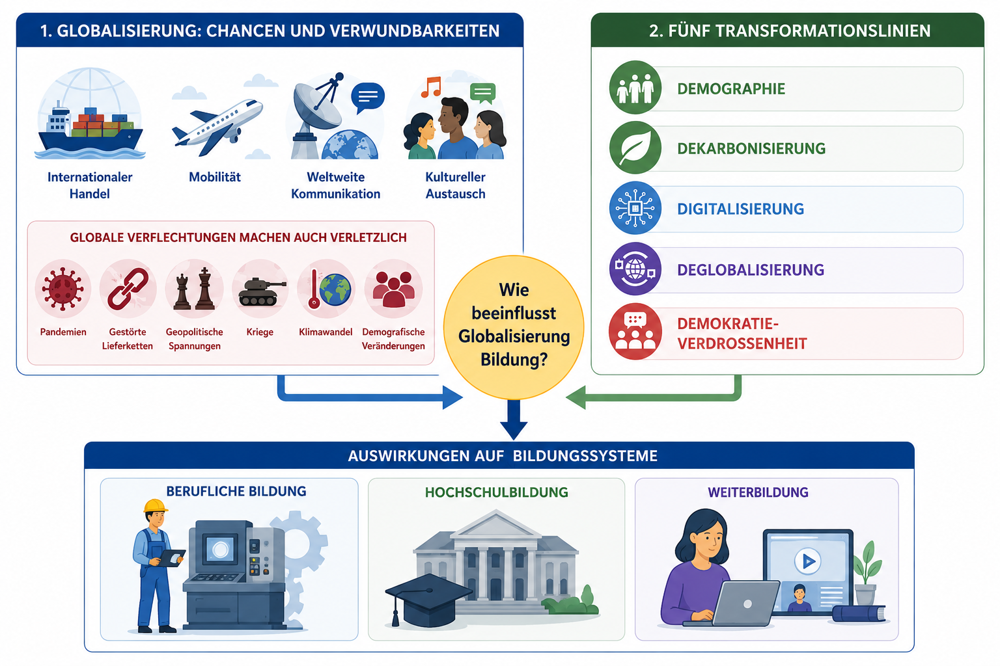
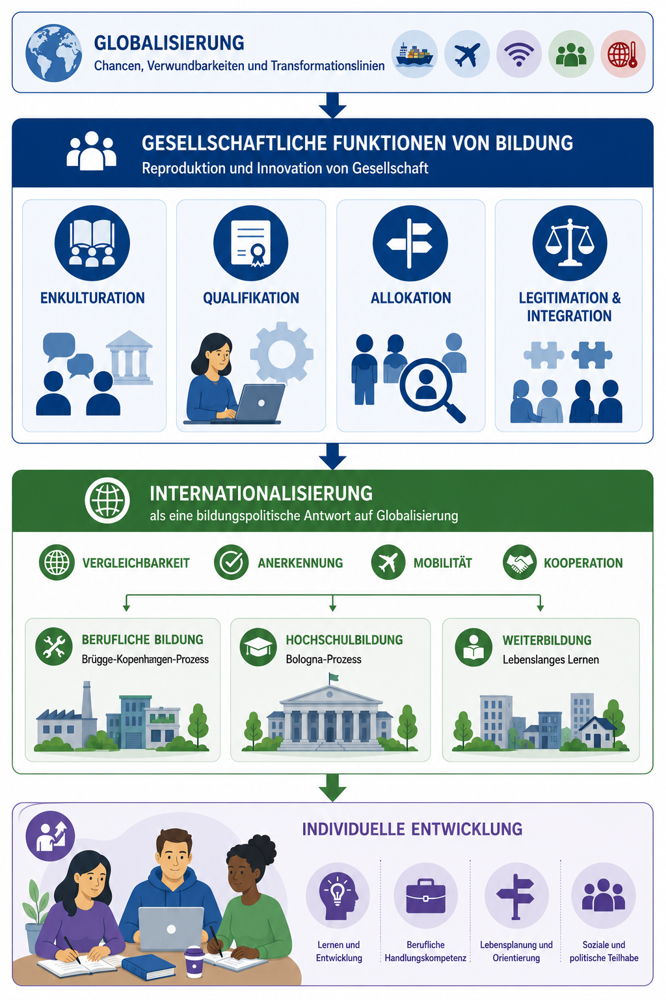

  <button id="md-copy-btn" title="Markdown kopieren (ohne Bilder)">📑</button>
  <button onclick="triggerPrint()" title="Blog speichern">📥</button>
  <button onclick="location.href='/iWIP/praesentation/lehre/bisy/bildung_weltweit/'" title="Zur Präsentationsansicht">🖥️</button>
  <button class="iwip_help_btn"
        type="button"
        aria-haspopup="dialog"
        aria-controls="iwip_help_overlay"
        aria-expanded="false"
        title="Hinweise zur Nutzung">
  ⓘ
  </button>



## 🧭 Hintergrund

Bildungssysteme stehen heute unter einem doppelten Druck: Sie sollen soziale Teilhabe sichern und zugleich auf tiefgreifende globale Veränderungen reagieren. Für Studierende der Wirtschaftspädagogik wird damit zentral, nicht nur Institutionen zu beschreiben, sondern deren Steuerungslogiken vergleichend zu analysieren. Der Beitrag verdichtet diese Perspektive entlang der fünf Transformationslinien Demografie, Dekarbonisierung, Digitalisierung, Deglobalisierung und Demokratieverdrossenheit.

## 💭 Ausgangsfrage

Wie reagieren Bildungssysteme auf globale gesellschaftliche und wirtschaftliche Herausforderungen, und warum unterscheiden sich Berufsbildung, Hochschulbildung und Weiterbildung in ihren Antworten?

## 🎯 Lernziele

- 🧠 Sie erläutern die 5D-Transformationslinien als analytischen Rahmen für Bildungsentwicklungen.
- 🧩 Sie vergleichen Berufsbildung, Hochschulbildung und Weiterbildung anhand zentraler Funktionen und Steuerungsinstrumente.
- 🤝 Sie ordnen Bologna- sowie Brügge-Kopenhagen-Prozess in ihren Zielen, Chancen und Spannungen ein.
- 🪞 Sie reflektieren Zielkonflikte zwischen Vergleichbarkeit, Teilhabe, Qualität und Verwertungslogik.

## Ablauf

**Gesamtdauer:** ca. 90 Minuten ⏱️

| Phase | Inhalt | Ziel | Zeit |
|:------|:--------|:------|:------:|
| **1️⃣ Einstieg** | Whiteboard-Brainstorming und Stimmungsbarometer | Vorwissen aktivieren, Perspektiven sichtbar machen | ⏱️ 8 Min |
| **2️⃣ Rahmung** | 5D-Transformationslinien und Bildungsfolgen | Gemeinsames Analysegerüst herstellen | ⏱️ 10 Min |
| **3️⃣ Vergleichsraster** | Drei Bildungsbereiche und Leitkriterien | Arbeitsrahmen für Gruppenanalyse klären | ⏱️ 4 Min |
| **4️⃣ Gruppenarbeit** | Recherche und Analyse entlang von Leitfragen | Eigenständige, quellenbasierte Urteilsbildung | ⏱️ 45 Min |
| **5️⃣ Sicherung & Reflexion** | Kurzberichte, Vergleich und Transfer | Ergebnisse bündeln und Spannungen diskutieren | ⏱️ 23 Min |

## 🧠 Globale Transformationslinien als Analysegerüst

Der Einstieg über spontanes Sammeln globaler Entwicklungen wird im zweiten Schritt systematisiert. Dafür dient das 5D-Modell als verdichtetes Raster, um Wirkungen auf Arbeit, Qualifikation und Bildungsorganisation vergleichbar zu machen (vgl. <a href="#literatur">BMAS, 2017</a>; <a href="#literatur">BIBB, 2024</a>).

| 🔄 Transformationslinie | Bedeutung für Arbeit und Bildung |
|---|---|
| **Demografie** | Alterung, Migration, Fachkräftesicherung und Anerkennung von Qualifikationen |
| **Dekarbonisierung** | Green Skills, nachhaltige Wirtschaftsweisen, Umbau von Berufsbildern |
| **Digitalisierung** | KI, Automatisierung, neue Kompetenzprofile, digitale Lern- und Arbeitsformen |
| **Deglobalisierung** | fragile Lieferketten, Resilienz, regionale Qualifizierung |
| **Demokratieverdrossenheit** | politische Polarisierung, Teilhabeprobleme, Legitimitätsfragen |

Globalisierung und ihre Auswirkungen auf Bildung

<figure class="figure-frame">
  
</figure>

Bildquelle: Eigene Darstellung (erstellt mit ChatGPT) in Anlehnung an <a href="#literatur">BMAS (2017)</a> und <a href="#literatur">BIBB (2024)</a> · Lizenz: <a href="https://creativecommons.org/licenses/by-sa/4.0/" target="_blank" rel="noopener noreferrer">CC BY-SA 4.0</a>

## 🧩 Bildungssysteme als gesellschaftliche Antwortstrukturen

Mit Fend lassen sich Bildungssysteme als Vermittlungsinstanzen zwischen Gesellschaft und Individuum lesen: Sie qualifizieren, verteilen Chancen, integrieren und legitimieren soziale Ordnung (vgl. <a href="#literatur">Fend, 2006</a>). Unter globalen Bedingungen verschiebt sich der Erwartungshorizont: Abschlüsse sollen anschlussfähig sein, Übergänge resilient organisiert werden und Teilhabe auch bei beschleunigtem Wandel möglich bleiben.

Drei Leitfragen strukturieren die Analyse:

- 💭 Welche Kompetenzen und Abschlüsse sichern Teilhabe an Arbeit, Demokratie und Gesellschaft?
- 🧭 Wie werden Übergänge organisiert und Lebenschancen verteilt?
- 🤝 Wie lassen sich Abschlüsse und Kompetenzen national wie international vergleichbar und anerkennbar machen?

Globalisierung, Bildungsfunktionen und Systemreaktionen

<figure class="figure-frame">
  
</figure>

Bildquelle: Eigene Darstellung (erstellt mit ChatGPT) in Anlehnung an <a href="#literatur">Fend (2006)</a>, <a href="#literatur">BMAS (2017)</a> und <a href="#literatur">BIBB (2024)</a> · Lizenz: <a href="https://creativecommons.org/licenses/by-sa/4.0/" target="_blank" rel="noopener noreferrer">CC BY-SA 4.0</a>

## 🤝 Drei Bildungsbereiche im Vergleich

Die drei im Modul fokussierten Bereiche reagieren unterschiedlich, weil sie in verschiedene institutionelle Umwelten eingebettet sind:

- 👥 **Berufliche Bildung:** enge Kopplung an Betriebe, Berufe und Fachkräftebedarf; hohe Reaktionsdynamik bei Qualifikationswandel.
- 👩‍🏫 **Hochschulbildung:** starke Orientierung an Wissenschaft, Internationalisierung und akademischer Mobilität.
- 🌱 **Weiterbildung:** lebenslaufbezogene Kompetenzaktualisierung, heterogene Trägerlandschaft, zentrale Rolle für Beschäftigungsfähigkeit und Teilhabe.

Diese Differenzierung verhindert vorschnelle Gleichsetzungen und macht sichtbar, dass einheitliche Reformlogiken häufig unterschiedliche Nebenwirkungen erzeugen.

## 🧩 Arbeitsauftrag

Analysieren Sie in Gruppen, wie ein Bildungsbereich auf globale Transformationsanforderungen reagiert.

### Gruppenlogik

- 👥 **Gruppe A:** Berufliche Bildung / Brügge-Kopenhagen-Prozess
- 🌱 **Gruppe B:** Weiterbildung / lebenslanges Lernen
- 👩‍🏫 **Gruppe C:** Hochschulbildung / Bologna-Prozess

### Rechercheauftrag

Nutzen Sie mindestens **eine belastbare wissenschaftliche oder institutionelle Quelle** zur Begründung Ihrer Analyse, z. B. aus dem Kontext von BIBB, Europäischer Kommission, Cedefop oder einschlägiger Fachliteratur.

### Vier Analysefragen

1. 💭 Welches zentrale Problem (oder welche Probleme) soll der Bereich bearbeiten?
2. 🧭 Welche Hauptmaßnahmen oder Instrumente werden eingesetzt?
3. 🧠 Welches Lernverständnis wird sichtbar?
4. 🪞 Welche Chancen und Spannungen entstehen daraus?

### Ergebnisformat

Bereiten Sie eine kurze Ergebnisdarstellung mit Antworten auf die vier Analysefragen vor und ergänzen Sie:

- die genutzte Quelle,
- eine zentrale Erkenntnis,
- eine offene Spannungsfrage für die Diskussion.

### Gemeinsame Sicherung

Sichern Sie die Ergebnisse im Plenum über einen kompakten Vergleichsimpuls:

| Vergleichsdimension | Berufliche Bildung | Hochschulbildung | Weiterbildung |
|---|---|---|---|
| Zentrales Problem |  |  |  |
| Instrumente |  |  |  |
| Lernverständnis |  |  |  |
| Chancen/Spannungen |  |  |  |

🌱 **Optionaler Vertiefungshinweis:** PISA kann ergänzend als Beispiel für internationale Vergleichslogiken herangezogen werden.

## 🌐 Europäische Steuerungsprozesse: Bologna und Brügge-Kopenhagen

Europa reagiert nicht mit vollständiger Vereinheitlichung, sondern mit Koordinationsinstrumenten, die Vergleichbarkeit erhöhen sollen:

- 🎓 **Bologna-Prozess (Hochschulbildung):** Bachelor/Master-Struktur, ECTS, Qualitätssicherung und Mobilitätsförderung (vgl. <a href="#literatur">European Ministers of Education, 1999</a>; <a href="#literatur">European Commission, 2026</a>).
- 🧭 **Brügge-Kopenhagen-Prozess (berufliche Bildung/Weiterbildung):** Transparenz, Anerkennung, Qualität und Attraktivität beruflicher Bildung, eng mit lebenslangem Lernen verbunden (vgl. <a href="#literatur">European Commission, 2023</a>; <a href="#literatur">European Ministers for Vocational Education and Training et al., 2010</a>).

Didaktisch zentral ist die Spannung: Mehr Vergleichbarkeit kann Mobilität fördern, zugleich aber Standardisierungsdruck und neue Selektivitäten verstärken.

## 🪞 Reflexion und Transfer

Für die professionelle Perspektive in der Wirtschaftspädagogik heißt das: Bildungssysteme sind weder rein nationale Konstruktionen noch bloße Vollzugsorgane globaler Trends. Sie sind umkämpfte Arrangements, in denen Ziele wie Teilhabe, Qualität, Wettbewerbsfähigkeit und demokratische Integration immer wieder neu austariert werden müssen.

Leitender Transferimpuls für die Sitzung:

💬 Wo entstehen aus Ihrer Sicht die größten Zielkonflikte zwischen internationaler Anschlussfähigkeit und sozial gerechter Bildungsteilnahme?

🎓🌍🔓 Dieser Beitrag ist als OER-Material unter CC BY-SA 4.0 veröffentlicht.

## Literatur und Quellen

- Bundesinstitut für Berufsbildung (BIBB). (2024). BIBB-Strategie 2030. <a href="https://www.bibb.de/dokumente/pdf/z3_bibb_strategie_2030.pdf" target="_blank" rel="noopener noreferrer">https://www.bibb.de/dokumente/pdf/z3_bibb_strategie_2030.pdf</a>
- Bundesministerium für Arbeit und Soziales (BMAS). (2017). WEISSBUCH Arbeiten 4.0. <a href="https://www.bmas.de/SharedDocs/Downloads/DE/Publikationen/a883-weissbuch.pdf?__blob=publicationFile&amp;v=2" target="_blank" rel="noopener noreferrer">https://www.bmas.de/SharedDocs/Downloads/DE/Publikationen/a883-weissbuch.pdf?__blob=publicationFile&amp;v=2</a>
- Europäische Kommission. (o. J.). Europäische Kompetenzagenda. Abgerufen 7. Juni 2026, von <a href="https://employment-social-affairs.ec.europa.eu/policies-and-activities/skills-and-qualifications/european-skills-agenda_de" target="_blank" rel="noopener noreferrer">https://employment-social-affairs.ec.europa.eu/policies-and-activities/skills-and-qualifications/european-skills-agenda_de</a>
- Europäische Kommission. (2025). Empfehlung des Rates zu Schlüsselkompetenzen für lebenslanges Lernen. <a href="https://education.ec.europa.eu/de/focus-topics/improving-quality/key-competences" target="_blank" rel="noopener noreferrer">https://education.ec.europa.eu/de/focus-topics/improving-quality/key-competences</a>
- European Commission. (2023). Vocational education and training initiatives. <a href="https://education.ec.europa.eu/education-levels/vocational-education-and-training/about-vocational-education-and-training" target="_blank" rel="noopener noreferrer">https://education.ec.europa.eu/education-levels/vocational-education-and-training/about-vocational-education-and-training</a>
- European Commission. (2026). Bologna-Prozess und Europäischer Hochschulraum. <a href="https://education.ec.europa.eu/de/education-levels/higher-education/inclusive-and-connected-higher-education/bologna-process" target="_blank" rel="noopener noreferrer">https://education.ec.europa.eu/de/education-levels/higher-education/inclusive-and-connected-higher-education/bologna-process</a>
- European Ministers for Vocational Education and Training, European Social Partners, & European Commission. (2010). The Bruges Communiqué on enhanced European Cooperation in Vocational Education and Training. <a href="https://ec.europa.eu/education/sites/default/files/document-library-docs/bruges-communique.pdf" target="_blank" rel="noopener noreferrer">https://ec.europa.eu/education/sites/default/files/document-library-docs/bruges-communique.pdf</a>
- European Ministers of Education. (1999). The Bologna Declaration of 19 June 1999. Joint declaration of the European Ministers of Education. <a href="https://ehea.info/Upload/document/ministerial_declarations/1999_Bologna_Declaration_English_553028.pdf" target="_blank" rel="noopener noreferrer">https://ehea.info/Upload/document/ministerial_declarations/1999_Bologna_Declaration_English_553028.pdf</a>
- Fend, H. (Hrsg.). (2006). Neue Theorie der Schule: Einführung in das Verstehen von Bildungssystemen. VS Verlag für Sozialwissenschaften. <a href="https://doi.org/10.1007/978-3-531-90169-5" target="_blank" rel="noopener noreferrer">https://doi.org/10.1007/978-3-531-90169-5</a>
