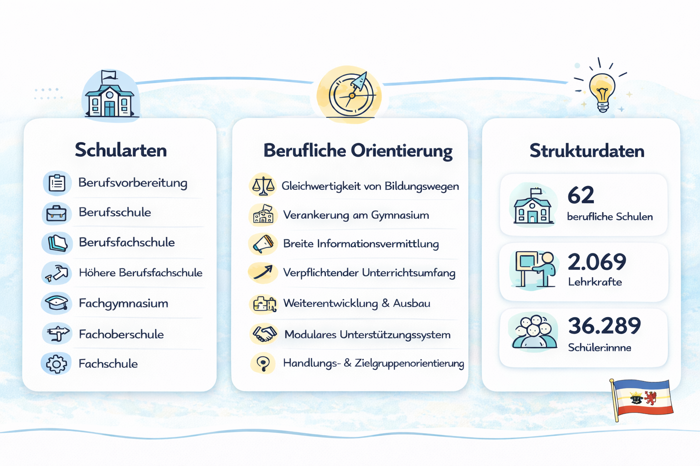

  <button id="md-copy-btn" title="Markdown kopieren (ohne Bilder)">📑</button>
  <button onclick="triggerPrint()" title="Blog speichern">📥</button>
  <button onclick="location.href='/iWIP/praesentation/lehre/bisy/deutsches_bildungssystem/'" title="Zur Präsentationsansicht">🖥️</button>
  <button class="iwip_help_btn"
        type="button"
        aria-haspopup="dialog"
        aria-controls="iwip_help_overlay"
        aria-expanded="false"
        title="Hinweise zur Nutzung">
  ⓘ
  </button>



---

# 📚 Gegenstand

Diese erste inhaltliche Vorlesung im Modul eröffnet den Zugang zum Thema über einen doppelten Blick: **Bildung wird 👤 individuell erlebt**, ist aber zugleich **🏛️ gesellschaftlich organisiert**. Bildungsbiographien erscheinen aus subjektiver Sicht oft als Folge **persönlicher Entscheidungen**. Im Lehrgespräch wird jedoch sichtbar, dass diese Entscheidungen immer in **institutionelle Strukturen**, Übergangsregeln, Abschlüsse, Zuständigkeiten und gesellschaftliche Erwartungen eingebettet sind.

Im Zentrum steht deshalb die Frage, **wie das deutsche Bildungssystem 🏛️ funktioniert**: Wie ist es aufgebaut? Wer ist wofür zuständig? Welche Rolle spielen Bund, Länder und einzelne Institutionen? Und wie hängen **🌍 Gesellschaft**, **🏫 Bildungssystem** und **💼 Arbeitswelt** zusammen?

---

# 💭 Leitfrage

> [!TIPP]
> Wie lassen sich individuelle Bildungswege verstehen, wenn man sie zugleich als Teil eines gesellschaftlich, rechtlich und institutionell geordneten Bildungssystems betrachtet?

---

# 🎯 Lernziele

Die Veranstaltung verbindet lebensweltlichen Einstieg, systematische Einführung und eine erste eigenständige Recherche.

Sie lernen, ...

- 👤 den Zusammenhang zwischen **individuellen Bildungsbiographien** und dem **Bildungssystem** herzustellen.
- 🔁 zwischen **subjektiven Erfahrungen** und **strukturellen Perspektiven** auf Bildung zu unterscheiden.
- 🧭 die Rollen und Perspektiven des Subjekts in der **Trias aus Gesellschaft, Bildungssystem und Arbeitswelt** zu erkennen und zu reflektieren.
- 🏛️ den **systematischen Aufbau des deutschen Bildungssystems** zu beschreiben und zu erklären.
- ⚖️ zentrale **rechtliche Rahmenbedingungen** des Bildungssystems einzuordnen.
- 🔎 offizielle Quellen zum Bildungssystem in **Mecklenburg-Vorpommern** zu nutzen und erste Rechercheergebnisse aufzubereiten.

---

# 🧭 Aufbau & Ablauf

**Gesamtdauer:** ca. 90 Minuten ⏱️

| Phase | Inhalt | Ziel | Zeit |
|:------|:--------|:------|:------:|
| **1. Einstieg 👤** | Aktivierung über eigene Bildungswege und erste Wortmeldungen zu biographischen Erfahrungen | Lebensweltbezug herstellen und Heterogenität sichtbar machen | ⏱️ 15 Min |
| **2. Lehrgespräch 🔁** | Subjektive und strukturelle Perspektive auf Bildung unterscheiden | analytische Grundunterscheidung aufbauen | ⏱️ 15 Min |
| **3. Systematik 🏛️** | Aufbau des deutschen Bildungssystems von frühkindlicher Bildung bis Weiterbildung | Systemlogik, Übergänge und Durchlässigkeit verstehen | ⏱️ 25 Min |
| **4. Recht ⚖️** | Föderale Zuständigkeiten und zentrale Rechtsgrundlagen | Steuerung und Rahmung des Systems einordnen | ⏱️ 10 Min |
| **5. Recherche MV 🔎** | Kurzrecherche mit offiziellen Quellen zum Bildungssystem in Mecklenburg-Vorpommern | Quellenkompetenz und Regionalbezug entwickeln | ⏱️ 15 Min |
| **6. Diskussion 💬** | Austausch über Besonderheiten, offene Fragen und erste Bewertungen | Ergebnisse sichern und regionale Perspektive reflektieren | ⏱️ 10 Min |

---

# 1. Einstieg – Bildungsbiographie als Zugang: Think-Pair-Share 🧠👥💭

> [!IMPORTANT]
> Welche Erkenntnis, welche Überraschung nehmen Sie aus der Beschäftigung mit Ihren Berufsbiographien in der Übung am Montag mit?

**1. Stiller Einzelimpuls, 1 Minute**
Notieren Sie sich ein Stichwort, eine Beobachtung oder eine Überraschung aus der Übung zu Ihrer Berufsbiographie.

**2. Austausch zu zweit, 2 Minuten**
Tauschen Sie sich mit Ihrer Sitznachbarin oder Ihrem Sitznachbarn aus:

Was war für dich die wichtigste Erkenntnis?
Was hatte eher mit dir persönlich zu tun?
Wo wurde schon Struktur sichtbar?

**3. Kurzes Einsammeln im Plenum, 3 bis 5 Minuten**
Versuchen Sie, Ihre Erkenntnisse und Beobachtungen in zwei Kategorien auf <a href="https://www.taskcards.de/#/board/85425d57-2921-4a91-ae4d-1bcff2e6b216/view?token=a1dea74f-04b8-44d1-8d26-a5fd07ad053a" target="_blank" rel="noopener noreferrer">Taskcards</a> zu sortieren:

- 👤 subjektiv (eigene Entscheidungen)  
- 🏛️ strukturell (institutionelle Vorgaben, Zugangsregeln, Abschlüsse)

Anschlussfrage im Plenum: 🌍 Welche Rolle spielten Schule, Familie, Region, Arbeitsmarkt oder Zufälle?

> [!TIPP]
> Bildungsbiographien sind ein guter Einstieg, weil sie uns unmittelbar betreffen. Zugleich lässt sich von hier aus der Übergang zur systematischen Analyse vorbereiten.

---

# 2. Subjektive und strukturelle Perspektive

Auf den Gegenstand der Bildungssysteme kann zwischen einer **subjektiven** und **strukturellen** Perspektive unterschieden werden.

## 👤 Subjektive Perspektive

Hier steht im Vordergrund, wie Bildung von einzelnen Personen erlebt wird:

- 👤 Interessen, Wünsche und Entscheidungen
- 🧠 Erfolgserlebnisse und Brüche
- 🛤️ Übergänge als persönliche Erfahrung
- 🪞 Deutungen des eigenen Bildungswegs

## 🏛️ Strukturelle Perspektive

Hier rückt das Bildungssystem als gesellschaftliche Ordnung in den Blick:

- 🏫 Schularten und Übergänge
- 📜 Abschlüsse und Berechtigungen
- ⚖️ rechtliche Vorgaben
- 🌍 soziale Ungleichheiten und Zugangsbedingungen
- 🧭 institutionelle Erwartungen

> [!TIPP]
> **Individuen handeln im Bildungssystem nie voraussetzungslos.** Persönliche Bildungswege entstehen im Zusammenspiel von **👤 subjektiven Entscheidungen** und **🏛️ strukturellen Bedingungen**.

---

# 3. Die Trias aus Gesellschaft, Bildungssystem und Arbeitswelt

Um die Perspektive zu weiten, kann die Veranstaltung mit einer einfachen Trias arbeiten:

- 🌍 **Gesellschaft:** Werte, Normen, soziale Ungleichheit, Teilhabe, Integration
- 🏫 **Bildungssystem:** Institutionen, Abschlüsse, Übergänge, Selektion, Förderung
- 💼 **Arbeitswelt:** Qualifikationsanforderungen, Berufe, Fachkräftesicherung, Beschäftigung

Das Subjekt ist in allen drei Bereichen zugleich positioniert:

- 👥 als Mitglied der Gesellschaft,
- 🎓 als Lernende:r im Bildungssystem,
- 💼 als gegenwärtige oder zukünftige Arbeitnehmende in der Arbeitswelt.

Die 🌍 **Gesellschaft** bildet dabei den Rahmen sozialer Ordnung und Kommunikation, in dem individuelles Handeln, Teilhabe und Bildungsprozesse überhaupt erst verstehbar werden (<a href="#literatur">Luhmann 2017</a>; <a href="#literatur">Habermas 1999</a>). Die 💼 **Arbeit** vermittelt zwischen Individuum und Gesellschaft, strukturiert soziale Rollen und ist zugleich eng mit Fragen sozialer Ungleichheit verbunden (<a href="#literatur">Offe 1984</a>). Das 🏫 **Bildungssystem** lässt sich vor diesem Hintergrund als institutionelles Arrangement verstehen, das Kompetenzen für gesellschaftliche Arbeit reproduziert, ordnet und weiterentwickelt (<a href="#literatur">Baethge et al. 2007</a>; <a href="#literatur">Kerschensteiner 2020</a>).

Trias aus Gesellschaft, Bildungssystem und Arbeitswelt

<figure class="figure-frame">
  
</figure>

Bildquelle: Eigene Darstellung · Lizenz: <a href="https://creativecommons.org/licenses/by-sa/4.0/" target="_blank" rel="noopener noreferrer">CC BY-SA 4.0</a>

Weitere Reflexionsfragen:

- 💭 Welche Erwartungen richten diese drei Teilsysteme an Individuen?
- 🔁 Wo ergänzen sie sich, wo entstehen Spannungen?
- 📈 Wie prägen Bildungsabschlüsse spätere Chancen auf dem Arbeitsmarkt?

---

# 4. Systematischer Aufbau des deutschen Bildungssystems

Der grundlegende Aufbau des deutschen Bildungssystems kann wie folgt systematisiert werden (<a href="#literatur">KMK 2025</a>):

## 🧱 Zentrale Bildungsbereiche

- 🧸 Frühkindliche Bildung, Betreuung und Erziehung
- 🎒 Primarbereich
- 🏫 Sekundarbereich I
- 🎓 Sekundarbereich II
- 🛠️ Berufliche Bildung
- 🏛️ Hochschulbildung
- 🔄 Weiterbildung/Erwachsenenbildung

## 🛠️ Fokus: berufliche Bildung

Im Bereich der beruflichen Bildung gibt es eine **Vielzahl** von Institutionen, Abschlüssen und Übergängen. Hier spielen insbesondere die **Berufsschulen**, die **duale Ausbildung** und **berufsbildende Schulen** eine zentrale Rolle:

Grundstruktur des Bildungssystems in Deutschland mit Fokus auf berufliche Bildung



Bildquelle: Eigene Darstellung in Anlehnung an <a href="#literatur">KMK (2023)</a> · Lizenz: <a href="https://creativecommons.org/licenses/by-sa/4.0/" target="_blank" rel="noopener noreferrer">CC BY-SA 4.0</a>

## 🔄 Zentrale Merkmale

- 🧭 Das System ist **gegliedert**: Es besteht aus verschiedenen Bildungsbereichen und Institutionen.
- 🏛️ Es ist **föderal organisiert**: Die Länder tragen die Hauptverantwortung für das Schulwesen.
- 🔁 Es ist prinzipiell **durchlässig**: Abschlüsse eröffnen Anschlussmöglichkeiten, auch wenn diese in der Praxis ungleich verteilt sind.
- 📜 Es ist **zertifikats- und berechtigungsorientiert**: Übergänge werden häufig über formale Abschlüsse geregelt.

Die <a href="#literatur">KMK (2023)</a> stellt die <a href="https://www.kmk.org/fileadmin/Dateien/pdf/Dokumentation/de_2023.pdf#page=2&zoom=page-fit" target="_blank" rel="noopener noreferrer"><strong>Grundstruktur des Bildungswesens in der Bundesrepublik Deutschland</strong></a> in einem Diagramm dar.

<a href="#literatur">Edelstein (2013)</a> erläutert das deutsche Bildungssystem in einem gut zugänglichen Überblicksbeitrag für die Bundeszentrale für politische Bildung und visualisiert es in einer interaktiven Darstellung.

---

# 5. Rechtliche Rahmenbedingungen

Für die erste Orientierung genügt eine konzentrierte Auswahl zentraler Rechtsbezüge:

- ⚖️ <a href="https://www.gesetze-im-internet.de/gg/art_7.html" target="_blank" rel="noopener noreferrer"><strong>Art. 7 GG</strong></a>: Das Schulwesen steht unter staatlicher Aufsicht.
- 🏛️ <a href="https://www.gesetze-im-internet.de/gg/art_30.html" target="_blank" rel="noopener noreferrer"><strong>Art. 30 GG</strong></a> und <a href="https://www.gesetze-im-internet.de/gg/art_70.html" target="_blank" rel="noopener noreferrer"><strong>Art. 70 GG</strong></a>: Bildung ist in weiten Teilen Sache der Länder; daraus folgt die föderale Prägung des Systems.
- 📚 <a href="https://www.landesrecht-mv.de/bsmv/document/jlr-SchulGMV2010pG4/format/xsl?oi=hheu3UuEz2&sourceP=%7B%22source%22%3A%22TOC%22%7D&docAcc=true" target="_blank" rel="noopener noreferrer"><strong>SchulG M-V, Teil 4 (§§ 41-51)</strong></a>: Hier ist die Schulpflicht in Mecklenburg-Vorpommern geregelt.
- 🛠️ <a href="https://www.gesetze-im-internet.de/bbig_2005/__2.html" target="_blank" rel="noopener noreferrer"><strong>BBiG § 2</strong></a>: Die Norm bestimmt die Lernorte der Berufsbildung, also Betrieb, berufsbildende Schule und sonstige Berufsbildungseinrichtungen.
- 🔎 <a href="https://www.gesetze-im-internet.de/bbig_2005/__3.html" target="_blank" rel="noopener noreferrer"><strong>BBiG § 3</strong></a>: Hier wird der Anwendungsbereich des Gesetzes abgegrenzt, insbesondere gegenüber den Schulgesetzen der Länder.
- 📜 <a href="https://www.gesetze-im-internet.de/bbig_2005/__4.html" target="_blank" rel="noopener noreferrer"><strong>BBiG § 4</strong></a>: Die Vorschrift regelt die Anerkennung von Ausbildungsberufen und die Grundlage von Ausbildungsordnungen.
- 🤝 <a href="https://www.gesetze-im-internet.de/bbig_2005/__71.html" target="_blank" rel="noopener noreferrer"><strong>BBiG § 71</strong></a>: Hier werden die zuständigen Stellen der beruflichen Bildung, etwa Kammern, festgelegt.

Damit lässt sich bereits ein grundlegendes Verständnis entwickeln:

- 🏛️ Das Bildungssystem in Deutschland ist **nicht vollständig zentral gesteuert**.
- 🔁 Es gibt einen **gemeinsamen Rahmen** und zugleich **länderspezifische Ausprägungen**.
- 🤝 Gerade für Wirtschaftspädagogik ist die Verbindung von **Bildung**, **Beruf** und **Recht** besonders relevant.

---

# 6. Recherche zum Bildungssystem in Mecklenburg-Vorpommern

Abschließend recherchierten die Studierenden in Kleingruppen oder Tandems in **offiziellen Quellen** des Landes Mecklenburg-Vorpommern.

## 📝 Rechercheaufträge

1. Welche **Schularten** umfasst die berufliche Bildung in Mecklenburg-Vorpommern? <!-- https://www.bildung-mv.de/schule/schularten/berufliche-schulen --> 
2. Welche Grundsätze der **Beruflichen Orientierung** im Sekundarbereich II werden in Mecklenburg-Vorpommern im Landeskonzept für den Übergang von der Schule in den Beruf verfolgt? <!-- https://www.bildung-mv.de/schule/schularten/berufliche-schulen/, https://www.bildung-mv.de/export/sites/bildungsserver/.galleries/dokumente/schule/Landeskonzept_Uebergang_Schule-Beruf_-24.06.2019.pdf -->
3. Wie viele **berufliche Schulen** gibt es in Mecklenburg-Vorpommern? <!-- https://www.laiv-mv.de/static/LAIV/Statistik/Dateien/Publikationen/B%20II%20Berufliche%20Schulen%2c%20Berufsbildung/B2131/B2131%202024%2000.pdf -->
4. Wie viele **Lehrkräfte** sind in den beruflichen Schulen in Mecklenburg-Vorpommern tätig? <!-- https://www.laiv-mv.de/static/LAIV/Statistik/Dateien/Publikationen/B%20I%20Allgemeinbildende%20Schulen/B%20123/B123%202024%2000.pdf -->
5. Wie viele **Schüler:innen** gehen in Mecklenburg-Vorpommern in beruflichen Schulen? <!-- https://www.laiv-mv.de/static/LAIV/Statistik/Dateien/Publikationen/B%20II%20Berufliche%20Schulen%2c%20Berufsbildung/B2131/B2131%202024%2000.pdf -->

Berufliche Bildung in Mecklenburg-Vorpommern

<figure class="figure-frame">
  
</figure>

Bildquelle: Eigene Darstellung (erstellt  mit ChatGPT) · Lizenz: <a href="https://creativecommons.org/licenses/by-sa/4.0/" target="_blank" rel="noopener noreferrer">CC BY-SA 4.0</a>

1. **Schularten:** Berufsvorbereitung, Berufsschule, Berufsfachschule, höhere Berufsfachschule, Fachgymnasium, Fachoberschule, Fachschule.  
  Quelle: <a href="https://www.bildung-mv.de/schule/schularten/berufliche-schulen" target="_blank" rel="noopener noreferrer">bildung-mv.de/schule/schularten/berufliche-schulen</a>

1. **Berufliche Orientierung:** Gleichwertigkeit von Bildungswegen, Verankerung am Gymnasium, Breite der Informationsvermittlung, verpflichtender Unterrichtsumfang, Weiterentwicklung und Ausbau, modulares Unterstützungssystem, Kooperation mit externen Partnern sowie Handlungs- und Zielgruppenorientierung.  
  Quelle: <a href="https://www.bildung-mv.de/export/sites/bildungsserver/.galleries/dokumente/schule/Landeskonzept_Uebergang_Schule-Beruf_-24.06.2019.pdf" target="_blank" rel="noopener noreferrer">Landeskonzept Übergang Schule-Beruf (PDF)</a>

1. **Anzahl berufliche Schulen:** 62 (2024).  
  Quelle: <a href="https://www.laiv-mv.de/static/LAIV/Statistik/Dateien/Publikationen/B%20II%20Berufliche%20Schulen%2c%20Berufsbildung/B2131/B2131%202024%2000.pdf" target="_blank" rel="noopener noreferrer">Statistischer Bericht B2131 2024 (PDF)</a>

1. **Anzahl Lehrkräfte:** 2.069 (2024).  
  Quelle: <a href="https://www.laiv-mv.de/static/LAIV/Statistik/Dateien/Publikationen/B%20I%20Allgemeinbildende%20Schulen/B%20123/B123%202024%2000.pdf" target="_blank" rel="noopener noreferrer">Statistischer Bericht B123 2024 (PDF)</a>

1. **Anzahl Schüler:innen an beruflichen Schulen:** 36.289 (2024).  
  Quelle: <a href="https://www.laiv-mv.de/static/LAIV/Statistik/Dateien/Publikationen/B%20II%20Berufliche%20Schulen%2c%20Berufsbildung/B2131/B2131%202024%2000.pdf" target="_blank" rel="noopener noreferrer">Statistischer Bericht B2131 2024 (PDF)</a>

      
## 📌 Ergebnisformat

Halten Sie Ihre Ergebnisse auf <a href="https://www.taskcards.de/#/board/85425d57-2921-4a91-ae4d-1bcff2e6b216/view?token=a1dea74f-04b8-44d1-8d26-a5fd07ad053a" target="_blank" rel="noopener noreferrer">Taskcards</a> fest:

- 📍 in wenigen Stichpunkten
- 🔎 mit mindestens **einer offiziellen Quelle**

⏱️ *Bearbeitungszeit: ca. 15 Minuten*

---

# 💬 Abschlussdiskussion

Zum Abschluss werden die Rechercheergebnisse im Plenum gebündelt.

Mögliche Diskussionsfragen:

- 💭 Welche Einsicht aus dem heutigen Überblick zum deutschen Bildungssystem war für Sie besonders klärend oder überraschend?
- 👤🏛️ An welchen Stellen wurde heute besonders deutlich, dass Bildungswege zugleich **individuell erlebt** und **strukturell gerahmt** sind?
- ⚖️ Welche Rolle spielen **Aufbau, Föderalismus und rechtliche Rahmenbedingungen** für das Verständnis des Bildungssystems?
- 📍 Was zeigen die Beispiele aus Mecklenburg-Vorpommern über **Gemeinsamkeiten** und **landesspezifische Besonderheiten** im deutschen Bildungssystem?

Eine mögliche Sicherung im Schlussteil:

- 👤 **Subjektive Perspektive:** Wie erleben Menschen Bildungswege?
- 🏛️ **Strukturelle Perspektive:** Wie ordnet und begrenzt das System diese Wege?
- 🧭 **Trias:** Wie hängen Gesellschaft, Bildungssystem und Arbeitswelt zusammen?

---

# 📚 Didaktischer Kommentar

Die Sitzung ist bewusst als **Vortrag mit Lehrgespräch** angelegt. Der lebensweltliche Einstieg erleichtert den Zugang, ohne beim rein biographischen Erzählen stehen zu bleiben. Sie sollen vielmehr früh lernen, individuelle Bildungsverläufe als Teil einer gesellschaftlich und rechtlich strukturierten Ordnung zu analysieren.

Die kurze Recherchephase am Ende erfüllt dabei zwei Funktionen:

- 📍 Sie öffnet den Blick vom bundesweiten Überblick zur **landesspezifischen Konkretisierung**.
- 🔎 Sie trainiert früh den Umgang mit **offiziellen und belastbaren Quellen**.

---

# 📚 Literatur

Baethge, M., Solga, H., & Wieck, M. (2007). <em>Berufsbildung im Umbruch: Signale eines überfälligen Aufbruchs</em>. Friedrich-Ebert-Stiftung. 

Bundesministerium der Justiz. (2025). <em>Berufsbildungsgesetz (BBiG): § 2 Lernorte der Berufsbildung</em>. Gesetze im Internet. 

Bundesministerium der Justiz. (2025). <em>Berufsbildungsgesetz (BBiG): § 3 Anwendungsbereich</em>. Gesetze im Internet. 

Bundesministerium der Justiz. (2025). <em>Berufsbildungsgesetz (BBiG): § 4 Anerkennung von Ausbildungsberufen</em>. Gesetze im Internet. 

Bundesministerium der Justiz. (2025). <em>Berufsbildungsgesetz (BBiG): § 71 Zuständige Stellen</em>. Gesetze im Internet. 

Bundesministerium der Justiz. (2025). <em>Grundgesetz für die Bundesrepublik Deutschland: Art. 7</em>. Gesetze im Internet. 

Bundesministerium der Justiz. (2025). <em>Grundgesetz für die Bundesrepublik Deutschland: Art. 30</em>. Gesetze im Internet. 

Bundesministerium der Justiz. (2025). <em>Grundgesetz für die Bundesrepublik Deutschland: Art. 70</em>. Gesetze im Internet. 

Edelstein, B. (2013). <em>Das Bildungssystem in Deutschland</em>. Bundeszentrale für politische Bildung. 

Habermas, J. (1999). <em>Theorie des kommunikativen Handelns</em> (Bd. 1). Suhrkamp. 

Habermas, J. (1999). <em>Theorie des kommunikativen Handelns</em> (Bd. 2). Suhrkamp. 

Kerschensteiner, G. (2020). <em>Begriff der Arbeitsschule</em>. R. Oldenbourg Verlag. 

Kultusministerkonferenz. (2023). <em>Grundstruktur des Bildungswesens in der Bundesrepublik Deutschland</em> [Diagramm]. 

Kultusministerkonferenz. (2025). <em>Das Bildungswesen in der Bundesrepublik Deutschland 2023/2024: Darstellung der Kompetenzen, Strukturen und bildungspolitischen Entwicklungen für den Informationsaustausch in Europa</em>. 

Landesrecht Mecklenburg-Vorpommern. (2010). <em>Schulgesetz für das Land Mecklenburg-Vorpommern (Schulgesetz - SchulG M-V), Teil 4 (§§ 41-51)</em>. 

Luhmann, N. (2017). <em>Systemtheorie der Gesellschaft</em> (Hrsg. J. F. K. Schmidt & A. Kieserling). Suhrkamp. 

Offe, C. (1984). <em>Arbeitsgesellschaft: Strukturprobleme und Zukunftsperspektiven</em>. Campus-Verlag. 