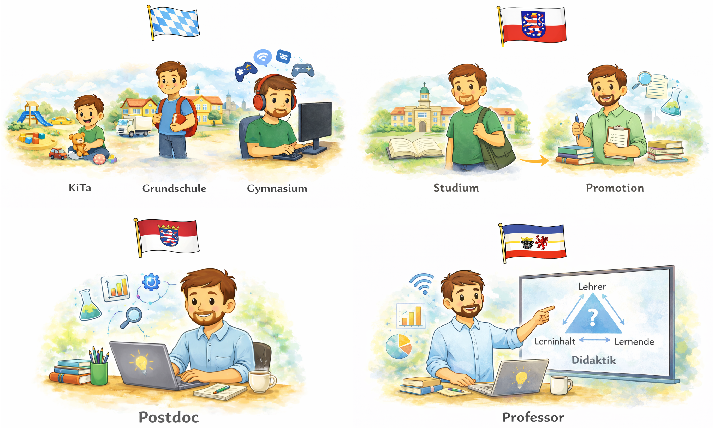

  <button id="md-copy-btn" title="Markdown kopieren (ohne Bilder)">📑</button>
  <button onclick="triggerPrint()" title="Blog speichern">📥</button>
  <button onclick="location.href='/iWIP/praesentation/lehre/bisy/einfuehrung/'" title="Zur Präsentationsansicht">🖥️</button>
  <button class="iwip_help_btn"
        type="button"
        aria-haspopup="dialog"
        aria-controls="iwip_help_overlay"
        aria-expanded="false"
        title="Hinweise zur Nutzung">
  ⓘ
  </button>



---

# 📚 Gegenstand

Mit dieser ersten Veranstaltung startet das Modul **Bildungssysteme im Kontext von Arbeit und Gesellschaft**. Sie markiert den inhaltlichen Einstieg: **Bildungswege**, **Übergänge** und **Institutionen** prägen Biographien, Chancen und berufliche Perspektiven. Darüber hinaus dient sie der **organisatorischen Orientierung**.

Im Zentrum der Einführung stehen daher drei Ziele: Sie lernen das **Lehrendenteam**, die **Struktur des Moduls** und die **Prüfungsanforderungen** kennen, und Sie beginnen zugleich, Ihre **eigenen Bildungswege** als Zugang zum Thema zu reflektieren.

# 🎯 Lehrziele

In dieser Einführungsveranstaltung gewinnen Sie eine erste Orientierung über das Modul und seine Relevanz.

Sie lernen, …

- 🧭 Gegenstand, Inhalte und Ziele des Moduls zu benennen.
- 👥 eigene Bildungswege mit gesellschaftlichen und institutionellen Strukturen in Beziehung zu setzen.
- 💬 die Relevanz des Themas Bildungssysteme für Studium, Beruf und gesellschaftliche Teilhabe zu reflektieren.
- 🌐 zentrale Kommunikationswege und Formen der Zusammenarbeit im Modul zu nutzen.
- 🧠 Prüfungsleistung, Zeitstruktur und Prüfungsanmeldung frühzeitig einzuordnen.

> [!TIPP]
> Die Einführung verbindet **Orientierung** und **Aktivierung**: Ihre eigenen Erfahrungen mit Schule, Ausbildung, Hochschule und Übergängen sind bereits ein erster Zugang zum Thema Bildungssysteme.

---

# 🧭 Aufbau & Ablauf

Gesamtdauer: ca. **60 Minuten**

| Phase | Inhalt | Ziel | Zeit |
|:------|:--------|:------|:------:|
| **1️⃣ Einstieg 🧭** | Biografischer Impuls von Matthias Söll zu Bildungswegen und Übergängen | Interesse wecken und Thema personalisieren | ⏱️ 8 Min |
| **2️⃣ Kennenlernen 👥** | Niedrigschwellige Aufstellung zu Bildungsbiographien der Studierenden | Heterogenität sichtbar machen und Gruppe aktivieren | ⏱️ 8 Min |
| **3️⃣ Lehrendenteam 👩‍🏫** | Kurzvorstellung von Vorlesung und Übung | Rollen, Zuständigkeiten und Erwartungen klären | ⏱️ 4 Min |
| **4️⃣ Modulüberblick 📚** | Inhalte, Ziele und Fahrplan des Semesters | Gegenstand und roten Faden des Moduls sichtbar machen | ⏱️ 14 Min |
| **5️⃣ Relevanzdiskussion 💬** | Warum sollte man sich mit Bildungssystemen auseinandersetzen? | Motivierung und erste Positionierung | ⏱️ 8 Min |
| **6️⃣ Kommunikation 🌐** | Gespräche in und nach der Veranstaltung, Sprechstunde, Mail, Telefon, Stud.IP | Verbindliche Kommunikationswege klären | ⏱️ 5 Min |
| **7️⃣ Zeitmanagement ⏱️** | Workload, Arbeitsweise und Semesterlogik | Erwartungen an Selbststudium und Arbeitsrhythmus klären | ⏱️ 5 Min |
| **8️⃣ Prüfung & Anmeldung 📝** | Hausarbeit und Prüfungsanmeldung beim Prüfungsamt | Prüfungsform transparent machen und Fristen sichtbar machen | ⏱️ 8 Min |

---

# 1️⃣ Einstieg – Bildungsbiographie als Türöffner

Wir starten mit einem **biografischen Einstieg**, der sich didaktisch als **analytischer Impuls** eignet. Matthias Söll skizziert dazu exemplarisch einzelne Stationen des eigenen Bildungswegs und macht sichtbar, wie persönliche Entscheidungen und institutionelle Rahmenbedingungen ineinandergreifen.

Biographie Matthias Söll

<figure class="figure-frame">
  
</figure>

Bildquelle: Eigene Darstellung · Illustration: erstellt mit Unterstützung von ChatGPT · Keine freie Lizenz (Rechte bei der dargestellten Person)

## 💭 Leitfrage

> [!TIPP]
> **Wie verlaufen 🛤️ Bildungswege eigentlich, und was haben 🧠 individuelle Entscheidungen mit 🧭 gesellschaftlichen Strukturen zu tun?**

Gerade dadurch wird schnell deutlich: Bildungsbiographien sind **persönlich erlebt**, aber niemals nur privat. Sie sind in **Institutionen**, **Zugangsregeln**, **Zertifikate** und **soziale Voraussetzungen** eingebettet.

---

## 👥 Niedrigschwellige Aufstellung

Im Anschluss folgt eine niedrigschwellige, aktivierende **Aufstellung** mit direktem thematischem Bezug.

Mögliche Aussagen:

- 🎓 Wer hat die **allgemeine Hochschulreife**?
- 🛠️ Wer hat eine **Berufsausbildung** angefangen oder abgeschlossen?
- 📚 Wer hat schon einmal etwas **anderes studiert**?
- 📍 Wer kommt aus **Mecklenburg-Vorpommern**?

Die Aufstellung macht sichtbar, wie unterschiedlich 🛤️ Bildungswege verlaufen und welche 🧠 Erfahrungen bereits im Raum vorhanden sind.

Anschlussfragen für das Plenum:

- Welche Unterschiede in 🛤️ Bildungswegen werden hier sichtbar?
- Was könnte davon 🧠 individuell wirken, was eher 🧭 strukturell?

---

# 👩‍🏫 Lehrendenteam

Das Modul wird in **Vorlesung** und **Übung** gemeinsam getragen.

- **Vorlesung:** systematische Einführung in Bildungssysteme im Kontext von Arbeit und Gesellschaft
- **Übung:** Vertiefung & Diskussion der Einführung sowie Begleitung des wissenschaftlichen Arbeitens

Claudia Thürke & Matthias Söll

<figure class="figure-frame">
  
</figure>

Bildquelle: ITMZ · Universität Rostock · nicht frei verwendbar

---

# 📚 Inhalte und Ziele des Moduls

Im Modul setzen Sie sich damit auseinander, wie **Bildungssysteme** – insbesondere die **berufliche Bildung** – in ihren **gesellschaftlichen**, **wirtschaftlichen** und **politischen Zusammenhängen** verstanden, analysiert und bewertet werden können.

Zugleich entwickeln Sie Ihre Kompetenzen im **wissenschaftlichen Arbeiten** weiter und werden schrittweise an die **Hausarbeit** herangeführt.

Im Mittelpunkt stehen unter anderem folgende Fragen:

- 🏛️ Wie funktioniert das deutsche Bildungssystem?
- 🧭 Wie verlaufen Bildungswege in Schule, Ausbildung, Hochschule und Weiterbildung?
- 🌐 Wie verändern sich Bildung und Arbeit unter Bedingungen von Digitalisierung, New Work und gesellschaftlichem Wandel?
- 🧠 Wie lassen sich diese Entwicklungen wissenschaftlich erschließen und argumentativ bearbeiten?

Dabei wird sich zeigen:

- Bildungssysteme strukturieren **Lebenschancen**.
- Bildungssysteme verändern sich mit **Arbeit**, **Gesellschaft** und **Politik**.
- Wer Wirtschaftspädagogik studiert, sollte diese Zusammenhänge **beschreiben**, **einordnen** und **bewerten** können.

---

# 🗓️ Fahrplan im Semester

Die Vorlesung findet **donnerstags von 13:15 bis 14:45 Uhr in SR 018** statt.  
Die Übung findet **montags von 09:15 bis 10:45 Uhr in SR 018/020** statt.

Grafik: Fahrplan des Moduls im Sommersemester 2026

<figure class="figure-frame">
  
</figure>

Bildquelle: Eigene Darstellung · Lizenz: <a href="https://creativecommons.org/licenses/by-sa/4.0/" target="_blank" rel="noopener noreferrer">CC BY-SA 4.0</a>

---

# 🌐 Kommunikation im Modul

Für das Modul sind mehrere Kommunikationswege relevant. Es ist hilfreich, ihre jeweilige Funktion gleich zu Beginn klar zu benennen.

- 💬 **Während oder nach der Veranstaltung:** für direkte Rückfragen
- 👥 **Sprechstunde:** für ausführlichere Rückfragen, Beratung und Feedback
- 📞 **Telefon:** für kurze dringliche Absprachen
- ✉️ **Mail:** für organisatorische und individuelle Anliegen
- 🌐 **Stud.IP:** für Materialien, Hinweise und organisatorische Informationen

---

# ⏱️ Zeitmanagement und Workload

Das Modul umfasst **6 Leistungspunkte** und damit ungefähr **180 Stunden Arbeitsaufwand**. Diese Zeit verteilt sich nicht nur auf Vorlesung und Übung, sondern auch auf Lektüre, Vor- und Nachbereitung sowie die Hausarbeit.

Eine grobe Orientierung kann so aussehen:

| Bereich | Orientierung |
|:------|:--------|
| **👥 Präsenzzeit** | ca. 50 Stunden für Vorlesung und Übung |
| **📚 Vor- und Nachbereitung** | ca. 26 Stunden für Lektüre bzw. Vertiefung, Notizen und Wiederholung (2 Stunden pro Woche) |
| **📝 Hausarbeit** | ca. 104 Stunden für Themenerschließung, Literaturarbeit, Schreiben und Überarbeitung (2,5 Wochen Vollzeit mit 40 Stunden pro Woche) |

Die **Hausarbeit ist keine Zusatzleistung am Schluss**, sondern ein integraler Bestandteil des Moduls. Deshalb lohnt es sich, Materialien, Fragen und Literaturhinweise von Beginn an systematisch mitzudenken.

---

# 📝 Prüfungsleistung

Die Prüfungsleistung des Moduls ist eine **wissenschaftliche Hausarbeit**.

- 📏 Umfang: **10 bis 12 Seiten Fließtext**
- 📄 hinzu kommen **Verzeichnisse**, **Deckblatt** und **Selbstständigkeitserklärung**
- 📚 die Themen greifen Inhalte aus **Vorlesung und Übung** auf
- 📅 die konkreten Themen werden **zu Beginn der Bearbeitungszeit (13.07.2026)** bekannt gegeben
- ✉️ Die Abgabe der Hausarbeit erfolgt digital **bis zum 07.09.2026** als WORD- und PDF-Datei **per Mail** an die Dozent:innen

Die formalen und inhaltlichen Anforderungen werden im <a href="https://www.iwip.uni-rostock.de/studium-und-lehre/waehrend-des-studiums/leitfaden-wissenschaftliches-arbeiten/" target="_blank" rel="noopener noreferrer">Leitfaden zum wissenschaftlichen Arbeiten</a> erläutert, den wir im Verlauf des Moduls gemeinsam besprechen.

---

# 🗂️ Prüfungsanmeldung

Die offiziellen Termine des Prüfungsamts für das SoSe 2026 finden Sie in der  
<a href="https://www.wsf.uni-rostock.de/storages/uni-rostock/Alle_WSF/WSF/Studium/termine-ba/SoSe/2026/2025-12-12_Terminuebersicht_BA_WIP.pdf" target="_blank" rel="noopener noreferrer">Terminübersicht des Prüfungsamts</a>.

> [!TIPP]
> ‼️ Melden Sie sich **fristgerecht** zur Prüfung an ‼️

---

# 🔭 Ausblick

Am kommenden Montag steht in der 👥 **Übung** die Frage im Mittelpunkt, wie sich **individuelle Bildungswege** beschreiben und systematisieren lassen. In der darauffolgenden 👩‍🏫 **Vorlesung** suchen wir dann eine erste Antwort auf die Frage, wie das **deutsche Bildungssystem** funktioniert.