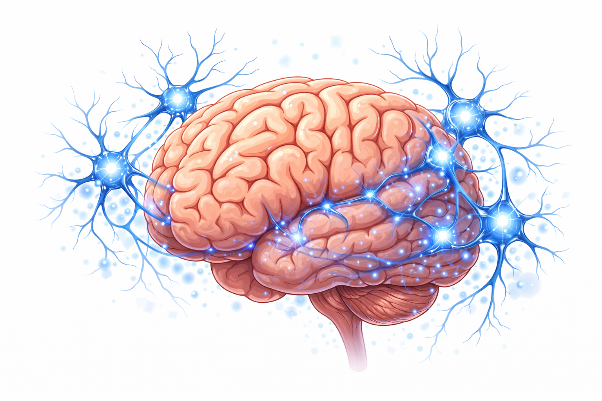
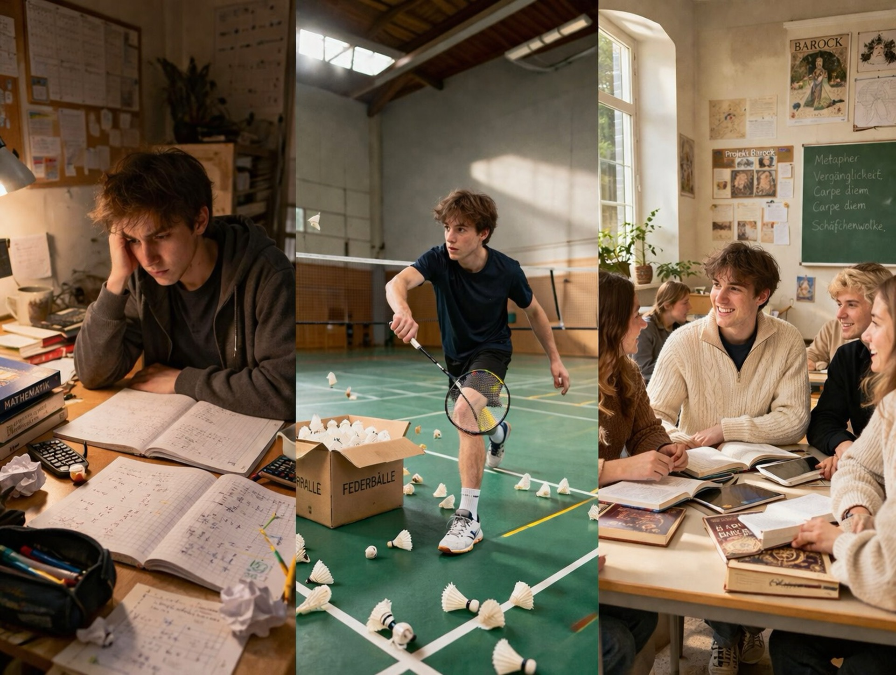

<!-- markdownlint-disable MD033 -->

  <button id="md-copy-btn" title="Markdown kopieren (ohne Bilder)">📑</button>
  <button onclick="triggerPrint()" title="Blog speichern">📥</button>
  <button onclick="location.href='/iWIP/praesentation/lehre/vt_gehirn_lernen_junior_studium/'" title="Zur Präsentationsansicht">🖥️</button>
  <button class="iwip_help_btn"
        type="button"
        aria-haspopup="dialog"
        aria-controls="iwip_help_overlay"
        aria-expanded="false"
        title="Hinweise zur Nutzung">
  ⓘ
  </button>



---

## 🧭 Hintergrund

Die Veranstaltung "**Dein Gehirn ist keine Festplatte – Wie Du Dein Lernen boostern kannst**" ist als kurzer Impuls für das Juniorstudium an der Universität Rostock mit ca. 150 Schüler:innen geplant.

Das Format kombiniert kurze Inputs mit zwei Aktivierungsphasen (Aufsteh-Abfrage und Murmelgruppe), damit die Teilnehmenden ihr **eigenes Lernen direkt reflektieren** und einen **konkreten nächsten Schritt** formulieren.

---

## 💭 Ausgangsfrage

> [!TIPP]
> Wie kannst Du so lernen, dass es zu Dir, Deinen Zielen und Deinem Alltag passt?

---

## 🎯 Lernziele

Die Junior-Studierenden können nach dem Impuls:

- 🧠 das **Lerntypen-Konzept** in einem Satz einordnen,
- 🔍 erklären, warum Lernen immer von **individuellen** und **situativen Faktoren** abhängt,
- 🧩 mindestens zwei konkrete **Lernzugänge** für sich selbst benennen,
- 🚀 eine direkte **Veränderung** für die nächste Lernwoche planen.

---

## 🧭 Ablauf (30 Minuten)

| Phase | Inhalt | Ziel | Zeit |
| :---- | :----- | :--- | :--: |
| **1️⃣ Einstieg 💭** | Titel, Leitfrage, kurzer Erwartungsanker | Fokus und Aktivierung | 2 Min |
| **2️⃣ Lerntypen-Check 🧠** | Aufsteh-Abfrage: auditiv, kognitiv, visuell, haptisch, weiß nicht | Vorwissen sichtbar machen | 4 Min |
| **3️⃣ Lerntypen-Impuls 🪞** | Lerntypen vor dem Hintergrund der Empirie | Fehlkonzepte klären | 4 Min |
| **4️⃣ Wie Lernen funktioniert 🧠** | Vier Lerntheorien als Kurzimpulse | Perspektiven erweitern | 6 Min |
| **5️⃣ Lernen boostern 🌱** | Drei persönliche Beispiele + Tool-Beispiele | Handlungsoptionen öffnen | 8 Min |
| **6️⃣ Murmelgruppe 💬** | Austausch zu bevorzugten Lernzugängen und nächster Schritt | Transfer sichern | 2 Min |
| **7️⃣ Abschluss + WiPäd 🎓** | Lerntipps, Lernen als sozialer Prozess, Wirtschaftspädagogik | Ausblick und Verabschiedung | 4 Min |

---

## Lerntypen 🧠

> [!TIPP]
> Wie lernst Du am besten?

Lerntypen

<figure class="figure-frame">
  
</figure>

Bildquelle: Eigene Darstellung · Illustration: erstellt mit Unterstützung von ChatGPT · Lizenz: <a href="https://creativecommons.org/licenses/by-sa/4.0/" target="_blank" rel="noopener noreferrer">CC BY-SA 4.0</a>

-🗄️ **Lerntypen** sind populäre, aber empirisch **nicht nachweisbare** Konstrukte, die Lernende in feste Kategorien einteilen ([Brand, 2025](#literatur); [Daumiller & Wisniewski, 2022](#literatur); [Menz et al., 2021](#literatur)).
- 🧪 Der Lerntypen-Ansatz gilt deshalb in der Forschung als **Mythos** ([Newton & Salvi, 2020](#literatur)).
- ⚠️ Lerntypen-Denken kann zu **Etikettierung** führen und Erwartungen an Lernende unnötig begrenzen ([Sun et al., 2023](#literatur)).
- 🔄 Konstruktiv gewendet bleibt aber sinnvoll: **Lernzugänge variieren**, testen und **reflektieren** statt sich auf einen Typ festzulegen ([Daumiller & Wisniewski, 2022](#literatur)).

---

## Wie funktioniert Lernen? 🧠

Wir wissen heute bspw. aus den **kognitiven Neurowissenschaften** viel über die **Funktionen des Gehirns beim Lernen**, aber nicht alles. Deshalb und weil entsprechende Erkenntnisse **nicht direkt auf die Gestaltung des Lernens übertragen** werden können, ist Lernen keine rein naturwissenschaftlich ableitbare, sondern eine **didaktisch zu gestaltende, kontextabhängige Aufgabe** ([Schumacher & Stern, 2012](#literatur); [Willingham, 2009](#literatur)).

<figure class="figure-frame">
  
</figure>

Bildquelle: Eigene Darstellung · Illustration: erstellt mit Unterstützung von ChatGPT · Lizenz: <a href="https://creativecommons.org/licenses/by-sa/4.0/" target="_blank" rel="noopener noreferrer">CC BY-SA 4.0</a>

> [!IMPORTANT]
> Lernen hängt davon ab, **wie** *Du* **was** und **wie** lernen möchtest - individuelle und situative Kontextfaktoren entscheiden mit!

### Lerntheorien im Kurzformat

Um Lernen **wissenschaftlich fundiert** zu **verstehen** und zu **gestalten**, sind **vier Lerntheorien** besonders hilfreich:

<figure class="figure-frame">
  
</figure>

Bildquelle: Eigene Darstellung · Illustration: erstellt mit Unterstützung von ChatGPT · Lizenz: <a href="https://creativecommons.org/licenses/by-sa/4.0/" target="_blank" rel="noopener noreferrer">CC BY-SA 4.0</a>

- 🔁 **Behaviorismus:** Lernen zeigt sich in beobachtbarer Verhaltensänderung durch Reiz, Reaktion und Verstärkung.
- 🧠 **Kognitivismus:** Lernen wird als aktive Informationsverarbeitung verstanden (Aufmerksamkeit, Verstehen, Gedächtnis).
- 🛠️ **Konstruktivismus:** Lernende konstruieren Bedeutung auf Basis eigener Erfahrungen und Vorkenntnisse.
- 👥 **Situiertes Lernen:** Lernen ist besonders wirksam in authentischen sozialen Kontexten und gemeinsamer Praxis [(Reinmann, 2013)](#literatur).

---

## Dein Lernen boostern 🌱

> [!TIPP]
> **Wie** kannst **Du** vor diesem Hintergrund **Dein Lernen boostern**?

<figure class="figure-frame">
  
</figure>

Bildquelle: Eigene Darstellung · Illustration: erstellt mit Unterstützung von ChatGPT ·
Keine freie Lizenz (Rechte bei der dargestellten Person)

Ich habe erst relativ spät angefangen, über mein eigenes **Lernen 🧠** nachzudenken – schade eigentlich.  
In meiner Schulzeit war Lernen für mich oft **anstrengend**. Besonders das Üben in Mathe: immer wieder **ähnliche Aufgaben**, wenig Abwechslung – das hat mir selten **Spaß** gemacht.  
Ganz anders war es im Badminton. Dort konnte ich mich stundenlang auf den Platz stellen und kurze Angaben üben – **freiwillig** und mit hoher **Konzentration 🧠**.  
Und dann gab es einzelne Unterrichtssituationen, die mir bis heute im Gedächtnis geblieben sind 👥. Besonders im Deutschunterricht zum Thema Barock: Wir haben die Epoche „mit Kopf, Hand und Herz“ kennengelernt – also nicht nur darüber gesprochen, sondern sie **aktiv erlebt**.  
Erst später habe ich verstanden, woran das liegt: **Motivation**, **Aktivierung**, **Rückmeldung** und **soziale Einbettung 👥** machen einen entscheidenden Unterschied – und viele dieser Faktoren kann ich selbst **beeinflussen 🌱**.

Was bedeutet das für Dich?

> [!IMPORTANT]
> Du kannst Dein Lernen aktiv steuern – und genau das macht einen großen Unterschied.

### Tools zum Boostern

Mit Tools wie den folgenden kannst Du **unterschiedliche Zugänge zum Lernen 🧠** gezielt nutzen:

**🧠 Verstehen & Erklären**
- <a href="https://notebooklm.google.com/" target="_blank" rel="noopener noreferrer">NotebookLM</a>
- <a href="https://chat.openai.com/" target="_blank" rel="noopener noreferrer">ChatGPT</a>

**📚 Wiederholen & Behalten**
- <a href="https://www.studysmarter.de/" target="_blank" rel="noopener noreferrer">StudySmarter</a>
- <a href="https://apps.ankiweb.net/" target="_blank" rel="noopener noreferrer">Anki</a>
  
**🧩 Strukturieren & Verknüpfen**
- <a href="https://www.notion.com/" target="_blank" rel="noopener noreferrer">Notion</a>
- <a href="https://obsidian.md/" target="_blank" rel="noopener noreferrer">Obsidian</a>
- <a href="https://www.goodnotes.com/" target="_blank" rel="noopener noreferrer">Goodnotes</a>

Entscheidend bleibt, dass Du die **Inhalte aktiv bearbeitest 🧠**, statt sie nur zu konsumieren.

---

## 💬 Murmelgruppe (2 Minuten)

Lernen ist auch ein **sozialer Prozess**: Wer mit anderen über Inhalte spricht, erklärt, fragt und Rückmeldung bekommt, kann nachhaltiger lernen.

Arbeitsauftrag:

> [!TIPP]
> Tauscht Euch mit Eurer Sitznachbarin oder Eurem Sitznachbarn aus:
>
> 1) Wie lernst Du aktuell am liebsten?
> 2) Was willst Du in den nächsten Tagen konkret ausprobieren?

Rückmeldungen ins Plenum erfolgen nur freiwillig.

---

## 🧠 Lerntipps und sozialer Blick

Aus didaktischer Perspektive für digitales Lernen wie im Juniorstudium besonders hilfreich:

- Eigene Lernziele klein und konkret formulieren
- 🔁 Lernaktivitäten variieren (lesen, zusammenfassen, erklären, anwenden)
- ✅ Verständnis aktiv prüfen, statt nur wiederzulesen
- 💬 Rückmeldung und Austausch gezielt suchen

Diese Tipps stammen von [Reinmann (2025)](#literatur), die in ihren Veröffentlichungen noch weitere, wertvolle Ratschläge zum Lernen bietet.

---

## 🎓 Wirtschaftspädagogik studieren?

Wenn Du Lernen spannend findest und wissen willst, wie Unterricht, Schule und digitale Bildung im Bereich Wirtschaft wirksam gestaltet werden können, dann ist Wirtschaftspädagogik vielleicht genau das Richtige für Dich!

Interessiert? Weitere Informationen findest Du hier: <a href="https://www.iwip.uni-rostock.de/studium-und-lehre/vor-dem-studium/studieninteressierte/" target="_blank" rel="noopener noreferrer">Das Studium der Wirtschaftspädagogik an der Universität Rostock</a>

---

## 📚 Literatur 

Brand, A. (2025). Der Lerntypen-Mythos und seine Folgen. *Deutsches Schulportal der Robert Bosch Stiftung*. <a href="https://deutsches-schulportal.de/bildungsforschung/der-lerntypen-mythos-und-seine-folgen/" target="_blank" rel="noopener noreferrer">https://deutsches-schulportal.de/bildungsforschung/der-lerntypen-mythos-und-seine-folgen/</a>

Daumiller, M., & Wisniewski, B. (2022). Lerntypen - Warum es sie nicht gibt und sie sich trotzdem halten. *In-Mind, 3*. <a href="https://de.in-mind.org/article/lerntypen-warum-es-sie-nicht-gibt-und-sie-sich-trotzdem-halten" target="_blank" rel="noopener noreferrer">https://de.in-mind.org/article/lerntypen-warum-es-sie-nicht-gibt-und-sie-sich-trotzdem-halten</a>

Dunlosky, J., Rawson, K. A., Marsh, E. J., Nathan, M. J., & Willingham, D. T. (2013). Improving Students' Learning With Effective Learning Techniques. *Psychological Science in the Public Interest, 14*(1), 4-58. 

Menz, C., Spinath, B., & Seifried, E. (2021). Misconceptions die hard: Prevalence and reduction of wrong beliefs in topics from educational psychology among preservice teachers. *European Journal of Psychology of Education, 36*(2), 477-494. 

Newton, P. M., & Salvi, A. (2020). How common is belief in the learning styles neuromyth, and does it matter? A pragmatic systematic review. *Frontiers in Education, 5*, 602451. 

Reinmann, G. (2013). Didaktisches Handeln. Die Beziehung zwischen Lerntheorien und didaktischem Design. In M. Ebner & S. Schoen (Hrsg.), *L3T. Lehrbuch für Lernen und Lehren mit Technologien*. 

Reinmann, G. (2025). Strategien, Lernformen, Tugenden <a href="https://www.uni-hamburg.de/dl-portal/studium-und-lehre/strategien-lernformen-tugenden.html" target="_blank" rel="noopener noreferrer">https://www.uni-hamburg.de/dl-portal/studium-und-lehre/strategien-lernformen-tugenden.html</a>

Schumacher, R., & Stern, E. (2012). Neurowissenschaften und Lehr-Lern-Forschung: Welches Wissen trägt zu lernwirksamem Unterricht bei? *Die Deutsche Schule, 104*(4), 383-396. 

Sun, X., Norton, O., & Nancekivell, S. E. (2023). Beware the myth: Learning styles affect parents', children's, and teachers' thinking about children's academic potential. *npj Science of Learning, 8*(1), 46. 

Willingham, D. T. (2009). *Why don't students like school?* Jossey-Bass. 

<!-- markdownlint-enable MD033 -->
