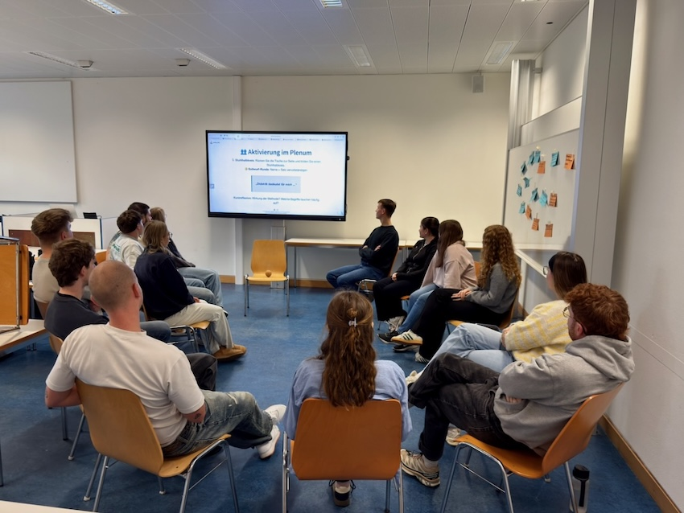

  <button onclick="triggerPrint()" title="Präsentation speichern">📥</button>
  <button onclick="location.href='/iWIP/praesentation/widi/did_allg_fach/'" title="Zur Präsentationsansicht">🖥️</button>



# 📚 Gegenstand  

Ausgangspunkt dieser Lehr-Lern-Einheit ist **Ihr eigenes Verständnis von Didaktik**. 🤔  
Darauf aufbauend möchte ich didaktische Entscheidungen **nicht nur erklären, sondern erlebbar machen** – und zugleich ein kleines **Kennenlernen** ermöglichen. 👥  

Im weiteren Verlauf werfen wir einen Blick auf die **Entstehungsgeschichte der Didaktik** 🕰️ 
und unterscheiden zwischen der **Allgemeinen Didaktik** und den **Fachdidaktiken**.  

# 🎯 Lehrziele  

In dieser Lehr-Lern-Einheit entwickeln Sie ein grundlegendes **Verständnis von Didaktik** und deren **wissenschaftliche Fundamente**.  

Sie lernen, …

- 🤔 das **eigene Verständnis von Didaktik** zu reflektieren und in Beziehung zu unterschiedlichen didaktischen Perspektiven zu setzen.  
- 🕰️ die **Entstehungsgeschichte der Didaktik** nachzuvollziehen und zentrale Entwicklungslinien zu skizzieren.  
- 🧭 zwischen **Allgemeiner Didaktik** und **Fachdidaktiken** zu unterscheiden und deren jeweilige Funktionen zu beschreiben.  
- 🔍 zentrale **Begriffe, Ziele und Prinzipien didaktischen Handelns** zu erklären und in eigene Überlegungen zu integrieren.  

---

💡 *Ziel ist es, ein reflektiertes Verständnis von Didaktik als Grundlage professionellen pädagogischen Handelns zu entwickeln.*

---

# 🧭 Aufbau & Ablauf  

Die Lehr-Lern-Einheit ist so gestaltet, dass Sie **Didaktik nicht nur theoretisch kennenlernen, sondern auch praktisch erfahren**.  

Gesamtdauer: ca. **90 Minuten**

| Phase | Inhalt | Ziel | Zeit |
|:------|:--------|:------|:------:|
| **1️⃣ Einstieg 🤔** | Individuelle Reflexion: *Was verstehe ich unter Didaktik?* | Aktivierung des Vorwissens und gemeinsame Begriffsklärung | 
⏱️ 20 Min
 |
| **2️⃣ Historischer Überblick 🕰️** | Entwicklungs­linien der Didaktik von Comenius bis Klafki | Verständnis zentraler Denkmodelle und Begriffstraditionen | 
⏱️ 15 Min
 |
| **3️⃣ Allgemeine Didaktik 🧭** | Vergleich theoretischer Ansätze und ihrer Funktionen | Abgrenzung und Verknüpfung beider Perspektiven | 
⏱️ 15 Min
 |
| **4️⃣ Fachdidaktik 🎓** | Übertragung didaktischer Prinzipien auf spezifische Fachkontexte | Erkennen der Besonderheiten und Funktionen fachdidaktischer Ansätze | 
⏱️ 25 Min
 |
| **5️⃣ Reflexion & Ausblick 💬** | Gemeinsame Diskussion und persönliche Standortbestimmung | Transfer auf das eigene Lehrverständnis | 
⏱️ 15 Min
 |

---

# 1️⃣ Einstieg 🤔  

Wahrscheinlich haben Sie bisher einen großen Teil Ihres Lebens in **Bildungseinrichtungen** verbracht – von der **KiTa** über die **Schule** bis zur **Universität**.  

Dort haben **Erzieher:innen** und **Lehrkräfte** Ihren Alltag geprägt. Vielleicht haben Sie selbst schon **Lehr-Lern-Arrangements** gestaltet – etwa als **Trainer:in**, **Tutor:in** oder **Nachhilfelehrer:in**?  

➡️ Sie verfügen also bereits über ein **eigenes Verständnis von Didaktik**.  

---

## 🧠 **Arbeitsauftrag**

Schreiben Sie Ihr Verständnis von **Didaktik** in **maximal zwei Sätzen** auf eine **Moderationskarte**. ✏️  

Anschließend besprechen wir im Seminar, **welche Unterschiede und Gemeinsamkeiten** sich zeigen.  

Darauf aufbauend reflektieren wir gemeinsam das **eigene Didaktikverständnis**. 💬  

⏱️ *Bearbeitungszeit: ca. 15 Minuten (inkl. Austausch im Plenum)*

---

🔽 Hinweis für asynchron Teilnehmende 🌍

Wenn Sie **nicht live am Seminar teilnehmen**, können Sie die Aufgabe digital bearbeiten:

1. Schreiben Sie Ihre zwei Sätze z. B. in ein Dokument auf  
   👉 <a href="https://cryptpad.fr/doc/" target="_blank" rel="noopener noreferrer">KryptPad – datenschutzfreundlicher Online-Editor</a>  
2. Führen Sie anschließend ein kurzes Gespräch mit einer **KI Ihrer Wahl** (z. B. ChatGPT, Claude o. Ä.) über Ihr Verständnis von Didaktik.  

💡 **Prompt-Vorschlag:**  
> „Ich möchte mein Verständnis von Didaktik reflektieren. Bitte erläutere, welche zentralen Dimensionen und Perspektiven typischerweise in einem Didaktikverständnis enthalten sind, und gib mir anschließend 2–3 Anregungen, wie ich mein eigenes Verständnis erweitern oder präzisieren könnte.“  

Notieren Sie anschließend Ihre wichtigsten Einsichten und vergleichen Sie sie mit Ihrer ursprünglichen Formulierung. 🔍  

---

## 👥 Kennenlernen & Aktivierung 

Um gut miteinander arbeiten zu können, möchte ich Sie nun kurz kennenlernen und aktivieren – und dabei erfahren, **welche Vorstellungen Sie mit Didaktik verbinden.**  

Bitte **schieben Sie die Tische zur Seite** und bilden Sie gemeinsam einen **Stuhlhalbkreis.** 🪑  

Werfen Sie anschließend den Ball 🎾 einer Person zu. Wer ihn fängt, stellt sich kurz **namentlich vor** und **vervollständigt den Satz**:

> **„Didaktik bedeutet für mich …“** 💬

🪞 **Reflexion**

Anschließend besprechen wir kurz gemeinsam:

- Wie hat diese Form der Vorstellung **auf Sie gewirkt**?  
- Wie hätte die gleiche Übung **mit Tischen** funktioniert?  
- Welche **didaktischen Überlegungen** stecken in dieser Methode?
- Welche **Begriffe** zur Didaktik wurden häufig genannt?

---

🔽 Unsere Beobachtungen 🔎

Wir haben unser Seminar im klassichen Setup mit Tischreihen begonnen:  

**Seminarraum mit Tischreihen:**  
 

<em><strong>Foto:</strong> Matthias Söll · <strong>Keine freie Lizenz</strong> (Rechte bei den abgebildeten Personen)</em>

Im Zuge der Vorbereitung der Vorstellungsrunde haben wir auf einen Stuhlkreis umgebaut:  

**Seminarraum mit Stuhlkreis:**  

<em><strong>Foto:</strong> Matthias Söll · <strong>Keine freie Lizenz</strong> (Rechte bei den abgebildeten Personen)</em>

Wir stellten fest, dass die Sitzordnung in **Tischreihen** zunächst vertraut und strukturiert wirkt, zugleich jedoch **mehr Ablenkung** durch Laptops oder Smartphones ermöglicht. Im **Stuhlkreis** hingegen waren alle Teilnehmenden unmittelbarer präsent, der Blickkontakt intensiver und die **Aufmerksamkeit stärker aufeinander gerichtet**. Die Atmosphäre wirkte offener und dialogischer. Wäre die gleiche Übung an Tischen durchgeführt worden, hätten sich vermutlich schnell **Gruppenstrukturen oder Barrieren** ergeben. Didaktisch lässt sich die Methode als Versuch verstehen, **Lernräume aktiv zu gestalten** und die **soziale Interaktion** bewusst in den Mittelpunkt zu stellen. Häufig genannte Begriffe waren dabei *Inhalte aufbereiten*, *Lehren*, *Methoden* oder *Medien*. 💬  

---

# 2️⃣ Historischer Überblick 🕰️

## 🖼️ Unterricht im Wandel  

Betrachten Sie die folgenden Bilder von **Unterrichtssituationen** aus unterschiedlichen Zeiten.  

Was fällt Ihnen in Bezug auf die **Aktivitäten der Lernenden und Lehrenden** sowie die **Sitzordnung** auf? 🤔  

---

### 📸 Klassenzimmer 1934  

  
*Quelle: <a href="https://rlp.museum-digital.de/object/33802" target="_blank" rel="noopener noreferrer">museum-digital Rheinland-Pfalz</a> · Lizenz: <a href="https://creativecommons.org/licenses/by/4.0/" target="_blank" rel="noopener noreferrer">CC BY 4.0</a>*  

---

### 📸 Klassenzimmer heute  

  
*Quelle: <a href="https://commons.wikimedia.org/wiki/File:Unterricht.jpg" target="_blank" rel="noopener noreferrer">Wikimedia Commons</a> · Lizenz: <a href="https://creativecommons.org/licenses/by-sa/3.0/" target="_blank" rel="noopener noreferrer">CC BY-SA 3.0</a>*  

---

🔽 Hinweis für asynchron Teilnehmende 🌍

Wenn Sie **nicht live am Seminar teilnehmen**, können Sie die Aufgabe digital bearbeiten:

1. Schreiben Sie Ihre Beobachtungen und Eindrücke z. B. in ein Dokument auf  
   👉 <a href="https://cryptpad.fr/doc/" target="_blank" rel="noopener noreferrer">KryptPad – datenschutzfreundlicher Online-Editor</a>  

2. Führen Sie anschließend ein kurzes Gespräch mit einer **KI Ihrer Wahl** (z. B. ChatGPT, Claude o. Ä.) über die Unterschiede und Veränderungen zwischen den beiden Unterrichtssituationen.  

💡 **Prompt-Vorschlag:**  
> „Ich betrachte zwei Unterrichtsbilder auf der Seite <a href="https://matthiassoell.github.io/iWIP/" target="_blank" rel="noopener noreferrer">SciBlog iWIP</a> im Beitrag *Unterricht im Wandel*. Bitte hilf mir, die Unterschiede in Lehr- und Lernaktivitäten, Raumgestaltung und Lehrerrolle herauszuarbeiten. Erläutere, wie sich diese Beobachtungen im historischen Kontext der Didaktik deuten lassen.“  

Notieren Sie anschließend Ihre wichtigsten Erkenntnisse und überlegen Sie,  
was diese Beobachtungen über den **Wandel von Unterricht** aussagen. 🔍  

---

🔽 Mögliche Beobachtungen 🔎

**Klassenzimmer 1934:**  
Im ersten Bild sitzen die Schüler:innen auf Bänken und schauen in die Kamera. Die Sitzhaltungen sind eher angespannt, die Gesichter ernst. Die Lehrerin sitzt in erhobener Position und beobachtet die Klasse mit wohlwollend-ernster Miene.  

**Klassenzimmer heute:**  
Im zweiten Bild sitzen die Schüler:innen in Gruppen zusammen und arbeiten aktiv. Gestik und Mimik variieren – eine Schülerin zeigt etwas, ein Schüler erklärt, eine andere meldet sich. Der Lehrer steht an einem Tisch und betrachtet das Arbeitsergebnis einer Schülerin.  

---

Sicherlich gab es auch früher schon **Gruppenarbeiten**, und auch heute findet **Frontalunterricht** statt.  

Dennoch zeigen die Bilder exemplarisch, dass **Unterricht immer zeitgebunden** ist – geprägt durch gesellschaftliche Bedingungen, Bildungsverständnisse und pädagogische Leitideen.  

---

Im Folgenden betrachten wir einige **gesellschaftliche Entwicklungen** und die **wissenschaftlichen Erkenntnisse**, die aus der Zeitgebundenheit von Unterricht hervorgegangen sind. 🕰️

## 🕰️ Geschichte der Pädagogik  

<a href="https://doi.org/10.36198/9783838545240" target="_blank" rel="noopener noreferrer">Koerrenz et al. (2017)</a> skizzieren die Geschichte der Pädagogik anhand der folgenden Etappen:

- 🏛️ **Antike (bis 313)** – Von Mykene bis Kaiser Konstantin  
- ⛪ **Mittelalter (313–1492)** – Von Kaiser Konstantin bis Christoph Kolumbus  
- 🌍 **Frühe Neuzeit I (1492–1689)** – Von Christoph Kolumbus bis zu Bill of Rights. 
- 💡 **Frühe Neuzeit II (1689–1789)** – Von Bill of Rights bis Französische Revolution  
- ⚙️ **Moderne I (1789–1920)** – Von der Französischen Revolution bis zum Völkerbund  
- ⚔️ **Moderne II (1920–1945)** – Vom Völkerbund bis zur Gründung der UNO  
- 🌐 **Moderne III (1945–1992)** – Von der UNO bis zum Weltgipfel in Rio de Janeiro  

Eine anschauliche Visualisierung bietet der Blog <a href="https://www.smarterlernen.at/geschichte-der-bildung/" target="_blank" rel="noopener noreferrer">smarterlernen.at</a>, betrieben von einem österreichischen Bildungsunternehmen.  

> 💬 Die Gliederung macht deutlich: Bildung ist nie zeitlos, sondern stets Ausdruck der gesellschaftlichen, kulturellen und ökonomischen Bedingungen ihrer Epoche.

---

## 3️⃣ Allgemeine Didaktik 🧭  

Warum benötigen wir eigentlich *Didaktik* als wissenschaftliche Disziplin?  

> „Didaktik ist die Wissenschaft und Theorie des Unterrichts.“  
> <a href="https://doi.org/10.1007/978-3-531-18984-0" target="_blank" rel="noopener noreferrer">Arnold & Roßa (2012, S. 14)</a>

Didaktik fragt also danach, **wie Lernprozesse gestaltet werden können**, um Lernen **bedeutsam, wirksam und reflexiv** zu machen.  

---

In der Übung *Methoden und Medien wirtschaftsberuflichen Handelns* haben Sie bereits Kriterien für guten Unterricht kennengelernt.  

Besonders bekannt sind die **10 Merkmale guten Unterrichts** von <a href="https://ebookcentral.proquest.com/lib/ubrostock-ebooks/detail.action?docID=2080724" target="_blank" rel="noopener noreferrer">Hilbert Meyer (2014)</a>. 🎥 <a href="https://www.youtube.com/watch?v=_4kPq5vhEHc" target="_blank" rel="noopener noreferrer">YouTube: Dr. Hilbert Meyer – Was guten Unterricht ausmacht</a>

---

### 📘 Kennzeichen der Allgemeinen Didaktik  

- Entstehungszeit: beginnende Aufklärung (ca. 1700, *Didactica Magna* von Comenius)  
- Ab 1960er-Jahren: Etablierung als wissenschaftliche Disziplin  
- Bedeutendster Vertreter: **Wolfgang Klafki** (Kategoriale Bildung, Didaktische Analyse, Allgemeinbildung, kritisch-konstruktive Didaktik) 🎓  
- Bezugsdisziplinen u. a.: Anthropologie, Psychologie, Philosophie, Soziologie, Politikwissenschaft  

➡️ Siehe dazu auch <a href="https://doi.org/10.1007/978-3-531-18984-0" target="_blank" rel="noopener noreferrer">Arnold & Roßa (2012)</a> und <a href="https://ebookcentral.proquest.com/lib/ubrostock-ebooks/detail.action?docID=2080721" target="_blank" rel="noopener noreferrer">Jank & Meyer (2014)</a>.

---

## 4️⃣ Fachdidaktik 🎓  

Warum benötigen wir nun zusätzlich *Fachdidaktiken* als eigene wissenschaftliche Disziplinen?

> „Fachdidaktik ist die Wissenschaft und Theorie des (Fach-)Unterrichts.“  
> <a href="https://doi.org/10.1007/978-3-531-18984-0" target="_blank" rel="noopener noreferrer">Arnold & Roßa (2012, S. 14)</a>

> „[…] Wissenschaft vom pädagogisch angeleiteten institutionalisierten Lehren und Lernen fachlich bezogener Inhalte, Methoden, Prinzipien und Aspekte.“  
> <a href="https://search.worldcat.org/de/title/76528336" target="_blank" rel="noopener noreferrer">Köhnlein (2004, S. 140)</a>

---

### 📘 Kennzeichen der Fachdidaktiken  

- Entstehungszeit: unterschiedlich, teils parallel zur Entwicklung der Fachwissenschaften (z. B. Wirtschaftsdidaktik um 1900)  
- Bezugspunkt: einzelne **Fächer oder Berufsfelder**  
- Fokus: Anwendung allgemeiner didaktischer Prinzipien auf fachliche Inhalte  

➡️ Vgl. dazu <a href="https://doi.org/10.1007/978-3-531-18984-0" target="_blank" rel="noopener noreferrer">Arnold & Roßa (2012)</a> und <a href="https://ebookcentral.proquest.com/lib/ubrostock-ebooks/detail.action?docID=2080721" target="_blank" rel="noopener noreferrer">Jank & Meyer (2014)</a>.

---

## 5️⃣ Reflexion & Ausblick 💬  

Haben wir unsere Ziele erreicht?  

Sie können nun …  

- 🤔 **Verständnis reflektieren** – eigene Sicht auf Didaktik prüfen.  
- 🕰️ **Geschichte verstehen** – Entwicklung und Linien kennen.  
- 🧭 **Disziplinen unterscheiden** – Allgemeine vs. Fachdidaktik.  
- 🔍 **Handeln begründen** – zentrale Prinzipien integrieren. 

> 💭 *Didaktik bleibt damit keine abgeschlossene Theorie, sondern ein Werkzeug, um Lernen in einer sich wandelnden Welt bewusst zu gestalten.* 🌍  

---

# 📚 Literatur  

<ul class="refs">
  <li>
    Arnold, K.-H., &amp; Roßa, A.-E. (2012). <em>Grundlagen der Allgemeinen Didaktik und der Fachdidaktiken.</em>
    In M. Kampshoff &amp; C. Wiepke (Hrsg.), <em>Handbuch Geschlechterforschung und Fachdidaktik</em> (S. 11–23). VS Verlag für Sozialwissenschaften.
    <a href="https://doi.org/10.1007/978-3-531-18984-0" target="_blank" rel="noopener noreferrer">https://doi.org/10.1007/978-3-531-18984-0</a>
  </li>
  <li>
    Meyer, H. (2014). <em>Was ist guter Unterricht?</em> Cornelsen Scriptor.
    <a href="https://ebookcentral.proquest.com/lib/ubrostock-ebooks/detail.action?docID=2080724" target="_blank" rel="noopener noreferrer">https://ebookcentral.proquest.com/lib/ubrostock-ebooks/detail.action?docID=2080724</a>
  </li>
  <li>
    Jank, W., &amp; Meyer, H. (2014). <em>Didaktische Modelle.</em> Cornelsen Scriptor.
    <a href="https://ebookcentral.proquest.com/lib/ubrostock-ebooks/detail.action?docID=2080721" target="_blank" rel="noopener noreferrer">https://ebookcentral.proquest.com/lib/ubrostock-ebooks/detail.action?docID=2080721</a>
  </li>
  <li>
    Koerrenz, R., Kenklies, K., Kauhaus, H., &amp; Schwarzkopf, M. (2017). <em>Geschichte der Pädagogik</em>. Springer VS.
    <a href="https://doi.org/10.36198/9783838545240" target="_blank" rel="noopener noreferrer">https://doi.org/10.36198/9783838545240</a>
  </li>
  <li>
    Köhnlein, W. (2004). Fachdidaktik. In R. W. Keck, U. Sandfuchs &amp; B. Feige (Hrsg.), <em>Wörterbuch Schulpädagogik</em> (S. 140–143). Bad Heilbrunn: Klinkhardt.
    <a href="https://search.worldcat.org/de/title/76528336" target="_blank" rel="noopener noreferrer">https://search.worldcat.org/de/title/76528336</a>
  </li>
</ul>