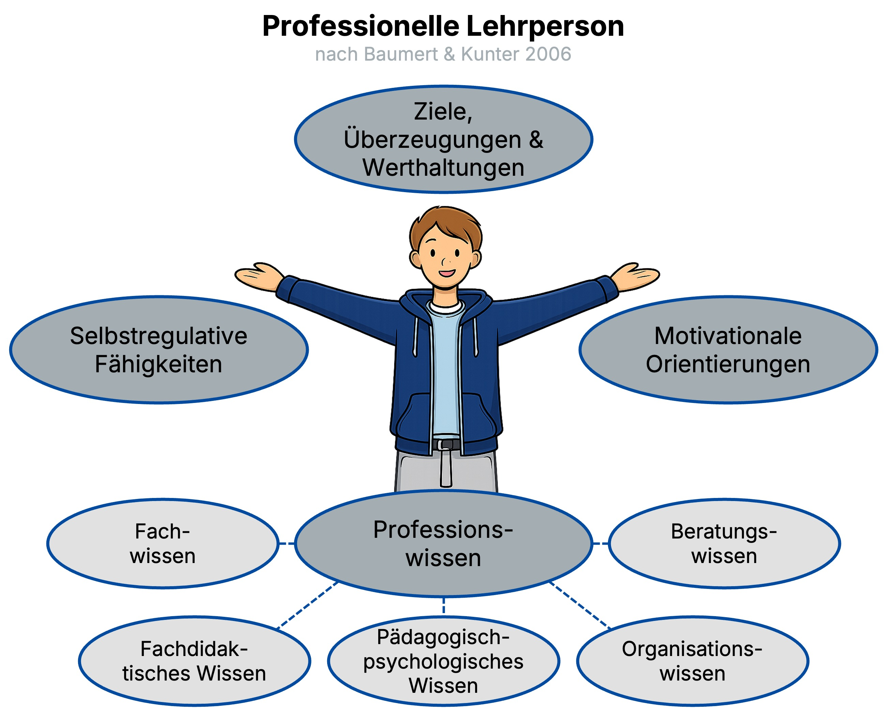

  <button id="md-copy-btn" title="Markdown kopieren (ohne Bilder)">📑</button>
  <button onclick="triggerPrint()" title="Blog speichern">📥</button>
  <button onclick="location.href='/iWIP/praesentation/widi/hosp_feed_refl/'" title="Zur Präsentationsansicht">🖥️</button>
  <button class="iwip_help_btn"
        type="button"
        aria-haspopup="dialog"
        aria-controls="iwip_help_overlay"
        aria-expanded="false"
        title="Hinweise zur Nutzung">
  ⓘ
  </button>



---

# 1️⃣ 🌀 Recap – Rückblick & Einordnung  

In dieser Lehr-Lern-Einheit knüpfen wir an grundlegende Fragen der Didaktik an:

- Was macht **professionelles Lehrer:innenhandeln** aus?  
- Wie können wir Unterricht gezielt **beobachten**, **rückmelden** und **reflektieren**, um daraus zu lernen?  
- Welche Rolle spielen dabei **Hospitation**, **Feedback** und **Reflexion**?

Die Veranstaltung verbindet damit zentrale Bausteine der **Professionalisierung** mit ganz praktischen Übungen im Seminar.

---

# 💭 Fragestellung  

> [!TIPP]
> Wie können Hospitation, Feedback und Reflexion genutzt werden, um das eigene Lehrer:innenhandeln gezielt weiterzuentwickeln?

---

# 🎯 Lehrziele  

Die Studierenden sind in der Lage …

- die Zusammenhänge zwischen **Hospitation**, **Feedback** und **Reflexion** in der Veranstaltung zu benennen,  
- Feedback zu geben und zu nehmen (am Beispiel der entwickelten OER-Themenübersichten WiDi),  
- den Beitrag von Hospitation, Feedback und Reflexion für die **Professionalisierung** von Lehrpersonen zu erläutern,  
- das **ALACT-Modell** als Strukturhilfe für eigene Reflexionsprozesse zu nutzen.

---

# 🧭 Ablauf (90 Min)  

Die Lehr-Lern-Einheit ist als Kombination aus Input, angeleiteter Analyse und gemeinsamer Reflexion angelegt.

Gesamtdauer: ca. **90 Minuten**

| Phase | Inhalt | Ziel | Zeit |
|:------|:--------|:------|:------:|
| **1️⃣ Einstieg & Aktivierung 🤔** | Anknüpfung an bisherige Sitzungen, Aktivierung von Erfahrungen mit Hospitation & Feedback | Orientierung schaffen | ⏱️ 5 Min |
| **2️⃣ Hospitation 🔍** | Klärung des Hospitationsbegriffs, Blick auf einen Hospitationsbogen | Zielgerichtete Unterrichtsbeobachtung verstehen | ⏱️ 15 Min |
| **3️⃣ Feedback inkl. Übung 💬** | Grundlagen wirksamen Feedbacks & praktische Feedbackphase zu OER-Themenübersichten | Feedback geben & nehmen erproben | ⏱️ 30 Min |
| **4️⃣ Reflexion 🪞** | Theoretische Grundlagen & ALACT-Modell, Anwendung auf eigene Erfahrungen | Reflexionsprozesse strukturieren | ⏱️ 25 Min |
| **5️⃣ Ausblick 🕰️** | Übertragung auf weitere Lehrsituationen & eigene Professionalisierung | Transfer sichern | ⏱️ 15 Min |

---

# 2️⃣ 🤝 Professionalisierung im Blick  

## Professionalisierung nach Baumert & Kunter (2006)  

Professionalisierung von Lehrer:innen wird häufig als Zusammenspiel mehrerer Dimensionen verstanden, etwa:

- **professionelles Wissen** (Fachwissen, fachdidaktisches Wissen, pädagogisch-psychologisches Wissen),  
- **Überzeugungen und Werthaltungen**,  
- **Motivation und Selbstregulation**,  
- **Handlungskompetenzen** im Unterricht und darüber hinaus.

<figure class="figure-frame">
  
</figure>

Bildquelle: Eigene Darstellung in Anlehnung an Baumert & Kunter (2006) · Illustration: erstellt mit Unterstützung von ChatGPT · Lizenz: <a href="https://creativecommons.org/licenses/by-sa/4.0/" target="_blank" rel="noopener">CC BY-SA 4.0</a>

Im Seminar wird dieses Verständnis über eine Grafik (in Anlehnung an Baumert & Kunter 2006) visualisiert und als Referenzrahmen genutzt, um Hospitation, Feedback und Reflexion einzuordnen.

> [!TIPP]
> Hospitation, Feedback und Reflexion sind keine „Add-ons“, sondern Bausteine professionellen Lehrer:innenhandelns: Sie helfen, Unterricht **bewusst wahrzunehmen**, **rückzumelden** und **weiterzuentwickeln**.

---

# 3️⃣ 👀 Hospitation – Unterricht gezielt beobachten  

## Was ist eine Hospitation?  

- Bei einer **Hospitation** wird Unterricht **systematisch beobachtet**.  
- Die Beobachtung dient einem bestimmten **Zweck**, z. B. der Professionalisierung der Beobachter:innen.  
- Hospitation bezieht sich in der Regel auf **spezifische Aspekte** des Unterrichts, z. B.:
  - Phasierung des Unterrichts,  
  - Darstellung der fachlichen Inhalte,  
  - Interaktionen zwischen Lehrenden und Lernenden,  
  - Methoden- und Medieneinsatz.  

Quelle: vgl. Köhler & Weiß (2015).

Im Seminar arbeiten wir mit einem **Hospitationsbogen**, der ausgewählte Beobachtungskategorien strukturiert und so die Auswertung im Anschluss erleichtert.

<figure class="figure-frame">
  
</figure>  

Bildquelle: Eigene Darstellung · Lizenz: <a href="https://creativecommons.org/licenses/by-sa/4.0/" target="_blank" rel="noopener">CC BY-SA 4.0</a>

---

# 4️⃣ 💬 Feedback – wirksam rückmelden  

## Hintergrund: Was ist Feedback?  

- **Gegenstand**: individuelle Rückmeldung zur eigenen Leistung.  
- **Ziel**: eine **Möglichkeit zur Verbesserung** eröffnen – nicht bloß zu bewerten.  
- **Form**: mündlich oder schriftlich.  
- **Metapher**: Feedback als „Geschenk“ – adressiert eine Person, gehört ihr, kann angenommen oder auch (teilweise) abgelehnt werden.  
- **Ansatz**: Feedback sollte von **Wertschätzung** getragen sein.

---

## Grundregeln für hilfreiches Feedback  

- **Beobachtetes konkret beschreiben**  
  - z. B. „Auf Folie XY sagtest du … . Das hat auf mich … gewirkt.“  
- **Ich-Botschaften senden**  
  - z. B. „Mir ist aufgefallen, dass du …“, „Ich habe wahrgenommen/gehört, dass …“.  
- Nur **Veränderbares** zurückmelden  
  - Fokus auf Aspekten, an denen die andere Person tatsächlich arbeiten kann.  
- **Keine Rechtfertigungen** seitens der Feedback-Nehmenden  
  - erst verstehen, dann ggf. nachfragen.  
- **Keine globalen Bewertungen**  
  - also nicht: „Das war doof/ langweilig“, sondern: „An der Stelle X bin ich ausgestiegen, weil …“.  
- **Keine Vermutungen über innere Motive**  
  - nicht: „Du hast das gemacht, weil …“, sondern bei der beobachtbaren Ebene bleiben.

---

## Tipps für hohe Wirkung – vertiefende Materialien  

Im Seminar werden kurze Videos eingesetzt, die zentrale Prinzipien wirksamen Feedbacks anschaulich machen.  
Für das Selbststudium können Sie u. a. folgende Videos nutzen:

- [Wirksam Feedback geben (YouTube)](https://www.youtube.com/watch?v=7KMeQ6hyPBU)  
- [Die Feedbackformel WWW – Mit WWW erfolgreich Feedback geben (YouTube)](https://www.youtube.com/watch?v=1DlSMQr4D6g)

> [!TIPP]
> Nutzen Sie diese Materialien, um Ihr eigenes „Feedback-Repertoire“ zu schärfen – z. B. indem Sie Formulierungen notieren, die Sie in zukünftigen Lehrsituationen ausprobieren möchten.

---

# 5️⃣ 🪞 Reflexion – vom Erleben zum Lernen  

## Was ist Reflexion?  

- Reflexion ist eine **spezifische Form des Denkens**, die zweckgebunden ist und auf die Analyse und Verbesserung des eigenen Handelns zielt (vgl. Dewey, 1933).  
- Jahncke et al. (2018, S. 118) betonen Reflexion als  
  > „[…] das Nachdenken über sich und das eigene Handeln sowie die Konsequenzen, die aus dem Reflektieren einer Situation gezogen werden […].“  
- Reflexion stellt eine **Verbindung zwischen Theorie und Praxis** her:  
  - Sie vermittelt zwischen **Wissen** und **Handeln**,  
  - hilft, Routinen bewusst zu machen und ggf. zu verändern.

---

## Reflexion als Professionalisierungsanlass  

Reflexion fördert die Professionalisierung von Lehrer:innen u. a. durch:

- **Selbstanalyse** und **Bewusstwerdung** von Handlungen, Überzeugungen und Werthaltungen,  
- die **Verbesserung von Planung, Durchführung und Auswertung** von Unterricht,  
- die Möglichkeit, Erfahrungen im Licht theoretischer Konzepte neu zu deuten.

> [!TIPP]
> Professionalisierung entsteht nicht nur durch „mehr Erfahrung“, sondern durch **strukturiert reflektierte Erfahrung**.

---

# 6️⃣ 🧠 Das ALACT-Modell der Reflexion  

## ALACT nach Korthagen & Kessels (1999)  

Das ALACT-Modell Korthagen & Kessels (1999) beschreibt einen fünfphasigen Zyklus professioneller Reflexion:

1. **Action (Handeln)** – eine konkrete Unterrichtssituation oder Handlung.  
2. **Looking back on the Action (Rückblick)** – was ist passiert, was war auffällig?  
3. **Awareness of essential Aspects (Bewusstwerden)** – welche Aspekte sind für das Gelingen/Misslingen zentral?  
4. **Creating alternative Methods of Action (Alternativen entwickeln)** – was könnte ich beim nächsten Mal anders machen?  
5. **Trial (Ausprobieren)** – die alternativen Handlungsmöglichkeiten werden in neuen Situationen erprobt.

<figure class="figure-frame">
  
</figure>  

Bildquelle: Eigene Darstellung in Anlehnung an Korthagen & Kessels (1999) · Lizenz: <a href="https://creativecommons.org/licenses/by-sa/4.0/" target="_blank" rel="noopener">CC BY-SA 4.0</a>

Im Seminar wird das Modell genutzt, um konkrete Erfahrungen aus Hospitation und Feedback systematisch zu reflektieren und **Handlungsalternativen** zu entwickeln.

---

# 7️⃣ ❤️ Hospitation, Feedback & Reflexion zusammenführen  

Zum Abschluss der Einheit werden die drei Bausteine noch einmal zusammengedacht:

- **Hospitation** liefert strukturierte Beobachtungen von Unterricht.  
- **Feedback** macht diese Beobachtungen für andere nutzbar und unterstützt deren Weiterentwicklung.  
- **Reflexion** hilft, aus Hospitation und Feedback **dauerhaftes Lernen** für das eigene professionelle Handeln abzuleiten.

Mögliche Leitfragen:

- Was nehme ich aus der Hospitation über **Gelingen und Stolpersteine** von Unterricht mit?  
- Welche **Feedback-Erfahrungen** waren für mich besonders hilfreich – und warum?  
- Wie kann ich das ALACT-Modell nutzen, um eigene Unterrichtserfahrungen in Zukunft systematisch zu reflektieren?

---

# 📚 Literatur

Arnold, K.-H., &amp; Roßa, A.-E. (2012). <em>Grundlagen der Allgemeinen Didaktik und der Fachdidaktiken.</em> In M. Kampshoff &amp; C. Wiepke (Hrsg.), <em>Handbuch Geschlechterforschung und Fachdidaktik</em> (S. 11–23). VS Verlag für Sozialwissenschaften.   

Baumert, J., & Kunter, M. (2006). Stichwort: Professionelle Kompetenz von Lehrkräften. *Zeitschrift Für Erziehungswissenschaft*, 9(4), 469–520.  
 
Dewey, J. (1933). *How we think : a restatement of the relation of reflective thinking to the educative process.* D.C. Heath.  

Vergleichende Analyse zweier Portfoliokonzepte zur Beförderung der (Selbst‑)Reflexionsfähigkeit die hochschullehre 06/2018. (n.d.). *Die Hochschullehre*, 4.  

Jank, W., &amp; Meyer, H. (2014). <em>Didaktische Modelle.</em> Cornelsen Scriptor.  

Korthagen, F. A. J., & Kessels, J. P. A. M. (1999). Linking theory and practice: Changing the pedagogy of teacher education. *Educational Researcher*, 28(4), 4–17.  

Koerrenz, R., Kenklies, K., Kauhaus, H., &amp; Schwarzkopf, M. (2017). <em>Geschichte der Pädagogik</em>. Springer VS.   

Köhler, K., Weiß, L., & Julius Beltz GmbH & Co KG. (2015). *Unterricht kompetenzorientiert nachbesprechen : Lehrproben - Unterrichtsbesuche - kollegiale Hospitationen*. Beltz.  
 
Köhnlein, W. (2004). Fachdidaktik. In R. W. Keck, U. Sandfuchs &amp; B. Feige (Hrsg.), <em>Wörterbuch Schulpädagogik</em> (S. 140–143). Bad Heilbrunn: Klinkhardt.  
