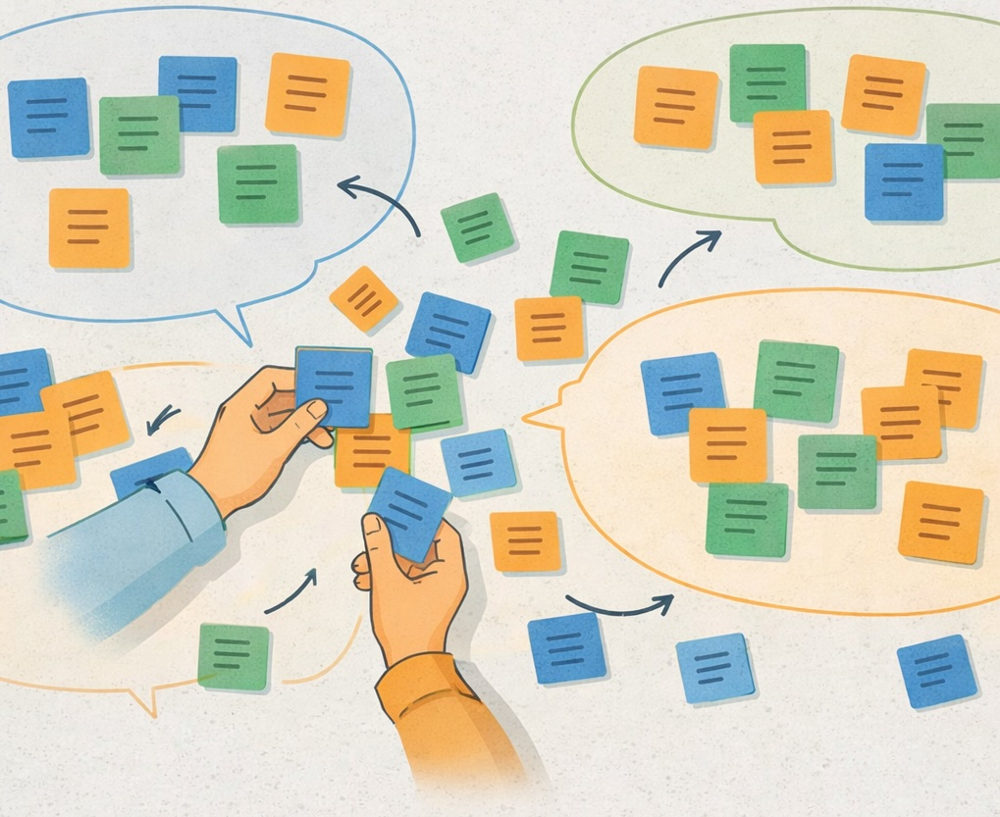

  <button id="md-copy-btn" title="Markdown kopieren (ohne Bilder)">📑</button>
  <button onclick="triggerPrint()" title="Blog speichern">📥</button>
  <button onclick="location.href='/iWIP/praesentation/widi/widi/'" title="Zur Präsentationsansicht">🖥️</button>
  <button class="iwip_help_btn"
        type="button"
        aria-haspopup="dialog"
        aria-controls="iwip_help_overlay"
        aria-expanded="false"
        title="Hinweise zur Nutzung">
  ⓘ
  </button>



---

# 🌀 Recap – Rückblick auf die letzte Veranstaltung  

- 🏫 Ausgehend von Ihren Erfahrungen in **Bildungseinrichtungen** haben wir in der letzten Veranstaltung Ihr persönliches **Didaktikverständnis** reflektiert.  
- 📜 Sie konnten außerdem die **historische Verwurzelung der Didaktik** rekapitulieren.  
- Die **unmittelbaren Auswirkungen didaktischer Entscheidungen** – etwa durch die Wahl der **Sitzordnung** 🪑 – haben wir erlebbar gemacht.  
- 🔍 Darüber hinaus arbeiteten wir Unterschiede zwischen **Allgemeiner Didaktik** und **Fachdidaktik** heraus.  

---

# 📚 Gegenstand  

- Heute widmen wir uns gezielt der **Wirtschaftsdidaktik** 💼.  
- Sie erarbeiten in **Gruppen** 👥 zentrale Themenfelder und **systematisieren** diese 🧩.
- Ferner **reflektieren** wir die **methodische Vorgehensweise** 🔄 im Vergleich zur letzten Sitzung.  

---

# 💭 Fragestellung  

> **Mit welchen Themen setzt sich die Wirtschaftsdidaktik aktuell auseinander?**

---

# 🎯 Lehrziele  

Sie erarbeiten sich einen Überblick über die zentralen Themenfelder der Wirtschaftsdidaktik.  

Sie lernen, …

- 🧩 die **Themenfelder der Wirtschaftsdidaktik** zu systematisieren und zu beschreiben,  
- 👥 in **Gruppen** Ergebnisse zu erarbeiten und  
- 🪞 die **Vor- und Nachteile methodischer Erarbeitungs- und Darstellungsformen** zu reflektieren.  

---

💡 *Ziel ist es, ein reflektiertes Verständnis von Wirtschaftsdidaktik als Grundlage professionellen wirtschaftspädagogischen Handelns zu entwickeln.*  

---

# 🧭 Aufbau & Ablauf  

Die Lehr-Lern-Einheit ist so konzipiert, dass Sie von einer **offenen Fragestellung** ausgehen und sich diese in **kooperativer Gruppenarbeit** selbst erarbeiten.  

Gesamtdauer: ca. **90 Minuten**

| Phase | Inhalt | Ziel | Zeit |
|:------|:--------|:------|:------:|
| **1️⃣ Einstieg 🤔** | Rückblick auf die letzte Sitzung und Einführung in die heutige Fragestellung | Vorwissen aktivieren, Leitfrage klären, Motivation schaffen | ⏱️ 10 Min |
| **2️⃣ Erarbeitung 🧩** | Vier Gruppen analysieren je eine Quelle: Arndt 2020, Brahm et al. o. J., Euler &amp; Hahn 2014 oder Wilbers 2022 und bereiten Ergebnisse auf | Themen identifizieren, geeignete Darstellungsform wählen, methodische Vor- & Nachteile reflektieren | ⏱️ 45 Min |
| **3️⃣ Präsentation 💬** | Kurzvorstellung der Gruppenergebnisse und gemeinsame Reflexion im Plenum | Perspektiven vergleichen, Themen systematisieren, Erkenntnisse sichern | ⏱️ 35 Min |

---

# 🧠 Arbeitsauftrag  

Als Studierende:r der Wirtschaftspädagogik verfügen Sie bereits über grundlegende didaktische Kenntnisse. Nun geht es darum, das **Spezifische der Wirtschaftsdidaktik** zu verstehen.  

1. Bilden Sie **vier Gruppen** und stellen Sie sich je zwei **Tische** zusammen.  
2. **Lesen** Sie die Ihnen zugewiesene Quelle sorgfältig:
- <a href="#-literatur">Arndt (2020)</a>, S. 47–53  
- <a href="#-literatur">Brahm et al. (o. J.)</a>, sämtliche Themenfelder  
- <a href="#-literatur">Euler & Hahn (2014)</a>, S. 77–87 & S. 89–91  
- <a href="#-literatur">Wilbers (2022)</a>, S. 1–22  
1. Arbeiten Sie heraus, mit welchen **Themen** sich die Wirtschaftsdidaktik beschäftigt.  
2. Ergänzen Sie ggf. **fehlende Themen**, die in Ihrer Quelle nicht vorkommen.  
3. Halten Sie Ihre Ergebnisse in einer geeigneten Form fest, z. B.:  
   - 🧾 **Dokument** (z. B. <a href="https://cryptpad.fr/doc/" target="_blank" rel="noopener noreferrer">cryptpad.fr</a>)  
   - 🪶 **Präsentation** (z. B. <a href="https://www.canva.com/" target="_blank" rel="noopener noreferrer">Canva</a> oder <a href="https://cryptpad.fr/presentation/" target="_blank" rel="noopener noreferrer">cryptpad.fr</a>)  
   - 🧱 **Board** (z. B. <a href="https://miro.com/app/board/uXjVJ7SaunY=/" target="_blank" rel="noopener noreferrer">Miro</a>)  
   - ✍️ **Etherpad** (z. B. <a href="https://yopad.eu" target="_blank" rel="noopener noreferrer">yopad.eu</a>)  
   - 📷 **analoge Grafik** (z. B. digitalisiert per Smartphone)  
4. Bereiten Sie eine **max. 5-minütige Kurzvorstellung** Ihrer Ergebnisse vor.  

⏱️ *Bearbeitungszeit: ca. 45 Minuten*  

---

🔽 Hinweis für asynchron Teilnehmende 🌍

Wenn Sie **nicht live am Seminar teilnehmen**, können Sie die Aufgabe digital bearbeiten:

1. **Lesen** Sie den Text von <a href="#-literatur">Wilbers (2022)</a> und lassen Sie sich den Text von <a href="#-literatur">Brahm et al. (o. J.)</a> mithilfe einer KI zusammenfassen.  
2. **Vergleichen** Sie anschließend die Ergebnisse beider Quellen.  
3. Schreiben Sie Ihre **Erkenntnisse** in ein Online-Dokument, z. B.:  
   👉 <a href="https://cryptpad.fr/doc/" target="_blank" rel="noopener noreferrer">KryptPad – datenschutzfreundlicher Online-Editor</a>  
4. Führen Sie ein **kurzes Gespräch** mit einer KI Ihrer Wahl (z. B. ChatGPT, Claude o. Ä.) über Ihr **Verständnis von Wirtschaftsdidaktik**.  

💡 **Prompt-Vorschlag:**  
> Fasse bitte den Text „Wirtschaft unterrichten. Offenes Lehrbuch für Wirtschaftsdidaktik“ von Brahm, Ring und Schild (o. J.) zusammen.  
> Konzentriere dich dabei auf folgende Punkte:  
> 1. Welche zentralen Themenfelder der Wirtschaftsdidaktik werden behandelt?  
> 2. Welche Ziele und Funktionen werden der Wirtschaftsdidaktik zugeschrieben?  
> 3. Welche aktuellen Herausforderungen oder Entwicklungstendenzen werden genannt?  
>  
> Bitte formuliere die Zusammenfassung klar und kompakt und verwende eine sachlich-akademische Sprache.  

Notieren Sie anschließend Ihre wichtigsten Einsichten und vergleichen Sie sie mit Ihrer ursprünglichen Einschätzung. 🔍  

---

# 📘 Kennzeichen der Fachdidaktiken 🔄  

- Entstehungszeit: unterschiedlich, teils parallel zur Entwicklung der **Fachwissenschaften** (z. B. Wirtschaftsdidaktik um 1900)  
- Bezugspunkt: einzelne **Fächer oder Berufsfelder**  
- Fokus: Anwendung allgemeiner didaktischer Prinzipien auf **fachliche Inhalte**  

➡️ Siehe dazu auch <a href="#-literatur">Arnold & Roßa (2012)</a> und <a href="#-literatur">Jank & Meyer (2014)</a>.  

---

# 🧩 Systematisierung der Themen der Wirtschaftsdidaktik  

Wir fassen die in den Quellen identifizierten Themenfelder gemeinsam auf **Moderationskarten** zusammen und **clustern** sie nach übergeordneten Bereichen.

<figure class="figure-frame">
  
</figure>

Bildquelle: Eigene Darstellung · Illustration: erstellt mit Unterstützung von ChatGPT · Lizenz: <a href="https://creativecommons.org/licenses/by-sa/4.0/" target="_blank" rel="noopener">CC BY-SA 4.0</a>

---

## 🗺️ Erläuterung zur Systematisierung  

Sie haben über die Gemeinsamkeiten und Unterschiede nachgedacht und möchten sich nun die **Hintergründe genauer ansehen**? Dann klicken Sie auf die folgende Liste 👇  

🔽 Erläuterung zur Systematisierung 🗺️

- Wirtschaftsdidaktik in der **beruflichen Bildung**: vgl. <a href="#-literatur">Euler & Hahn (2014)</a>, <a href="#-literatur">Wilbers (2022)</a>  
- Wirtschaftsdidaktik in der **allgemeinen Bildung**: vgl. <a href="#-literatur">Arndt (2020)</a>, <a href="#-literatur">Brahm et al. (o. J.)</a>  
- Unterschiedliche **normative Zielsetzungen** (z. B. berufliche Handlungskompetenz vs. mündige Konsument:innen)  
- Unterschiedliche **Bezugspunkte** (z. B. betriebliche Praxis, Konsumverhalten, Finanzentscheidungen)  

---

# 💬 Reflexion & Ausblick  

Haben wir unsere Ziele erreicht?  

Sie können nun …

- zentrale **Themenfelder der Wirtschaftsdidaktik** benennen und systematisieren,  
- in **Gruppen** kooperativ Ergebnisse erarbeiten,  
- **methodische Ansätze und Darstellungsformen** kritisch reflektieren.  

💡 *Damit vertiefen Sie Ihr Verständnis von Wirtschaftsdidaktik als Grundlage professionellen pädagogischen Handelns.*

🔭 **Ausblick:** OER

---

# 📚 Literatur  

Arndt, H. (2020). <em>Economic Education – Ökonomische Bildung.</em> FAU University Press.  

Brahm, T., Ring, M. &amp; Schild, K. (o.&nbsp;J.). <em>Wirtschaft unterrichten. Offenes Lehrbuch für Wirtschaftsdidaktik.</em> <a href="https://wirtschaft-unterrichten.de/themenfelder-oekonomische-bildung" target="_blank" rel="noopener noreferrer">https://wirtschaft-unterrichten.de/themenfelder-oekonomische-bildung</a> (abgerufen am 17.02.2026)

Euler, D. &amp; Hahn, A. (2014). <em>Wirtschaftsdidaktik.</em> Haupt Verlag.   

Wilbers, K. (2022). <em>Einführung in die Berufs- und Wirtschaftspädagogik. Schulische und betriebliche Lernwelten erkunden.</em> epubli.   