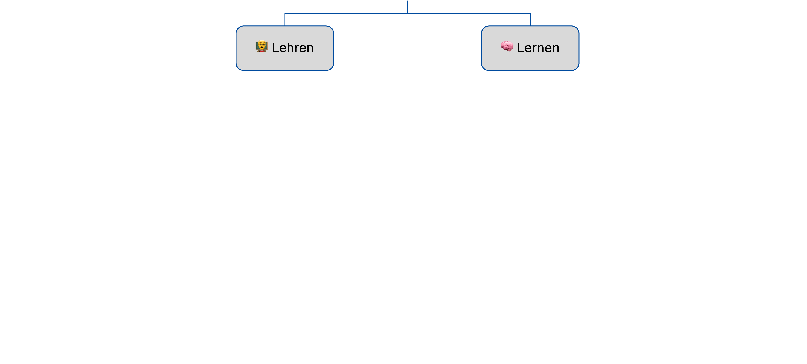
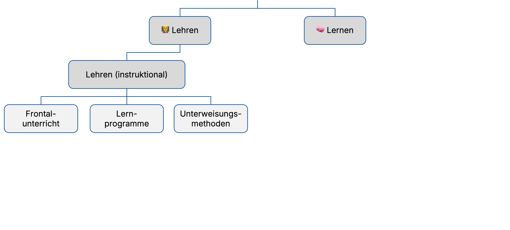
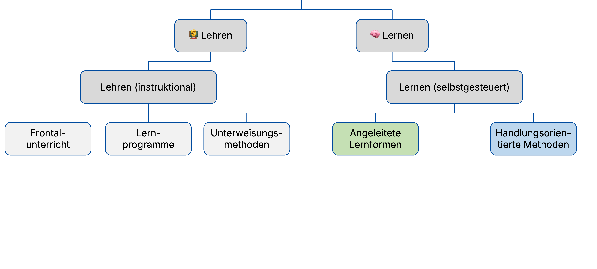
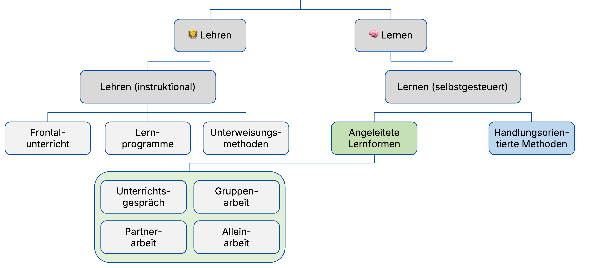
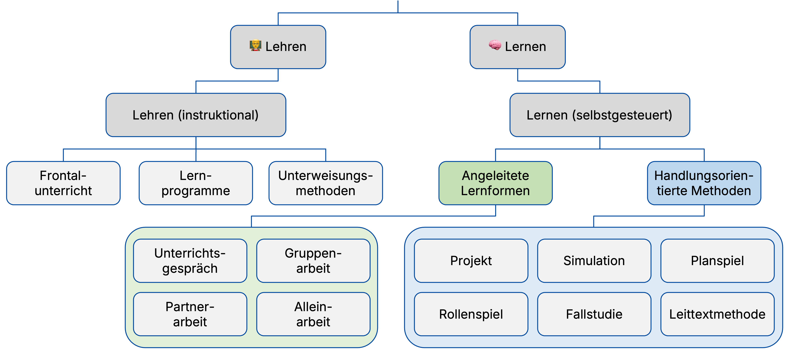
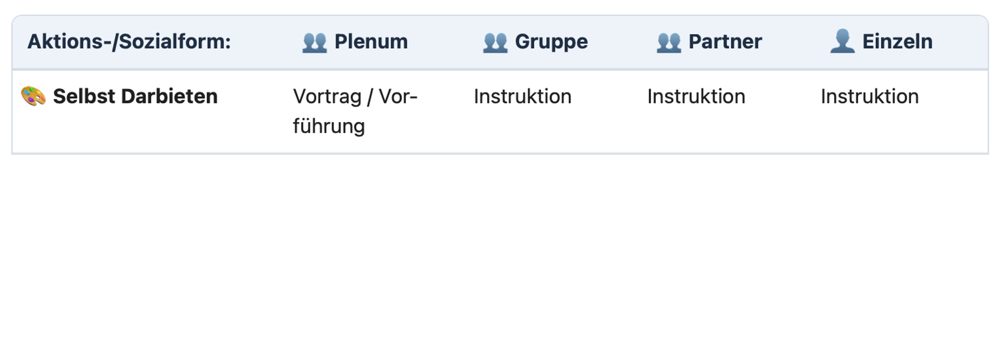
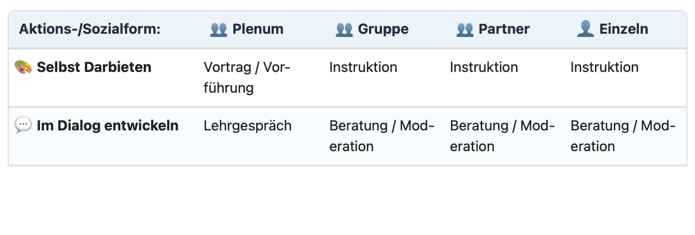
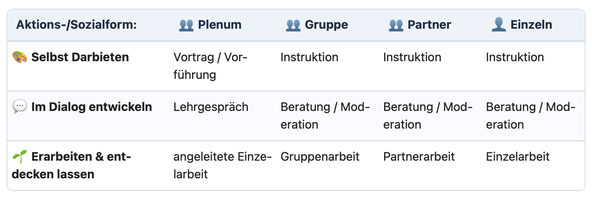



---

🙏

{}
Einstieg: Vielen Dank für Ihr Interesse an einer wissenschaftsbasierten Weiterbildung. Dies ist gerade aktuell nicht selbstverständlich. Wissenschaftliche Erkenntnisse stehen aktuell unter besonderer gesellschaftlicher Beobachtung.
{}

---

## 🧐 Evidenzorientierung

<b>Beitrag für die Unterrichts- und Schulentwicklung:</b>
  

- Weiterentwicklung von **Unterrichtspraxis** 🧠  
- Unterstützung der **Lehrkräfteprofessionalisierung** 👩‍🏫  
- Stärkung einer innovativen, kooperativen **Schulkultur** 🤝  

(Brown & Zhang, 2017)

---

## 💭 Leitfrage

> [!TIPP]
> Was können aktuelle wissenschaftliche Erkenntnisse zu Lerntypen,
> Lernformen und Prüfungsformen für die Weiterentwicklung
> von Unterricht und Schule beitragen?

---

## 🧭 Aufbau & Ablauf (90 Min)

1. Einstieg 💭 (5')  
2. Lerntypen 🧠 (25')  
3. Lernformen 🧩 (25')  
4. Prüfungsformen 🎯 (30')  
5. Transfer 🌱 (5')

---

## 🎯 Lernziele

- Lerntypen-Konzept wissenschaftlich einordnen 🧠 <!-- .element: class="fragment" -->
- Lernformen begründet vergleichen 🧩 <!-- .element: class="fragment" -->
- Passung von Prüfungsformen prüfen 🎯 <!-- .element: class="fragment" -->
- eine konkrete Veränderung für die eigene Praxis planen 🌱 <!-- .element: class="fragment" -->

{}
Hinweis an Teilnehmende: "Am Ende brauchen wir eine konkrete 14-Tage-Entscheidung."
Kurz pruefen, ob die Ziele fuer alle plausibel sind.
{}

---

## Lerntypen 🧠

Frage: Welcher Lerntyp dominiert bei Ihren Schüler:innen –  **a**uditiv, **v**isuell, **h**aptisch, **k**ognitiv oder **s**onstiger?

<figure class="figure-frame figure-frame-sm">
  
</figure>

Bildquelle: Eigene Darstellung (erstellt  mit ChatGPT) · Lizenz: CC BY-SA 4.0

---

## Lerntypen 🧠

<ul>
  <li>Lerntypen empirisch nicht nachweisbar: <b>Mythos</b>! ⚠️ (Brand, 2025; Daumiller & Wisniewski, 2022; Menz et al., 2021)</li>
  <li class="fragment"><b>Keine Evidenz höherer Lernwirksamkeit</b> durch Abstimmung des Unterrichts auf Lerntypen ☝️ (Newton & Salvi, 2020)</li>
  <li class="fragment">Risiko des Lerntypen-Konzepts, Lernende durch Etikettierung <b>nicht angemessen zu fördern</b> 🪞 (Sun et al., 2023)</li>
</ul>

---

## Lerntypen 🧠

> [!IMPORTANT]
> Sollten wir aufhören, über Lerntypen zu sprechen – oder sie bewusst anders nutzen?

<ul class="fragment">
  <li>Was könnte eine <b>sinnvolle Alternative</b> zum Lerntypen-Konzept im Unterricht sein? 🧩</li>
  <li>Wie können Sie die <b>Heterogenität im Lernen</b> berücksichtigen, ohne Lernende zu stigmatisieren? 👥</li>
</ul>

---

## Lernformen 🧩

Frage: Welcher Lehrer:innentyp sind Sie – eher Typ "**F**rontal" oder Typ "**H**andlungsorientiert"? 

Welche **Lernform** dominiert dann in Ihrem Unterricht?
 &nbsp; 
Lernformen beschreiben, **wie Lernen im Unterricht organisiert** ist – sie entstehen aus dem Zusammenspiel von Methoden 🧩, Sozialformen 👥 und der konkreten Aufgaben- 📋 und Steuerungsstruktur 🎛️.

---

## Lernformen 🧩

**🧭 Spektrum der Methoden beruflicher Schulen**



  
  
  
  
  
  



Bildquelle: Eigene Darstellung in Anlehnung an Bonz (2006, 339) · Lizenz: CC BY-SA 4.0

---

## Lernformen 🧩

**Methoden in Abhängigkeit von Aktions- und Sozialform**



  
  
  
  



Bildquelle: Eigene Darstellung in Anlehnung an Euler & Hahn (2014, 319) · Lizenz: CC BY-SA 4.0

---

## Lernformen 🧩

<ul>
  <li><b>Keine</b> Unterrichtsmethode ist <b>per se überlegen</b> ⚖️ (Nickolaus, 2018; Seifried & Sembill, 2010)</li>

  <li class="fragment">Wirksamkeit hängt von <b>Lernzielen</b> 🎯, <b>Inhalten</b> 📚, <b>Lernvoraussetzungen</b> 👥 und notwendigem <b>Scaffolding</b> 🪜 ab</li>

  <li class="fragment">Tendenziell unterschiedliche <b>Stärken</b>:
    <ul>
      <li>👩‍🏫 Instruktion → eher <b>Fachkompetenz bzw. Wissenserwerb 📚</b></li>
      <li>🧠 Handlungsorientierung → eher <b>Sozial- & Selbstkompetenz 👥</b></li>
    </ul>
  </li>
</ul>

---

## Lernformen 🧩

> [!IMPORTANT]
> Welche Lernformen sind in Ihrem Unterricht sinnvoll – und warum eigentlich?

<ul class="fragment">
  <li>Welche <b>Lernformen dominieren</b> aktuell in Ihrem Unterricht – und wodurch werden diese geprägt? 👥</li>
  <li>Wie gut passen diese zu Ihren <b>Lernzielen</b> 🎯 und <b>Inhalten</b> 📚?</li>
  <li>Wo könnten <b>andere Lernformen</b> gezielt <b>mehr Lernwirkung</b> entfalten? 🧠</li>
</ul>

---

## Prüfungsformen 🎯

<ul>
  <li>
    <b>Funktionen</b> von Prüfungen 🛠️:
    <ul>
      <li>Diagnose erreichter Kompetenzen</li>
      <li>Steuerung von Lernprozessen</li>
      <li>Zertifizierung und Selektion</li>
    </ul>
  </li>
  <li class="fragment">
    <b>Anforderungen</b> an Prüfungen 🎯:
    <ul>
      <li>lernförderlich</li>
      <li>objektiv</li>
      <li>reliabel</li>
      <li>valide(Wilbers, 2025)</li>
    </ul>
  </li>
</ul>

---

## Prüfungsformen 🎯

<ul>
    <li><b>Funktionen verfehlt</b>, wenn bspw. Handlungskompetenz 🤝 angestrebt, aber Reproduktion von Wissen 📚 geprüft(Deutscher et al., 2023; Wilbers, 2025)
  </li>
  <li class="fragment">
    <b>Empirische Befunde</b>:
    <ul>
      <li><b>Beeinflussung</b> von Lernprozessen durch Prüfungsformen („assessment drives learning“) (Gibbs & Simpson, 2005)</li>
      <li><b>Prüfungsaufgaben</b> in wirtschaftsberuflichen Zwischen- und Abschlussprüfungen <b>häufig wenig problemhaltig und authentisch</b>, erfassen berufliche Handlungskompetenz 🤝 nur eingeschränkt (Wuttke et al., 2022)</li>
    </ul>
  </li>
</ul>

---

## 🧠 Prüfungsformen 

**Lernziel-Taxonomie nach Anderson & Krathwohl (2001)**

Bildquelle: Eigene Darstellung in Anlehnung an Anderson & Krathwohl (2021) · Lizenz: CC BY-SA 4.0

---

## Prüfungsformen 🎯

> [!IMPORTANT]
> Prüfen Sie eigentlich das, was Sie fördern wollen?

<ul class="fragment">
  <li>Welche <b>Prüfungsformen</b> dominieren aktuell in Ihrem Unterricht – und was erfassen sie tatsächlich? 📊</li>
  <li>Wie gut passen diese zu Ihren <b>Lernzielen</b> 🎯 und <b>angestrebten Kompetenzen</b> 🤝?</li>
  <li>Wo entstehen <b>Fehlpassungen</b> – z. B. zwischen Handlungskompetenz und Wissensabfrage? 🪞</li>
</ul>

---

## Diskussion 🌱 Transfer

> [!TIPP]
> Wie wollen Sie vor dem Hintergrund der Fortbildung Lerntypen, Lernformen und Prüfungsformen in Ihrem Unterricht und an Ihrer Schule gestalten?

**Konkret, jede Person formuliert für sich selbst:**

<ol>
  <li>eine konkrete Veränderung</li>
  <li>ein Beobachtungskriterium</li>
  <li>einen Termin zur Überprüfung nach 14 Tagen</li>
</ol>

---



---


