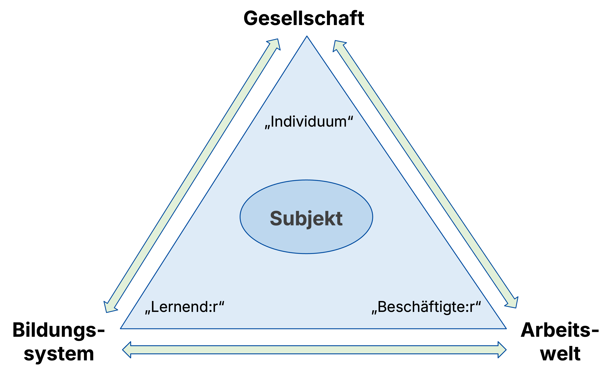
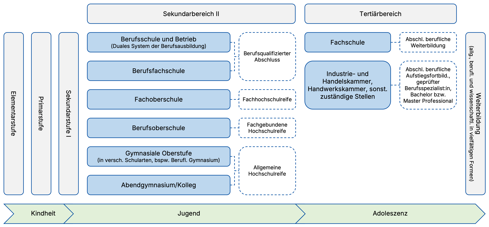



---

## 💭 Leitfrage

> [!TIPP]
> Wie lassen sich **individuelle Bildungswege** verstehen, wenn man sie zugleich als Teil eines gesellschaftlich, rechtlich und institutionell geordneten **Bildungssystems** betrachtet?

---

## 🧭 Ablauf (90 Min)

1. Einstieg 🎯  
2. Bildungsbiographie 👤  
3. Systematik 🏛️  
4. Recht ⚖️  
5. Recherche MV 🔎  
6. Diskussion 💬

---

## 🎯 Lernziele

**Sie lernen ...**

- 👤 **Bildungsbiographien** und **Bildungssystem** zusammen denken.
- 🔁 subjektive und strukturelle **Perspektiven** unterscheiden.
- 🧭 die **Trias** aus Gesellschaft, Bildungssystem und Arbeitswelt reflektieren.
- 🏛️ den **Aufbau** des deutschen Bildungssystems beschreiben.
- ⚖️ **rechtliche Rahmenbedingungen** einordnen.
- 🔎 offizielle Quellen zu **Mecklenburg-Vorpommern** nutzen.

---

## 1. Einstieg: Bildungsbiographie

> [!IMPORTANT]
> Welche **Erkenntnis** oder **Überraschung** nehmen Sie aus der Beschäftigung mit Ihren **Berufsbiographien** in der Übung am Montag mit?

<ul>
  <li>📝 Notieren Sie ein Stichwort oder eine Beobachtung.</li>
  <li class="fragment">👥 Tauschen Sie sich zu zweit aus.</li>
  <li class="fragment">📌 Ordnen Sie Ihre Beobachtung auf Taskcards  ein.</li>
</ul>

---

## 👤🏛️ Zwei Perspektiven

**👤 Subjektive Perspektive**

- Interessen, Wünsche und Entscheidungen
- Erfolgserlebnisse und Brüche
- Übergänge als persönliche Erfahrung

**🏛️ Strukturelle Perspektive**

- Schularten und Übergänge
- Abschlüsse und Berechtigungen
- rechtliche Vorgaben und institutionelle Erwartungen

---

## Trias "Subjekt"

<figure class="figure-frame figure-frame">
  
</figure>

Bildquelle: Eigene Darstellung · Lizenz: CC BY-SA 4.0

---

## Trias "Subjekt"

- 🌍 **Gesellschaft:** Werte, Normen, Teilhabe, Ungleichheit
- 🏫 **Bildungssystem:** Institutionen, Abschlüsse, Übergänge, Förderung
- 💼 **Arbeitswelt:** Berufe, Qualifikationen, Fachkräftesicherung

<ul>
  <li class="fragment">💭 Welche Erwartungen richten diese drei Teilsysteme an Individuen?</li>
  <li class="fragment">🔁 Wo ergänzen sie sich, wo entstehen Spannungen?</li>
  <li class="fragment">📈 Wie prägen Bildungsabschlüsse spätere Chancen auf dem Arbeitsmarkt?</li>
</ul>

---

## Zentrale Begriffe

<ul>
  <li>🌍 <b>Gesellschaft</b>: Rahmen sozialer Ordnung und Kommunikation (Luhmann 2017; Habermas 1999)</li>
  <li class="fragment">💼 <b>Arbeit</b>: Vermittlungsinstanz zwischen Individuum und Gesellschaft; strukturiert soziale Rollen und Ungleichheit (Offe 1984)</li>
  <li class="fragment">🏫 <b>Bildungssystem</b>: institutionalisiertes Arrangement zur Reproduktion und Transformation von Kompetenzen für gesellschaftliche Arbeit (Baethge et al. 2007; Kerschensteiner 2020)</li>
</ul>

---

## 🏛️ Systematischer Aufbau

<figure class="figure-frame">
  
</figure>

Bildquelle: Eigene Darstellung in Anlenung an KMK (2023) · Lizenz: CC BY-SA 4.0

---

## 🔄 Zentrale Merkmale

<ul>
  <li>🧭 Das System ist <b>gegliedert</b>.</li>
  <li class="fragment">🏛️ Es ist <b>föderal organisiert</b>.</li>
  <li class="fragment">🔁 Es ist prinzipiell <b>durchlässig</b>.</li>
  <li class="fragment">📜 Es ist <b>zertifikats- und berechtigungsorientiert</b>.</li>
</ul>

> [!TIPP]
> KMK (2023) und KMK (2025) bieten dafür gute Gesamtübersichten.

---

## ⚖️ Rechtliche Rahmenbedingungen

<ul>
  <li>⚖️ <b>Art. 7 GG</b>: staatliche Aufsicht über das Schulwesen</li>
  <li class="fragment">🏛️ <b>Art. 30 und 70 GG</b>: föderale Zuständigkeit der Länder</li>
  <li class="fragment">📚 <b>SchulG M-V, Teil 4</b>: Schulpflicht in Mecklenburg-Vorpommern</li>
  <li class="fragment">🛠️ <b>BBiG §§ 2, 3, 4, 71</b>: Lernorte, Anwendungsbereich, Ausbildungsberufe, zuständige Stellen</li>
</ul>

---

## 🤝 Recht, Bildung, Beruf

<ul>
  <li>🏛️ Das Bildungssystem ist nicht vollständig zentral gesteuert.</li>
  <li class="fragment">🔁 Es gibt einen gemeinsamen Rahmen und zugleich länderspezifische Ausprägungen.</li>
  <li class="fragment">🤝 Für die Wirtschaftspädagogik ist die Verbindung von Bildung, Beruf und Recht besonders relevant.</li>
</ul>

---

## 🔎 Rechercheauftrag MV

Recherchieren Sie in Kleingruppen oder Tandems in **offiziellen Quellen** des Landes Mecklenburg-Vorpommern.

1. Welche **Schularten** umfasst die berufliche Bildung in MV? <!-- https://www.bildung-mv.de/schule/schularten/berufliche-schulen --> 
2. Welche Grundsätze der **Beruflichen Orientierung** im Sekundarbereich II werden in MV im Landeskonzept für den Übergang von der Schule in den Beruf verfolgt? <!-- https://www.bildung-mv.de/schule/schularten/berufliche-schulen/, https://www.bildung-mv.de/export/sites/bildungsserver/.galleries/dokumente/schule/Landeskonzept_Uebergang_Schule-Beruf_-24.06.2019.pdf -->
3. Wie viele **berufliche Schulen** gibt es in MV? <!-- https://www.laiv-mv.de/static/LAIV/Statistik/Dateien/Publikationen/B%20II%20Berufliche%20Schulen%2c%20Berufsbildung/B2131/B2131%202024%2000.pdf -->
4. Wie viele **Lehrkräfte** sind in den beruflichen Schulen in MV tätig? <!-- https://www.laiv-mv.de/static/LAIV/Statistik/Dateien/Publikationen/B%20I%20Allgemeinbildende%20Schulen/B%20123/B123%202024%2000.pdf -->
5. Wie viele **Schüler:innen** gehen in MV in beruflichen Schulen? <!-- https://www.laiv-mv.de/static/LAIV/Statistik/Dateien/Publikationen/B%20II%20Berufliche%20Schulen%2c%20Berufsbildung/B2131/B2131%202024%2000.pdf -->

---

## 📌 Ergebnisformat

Halten Sie Ihre Ergebnisse fest: Taskcards 

<ul>
  <li>📍 in wenigen Stichpunkten</li>
  <li>🔎 mit mindestens einer offiziellen Quelle</li>
  <li>⏱️ Bearbeitungszeit: ca. 15 Minuten</li>
</ul>

---

## 💬 Abschlussdiskussion

<ul>
  <li>💭 Welche <b>Einsicht</b> aus dem heutigen Überblick zum deutschen Bildungssystem war für Sie <b>besonders klärend</b> oder <b>überraschend</b>?</li>
  <li class="fragment">👤🏛️ An welchen Stellen wurde heute besonders deutlich, dass Bildungswege zugleich <b>individuell erlebt</b> und <b>strukturell gerahmt</b> sind?</li>
  <li class="fragment">⚖️ Welche Rolle spielen <b>Aufbau, Föderalismus und rechtliche Rahmenbedingungen</b> für das Verständnis des Bildungssystems?</li>
  <li class="fragment">📍 Was zeigen die Beispiele aus Mecklenburg-Vorpommern über <b>Gemeinsamkeiten</b> und <b>landesspezifische Besonderheiten</b> im deutschen Bildungssystem?</li>
</ul>

---

## 🧭 Sicherung

- 👤 **Subjektive Perspektive:** Wie erleben Menschen Bildungswege?
- 🏛️ **Strukturelle Perspektive:** Wie ordnet und begrenzt das System diese Wege?
- 🧭 **Trias:** Wie hängen Gesellschaft, Bildungssystem und Arbeitswelt zusammen?

---



---

