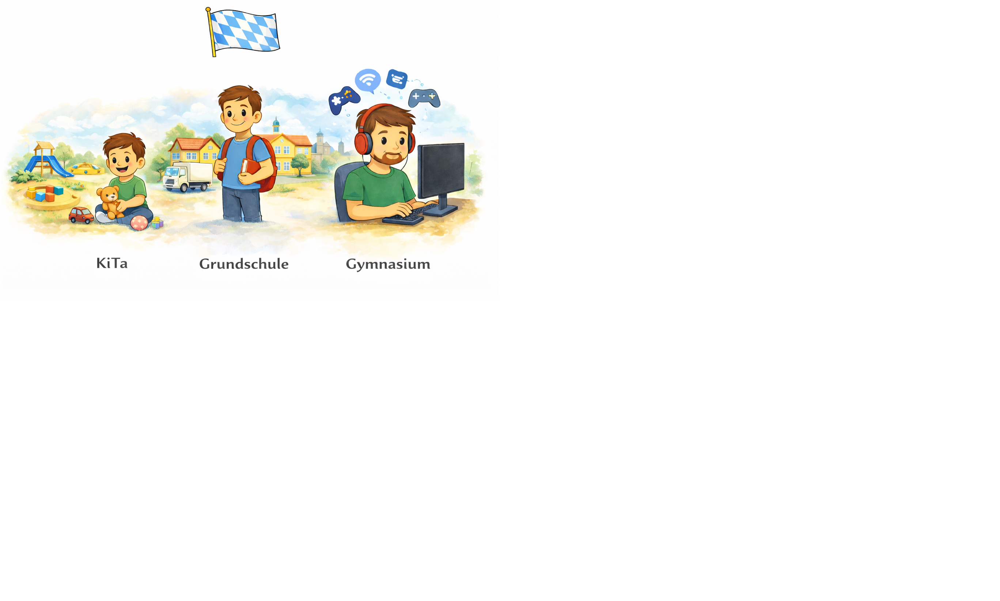
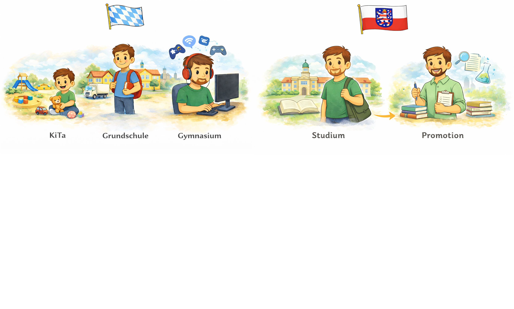
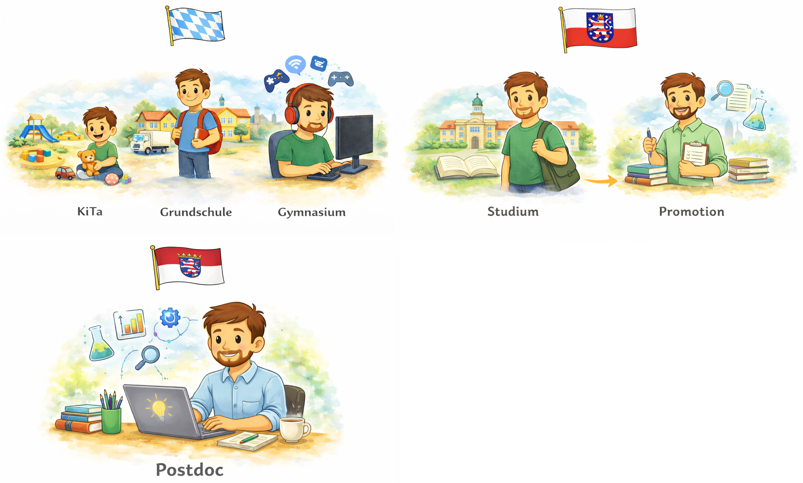
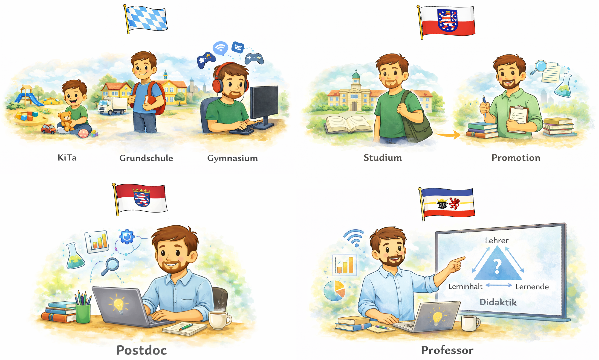
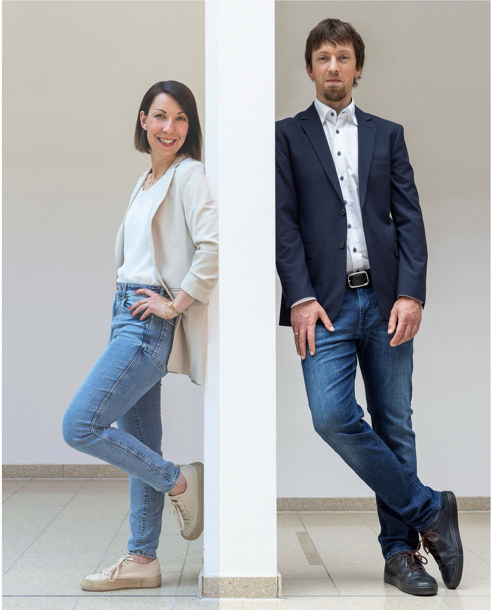
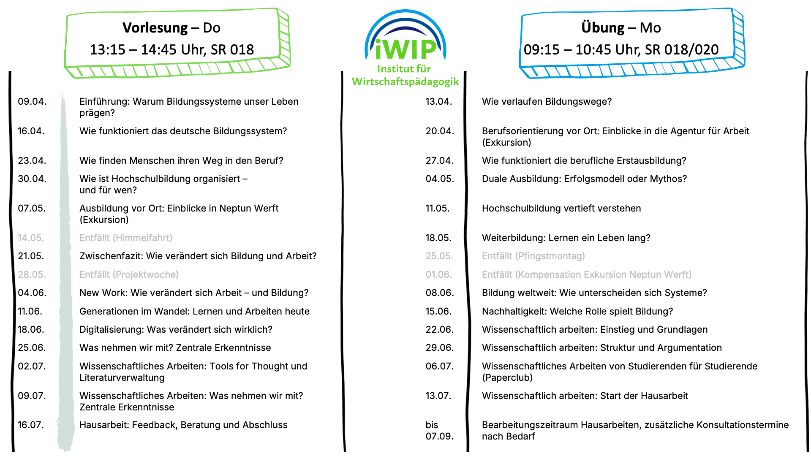



---

## 1. Meine Bildungsbiographie



  
  
  
  



Bildquelle: Eigene Darstellung (erstellt mit ChatGPT) ·  Lizenz: nicht frei verwendbar

---

## 💭 Leitfrage

> [!TIPP]
> Wie verlaufen 🛤️ **Bildungswege** eigentlich, und was haben 🧠 **individuelle Entscheidungen** mit 🧭 **gesellschaftlichen Strukturen** zu tun?

---

## 🎯 Lehrziele

**Sie lernen ...**

- 🧭 Gegenstand, Inhalte, Ziele und Organisation des Moduls kennen. <!-- .element: class="fragment" -->
- 👥 eigene Bildungswege zu reflektieren. <!-- .element: class="fragment" -->
- 💬 die Relevanz des Themas Bildungssysteme für Studium, Beruf und gesellschaftliche Teilhabe kennen. <!-- .element: class="fragment" -->
- 🧠 Prüfungsleistung, Zeitstruktur und Prüfungsanmeldung frühzeitig einzuordnen. <!-- .element: class="fragment" -->

---

## 🧭 Ablauf (60 Min)

1. Einstieg 🧭  
2. Kennenlernen 👥  
4. Modulüberblick 📚  
5. Organisation 🌐  
6. Zeitmanagement ⏱️  
7. Prüfung & Anmeldung 📝

---

## 👥 Kennenlernen: Aufstellung

<ul>
  <li>🎓 Wer hat die <b>allgemeine Hochschulreife</b>?</li>
  <li class="fragment">🛠️ Wer hat eine <b>Berufsausbildung</b> angefangen oder abgeschlossen?</li>
  <li class="fragment">📚 Wer hat schon einmal etwas <b>anderes studiert</b>?</li>
  <li class="fragment">📍 Wer kommt aus <b>Mecklenburg-Vorpommern</b>?</li>
</ul>

> [!TIPP]
> Die Aufstellung macht sichtbar, wie unterschiedlich 🛤️ Bildungswege verlaufen und welche 🧠 Erfahrungen bereits im Raum vorhanden sind.

---

## 👥 Kennenlernen: Aufstellung

**Reflexionsfragen:**

- Welche Unterschiede in 🛤️ **Bildungswegen** werden hier sichtbar? <!-- .element: class="fragment" -->
- Was könnte davon 🧠 **individuell** wirken, was eher 🧭 **strukturell**? <!-- .element: class="fragment" -->

---

## 👥 Kennenlernen: 👩‍🏫 Lehrende

Claudia Thürke & Matthias Söll

<figure class="figure-frame figure-frame-sm">
  
</figure>

Bildquelle: Universität Rostock ITMZ · Lizenz: nicht frei verwendbar

---

## 📚 Gegenstände des Moduls

<ul>
  <li>🏛️ Wie <b>funktioniert</b> das deutsche Bildungssystem?</li>
  <li class="fragment">🧭 Wie verlaufen <b>Bildungswege</b> in Schule, Ausbildung, Hochschule und Weiterbildung?</li>
  <li class="fragment">🌐 Wie <b>verändern</b> sich Bildung und Arbeit unter Bedingungen von <b>Digitalisierung</b>, <b>New Work</b> und <b>gesellschaftlichem Wandel</b>?</li>
  <li class="fragment">🧠 Wie lassen sich diese Entwicklungen <b>wissenschaftlich erschließen</b> und <b>argumentativ bearbeiten</b>?</li>
</ul>

> [!TIPP]
> Mit entsprechenden Kompetenzen können Sie eigene **Bildungswege gestalten**, andere **beraten** und an der **Entwicklung des Systems** mitarbeiten.

---

## 🗓️ Fahrplan im Semester

<figure class="figure-frame">
  
</figure>

Bildquelle: Eigene Darstellung · Lizenz: CC BY-SA 4.0 (Hinweis iWIP Logo: nicht frei verwendbar)

---

## 🌐 Kommunikation

- 💬 **Veranstaltung:** für direkte Rückfragen <!-- .element: class="fragment" -->
- 👥 **Sprechstunde:** für ausführlichere Rückfragen, Beratung und Feedback <!-- .element: class="fragment" -->
- 📞 **Telefon:** für kurze dringliche Absprachen <!-- .element: class="fragment" -->
- ✉️ **Mail:** für organisatorische und individuelle Anliegen <!-- .element: class="fragment" -->
- 🌐 **Stud.IP:** für Materialien, Hinweise und organisatorische Informationen <!-- .element: class="fragment" -->

---

## ⏱️ Zeitmanagement & Workload

Das Modul umfasst **6 Leistungspunkte** und damit  ungefähr **180 Stunden Arbeitsaufwand**.

| Bereich | Stunden | Orientierung |
|:--------|:--------|:-------------|
| **👥 Präsenzzeit** | ca. 50 Stunden | Vorlesung und Übung |
| **📚 Vor- und Nachbereitung** | ca. 26 Stunden | Lektüre, Vertiefung, Notizen und Wiederholung |
| **📝 Hausarbeit** | ca. 104 Stunden* | Themenerschließung, Literaturarbeit, Schreiben und Überarbeitung |

* entspricht 2,5 Wochen mit 40 h/Woche

---

## 📝 Prüfungsleistung

- 📝 Prüfungsform: wissenschaftliche **Hausarbeit** <!-- .element: class="fragment" -->
- 📚 Themen: aus **Vorlesung und Übung** <!-- .element: class="fragment" -->
- 📏 Umfang:
  - **10 bis 12 Seiten Fließtext** <!-- .element: class="fragment" -->
  - zzgl. **Verzeichnisse**, **Deckblatt** und **Selbstständigkeitserklärung** <!-- .element: class="fragment" -->
- 📅 Termine:
  - Bekanntgabe der Themen: **13.07.2026** <!-- .element: class="fragment" -->
  - Abgabe: **digital** per E-Mail bis **07.09.2026** als WORD- und PDF-Datei an die **Dozent:innen** <!-- .element: class="fragment" -->
- 📘 Zentrales Regelwerk: Leitfaden zum wissenschaftlichen Arbeiten <!-- .element: class="fragment" -->

---

## 🗂️ Prüfungsanmeldung

Offizielle Termine des Prüfungsamts für das SoSe 2026:  

<a href="https://www.wsf.uni-rostock.de/storages/uni-rostock/Alle_WSF/WSF/Studium/termine-ba/SoSe/2026/2025-12-12_Terminuebersicht_BA_WIP.pdf" target="_blank" rel="noopener noreferrer">Terminübersicht des Prüfungsamts</a>

> [!IMPORTANT]
> ‼️ Melden Sie sich **fristgerecht** zur Prüfung an ‼️

---

## 🔭 Ausblick

**👥 Übung**: Wie lassen sich **individuelle Bildungswege** beschreiben und systematisieren?  

**👩‍🏫 Vorlesung**: Wie funktioniert das **deutsche Bildungssystem**? <!-- .element: class="fragment" -->

---

