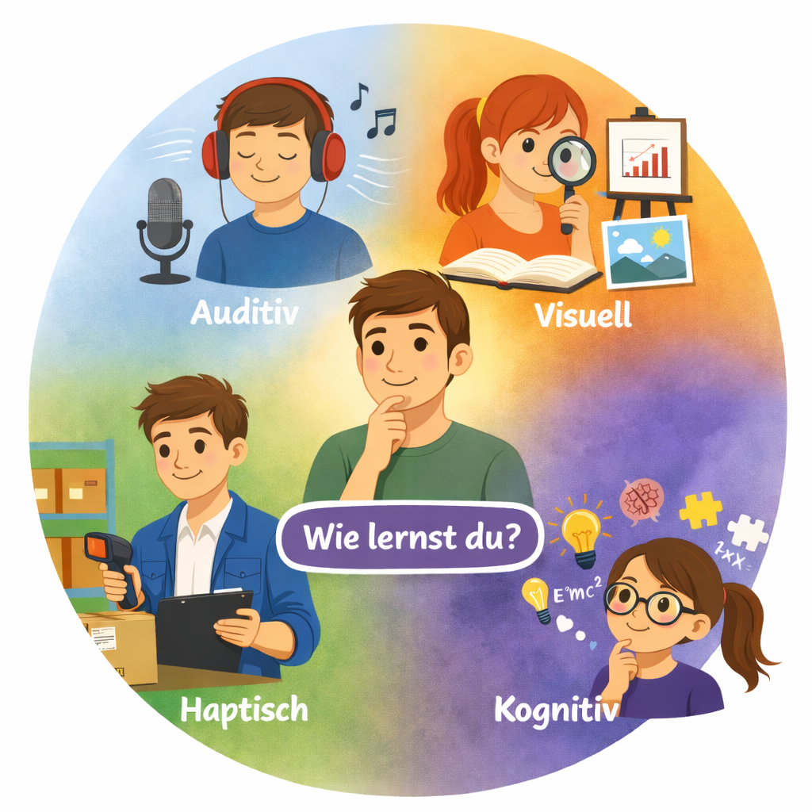
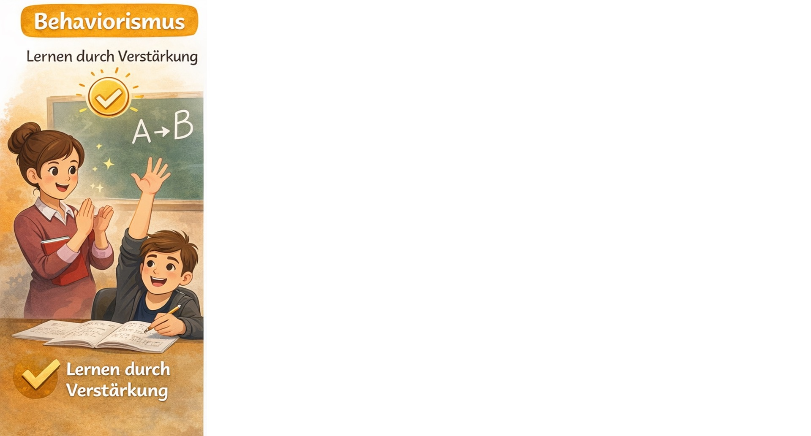
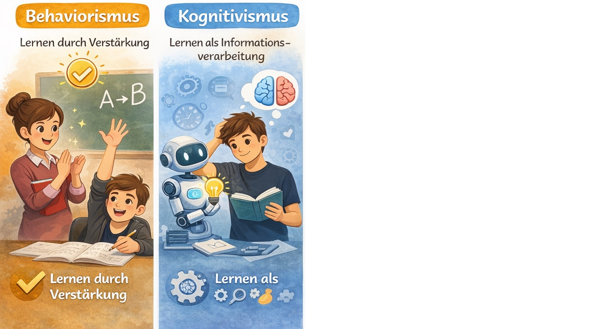
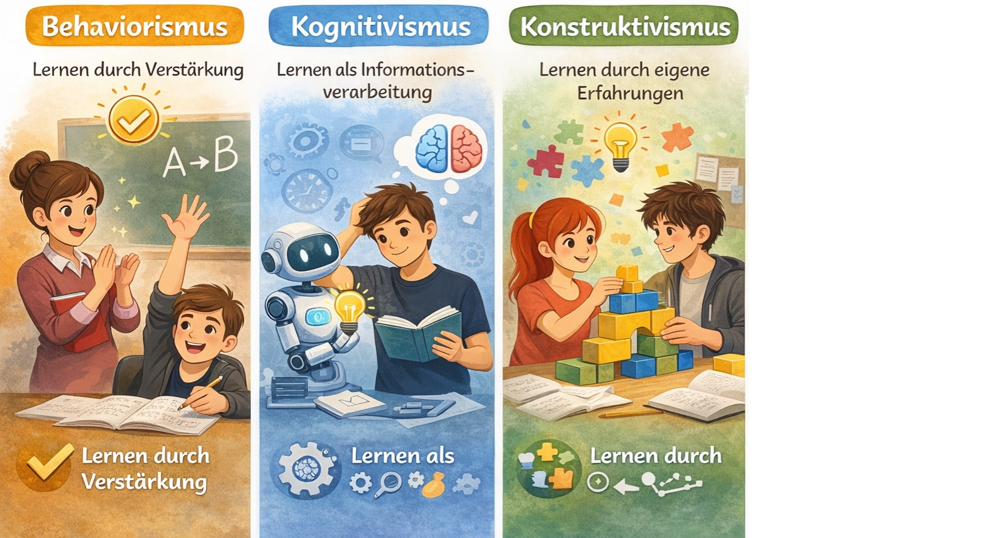
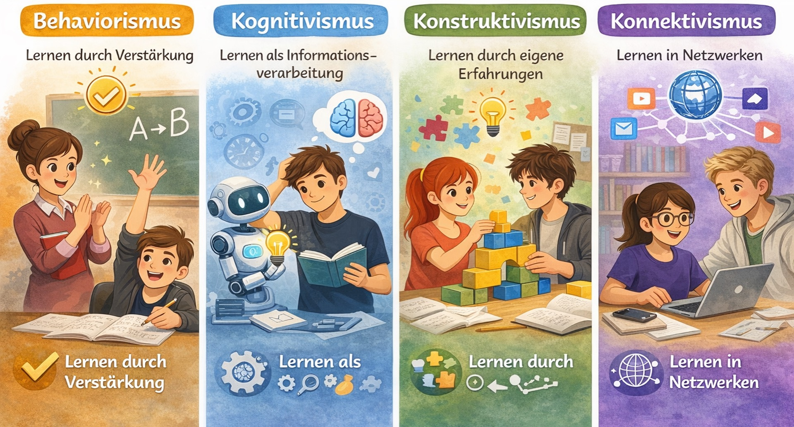

<!-- markdownlint-disable MD033 -->



---

## 💭 Leitfrage

> [!TIPP]
> Wie kannst Du so lernen, dass es zu Dir, Deinen Zielen  
> und Deinem Alltag passt?

---

## 🧭 Ablauf

1️⃣ Einstieg 🎯  
2️⃣ Lernen verstehen 🧠  
3️⃣ Lernen boostern 🧗  
4️⃣ Ausblick 🔭  

---

## Lerntypen-Check 🧠

<figure class="figure-frame figure-frame figure-frame-tight-top">
  
</figure>

Bildquelle: Eigene Darstellung · Illustration: erstellt mit Unterstützung von ChatGPT · Lizenz: CC BY-SA 4.0

---

## Lerntypen-Mythos 🪞

<ul>
  <li>🗄️ Lerntypen als <b>feste Kategorien</b> empirisch <b>nicht nachweisbar</b> (Brand, 2025; Daumiller & Wisniewski, 2022; Menz et al., 2021)</li>
  <li class="fragment">🧪 Lerntypen gelten in der Forschung als <b>Mythos</b> (Newton & Salvi, 2020)</li>
  <li class="fragment">⚠️ Gefahr von Lerntypen-Denken: <b>Etikettierungen</b> (Sun et al., 2023)</li>
  <li class="fragment">🔁 Konstruktiv gewendet: Lernzugänge <b>variieren</b>, testen und <b>reflektieren</b> statt Typenfestlegung (Daumiller & Wisniewski, 2022)</li>
</ul>

---

## Wie funktioniert Lernen? 🧠

<figure class="figure-frame figure-frame figure-frame-tight-top">
  
</figure>

Bildquelle: Eigene Darstellung · Illustration: erstellt mit Unterstützung von ChatGPT · Lizenz: CC BY-SA 4.0

---

## Wie funktioniert Lernen? 🧠



  
  
  
  



Bildquelle: Eigene Darstellung · Illustration: erstellt mit Unterstützung von ChatGPT · Lizenz: CC BY-SA 4.0

---

## Lernen boostern 🌱



  
  
  



Bildquelle: Eigene Darstellung · Illustration: erstellt mit Unterstützung von ChatGPT ·  Keine freie Lizenz (Rechte bei der dargestellten Person)

---

## Lernen boostern 🌱

> [!IMPORTANT]
> Lernen hängt davon ab, **wie** Du lernst, **was** Du lernst  
> und in welchem **Kontext** Du lernst.  
>  
> Diese Bedingungen **wirken zusammen** –  
>
> und viele davon kannst **Du aktiv gestalten**!

---
## Lernen boostern 🌱

Tools als Lernhelfer 💻

- 🧠 Verstehen & Erklären:
  <a href="https://notebooklm.google.com/" target="_blank" rel="noopener noreferrer">NotebookLM</a> ·
  <a href="https://chat.openai.com/" target="_blank" rel="noopener noreferrer">ChatGPT</a>
- 📚 Wiederholen & Behalten:
  <a href="https://www.studysmarter.de/" target="_blank" rel="noopener noreferrer">StudySmarter</a> ·
  <a href="https://apps.ankiweb.net/" target="_blank" rel="noopener noreferrer">Anki</a>
- 🧩 Strukturieren & Verknüpfen:
  <a href="https://www.notion.com/" target="_blank" rel="noopener noreferrer">Notion</a> ·
  <a href="https://obsidian.md/" target="_blank" rel="noopener noreferrer">Obsidian</a> ·
  <a href="https://www.goodnotes.com/" target="_blank" rel="noopener noreferrer">Goodnotes</a>

> [!TIPP]
> Tools selbst bringt keinen Lernerfolg. Wirkung entsteht, wenn Du Inhalte aktiv strukturierst, anderen erklärst und ausprobierst.

---

## 👫 Jetzt wird sozial gelernt!

**Auftrag: 💬 Murmelgruppen** (1 Minute + 1 Minute)

> [!TIPP]
> Drehe Dich zu der Person, die rechts von Dir sitzt und besprecht:
> 1. Wie lernst Du aktuell am liebsten?
> 2. Was willst Du in den nächsten Tagen konkret ausprobieren?

> [!IMPORTANT]
> Nachhaltiges Lernen entsteht selten allein: Fragen, Erklären, Diskutieren und Reflektieren machen den Unterschied.

---

## 🎓 Lust, Lernen selbst zu verstehen – und zu gestalten?

<figure class="figure-frame figure-frame">
  
</figure>

Bildquelle: Eigene Darstellung · Illustration: erstellt mit Unterstützung von ChatGPT · Lizenz: CC BY-SA 4.0

---



<!-- markdownlint-enable MD033 -->
