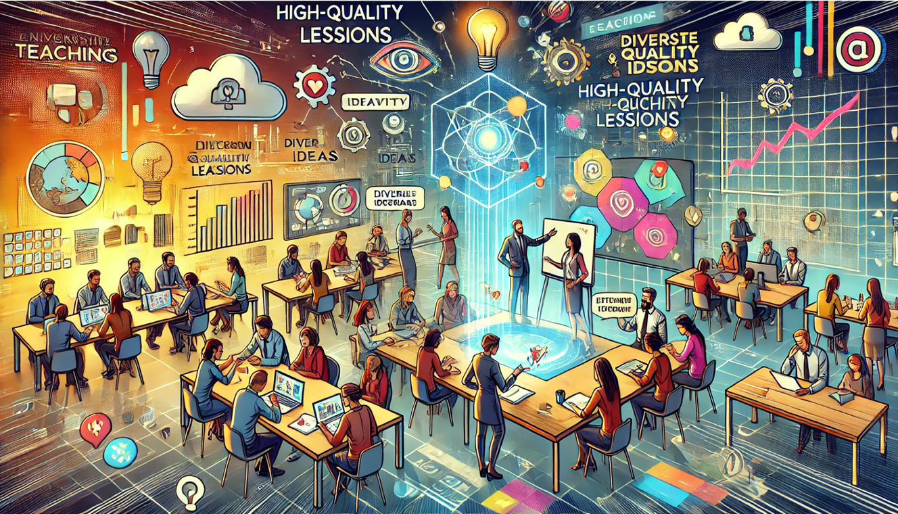



---

### OER sind:  🎓🌍🔓
- Bildungsmaterialien im weiten Sinn  
  *(Definition → Grafik → Selbstlernkurse)*  
- frei auf Plattformen teilbar  
  *(z. B. <a href="https://www.twillo.de" target="_blank" rel="noopener">twillo</a>, <a href="https://hubbs.schule/" target="_blank" rel="noopener">HubbS</a>)*  
- überwiegend digital, leicht bearbeitbar  
- mit **offener Lizenz** veröffentlicht  
  *(vgl. <a href="https://creativecommons.org" target="_blank" rel="noopener">Creative Commons</a>)*

---

### Woher kommen OER? 🇺🇳 UNESCO
- Referenzrahmen: <a href="https://www.unesco.de/assets/dokumente/Deutsche_UNESCO-Kommission/02_Publikationen/Publikation_Bildungsagenda_2030_Aktionsrahmen.pdf" target="_blank" rel="noopener">Agenda Bildung 2030 (PDF)</a>  
- Zielrichtung: inklusiv, chancengerecht, hochwertig (SDG 4)  
- Empfehlung zu OER (2019): <a href="https://www.unesco.de/assets/2019_Empfehlung_Open_Educational_Resources.pdf" target="_blank" rel="noopener">PDF</a>  
  → offener Zugang, gemeinsame Weiterentwicklung

---

### Woher kommen OER?  🇩🇪 GER
- Förderung (ehem. BMBF, jetzt BMFTR) seit 2016:  
  - <a href="https://open-educational-resources.de/" target="_blank" rel="noopener">OERinfo</a> (2016)  
  - <a href="https://www.oer-strategie.de/foerdern/foerderrichtlinien/" target="_blank" rel="noopener">OE_COM</a> (2023)  
  - <a href="https://www.oer-strategie.de/foerdern/foerderrichtlinien/" target="_blank" rel="noopener">OE_Struktur</a> (2024)  
- Umsetzung der <a href="https://www.bmbf.de/SharedDocs/Publikationen/DE/3/691288_OER-Strategie.pdf?__blob=publicationFile&v=5" target="_blank" rel="noopener">OER-Strategie der Bundesregierung (PDF)</a>

---

### 🔎 Noch mehr OER-Infos?

  

    
<em>Auf <a href="https://open-educational-resources.de/was-ist-oer-3-2/" target="_blank" rel="noopener">OERinfo.de</a> finden Sie Erklärvideo (~90 s), ausführliche Definition, Lizenzmodelle & Mehrwerte.</em>

  

  

    
  

---

### Warum OER? ❤️ Emotionale Begründung

  

    <blockquote class="zitat-box">
       „ Wissen ist das einzige Gut, das sich vermehrt, wenn man es teilt.“
    </blockquote>
    
Marie von Ebner-Eschenbach (1830–1916)

  

Vgl. <a href="https://www.bpb.de/shop/zeitschriften/apuz/33204/elinor-ostrom-und-die-wiederentdeckung-der-allmende/" target="_blank" rel="noopener">Elinor Ostrom</a> – „Was mehr wird, wenn wir teilen“ (<a href="https://search.worldcat.org/de/title/897400533" target="_blank" rel="noopener">WorldCat</a>).

---

### Warum OER? 📈 Rationale Begründung
<ul>
  <li>22.638 neue Büromanagement-Azubis (2023) 👩‍💼</li>
  <li>∅ 22 Lernende pro Klasse 👥</li>
  <li>≈ 1.029 Klassen im 1. Lehrjahr 🏫</li>
  <li class="special-bullet">≈ 1.000 Lehrkräfte bereiten täglich Unterricht vor 👩‍🏫</li>
</ul>

  ☝️ Teilen & Co-Entwicklung reduzieren Doppelarbeit und erhöhen Wiederverwendbarkeit.

---

### Warum OER? ✨ Qualitative Begründung
- Schnell aktualisierbar, adaptierbar, kombinierbar  
- Peer-Feedback, kollegiale Qualitätsentwicklung  
- Sichtbarkeit & Anschlussfähigkeit in Netzwerken

Bildquelle: Eigene Darstellung (erstellt mit ChatGPT) · Lizenz: CC BY-SA 4.0

---

### 🚀 Einführung & Einstieg in OER

- 🌐 Zum Blogbeitrag: [Frei nutzbare Lehr-Lern-Materialien – OER](/iWIP/widi/oer/)
- 🧭 Lieber selbst entdecken? Dann besuchen Sie den interaktiven **Selbstlernkurs der Universität Potsdam**:  
  <a href="https://openup.uni-potsdam.de/enrol/index.php?id=556" target="_blank" rel="noopener">openup.uni-potsdam.de</a>  
- 🎥 Lieber Videos? Auf **OERinfo.de** finden Sie kompakte Erklärvideos zu offenen Bildungsmaterialien:  
  <a href="https://open-educational-resources.de/was-ist-oer-3-2/" target="_blank" rel="noopener">open-educational-resources.de</a>

---

### 🎯 Ziel der Aufgabe
- Eigenes **Open Educational Resource (OER)** entwickeln  
- Grundlage: **eigene Ausarbeitung** (wirtschaftsdidaktisches Thema)  
- Optional: bestehende OER als Ausgangspunkt → **didaktisch sinnvoll neu kombinieren/anpassen**

---

### 🌟 Zielsetzung
- **Praxisnahes Beispiel** erstellen  
- zeigen, wie aus Vorarbeiten + OER **ein neues OER** entsteht

---

### ✅ Selbst tätig werden — Vorgehen (1/2)
1) **Rekapitulation**  
   - Thema, Kernthesen, Zusammenfassung kurz prüfen  
2) **Recherche**  
   - passende OER finden (vgl. Folie „OER finden und einsetzen“)  
3) **Erstellung**  
   - Format frei: Präsentation, Arbeitsblatt, H5P, Erklärvideo, Infografik  
   - Anforderungen: fachlich korrekt, verständlich, didaktisches Ziel, im Seminar einsetzbar

---

### ✅ Selbst tätig werden — Vorgehen (2/2)
4) **Lizenzierung**  
   - geeignete CC-Lizenz wählen  
   - Tools: <a href="https://creativecommons.org/choose/" target="_blank" rel="noopener">creativecommons.org/choose</a>  
   - Entscheidung **kurz begründen**  
5) **Dokumentation (Didaktik)**
   - Zielgruppe | Kontext | Lernziele | Einsatz (Einstieg/Erarbeitung/Vertiefung/Prüfung)  
6) **Abgabe**
   - Format: bevorzugt **editierbar** (.pptx/.docx/.odt), ggf. PDF  
   - Digitale Formate: Link/QR-Code ergänzen  
   - Upload: **Stud.IP** → Datenbereich  
   - **Deadline:** 17.11.2025

---

### 💡 Gestaltungshinweise
- Nur **offen lizenzierte** Materialien verwenden  
- **Quellen/Lizenzen korrekt** angeben (TULLU-Prinzip)  
- **Adressatengerechte Sprache**, klare Struktur, professionelles Design  
- **Offene Lizenz** vergeben (z. B. CC BY 4.0 / CC BY-SA 4.0)

---

### 🧮 Bewertung (100 Punkte)
| Kriterium | Punkte |
|---|:--:|
| Fachliche Richtigkeit & Relevanz | 30 |
| Didaktische Einbindung & Zielgruppenorientierung | 30 |
| Korrekte Lizenzierung & Quellenangaben | 20 |
| Gestaltung & Verständlichkeit | 10 |
| Kreativität & Eigenleistung | 10 |
| **Gesamt** | **100** |

---



---

