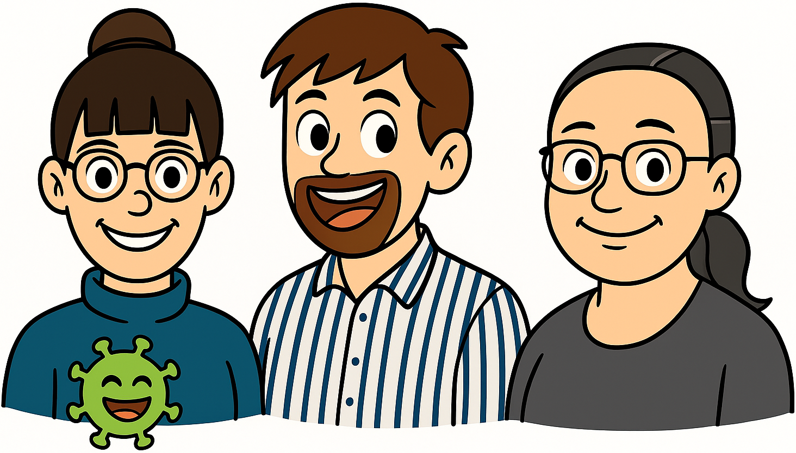





---

## 🚀 Einstieg

💬 Warum möchten wir über <b>standort-</b> und <b>zielgruppenspezifische Anreize</b> diskutieren? 🎯

  

---

## Anreize ✨: Allgemein

Ein Anreiz ist ein verhaltensbeeinflussender <b>Reiz</b>, der als Bindeglied zwischen <b>Motiven</b> (Bedürfnissen) und <b>Motivation</b> (zielgerichtetem <b>Handeln</b>) wirkt. Anreize können innerhalb einer <b>Person</b> (z. B. durch Sinn, Anerkennung oder Zugehörigkeit) oder <b>außerhalb</b> (z. B. durch Ressourcen, Strukturen oder Belohnungen) liegen.

Müsseler & Rieger (2017)

☝️ Wirkentscheidend ist, dass <b>Anreize</b> mit den individuellen <b>Bedürfnissen</b> 
und <b>Rahmenbedingungen</b> der Zielgruppen übereinstimmen.

---

## Anreize ✨: Co-WOERK

- Anreize als gezielte Unterstützungsimpulse
- Ausrichtung von Anreizen an Bedürfnissen verschiedener Zielgruppen  

Organisation internationale de la Francophonie (2016)

👉 Anreize sollen Studierende, Hochschullehrende, Referendar:innen und Lehrkräfte an beruflichen Schulen dazu motivieren, OER zu entdecken, zu nutzen, zu erstellen und zu teilen.

---

## ✨ Anreize ➡️ Anreizmatrix ✨🧩

**📚 Modell zur Adaption von OER nach Hart et al. (2015)**  

<ul>
<li class="fragment">🔄 Adaption als mehrphasiger Prozess: <b>Awareness → Interesse → Erwägung → Umsetzung → Integration</b></li>
<li class="fragment">⚙️ Nutzung von OER ist kein einmaliger Entschluss: <b>prozesshaftes Geschehen</b> über mehrere Phasen hinweg</li>
</ul>

---

## 🎓🌍🔓 ✨ OER-Anreizkategorien

| Kategorie | Beschreibung | Wirkung |
|:-----------|:--------------|:---------|
| **A Immateriell 💡** | <ul><li>Innere, nicht greifbare Motivationsfaktoren</li><li>Psychologische & soziale Bedürfnisse</li></ul> | 🧠 Stärken **intrinsische Motivation** und **nachhaltiges Engagement** – v. a. in der *Awareness-Phase*. |
| **B Materiell 💰** | <ul><li>Greifbare **Belohnungen oder Ressourcen**</li><li>Zeit, Tools, Unterstützung</li></ul> | 🎯 Wirken **extrinsisch**, setzen Anreize in **Entscheidungs- & Umsetzungsphasen**. |
| **C Strukturell 🏛️** | <ul><li>Institutionelle **Rahmenbedingungen**</li><li>Erleichtern OER-Arbeit systemisch</li></ul> | ⚙️ **Reduzieren Hürden**, senken Reibungsverluste, machen OER zum **Normalfall**. |
| **D Sozial 🤝** | <ul><li>**Interaktion, Austausch, Gemeinschaftserleben**</li><li>„Community is key“</li></ul> | 💬 **Aktivieren Zugehörigkeit**, stärken andere Anreize durch **positive Gruppendynamik**. |

---

## 🎓🌍🔓  ✨🧩  OER-Anreizmatrix

||| **A Immateriell 💡** | **B Materiell 💰** | **C Strukturell 🏛️** | **D Sozial 🤝** |
|:--|:--|:--|:--|:--|:--|
1️⃣| **Awareness**   |  |  |  |  |
2️⃣| **Interesse**   |  |  |  |  |
3️⃣| **Erwägung**   |  |  |  |  |
4️⃣| **Umsetzung**  |  |  |  |  |
5️⃣| **Integration** |  |  |  |  |

👉 Aus der Kombination von <b>Adaptionsphasen</b> und <b>Anreizkategorien</b> entsteht ein <b>Anreizsystem</b>, das auf die jeweilige Zielgruppe anzupassen ist.

---

## 🛠️ Spezifische Anreize ✨ (⏱️ 15')

👥 **Bildet Gruppen nach Hochschulstandorten** und wählt eine interessante **Persona**: 👩‍🏫 Professor:in · 🧑‍🔧 Lehrkraft · 🧑‍💻 Service-MA · 👩‍🎓 Referendar:in · 🎓 Studierende:r  

🛠️ **Auftrag:** Ermittelt, welche **Anreize** (💡 imm. · 💰 mat. · 🏛️ str. · 🤝 soz.) für Eure Persona in den jeweiligen **Adaptionsphasen** wirken  

📄 **Material:** Übersicht Anreizkategorien · Beispiele für Anreize · Adaptionsphasen  

🧩 <b>Ziel:</b> Gemeinsames Verständnis für die Bedürfnisse Eurer Zielgruppe entwickeln.  

 

---

## 🛠️ Plan: Werkstatttag 🎨 (⏱️ 30')

🛠️ <b>Auftrag:</b> Konzipiert in Euren Kleingruppen den Werkstatttag.

<ul class="tight">
  <li>Welche <b>Formate</b> eignen sich für Eure Zielgruppe?</li>
  <li>Welche <b>Methoden</b> passen während des Formats?</li>
  <li>Welche <b>Räumlichkeiten</b> braucht Ihr?</li>
  <li>Welche <b>Kommunikationskanäle</b> sind geeignet?</li>
  <li>Wie könnte die <b>Einladung</b> formuliert sein?</li>
</ul>

📄 <b>Material:</b> Vorlage Plakat „Planung Werkstatttag“

🛗 <b>Präsentation:</b> Nutzt für Eure Ergebnisse einen Elevator-Pitch (🔄 Was passt zu meinem Standort? Was würde ich adaptieren?)

🧩 <b>Ziel:</b> Erarbeitung zielgruppenspezifischer Formatkonzepte – von der Idee bis zur Einladung.

---

## 🔄 Transfer & Abschluss  

🧩 **Gemeinsame Ableitung einer Mini-Checkliste:**  
- Welche **3 Schritte** gehen wir bis **Januar**?  
- Wer übernimmt **welche Verantwortung**?  

🌍 <b>Community im Blick:</b>   
Ein erfolgreicher Werkstatttag entsteht, wenn Standorte ihre <b>eigenen Communities verstehen</b> –  
und Anreize in deren <b>Sprache, Kultur und Struktur</b> formulieren.  

---

## 💡 Zentrale Erkenntnisse

☝️ Die OER-Anreizmatrix zeigt, <b>dass Anreize nur im jeweiligen Kontext wirken</b> –  
abhängig von <b>Adaptionsphasen, Motivationen</b> und <b>Rahmenbedingungen</b> der Zielgruppen.

---

## 📚 Literatur

- Hart, K. de, Chetty, Y. & Archer, E. (2015). *Uptake of OER by staff in distance education in South Africa. International Review of Research in Open and Distributed Learning, 16*(2), 18–45.  
<a href="https://www.irrodl.org/index.php/irrodl/article/view/2047/3272" target="_blank" rel="noopener">https://www.irrodl.org/index.php/irrodl/article/view/2047/3272</a>  

- Organisation internationale de la Francophonie. (2016). *Open Educational Resources: From commitment to action.* <a href="https://open-educational-resources.de/wp-content/uploads/266159eng.pdf" target="_blank" rel="noopener">https://open-educational-resources.de/wp-content/uploads/266159eng.pdf</a>  
- Puca, R. M. & Schüler, J. (2024). *Motivation.* In M. Rieger & J. Müsseler (Eds.), *Allgemeine Psychologie* (pp. 269–301). Springer Nature. <a href="https://link.springer.com/chapter/10.1007/978-3-662-68476-4_8" target="_blank" rel="noopener">https://link.springer.com/chapter/10.1007/978-3-662-68476-4_8</a>