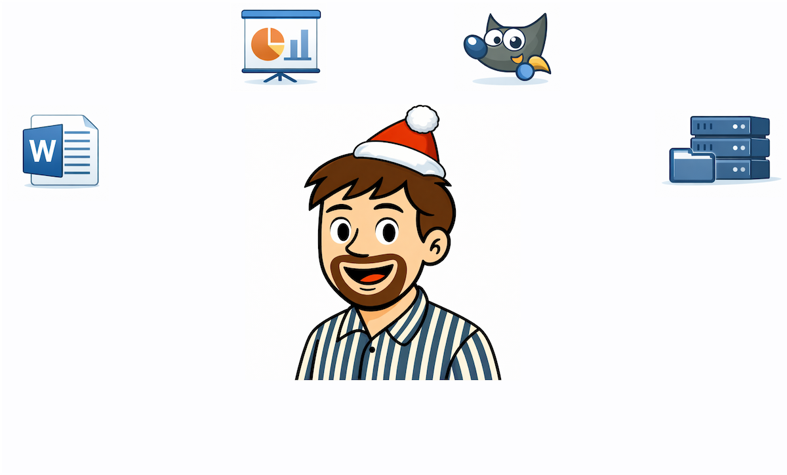
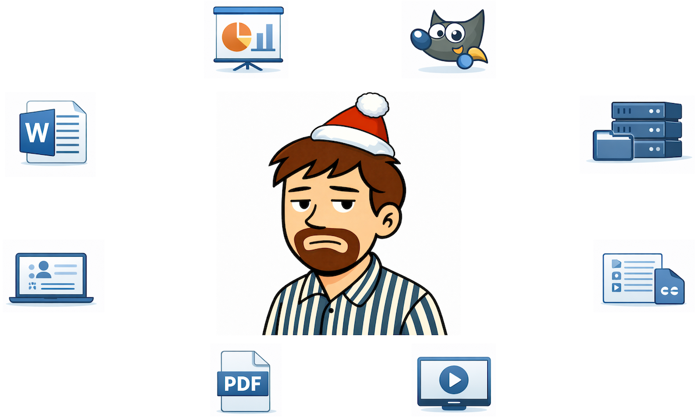
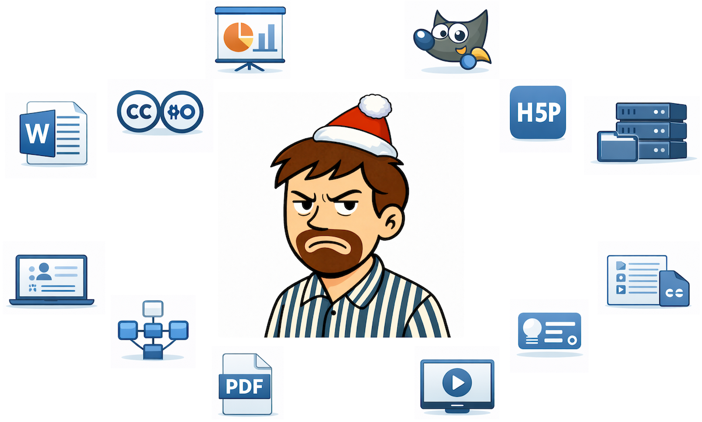
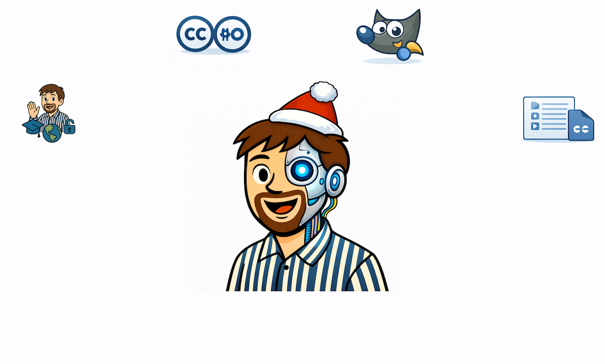





---

## Agenda 🧭
1. Motivation für SciBlog iWIP 💡
2. Zentrale Funktionen 🛠️
3. Learnings 🧠

---

## 1. Motivation 💡



  
  
  
  
  
  



Bildquelle: erstellt mit ChatGPT · Keine freie Lizenz (Rechte bei der dargestellten Person)

---

## Vom Tool-Zoo 🦒🦉🐘 zur integrierten Umgebung 🧭🧩

<ul>
  <li>
    <strong>Problem:</strong> wachsende Tool-Vielfalt wird <strong>didaktisch wirksam</strong> 🧠⚠️ 
    → Lehre droht verwaltet statt gestaltet zu werden 🎯
  </li>

  <li class="fragment">
    <strong>Prinzip:</strong> Reduktion als Gewinn 🌱✂️ 
    → weniger Formate · weniger Pflege · mehr Kohärenz 🤝
  </li>

  <li class="fragment">
    <strong>Konsequenz:</strong> integrierte, web-basierte Lehr-Lern-Umgebung 🌐 
    → <strong>SciBlog iWIP</strong> 🎯
  </li>
</ul>

---

## 2. Zentrale Funktionen 💻🎯

<ul>
  <li>
    <strong>👥 Lernendenperspektive zuerst:</strong> 
    → strukturiert, responsiv, selbststeuerbar,
    <a href="/iWIP/blog/oer/warum_sciblog/#-literatur">quellenbasiert</a> 🧠📱
  </li>

  <li class="fragment">
    <strong>🌐 Ein Inhalt – mehrere Zugänge:</strong> 
    → <a href="/iWIP/blog/oer/warum_sciblog/">Blog</a> · Präsentation ·
    <a href="/iWIP/praesentation/oer/warum_sciblog/#/">PDF</a> ·
    <a href="/iWIP/blog/oer/warum_sciblog/">Markdown</a> 
    eine Quelle, keine Redundanz 🤝
  </li>

  <li class="fragment">
    <strong>🎓🌍🔓 Transparenz & Offenheit:</strong> 
    → OER-Lizenzierung, Quellen, didaktische Dokumentation 🧭
  </li>
</ul>

---

## 2. Zentrale Funktionen 💻🎯

<ul>
  <li>
    <strong>🌱 Nachhaltige & offene Formate:</strong> 
    → Markdown-basiert, versionierbar, zukunftsfähig
    <a href="/iWIP/blog/oer/warum_sciblog/">✍️🔁</a>
  </li>

  <li class="fragment">
    <strong>🔗 Anschlussfähig statt isoliert:</strong> 
    → LMS-kompatibel, Metadaten-klar, Repositorien-fähig 🏷️🌐
  </li>
</ul>

---

## 3. Learnings🪞🧠

<ul>
  <li>
    🌐 <strong>Veröffentlichen verändert Lehre:</strong> Offenheit erzeugt produktiven Druck:
    klarere Struktur, bessere Begründungen, mehr Reflexion 🪞
  </li>

  <li class="fragment">
    🤖 <strong>KI als didaktisches Gegenüber:</strong> KI als Reflexionshilfe für Didaktik & Technik 🧠⚙️
  </li>

  <li class="fragment">
    ✂️ <strong>Reduktion schafft didaktischen Raum:</strong> weniger Tools & Formate · mehr Fokus auf Lernziele 🎯,
    Lernprozesse 🧠 und Inhalte 📚
  </li>
</ul>

  💡 Nicht Tools gestalten Lehre – <b>sondern didaktische Entscheidungen</b>. SciBlog iWIP schafft dafür Raum.

---



  <h1>🌱 Danke für Ihr Interesse! 😃</h1>

  

  <h1>Fragen oder Feedback?</h1>

  

    

      <a href="mailto:matthias.soell@uni-rostock.de">matthias.soell@uni-rostock.de</a>
    

    

      <a href="https://mastodon.social/@matthias_oer">matthias_oer@mastodon.social</a>
    

  

