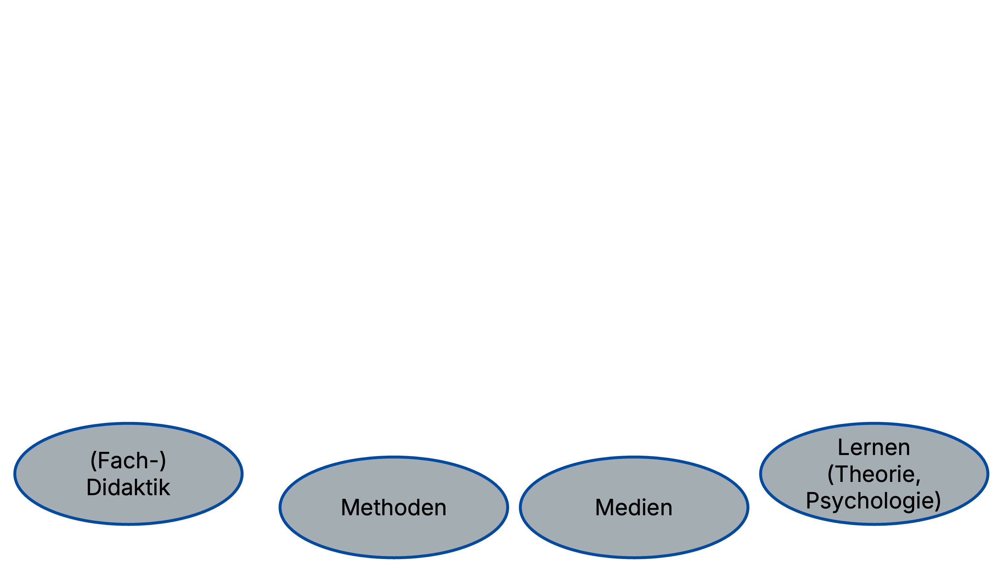
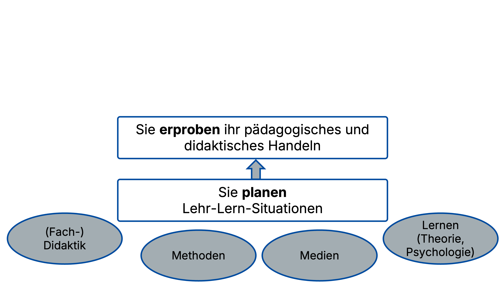
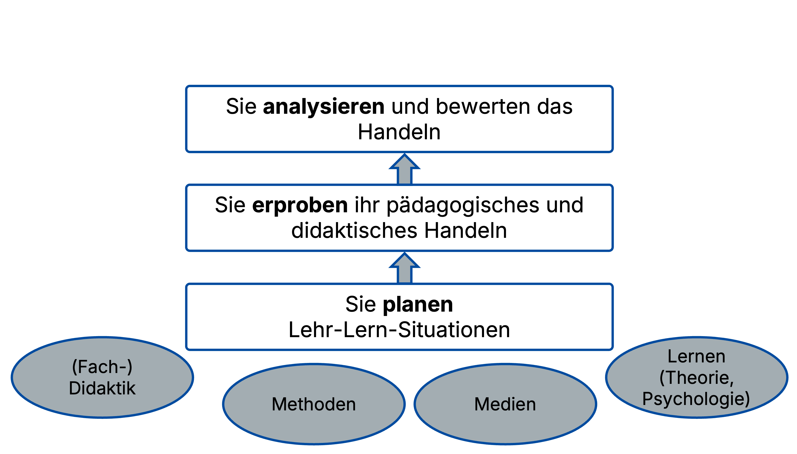
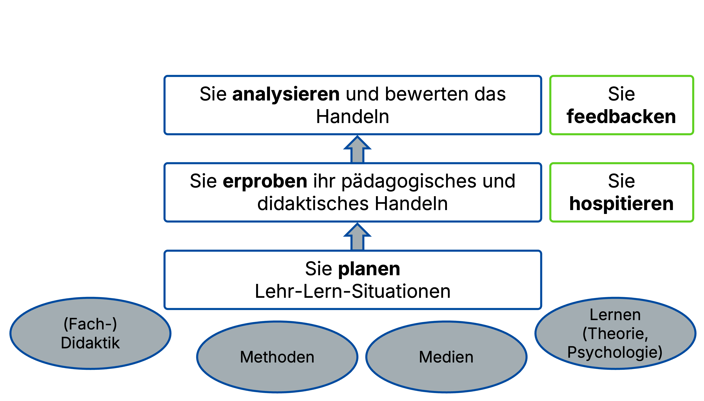
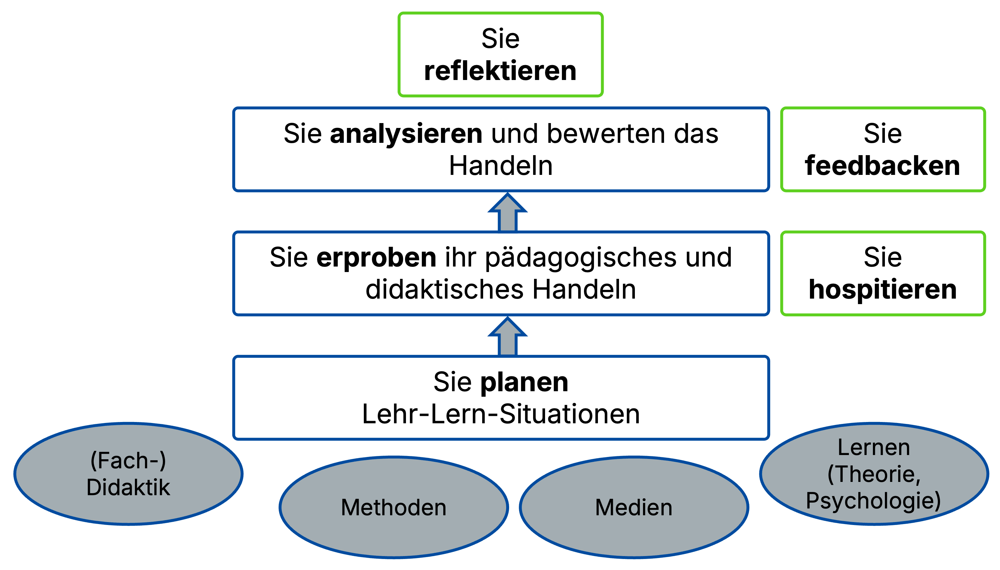
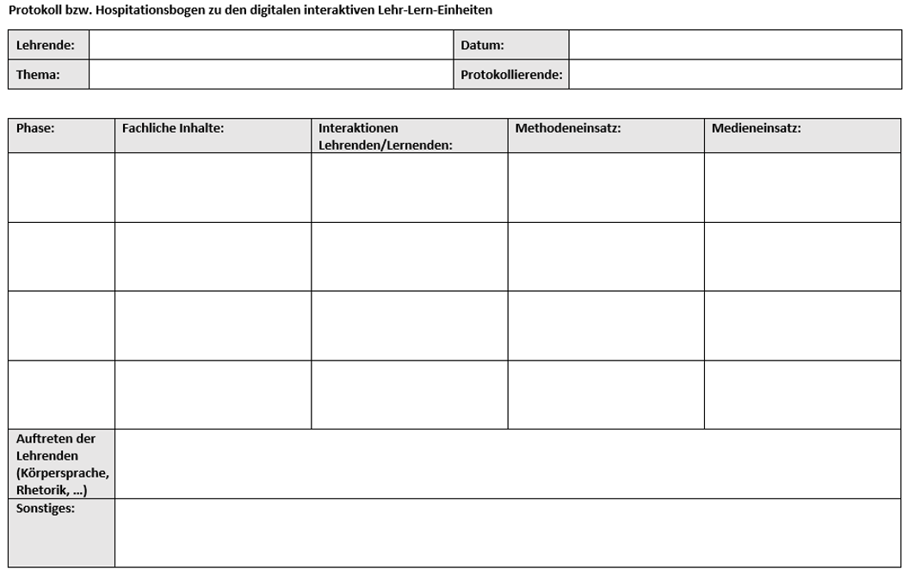
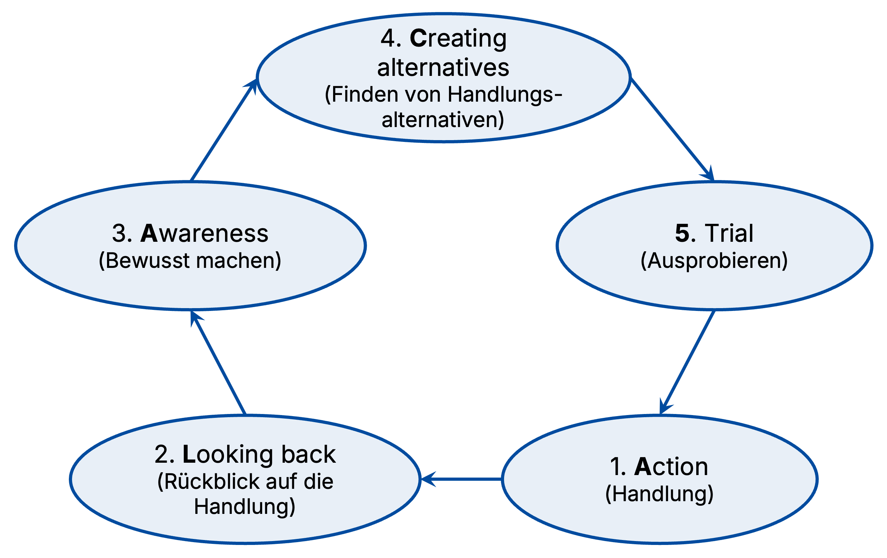





---

## Professionalisierung

(Baumert & Kunter 2006)



  
  
  
  
  
  
  
  
  



Bildquelle: Eigene Darstellung · Lizenz: CC BY 4.0

---

## 🎯 Lehrziele

 Die Studierenden sind in der Lage:
- Die Zusammenhänge zwischen Reflexion, Hospitation und Feedback in der Veranstaltung zu benennen. <!-- .element: class="fragment" --> ✨
- Feedback zu geben und zu nehmen (am Beispiel der entwickelten OER-Themenübersichten WiDi). <!-- .element: class="fragment" --> 🔄

---

## 🧭 Ablauf (90 Min)

1️⃣ Einstieg &amp; Aktivierung (5’) 
2️⃣ Hospitation (15’) 
3️⃣ Feedback inkl. Übung (30’) 
4️⃣ Reflexion (25’) 
5️⃣ Ausblick (15’)  
🕒

---

## 1️⃣ Hospitation

 - Bei einer Hospitation wird Unterricht systematisch beobachtet. 👀
 - Die Beobachtung dient einem bestimmten Zweck, bspw. der Professionalisierung der Beobachter:innen. 🎓
 - Die Hospitation bezieht sich auf spezifische Aspekte des Unterrichts, bspw. auf die Phasierung des Unterrichts, die Darstellung fachlicher Inhalte, Interaktionen zwischen Lehrenden und Lernenden oder den Methoden- bzw. Medieneinsatz. 🧩  

(Köhler & Weiß 2015)

---

## 1️⃣ Hospitation

  
  
Bildquelle: Eigene Darstellung · Lizenz: CC BY 4.0

---

## Feedback: Hintergrund

- **Gegenstand**: individuelle Rückmeldung zur eigenen Leistung 🎯  
- **Ziel**: Möglichkeit, sich in Zukunft zu verbessern 📈  
- **Form**: mündlich oder schriftlich ✍️  
- **Metapher**: Feedback als „Geschenk“ 🎁  
- **Ansatz**: Wertschätzung zeigen 💛

---

## Feedback: Grundregeln

- **Beobachtetes** konkret beschreiben („auf Folie XY sagtest du … . Das hat auf mich … gewirkt.“) 👀  
- **Ich-Botschaften** senden („Mir ist aufgefallen, dass du ... . Ich habe wahrgenommen /gesehen / gehört, dass du ... .“) 🗣️  
- Nur **Veränderbares** zurückmelden 🔧  
- **Keine Rechtfertigungen**, insbesondere seitens des Feedback-Nehmers 🙅‍♂️  
- **Keine Bewertungen** („Das war doof“, „das war langweilig“) 🚫  
- **Keine Vermutungen** („Ich glaube, Du hast Dich … verhalten, weil … .“) 🔍  

---

## Feedback: Tipps für hohe Wirkung


<iframe
  class="video-embed"
  width="700"
  height="394"
  src="https://www.youtube-nocookie.com/embed/7KMeQ6hyPBU"
  title="Wirksam Feedback geben"
  loading="lazy"
  allow="accelerometer; autoplay; clipboard-write; encrypted-media; gyroscope; picture-in-picture; web-share"
  referrerpolicy="strict-origin-when-cross-origin"
  allowfullscreen>
</iframe>


Quelle: <a href="https://www.youtube.com/watch?v=7KMeQ6hyPBU" target="_blank" rel="noopener">
YouTube: Wirksam Feedback geben
</a>

---

## Feedback: Tipps für hohe Wirkung


<iframe
  class="video-embed"
  width="700"
  height="394"
  src="https://www.youtube-nocookie.com/embed/1DlSMQr4D6g"
  title="Wirksam Feedback geben"
  loading="lazy"
  allow="accelerometer; autoplay; clipboard-write; encrypted-media; gyroscope; picture-in-picture; web-share"
  referrerpolicy="strict-origin-when-cross-origin"
  allowfullscreen>
</iframe>


Quelle: <a href="https://www.youtube.com/watch?v=1DlSMQr4D6g" target="_blank" rel="noopener">
YouTube: Die Feedbackformel WWW – Mit WWW erfolgreich Feedback geben
</a>

---

## Reflexion

- Reflexion als spezifische Form des Denkens, die zweckgebunden ist und auf die Analyse und Verbesserung des eigenen Handelns abzielt (vgl. Dewey, 1933) 🧠  
- Ziel von Reflexion: „[…] das Nachdenken über sich und das eigene Handeln sowie die Konsequenzen, die aus dem Reflektieren einer Situation gezogen werden […].“ (Jahncke et al. 2018, 118) 🎯  
- Verbindung zwischen Theorie und Praxis: Reflexion vermittelt zwischen Wissen und Handeln 🔗  

---

## Reflexion

- Reflexion fördert die Professionalisierung von Lehrer:innen durch:
   - Selbstanalyse und Bewusstwerdung von Handlungen, Überzeugungen, Werthaltungen 🔍  
   - Verbesserung der Planung, Durchführung und Evaluierung von Unterricht 📊  

---

## Reflexionsmodell: ALACT

(Korthagen 2002)

  
  
Bildquelle: Eigene Darstellung in Anlehnung an Müller (2007) · Lizenz: CC BY 4.0

---

## 📚 Literatur (Auszug)

- Arnold, K.-H., & Roßa, A.-E. (2012). *Grundlagen der Allgemeinen Didaktik und der Fachdidaktiken.*  
- Jank, W., & Meyer, H. (2014). *Didaktische Modelle.*  
- Meyer, H. (2014). *Was ist guter Unterricht?*  
- Koerrenz, R., Kenklies, K., Kauhaus, H., & Schwarzkopf, M. (2017). *Geschichte der Pädagogik.*  
- Köhnlein, W. (2004). *Fachdidaktik.* In *Wörterbuch Schulpädagogik.*

<small>Vollständige Angaben: siehe Blogbeitrag.</small>

---



  <h1>🌱 Danke fürs Mitdenken, Mitreden & Mitlernen! 😃</h1>

  

  <h1>Fragen oder Feedback?</h1>

  

    

      <a href="mailto:matthias.soell@uni-rostock.de">matthias.soell@uni-rostock.de</a>
    

    

      <a href="https://mastodon.social/@matthias_oer">matthias_oer@mastodon.social</a>
    

  

