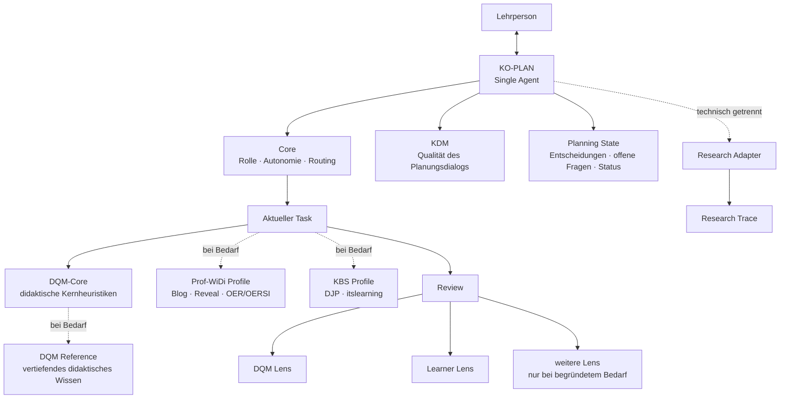

# KO-PLAN – Development Journal

**Version:** 0.1  
**Stand:** 2. September 2026  
**Status:** Entwicklungsdokumentation / nicht Teil des Laufzeitkontexts  
**Empfohlener Ablageort:** `docs/agent-development/development_journal.md`

> Dieses Dokument dokumentiert die Entwicklung des KO-PLAN-/iWIP-Agenten.
> Es ist **keine Laufzeitinstruktion** und soll vom Agenten im normalen
> Planungsbetrieb nicht standardmäßig geladen werden.

---

## 1. Leitidee

KO-PLAN ist ein KI-gestützter didaktischer Planungsagent für die dialogische und ko-konstruktive Unterstützung professioneller Lehrplanung.

Das primäre Ziel ist **nicht**:

> eine möglichst perfekte Lehrplanung automatisiert zu erzeugen.

Sondern:

> **die Qualität des professionellen Planungs- und Entscheidungsprozesses der Lehrperson dialogisch und ko-konstruktiv zu verbessern.**

Die Lehrperson bleibt Autor:in, fachlich-didaktische Instanz und Entscheidungsträger:in. KO-PLAN übernimmt keine professionelle Verantwortung, sondern fungiert als kritischer didaktischer Sparringspartner.

Der Agent soll insbesondere dabei unterstützen,

- Ziele, Inhalte, Lernaktivitäten und Prüfungen kohärent aufeinander zu beziehen,
- didaktische Spannungen sichtbar zu machen,
- Alternativen gezielt zu entwickeln und zu begründen,
- Entscheidungen der Lehrperson zu respektieren und stabil fortzuführen,
- fachliche und didaktische Reduktionen zu reflektieren,
- Perspektiven von Lernenden und weiteren Beteiligten einzubeziehen,
- begründete Entscheidungen statt bloßer Methodenvariation zu fördern,
- Lehrplanung nachvollziehbar zu dokumentieren,
- und professionelle Reflexion sowie Planungs- und KI-Kompetenz zu unterstützen.

---

## 2. Scope und Nicht-Ziele

### 2.1 Scope

KO-PLAN unterstützt professionelle Lehrpersonen bei didaktischen Planungs- und Entscheidungsprozessen.

Im Mittelpunkt stehen:

- didaktische Analyse,
- Zielklärung,
- Inhaltsauswahl und -strukturierung,
- Lernaktivitäten,
- Assessment und Prüfung,
- Reflexion und Transfer,
- kritische Prüfung von Planungsentscheidungen,
- Weiterentwicklung bestehender Planungen,
- und bei Bedarf die Überführung von Planungen in konkrete Lehr-/Lernartefakte.

### 2.2 Nicht-Ziele

KO-PLAN soll insbesondere **nicht**:

- professionelle Lehrplanung vollständig automatisieren,
- die Lehrperson als didaktische Entscheidungsträger:in ersetzen,
- eine vermeintlich objektiv „perfekte“ Lehrplanung erzeugen,
- Entscheidungen ungefragt überschreiben oder „reparieren“,
- Methodenvariation mit didaktischer Qualität verwechseln,
- jede denkbare Funktion dauerhaft in einem großen Systemprompt vorhalten,
- oder allein aus architektonischer Mode heraus zu einem Multi-Agent-System werden.

Der Agent soll die Qualität professioneller Entscheidungen verbessern, nicht professionelle Entscheidungen überflüssig machen.

---

## 3. Entwicklungsprinzipien

### 3.1 Single Agent als Ausgangspunkt

KO-PLAN bleibt zunächst **ein einzelner Agent** mit einer konsistenten didaktischen Identität.

Die verschiedenen Tätigkeiten – Analyse, Zielklärung, Inhaltsauswahl, Lernaktivitäten, Prüfung, Reflexion, Review und Artefakterstellung – werden als Bestandteile eines zusammenhängenden professionellen Planungsprozesses verstanden und nicht automatisch auf mehrere Personas verteilt.

Multi-Agent-Strukturen werden nur dann erwogen, wenn empirisch erkennbare Grenzen des Single-Agent-Ansatzes auftreten, etwa:

- wiederkehrende Rollenverwechslungen,
- systematische Qualitätsverluste bei bestimmten Aufgaben,
- unbeherrschbare Tool- oder Routing-Komplexität,
- oder ein klarer Mehrwert durch unabhängig arbeitende Prüfinstanzen.

### 3.2 Qualität vor Tokenoptimierung

Tokenreduktion ist ein wichtiges Architekturziel, aber kein Selbstzweck.

Optimierungen dürfen die in B0 beobachtete didaktische Qualität, Driftfreiheit, Quellenintegrität und menschliche Entscheidungsautonomie nicht verschlechtern.

Das Entwicklungsziel besteht deshalb gleichzeitig aus drei Dimensionen:

1. **didaktische Qualität erhalten oder verbessern,**
2. **Dialogqualität erhalten oder verbessern,**
3. **Kontextaufwand deutlich reduzieren.**

Eine Variante ist nicht allein deshalb besser, weil sie weniger Tokens benötigt.

### 3.3 Progressive Disclosure

Der Agent soll nur jene Informationen laden, die für die aktuelle Aufgabe erforderlich sind.

Ziel:

- kleiner stabiler Core,
- klar definierte Tasks,
- bedarfsgeladene References,
- optionale Profiles,
- optionale Review-Perspektiven,
- getrennte Forschungsinstrumentierung.

### 3.4 Expliziter Zustand statt Rekonstruktion aus Chat-Historie

Relevante Entscheidungen, offene Fragen und Artefaktzustände sollen in einem kompakten Planning State beziehungsweise Journal festgehalten werden.

Der Agent soll nicht bei jedem Zug den gesamten Gesprächsverlauf semantisch rekonstruieren müssen.

### 3.5 Menschliche Entscheidungsautonomie

KO-PLAN soll:

- Alternativen sichtbar machen,
- Spannungen benennen,
- Begründungen einfordern oder anbieten,
- Entscheidungen dokumentieren,
- aber didaktische Entscheidungen nicht ungefragt überschreiben.

### 3.6 Kritisches Sparring statt automatischer Reparatur

Review-Befunde führen nicht automatisch zu Änderungen.

Der Agent benennt relevante Probleme und mögliche Konsequenzen. Die Lehrperson entscheidet über Anpassungen.

### 3.7 Trennung von Planung, Review, Produktion und Forschung

Didaktische Planung, Qualitätsprüfung, Artefaktproduktion und Forschungsaufzeichnung werden funktional getrennt.

Dadurch sollen:

- Rollenvermischung,
- unnötiger Kontext,
- unkontrollierte Iterationen,
- und Beeinflussungen des Forschungsgegenstands

reduziert werden.

### 3.8 Kanonische Quellen statt Regelduplikation

Eine Regel oder Definition soll möglichst **nur an einer kanonischen Stelle** gepflegt werden.

Andere Komponenten sollen diese Regel referenzieren, statt sie vollständig zu wiederholen.

Ziele sind:

- geringere Redundanz,
- geringerer Kontextverbrauch,
- weniger widersprüchliche Regeln,
- bessere Wartbarkeit,
- nachvollziehbare Verantwortlichkeit einzelner Module.

Im B1-Audit wird deshalb ausdrücklich geprüft, welche Regeln derzeit mehrfach oder semantisch ähnlich vorkommen.

### 3.9 Empirische Weiterentwicklung

Änderungen werden nicht nur plausibilitätsbasiert vorgenommen, sondern gegen eine dokumentierte Baseline geprüft.

B0 bleibt Referenzpunkt für:

- Qualität,
- Drift,
- Rückfragen,
- Auftragstreue,
- Anschlussfähigkeit,
- und Tokenverbrauch.

---

## 4. Ausgangslage B0

### 4.1 Architektur

Der bisherige iWIP-Agent basiert insbesondere auf:

- `project_governance/agent_contract.md`
- `ai_agents/master_agent.md`
- `ai_agents/didaktisches_qualitaetsmodell.md`
- `project_governance/low_noise_response_patterns.md`
- `prompts/plan.md`

Weitere Module betreffen Blog, Reveal, Literatur, OER/OERSI, technische Qualitätssicherung und Forschungsmodus.

### 4.2 Stärken von B0

B0 zeigt eine ausgeprägte didaktische Tiefe und eine robuste Dialogführung.

Besonders relevant:

- kritisches didaktisches Sparring,
- explizite menschliche Entscheidungsautonomie,
- Ziel-Inhalt-Aktivität-Prüfungs-Passung,
- Quellenintegrität,
- Driftbegrenzung,
- reflektierter Umgang mit Perspektiven,
- Forschungsanschluss,
- bewährter Blog-/Reveal-/OER-Workflow.

### 4.3 Schwäche von B0

Die zentrale Schwäche liegt nach bisherigem Stand nicht in der sichtbaren Antwortqualität, sondern im **großen Pflichtkontext**.

Beim Planungseinstieg werden große Instruktions- und Referenzdateien früh vollständig einbezogen.

Der Benchmark deutet darauf hin, dass ein erheblicher Anteil der Nutzung durch wiederholt verarbeiteten Eingabekontext entsteht.

---

## 5. B0-Benchmark

### 5.1 Hauptfall H01

H01 ist ein fünfzügiger realer Planungsfall auf Basis einer 90-minütigen Bachelor-Sitzung zum Thema:

**„Nachhaltigkeit – Welche Rolle spielt Bildung?“**

Der Fall prüft insbesondere:

1. priorisierte didaktische Spannungen,
2. begründete Zuspitzungen,
3. Entscheidungsstabilität,
4. Driftresistenz,
5. konsolidierten HTML-Export.

### 5.2 Ergebnis

| Zug | Qualität | Drift | unnötige Rückfragen |
|---|---:|---:|---:|
| H01.1 | 15/15 | 0 | 0 |
| H01.2 | 15/15 | 0 | 0 |
| H01.3 | 15/15 | 0 | 0 |
| H01.4 | 15/15 | 0 | 0 |
| H01.5 | 15/15 | 0 | 0 |

**Gesamtergebnis:** volle Punktzahl, Drift-Index 0, keine unnötigen Rückfragen.

### 5.3 Tokenwerte

| Messwert | B0 |
|---|---:|
| Eingabetokens | 229.974 |
| davon gecacht | 198.912 |
| nicht als Cache ausgewiesen | 31.062 |
| Ausgabetokens | 4.234 |
| Reasoning-Tokens | 780 |
| Gesamttokens | 234.208 |

### 5.4 Arbeitsdiagnose

Die sichtbare Ausgabe und das Reasoning sind nicht der Haupttreiber.

Die zentrale Hypothese lautet:

> B0 erreicht hohe Qualität, verarbeitet dafür aber einen unverhältnismäßig großen und wiederkehrenden Instruktions- und Gesprächskontext.

Die Optimierung soll deshalb **nicht die bewährte didaktische Logik ersetzen**, sondern diese semantisch komprimieren und bedarfsgerechter laden.

---

## 6. Architekturfragen für B1

| Prüfung | Zielkomponente |
|---|---|
| Was muss KO-PLAN immer wissen? | **Core** |
| Was macht einen guten Planungsdialog aus? | **KDM / Core-Heuristik** |
| Was macht eine gute Lehrplanung aus? | **DQM-Core** |
| Was ist vertiefendes didaktisches Wissen? | **DQM Reference** |
| Was muss über den konkreten Fall erhalten bleiben? | **Planning State / Journal** |
| Was ist eine bestimmte Tätigkeit? | **Task** |
| Was gehört nur zum Hochschul-/Blogkontext? | **Prof-WiDi Profile** |
| Was gehört nur zu KBS/DJP/itslearning? | **KBS Profile** |
| Was prüft einen Planungsentwurf? | **Review Lenses** |
| Was gehört ausschließlich zur Forschung? | **Research Adapter / Trace** |

---

## 7. Zielarchitektur



### 7.1 Architekturidee

Die Lehrperson spricht weiterhin mit **einem** KO-PLAN-Agenten.

Intern arbeitet dieser jedoch modular:

1. Core bestimmt Rolle, Grenzen und Routing.
2. Planning State liefert nur den aktuellen relevanten Planungsstand.
3. Der aktuelle Task aktiviert die passende Arbeitslogik.
4. DQM-Core liefert zentrale didaktische Heuristiken.
5. Vertiefende DQM-Inhalte werden nur bei Bedarf nachgeladen.
6. Prof-WiDi- oder KBS-spezifische Regeln werden als Profiles zugeschaltet.
7. Review Lenses ermöglichen gezielte Perspektivwechsel.
8. Forschungsaufzeichnung läuft getrennt vom sichtbaren Planungsdialog.

---

## 8. Kernkomponenten

### 8.1 Core

Der Core soll möglichst klein und stabil sein.

Voraussichtliche Inhalte:

- Rolle als kritischer didaktischer Sparringspartner,
- menschliche Entscheidungsautonomie,
- Auftragstreue,
- begrenzte Rückfragen,
- Driftbegrenzung,
- Quellenintegrität,
- Routing zu Tasks, Profiles und References,
- Regeln zum Aktualisieren des Planning State.

Der Core soll **keine** ausführlichen Blog-, Reveal-, Forschungs- oder Fachreferenzen enthalten.

### 8.2 KDM – Qualität des ko-konstruktiven Planungsdialogs

Neben der Qualität des Planungsprodukts soll künftig auch die Qualität des Planungsdialogs explizit modelliert werden.

Arbeitstitel:

**KDM – Ko-konstruktives Dialogmodell**

Vorläufige Leitfragen:

- Fragt der Agent nur dann nach, wenn eine Entscheidung davon tatsächlich abhängt?
- Macht er relevante didaktische Spannungen sichtbar?
- Bietet er begründete Alternativen statt bloßer Variantenproduktion?
- Respektiert er bereits getroffene Entscheidungen?
- Fordert oder unterstützt er professionelle Begründungen?
- Vermeidet er unnötige Komplexität und methodische Ablenkung?
- Unterstützt er Reflexion, ohne der Lehrperson Entscheidungen abzunehmen?
- Bleibt er beim vereinbarten Arbeitsauftrag?

Das KDM soll **kurz** bleiben und nicht zu einem zweiten großen Qualitätsmodell anwachsen.

### 8.3 DQM-Core

Das heutige DQM soll nicht pauschal verworfen werden.

Zunächst wird geprüft:

- welche Dimensionen B0 tatsächlich tragen,
- welche Regeln redundant sind,
- welche Inhalte eher theoretische Referenz als Laufzeitinstruktion darstellen,
- und wie klein eine wirksame Kernheuristik werden kann.

Ziel ist eine kompakte Entscheidungsmatrix für normale Planungsaufgaben.

### 8.4 DQM Reference

Die vollständige theoretische und differenzierte didaktische Wissensbasis bleibt erhalten, wird aber nur bei Bedarf geladen.

Mögliche Auslöser:

- schwierige didaktische Konflikte,
- theoretische Begründungsfragen,
- profilabhängige Entscheidungen,
- Review strittiger Planungsentscheidungen,
- wissenschaftliche Dokumentation.

### 8.5 Planning State / Journal

Für jeden Planungsfall soll ein kompakter expliziter Zustand geführt werden.

Mögliche Struktur:

```markdown
# Planning State

## Kontext
- Zielgruppe:
- Lernsetting:
- Zeit:
- Rahmenbedingungen:

## Ziele
- ...

## Getroffene Entscheidungen
- ...

## Didaktische Begründungen
- ...

## Verworfene Optionen
- ...

## Offene Entscheidungen
- ...

## Aktueller Task
- ...

## Artefaktstatus
- Planung:
- Blog:
- Reveal:
- Export:
```

Das Planning State ist:

- Laufzeitgedächtnis,
- Decision Log,
- Grundlage für Anschlussfähigkeit,
- potenzielle Datenquelle für Forschung.

Es ersetzt **nicht** den vollständigen technischen Research Trace.

### 8.6 Tasks

Tasks beschreiben konkrete Tätigkeiten, nicht verschiedene Personas.

Mögliche Tasks:

- `intake`
- `analyse`
- `goals`
- `content`
- `learning-activities`
- `assessment`
- `plan-refine`
- `review`
- `blog`
- `reveal`
- `export`
- `final-check`

Die endgültige Task-Struktur wird erst nach dem Audit festgelegt.

### 8.7 Profiles

Profiles enthalten kontextspezifische Regeln.

#### Prof-WiDi Profile

Mögliche Inhalte:

- Hochschullehre,
- iWIP-Blog,
- Reveal,
- OER/OERSI,
- wissenschaftliche Fundierung,
- Publikationsworkflow.

#### KBS Profile

Mögliche Inhalte:

- berufliche Schulen,
- DJP,
- itslearning,
- Fortbildungssituation,
- niedrigschwellige HTML-Ausgabe.

Profiles sollen nicht im allgemeinen Core stehen.

### 8.8 Review Lenses

Reviews sollen nicht nur aus einer einzigen Qualitätsmodell-Perspektive erfolgen.

Vorgesehen sind insbesondere:

#### DQM Lens

Prüft den Planungsentwurf anhand der relevanten didaktischen Qualitätsdimensionen.

#### Learner Lens

Simuliert einen gezielten Perspektivwechsel:

- Ist der Auftrag verständlich?
- Welche fachlichen und kognitiven Anforderungen entstehen tatsächlich?
- Wo wird nur abgearbeitet?
- Welches Vorwissen wird vorausgesetzt?
- Wo droht der fachliche Zusammenhang verloren zu gehen?
- Ist für Lernende erkennbar, warum eine Aktivität sinnvoll ist?
- Welche möglichen Hürden oder Missverständnisse entstehen?

Die Learner Lens ist **kein eigenständiger permanenter Agent** und bildet reales Lernendenverhalten nicht ab. Sie ist ein Review-Instrument.

Weitere Lenses werden nur bei klar begründetem Bedarf ergänzt.

### 8.9 Research Adapter / Trace

Forschungsinstrumentierung soll technisch möglichst getrennt vom sichtbaren Agentendialog erfolgen.

Der Research Trace kann – soweit verfügbar – enthalten:

- Prompt,
- Antwort,
- Zeitstempel,
- Agenten-/Modellversion,
- Task,
- Rückfragen,
- Werkzeugereignisse,
- Artefakte,
- tatsächlich verfügbare Tokenwerte.

Der Planning State kann als interpretierte Planungsspur genutzt werden; der Research Trace bleibt die technische Rohdatenebene.

---

## 9. Abgrenzung zum Teaching-Agent von André

Andrés Teaching-Agent dient als Architektur- und Vergleichsreferenz.

Übernommen beziehungsweise geprüft werden insbesondere:

- taskbezogene Modularisierung,
- Lazy Loading / Progressive Disclosure,
- explizite Zustandsdatei,
- Plattformadapter,
- proportionale Quick Fixes,
- Trennung mechanischer und pädagogischer Validierung.

Nicht ungeprüft übernommen werden:

- vier permanente Agentenrollen,
- LiaScript-zentrierter Produktionsworkflow,
- eine stärkere Aufteilung professioneller Planung auf verschiedene Personas.

### Arbeitsentscheidung

KO-PLAN bleibt vorerst ein Single Agent.

Begründung:

Die verschiedenen didaktischen Tätigkeiten werden als Bestandteile eines kohärenten professionellen Planungsprozesses verstanden. B0 zeigt bislang keine Qualitätsprobleme, die eine Multi-Agent-Aufteilung erforderlich machen.

---

## 10. Versionierungs- und Experimentierprinzip

Die Optimierung erfolgt kontrolliert gegen eine stabile Referenz.

### B0

B0 bezeichnet die unveränderte Baseline des bestehenden Agenten.

Sie bleibt als Vergleichspunkt erhalten und wird nicht nachträglich an die neue Architektur angepasst.

### B1.x

B1.x bezeichnet experimentelle Varianten der semantischen und architektonischen Optimierung.

Beispiele:

- B1.1 – erster reduzierter Core,
- B1.2 – DQM-Core,
- B1.3 – Planning State,
- B1.4 – weitere Kontextoptimierung.

Die genaue Nummerierung wird erst mit den tatsächlichen Experimenten festgelegt.

### Prinzip

Eine Änderung wird nicht allein deshalb zur neuen Referenz, weil sie konzeptionell plausibel erscheint.

Sie muss sich im Benchmark hinsichtlich der relevanten Qualitätsdimensionen bewähren.

So bleibt nachvollziehbar:

- welche Änderung vorgenommen wurde,
- warum sie vorgenommen wurde,
- welchen Effekt sie hatte,
- und ob sie beibehalten oder verworfen wurde.

---

## 11. Entwicklungsphasen

### B0 – Baseline

**Status:** abgeschlossen

Ziele:

- Ausgangszustand dokumentieren,
- reale Planungsqualität messen,
- Drift und Tokenverbrauch erfassen.

Ergebnis:

- H01 vollständig bestanden,
- 5 × 15/15,
- Drift 0,
- keine unnötigen Rückfragen,
- 234.208 Gesamttokens,
- deutlicher Schwerpunkt auf Eingabekontext.

---

### B1 – Audit und semantische Kompression

**Status:** nächster Schritt

Zu analysierende Hauptdateien:

1. `project_governance/agent_contract.md`
2. `ai_agents/master_agent.md`
3. `ai_agents/didaktisches_qualitaetsmodell.md`
4. `project_governance/low_noise_response_patterns.md`

Jeder relevante Abschnitt wird klassifiziert als:

- **CORE** – dauerhaft erforderlich,
- **TASK** – nur bei einer bestimmten Tätigkeit,
- **REFERENCE** – nur bei Bedarf,
- **PROFILE** – nur in einem spezifischen Anwendungskontext,
- **REDUNDANT** – streichen oder zusammenführen.

Erwartete Ergebnisse:

- Entwurf eines kleinen Core,
- erste KDM-Heuristik,
- DQM-Core,
- DQM-Reference-Abgrenzung,
- Redundanzliste,
- begründete Zielstruktur.

Noch **keine** großflächige Implementierung während der Auditphase.

---

### B2 – Context Architecture

**Status:** geplant

Umsetzung von:

- Planning State,
- Tasks,
- Progressive Disclosure,
- Profiles,
- Review Lenses,
- Research Adapter.

Ziel:

Die didaktische Qualität von B0 soll bei deutlich kleinerem Pflichtkontext erhalten bleiben.

---

### B3 – Evaluation

**Status:** geplant

#### Regression

H01 wird unter möglichst vergleichbaren Bedingungen erneut ausgeführt.

Ziel:

- Qualität möglichst 15/15,
- Drift 0,
- keine Zunahme unnötiger Rückfragen,
- deutlich weniger Input-Tokens.

#### Ablation Tests

Geplante experimentelle Vergleiche:

- vollständiges DQM vs. DQM-Core,
- mit vs. ohne Planning State,
- vollständige Chat-History vs. kompakter State,
- mit vs. ohne Learner Lens,
- ggf. Core-Varianten unterschiedlicher Kompression.

Ziel ist herauszufinden, **welche Komponenten einen nachweisbaren Qualitätsbeitrag leisten**.

---

### B4 – Plattform- und Profiltests

**Status:** später

Geplant:

- Codex,
- GitHub Copilot Education,
- fobizz,
- Prof-WiDi Profile,
- KBS Profile,
- itslearning-HTML.

Absolute Tokenwerte werden nur verglichen, wenn Messbedingungen ausreichend ähnlich sind.

---

## 12. Bewertungslogik

Die Weiterentwicklung bewertet mindestens vier Ebenen.

### 12.1 Produktqualität

- Ziel-Inhalt-Aktivität-Prüfungs-Passung,
- fachlicher Gehalt,
- Lernlogik,
- kognitive Aktivierung,
- Perspektiven,
- Reduktion,
- Reflexion,
- Transfer.

### 12.2 Dialogqualität

- Relevanz von Rückfragen,
- kritisches Sparring,
- Entscheidungsstabilität,
- Auftragstreue,
- begründete Alternativen,
- Reflexionsförderung,
- Driftfreiheit.

### 12.3 Architekturqualität

- Pflichtkontext,
- Modularität,
- Wiederverwendbarkeit,
- Verständlichkeit,
- Wartbarkeit,
- Plattformneutralität,
- Eindeutigkeit kanonischer Regelquellen.

### 12.4 Ressourceneffizienz

- Eingabetokens,
- Cacheanteil,
- Ausgabetokens,
- Toolschritte,
- Laufzeit soweit sinnvoll interpretierbar.

Tokenwerte allein entscheiden nicht über die Qualität einer Version.

### 12.5 Übergeordnetes Erfolgskriterium

Eine neue Version ist insbesondere dann erfolgreich, wenn sie:

> **die didaktische Qualität und die Qualität des ko-konstruktiven Planungsdialogs mindestens auf dem Niveau von B0 hält oder verbessert und dafür deutlich weniger obligatorischen Kontext benötigt.**

---

## 13. Entscheidungslog

### Entscheidung 001 – Single Agent beibehalten

**Status:** beschlossen

KO-PLAN bleibt zunächst ein einzelner Planungsagent.

**Begründung:**  
Die zentralen didaktischen Tätigkeiten gehören zu einem kohärenten professionellen Planungsprozess. B0 zeigt keine relevanten Rollen- oder Qualitätsprobleme, die eine Aufteilung auf mehrere Agenten erforderlich machen.

---

### Entscheidung 002 – Andrés Agent als Architekturreferenz, nicht als Ersatz

**Status:** beschlossen

Andrés Teaching-Agent wird als Referenz für Modularisierung, State Management und Progressive Disclosure genutzt.

**Nicht übernommen:** Multi-Agent-Struktur als Selbstzweck.

---

### Entscheidung 003 – Development Journal einführen

**Status:** beschlossen

Dieses Dokument hält:

- Zielbild,
- Architekturentscheidungen,
- Entwicklungsschritte,
- Benchmarkbefunde,
- offene Fragen,
- und zentrale Begründungen

fortlaufend fest.

**Wichtig:** Das Development Journal ist kein Laufzeitkontext des Agenten.

---

### Entscheidung 004 – Planning State / Journal für Laufzeit

**Status:** beschlossen als Zielbild

Für konkrete Planungsfälle wird ein separates, kompaktes State-/Journal-Format entwickelt.

Es soll:

- relevante Entscheidungen speichern,
- offene Fragen sichtbar halten,
- verworfene Optionen dokumentieren,
- Anschlussfähigkeit sichern,
- und den Bedarf reduzieren, lange Chatverläufe erneut zu verarbeiten.

---

### Entscheidung 005 – DQM nicht einfach streichen, sondern empirisch komprimieren

**Status:** beschlossen

Das vollständige DQM bleibt zunächst Referenz.

Es wird geprüft:

- welche Teile in den Core gehören,
- welche Teile bedarfsgeladene Reference sein können,
- welche Inhalte redundant sind,
- und ob ein stark komprimiertes DQM-Core dieselbe Planungsqualität erzeugt.

---

### Entscheidung 006 – Learner Lens als Review-Perspektive

**Status:** beschlossen als Entwicklungsoption

Die Lernendenperspektive wird als gezielter Review-Modus umgesetzt, nicht als permanenter eigenständiger Agent.

Ziel ist ein zusätzlicher Perspektivwechsel, der über die abstrakte DQM-Prüfung hinaus die mögliche Erfahrung von Lernenden fokussiert.

---

### Entscheidung 007 – Planung, Review und automatische Reparatur trennen

**Status:** beschlossen

Review-Befunde führen nicht automatisch zu Änderungen.

Die Lehrperson entscheidet über Anpassungen.

---

### Entscheidung 008 – Forschungsdaten technisch trennen

**Status:** beschlossen

Forschungs-Rohdaten sollen nicht unnötig in den sichtbaren Dialog oder in das Planning State geschrieben werden.

Planning State und Research Trace sind unterschiedliche Ebenen.

---

### Entscheidung 009 – B0 als stabile Referenz erhalten

**Status:** beschlossen

B0 darf bei der Entwicklung von B1 nicht überschrieben werden.

Änderungen erfolgen versioniert beziehungsweise in klar getrennten Commits/Branches.

---

### Entscheidung 010 – Kanonische Regelquellen

**Status:** beschlossen als Architekturprinzip

Eine relevante Agentenregel soll möglichst nur an einer kanonischen Stelle definiert werden.

Andere Module sollen sie referenzieren, statt dieselbe Regel semantisch oder wörtlich zu duplizieren.

---

### Entscheidung 011 – Erfolg mehrdimensional bewerten

**Status:** beschlossen

Optimierung wird nicht allein anhand des Tokenverbrauchs bewertet.

Maßgeblich sind gemeinsam:

- didaktische Qualität,
- Dialogqualität,
- Architekturqualität,
- Ressourceneffizienz.

---

## 14. Offene Forschungs- und Entwicklungsfragen

### DQM

- Wie häufig greift der Agent tatsächlich auf differenzierte DQM-Inhalte zurück?
- Welche DQM-Dimensionen tragen normale Planungsentscheidungen?
- Welche Inhalte sind Laufzeitinstruktion und welche eher Wissensreferenz?
- Wie stark kann das DQM komprimiert werden, ohne Qualität zu verlieren?
- Gibt es Dimensionen, die nur in Spezialfällen benötigt werden?

### Dialogqualität

- Welche wenigen Regeln erklären die hohe Driftfreiheit von B0?
- Welche Rückfragen verbessern tatsächlich die Planungsqualität?
- Wann wird kritisches Sparring als hilfreich statt als störend erlebt?
- Wie lässt sich Ko-Konstruktion operationalisieren?

### Planning State

- Welche Informationen müssen zwingend gespeichert werden?
- Wann soll der State aktualisiert werden?
- Kann ein kompakter State Chat-History zuverlässig ersetzen?
- Wie stark reduziert er den tatsächlichen Kontextverbrauch?
- Wie lässt er sich für Forschung nutzen, ohne Rohdaten und Interpretation zu vermischen?

### Learner Lens

- Liefert die Learner Lens zusätzliche relevante Befunde gegenüber dem DQM?
- Führt sie zu besseren Planungsentscheidungen?
- Wie wird verhindert, dass eine simulierte Lernendenperspektive als empirisches Lernendenverhalten missverstanden wird?
- Wann sollte sie automatisch angeboten und wann nur explizit aktiviert werden?

### Architektur

- Wie klein kann der Core werden?
- Wie granular sollten Tasks sein?
- Wann lohnt sich das Nachladen einer Reference?
- Welche Profiles sind tatsächlich notwendig?
- Wie kann dieselbe kanonische Spezifikation auf Codex, Copilot und fobizz abgebildet werden?
- Welche heutigen Regeln sind redundant oder an der falschen Stelle verankert?

### Evaluation

- Welche Fälle vermeiden Deckeneffekte?
- Welche Kriterien lassen sich deterministisch prüfen?
- Welche Kriterien benötigen menschliches Urteil?
- Wie viele Wiederholungen sind für belastbare Versionsvergleiche erforderlich?
- Welche Ablation Tests liefern den größten Erkenntnisgewinn bei vertretbarem Tokenaufwand?

---

## 15. Nächster Arbeitsschritt

### Audit B1

Als nächstes werden systematisch analysiert:

1. `agent_contract.md`
2. `master_agent.md`
3. `didaktisches_qualitaetsmodell.md`
4. `low_noise_response_patterns.md`

Dabei werden zusätzlich alle Dateien berücksichtigt, die für die tatsächliche Laufzeitarchitektur, Abhängigkeiten oder Regelduplikationen relevant sind.

Für jeden relevanten Abschnitt wird entschieden:

> **CORE / TASK / REFERENCE / PROFILE / REDUNDANT**

Danach werden zunächst konzeptionell entwickelt:

- KO-PLAN Core,
- KDM-Core,
- DQM-Core,
- DQM Reference,
- Planning State,
- Task-Struktur,
- Review Lenses,
- Profiles,
- Research Adapter.

Erst nach dieser inhaltlichen und architektonischen Klärung erfolgt die Implementierung.

---

## 16. Entwicklungsziel B1/B2 in einem Satz

> **KO-PLAN soll die in B0 erreichte hohe didaktische Qualität und Driftfreiheit mit einem deutlich kleineren, bedarfsgesteuerten Kontext erhalten oder verbessern – und dabei den professionellen Planungs- und Entscheidungsprozess der Lehrperson stärker unterstützen als die bloße Produktion eines möglichst perfekten Lehrplans.**

---

## 17. Pflege dieses Journals

Das Journal wird nur bei relevanten Entwicklungsschritten aktualisiert.

Neu aufzunehmen sind insbesondere:

- Architekturentscheidungen,
- Änderungen an Core, DQM, KDM oder State,
- neue oder verworfene Tasks/Profiles/Lenses,
- Benchmarkresultate,
- Ablationsergebnisse,
- wichtige Plattformbefunde,
- methodische Entscheidungen für KO-PLAN-Forschung.

Nicht aufgenommen werden:

- vollständige Chatverläufe,
- temporäre Detaildiskussionen,
- Forschungs-Rohdaten,
- technische Logs,
- normale Planungsfälle.

So bleibt das Dokument als nachvollziehbare, kompakte Entwicklungsgeschichte nutzbar.

---

## B1.1 – Kontextentkopplung

### Ziel

B1.1 entfernt ausschließlich eindeutig unnötigen frühen Laufzeitkontext aus
dem normalen didaktischen PLAN-Modus. B0 bleibt mit H01 `5 × 15/15`, Drift `0`
und `0` unnötigen Rückfragen die Referenz. Die Änderung ist bewusst klein und
soll vor weiteren Architekturvarianten kausal interpretierbar bleiben.

### Vorgenommene Änderungen

- `project_governance/plan_core.md` wurde als minimaler normaler PLAN-Core aus
  bestehenden B0-Regeln angelegt.
- `AGENTS.md` lädt beim normalen PLAN-Start nur noch PLAN-Core, Master-Agent,
  vollständiges DQM und Plan-Prompt.
- Blog- und Reveal-Templates werden erst bei `BLOG GO` beziehungsweise
  `REVEAL GO` geladen; Literatur-, Emoji-, QA- und weitere Finaldetails erst am
  jeweiligen FINAL-Gate. OER/OERSI-Metadaten werden erst mit Blog- oder
  Publikationsaufgaben geladen.
- Research-Schemas, Research-Dateiregeln, Snapshots, Trace-Regeln und
  Research-Exit-Actions wurden aus dem normalen Routing entfernt. Ihr
  vollständiger B0-Stand bleibt in `project_governance/agent_contract.md`
  erhalten; der Research-Adapter ist derzeit inaktiv.
- `project_governance/low_noise_response_patterns.md` gehört nicht mehr zum
  normalen PLAN-Pflichtkontext. Die Datei bleibt als B0-Regelstand erhalten und
  kann bei FINAL-Aufgaben weiterhin bedarfsgesteuert geladen werden.
- `prompts/plan.md`, `ai_agents/master_agent.md` und `prompts/check.md` wurden
  nur soweit angepasst, wie es für die neue Ladegrenze und das Entfernen früher
  Research-Verweise erforderlich war.

### Bewusst unverändert

Das vollständige DQM, seine didaktischen Kernheuristiken und Profile,
Human-in-the-loop und Lehrpersonenautonomie, führende begründete Verdichtung,
Behandlung didaktischer Spannungen, höchstens eine entscheidende Rückfrage,
Entscheidungs- und Auftragstreue, Quellenintegrität, Gate-Logik, Blog-first und
DQM-Konfliktlogik bleiben erhalten. Es wurden weder DQM-Core noch KDM-Core,
Planning State, Learner Lens, neue KBS-/DJP-/itslearning-Profile,
Multi-Agent-Struktur oder maschinenlesbarer Router eingeführt.

### Normaler PLAN-Pflichtkontext

1. `AGENTS.md`
2. `project_governance/plan_core.md`
3. `ai_agents/master_agent.md`
4. `ai_agents/didaktisches_qualitaetsmodell.md`
5. `prompts/plan.md`

Der B1.1-Pflichtkontext umfasst 1.473 Zeilen, 7.667 Wörter und 64.672 Bytes
(Dateisummen mit `wc`). B0 umfasste 2.127 Zeilen, 15.140 Wörter und 130.407
Bytes.

### Lazy oder inaktiv

- `BLOG GO`: Blog-Template und konkrete Blogregeln
- `REVEAL GO`: Reveal-Template und konkrete Transformationsregeln
- Blog-/Publikationsaufgaben: OER/OERSI-Metadaten
- `BLOG FINAL` / `REVEAL FINAL`: Check-, Build-, Literatur-, Emoji-,
  Metadaten- und weitere QA-/Finalisierungsdetails
- normaler PLAN-, GO- und FINAL-Modus: Research-Adapter inaktiv
- normaler PLAN-Modus: Low-noise-Beispielsammlung nicht geladen

### Offene Risiken

- B0-Redundanz könnte bislang als Sicherheitsverstärkung gewirkt haben; ihr
  Wegfall kann Antwortstil, Entscheidungsstabilität oder Rückfrageverhalten
  unbeabsichtigt verändern.
- Die neue Ladearchitektur bleibt deklarativ. Ihre korrekte Gate-Aktivierung
  ist noch nicht technisch erzwungen.
- Der neue PLAN-Core überführt B0-Regeln in eine kürzere Datei. Trotz
  semantischer Nähe sind Nuancenverlust oder eine veränderte Gewichtung nicht
  ohne empirischen Vergleich auszuschließen.
- Produktions- und FINAL-Pfade wurden in B1.1 nicht benchmarkgeprüft.

### Nächster Schritt

Der nächste Schritt ist ein H01-Vergleich B1.1 gegen B0 unter möglichst gleichen
Bedingungen. Bis dahin ist B1.1 eine benchmarkbereite Experimentvariante, aber
keine neue Referenz.

## B1.1 – Entkopplung des normalen PLAN-Kontexts

### Ziel

B1.1 prüft, ob sich der verpflichtend geladene Kontext des KO-PLAN-Agenten deutlich
reduzieren und modularisieren lässt, ohne die im B0-Benchmark beobachtete didaktische
Qualität und Dialogtreue substanziell zu verschlechtern.

B1.1 verändert bewusst noch nicht das didaktische Qualitätsmodell (DQM). Insbesondere
bleibt das vollständige DQM weiterhin verpflichtender Bestandteil des normalen
PLAN-Kontexts. Damit soll die Wirkung der Kontextentkopplung möglichst isoliert
beobachtet werden.

### Architekturänderung

Für den normalen PLAN-Pfad wurde ein kompakter `plan_core.md` eingeführt. Forschungs-,
Produktions- und Finalisierungsregeln werden nicht mehr generell geladen, sondern nur
noch bei entsprechendem Bedarf. Auch `low_noise_response_patterns.md` ist nicht mehr
Bestandteil des normalen PLAN-Pflichtkontexts.

Der verpflichtende normale PLAN-Kontext reduzierte sich dadurch von:

- B0: 130.407 Bytes, 15.140 Wörter, 2.127 Zeilen
- B1.1: 64.672 Bytes, 7.667 Wörter, 1.473 Zeilen

Dies entspricht einer Reduktion um ca. 50,4 % bei den Bytes und 49,4 % bei den Wörtern.

Das vollständige DQM blieb unverändert.

### Benchmark

B1.1 wurde mit dem bestehenden H01-Benchmark und den fünf unveränderten Dialogschritten
aus `benchmark/inputs/H01_DIALOG.md` geprüft.

Modell und Laufzeitkonfiguration:

- Modell: `gpt-5.6-sol`
- Reasoning: `low`
- Benchmark: H01
- Dialogschritte: H01.1–H01.5
- Calls: 8

Der Clean-Lauf ist dokumentiert unter:

`benchmark/runs/B1.1-codex-clean/summary.md`

Ein vorheriger B1.1-Pilotlauf ist nicht als direkter Qualitätsvergleich mit B0 zu
verwenden, da H01.3–H01.5 versehentlich nicht mit den originalen Benchmark-Prompts
durchgeführt wurden. Der Pilot bleibt als Entwicklungsartefakt erhalten, wird aber
methodisch vom Clean-Lauf getrennt.

### Qualitätsbefund

B0:

- Qualität: 75/75
- Drift: 0
- unnötige Rückfragen: 0

B1.1 Clean:

- H01.1: 14/15
- H01.2: 15/15
- H01.3: 15/15
- H01.4: 15/15
- H01.5: 15/15
- Gesamt: 74/75
- Drift: 0
- unnötige Rückfragen: 0

Der einzige Punktverlust entstand in H01.1: Gefordert waren höchstens drei zentrale
Spannungen; die Antwort benannte inhaltlich vier. Dafür wurde ein Punkt bei der
Auftragstreue abgezogen.

Weitere relevante Abweichungen wurden nicht festgestellt. Insbesondere wurde die in
H01.2 getroffene Entscheidung für die erste Variante in den folgenden Dialogschritten
stabil beibehalten.

B1.1 wird deshalb hinsichtlich der beobachteten didaktischen Qualität als praktisch
qualitätserhaltend bewertet. Der Unterschied von 75/75 zu 74/75 liefert im vorliegenden
Einzelfall keinen Hinweis auf eine substanzielle Verschlechterung.

### Token- und Effizienzbefund

Die Usage-Daten von B0 und B1.1 Clean wurden direkt aus den jeweiligen lokalen
Codex-Sessionlogs ermittelt. Damit beruhen beide Messungen auf derselben Methode.

| Metrik | B0 | B1.1 Clean | Veränderung |
|---|---:|---:|---:|
| Input | 229.974 | 249.791 | +8,6 % |
| Cached Input | 198.912 | 222.976 | +12,1 % |
| Uncached Input | 31.062 | 26.815 | -13,7 % |
| Output | 4.234 | 4.282 | +1,1 % |
| Reasoning Output | 780 | 1.104 | +41,5 % |
| Total | 234.208 | 254.073 | +8,5 % |
| Calls | 7 | 8 | +1 |

Die lokal verifizierten B0-Werte entsprechen exakt den zuvor dokumentierten Werten.

### Interpretation

B1.1 erreicht das Architekturziel: Der verpflichtende statische PLAN-Kontext wurde
ungefähr halbiert und fachlich bzw. funktional stärker entkoppelt, während die im
H01-Benchmark beobachtete Qualität praktisch erhalten blieb.

Die starke Reduktion des statischen Pflichtkontexts führt jedoch nicht zu einer
entsprechenden Reduktion des kumulierten Tokenverbrauchs. Der gesamte Input steigt
im Clean-Lauf sogar um 8,6 %. Gleichzeitig sinkt der uncached Input um 13,7 %.

Damit zeigt B1.1, dass die Größe des statischen Pflichtkontexts allein kein
hinreichender Indikator für den kumulierten Tokenverbrauch eines agentischen
Codex-Laufs ist. Unterschiede in Modellaufrufen, wiederverwendetem Cache und
Laufverhalten müssen bei der Effizienzbewertung berücksichtigt werden.

Die Ursache für die gegenüber B0 höhere Zahl der Calls und den höheren kumulierten
Input lässt sich aus B1.1 allein nicht belastbar bestimmen.

Ein zusätzlicher Hinweis auf die Stabilität des B1.1-Verbrauchs ergibt sich aus dem
nicht direkt qualitätsvergleichbaren Pilotlauf: Pilot und Clean-Lauf benötigten beide
8 Calls und unterschieden sich beim gesamten Input nur um ca. 0,5 %. Dies spricht
dafür, dass der gemessene B1.1-Verbrauch nicht lediglich durch den im Pilot
abweichenden Dialog entstanden ist.

### Entscheidung

B1.1 wird beibehalten.

Die Kontextentkopplung hat die Architektur deutlich modularisiert, ohne im
H01-Benchmark einen substanziellen Qualitätsverlust zu erzeugen. Eine Rückkehr zur
B0-Architektur ist daher nicht angezeigt.

B1.1 belegt zugleich nicht, dass eine bloße Reduktion der statischen Kontextmenge
automatisch den gesamten Tokenverbrauch reduziert.

### Nächster experimenteller Schritt: B1.2

B1.2 untersucht als kontrollierte Ablation den größten verbleibenden verpflichtenden
Kontextbaustein: das vollständige didaktische Qualitätsmodell (DQM).

Dazu soll ein kompakter DQM-Core für den normalen PLAN-Pfad entwickelt werden, während
das vollständige DQM als Referenz erhalten bleibt und bei Bedarf gezielt geladen
werden kann.

B1.2 soll zunächst keine weiteren grundlegenden Architektur- oder Dialogänderungen
vornehmen. Insbesondere werden KDM, Planning State und weitere optionale Lenses noch
nicht eingeführt. Dadurch soll möglichst isoliert geprüft werden, welchen Beitrag die
permanente Verfügbarkeit des vollständigen DQM zur Qualität und zum Tokenverbrauch
leistet.

B1.2 ist wiederum gegen B0 und B1.1 mit demselben H01-Benchmark zu prüfen.

## B1.2 – DQM-Core-Ablation

### Ziel und Hypothese

B1.2 ersetzt im normalen PLAN-Pflichtkontext ausschließlich das vollständig
geladene didaktische Qualitätsmodell durch einen kompakten DQM-Core. Die
Hypothese lautet, dass die entscheidungsrelevanten didaktischen Heuristiken für
normale PLAN-Aufgaben damit erhalten bleiben, während der statische
Pflichtkontext weiter sinkt. Die tatsächliche Wirkung auf Qualität und
Tokenverbrauch kann erst der noch ausstehende Benchmark zeigen.

### Umsetzung

- `ai_agents/didaktisches_qualitaetsmodell_core.md` wurde als verpflichtender
  didaktischer Referenz- und Diagnoserahmen für normale PLAN-Aufgaben
  eingeführt.
- Das vollständige `ai_agents/didaktisches_qualitaetsmodell.md` bleibt
  unverändert als vertiefende DQM-Reference erhalten.
- Angepasst wurden ausschließlich `AGENTS.md`,
  `project_governance/plan_core.md`, `ai_agents/master_agent.md`,
  `prompts/plan.md` und dieses Development Journal; neu hinzugekommen ist die
  DQM-Core-Datei.

### Lazy Loading des vollständigen DQM

Die kanonische Lazy-Loading-Regel liegt in
`project_governance/plan_core.md`. Das vollständige DQM wird zusätzlich nur
geladen bei:

- expliziter theoretischer oder wissenschaftlicher Vertiefung,
- einem mit dem Core nicht ausreichend auflösbaren didaktischen Grenz- oder
  Konfliktfall mit ernsthaft kollidierenden DQM-Prinzipien,
- explizit vertiefter oder formaler DQM-Prüfung,
- spezifischer Vertiefung, die im Core bewusst nicht vollständig enthalten
  ist, etwa detaillierter Kompetenzmodellierung, Reflexions-, Feedback- oder
  Adaptivitäts-/Differenzierungsmodellen oder Bachelor-/Master-Progression.

Normale PLAN-Überarbeitungen und Ziel-Mittel-Spannungen,
Multiperspektivität, Profil B oder C, einzelne Lernhürden, kritisches Sparring
und H01 lösen kein automatisches Laden aus. Formale FINAL-Prüfungen dürfen
weiterhin auf das vollständige DQM zugreifen.

### Bewusst unverändert

Unverändert bleiben insbesondere das vollständige DQM, `prompts/check.md`,
die FINAL-Prüflogik, KDM/KDM-Core, Planning State, Tasks und allgemeines
Routing, Learner Lens und weitere Review Lenses, Profile,
Multi-Agent-Strukturen, Research-Architektur, allgemeine Token- oder
Call-Optimierungen sowie die bestehenden Dialog-, Autonomie-, Gate-,
Spannungs- und Prozessregeln außerhalb der notwendigen DQM-Umschaltung.

### Statischer Pflichtkontext nach Implementierung

Der normale B1.2-PLAN-Pflichtkontext besteht aus:

1. `AGENTS.md`
2. `project_governance/plan_core.md`
3. `ai_agents/master_agent.md`
4. `ai_agents/didaktisches_qualitaetsmodell_core.md`
5. `prompts/plan.md`

Die neue DQM-Core-Datei umfasst exakt 261 Zeilen, 1.363 Wörter und 12.378
Bytes. Der gesamte normale B1.2-PLAN-Pflichtkontext umfasst exakt 638 Zeilen,
4.312 Wörter und 37.116 Bytes (Dateisummen mit `wc`).

Gegenüber B1.1 mit 1.473 Zeilen, 7.667 Wörtern und 64.672 Bytes entspricht
dies einer Reduktion des statischen Pflichtkontexts um 56,69 % bei den Zeilen,
43,76 % bei den Wörtern und 42,61 % bei den Bytes.

Gegenüber B0 mit 2.127 Zeilen, 15.140 Wörtern und 130.407 Bytes entspricht
dies einer Reduktion des statischen Pflichtkontexts um 70,00 % bei den Zeilen,
71,52 % bei den Wörtern und 71,54 % bei den Bytes.

Aus diesen statischen Kontextwerten wird keine proportionale Tokenersparnis
abgeleitet. H01 wurde noch nicht ausgeführt; Benchmarkresultate und tatsächliche
Tokenwirkung stehen aus.

## B1.2 – DQM-Core-Ablation: Benchmark und Ergebnis

### Ziel

B1.2 prüft, ob das vollständige didaktische Qualitätsmodell im normalen
PLAN-Modus durch einen kompakten DQM-Core ersetzt werden kann, ohne die
didaktische Qualität des Agenten im etablierten H01-Regressionsfall zu
verschlechtern.

Gegenüber B1.1 wurde ausschließlich die didaktische Referenzarchitektur
verändert:

- `ai_agents/didaktisches_qualitaetsmodell_core.md` wurde als verpflichtender
  didaktischer Referenz- und Diagnoserahmen für normale PLAN-Aufgaben
  eingeführt.
- Das vollständige `ai_agents/didaktisches_qualitaetsmodell.md` blieb
  unverändert als vertiefende DQM-Reference erhalten.
- Das vollständige DQM wird im normalen PLAN-Modus nur unter den im PLAN-Core
  definierten Lazy-Loading-Bedingungen zusätzlich geladen.
- Dialog-, Autonomie-, Gate-, Spannungs- und Prozessregeln wurden nicht
  verändert.
- KDM, Planning State, Tasks, Review Lenses, Multi-Agent-Strukturen und
  Research-Architektur blieben außerhalb von B1.2.

Damit bildet B1.2 eine kontrollierte Ablation des permanent geladenen
vollständigen DQM.

### Statischer PLAN-Pflichtkontext

Der normale B1.2-PLAN-Pflichtkontext umfasst:

1. `AGENTS.md`
2. `project_governance/plan_core.md`
3. `ai_agents/master_agent.md`
4. `ai_agents/didaktisches_qualitaetsmodell_core.md`
5. `prompts/plan.md`

Gemessener Umfang:

| Stand | Zeilen | Wörter | Bytes |
|---|---:|---:|---:|
| B0 | 2.127 | 15.140 | 130.407 |
| B1.1 | 1.473 | 7.667 | 64.672 |
| B1.2 | 638 | 4.312 | 37.116 |

B1.2 reduziert den statischen Pflichtkontext damit gegenüber B1.1 um
43,76 % bei den Wörtern und 42,61 % bei den Bytes. Gegenüber B0 beträgt
die Reduktion 71,52 % bei den Wörtern und 71,54 % bei den Bytes.

Aus dieser statischen Reduktion wird keine proportionale Tokenersparnis
abgeleitet. Statischer Pflichtkontext und kumulierte Laufzeit-Usage sind
unterschiedliche Messgrößen.

### Benchmark-Setup

Für die Regression wurde erneut H01 verwendet.

- Datum: 02.09.2026
- Modell: `gpt-5.6-sol`
- Reasoning-Level: `low`
- Session-ID: `01a0627d-8a31-7f02-8f8a-b96b7f7861ae`
- Thread: `Analysiere didaktische Spannungen`
- lokales Session-Log:
  `/Users/matthias/.codex/sessions/2026/09/02/rollout-2026-09-02T16-19-49-01a0627d-8a31-7f02-8f8a-b96b7f7861ae.jsonl`

Verwendet wurden die fünf Original-Prompts H01.1 bis H01.5 aus
`benchmark/inputs/H01_DIALOG.md` in der vorgesehenen Reihenfolge.

Bei H01.2 enthielt der in der IDE übermittelte Text lediglich eine
Markdown-Fetthervorhebung der ersten Zeile. Der Wortlaut und die Semantik
des Auftrags blieben unverändert.

Bewertet wurden ausschließlich die Antworten bis zum vollständig
abgeschlossenen H01.5-Turn.

### Qualitätsauswertung

| Zug | Qualität | Drift | unnötige Rückfragen |
|---|---:|---:|---:|
| H01.1 | 15/15 | 0 | 0 |
| H01.2 | 15/15 | 0 | 0 |
| H01.3 | 15/15 | 0 | 0 |
| H01.4 | 15/15 | 0 | 0 |
| H01.5 | 15/15 | 0 | 0 |
| **Gesamt** | **75/75** | **0** | **0** |

B1.2 erfüllt damit im H01-Regressionsfall den vollständigen
Erwartungshorizont.

Insbesondere:

- H01.1 priorisiert eine zentrale didaktische Spannung und überschreitet die
  vorgegebene Obergrenze nicht.
- H01.2 entwickelt genau zwei begründete didaktische Zuspitzungen.
- Die Entscheidung für Variante 1 bleibt in H01.3 bis H01.5 stabil.
- H01.3 entwickelt einen kohärenten Ablauf von exakt 90 Minuten.
- H01.4 verändert ausschließlich die Arbeitsaufträge.
- H01.5 liefert ausschließlich das verlangte fragmentfähige HTML.
- Es erfolgt keine externe Recherche.
- Es werden keine neuen fachlichen Quellen oder Inhalte eingeführt.
- Es erfolgt keine vorzeitige itslearning-Beratung.
- Es werden keine Dateien verändert.

### Technische Usage

Die Usage wurde direkt aus dem lokalen JSONL-Session-Log bis zum
abgeschlossenen H01.5-Turn bestimmt.

| Kennzahl | B0 | B1.1 Clean | B1.2 |
|---|---:|---:|---:|
| Input | 229.974 | 249.791 | 156.653 |
| Cached Input | 198.912 | 222.976 | 137.344 |
| Uncached Input | 31.062 | 26.815 | 19.309 |
| Output | 4.234 | 4.282 | 4.406 |
| Reasoning Output | 780 | 1.104 | 1.103 |
| Total | 234.208 | 254.073 | 161.059 |
| Modellaufrufe | 7 | 8 | 6 |

Gegenüber B1.1 Clean verändert sich B1.2 wie folgt:

- Input: −37,29 %
- Cached Input: −38,40 %
- Uncached Input: −27,99 %
- Output: +2,90 %
- Reasoning Output: −0,09 %
- Total: −36,61 %
- Modellaufrufe: 8 → 6

Gegenüber B0:

- Input: −31,88 %
- Cached Input: −30,95 %
- Uncached Input: −37,84 %
- Output: +4,06 %
- Reasoning Output: +41,41 %
- Total: −31,23 %
- Modellaufrufe: 7 → 6

Die fünf Nutzereingaben erzeugten sechs Modellaufrufe. H01.1 erforderte
aufgrund des initialen Tool-/Dateizugriffs zwei Aufrufe; H01.2 bis H01.5
jeweils einen.

Die Reduktion der kumulierten Usage darf nicht allein kausal auf die
Verkleinerung des statischen Pflichtkontexts zurückgeführt werden. Neben
dem kleineren Kontext wirkt insbesondere die geringere Anzahl der
Modellaufrufe auf die kumulierten Werte.

### Prüfung der Ablation

Während des H01-Benchmarks wurde das vollständige
`ai_agents/didaktisches_qualitaetsmodell.md` nicht geladen.

Beim initialen Tool-/Dateizugriff wurden ausschließlich geladen:

- `project_governance/plan_core.md`
- `ai_agents/master_agent.md`
- `ai_agents/didaktisches_qualitaetsmodell_core.md`
- `prompts/plan.md`
- `benchmark/inputs/H01_AGENT_INPUT.md`

Vorkommen des vollständigen DQM-Pfads im Session-Log stammen aus den
Lazy-Loading-Instruktionen. Ein tatsächlicher Lesezugriff auf die vollständige
DQM-Datei erfolgte nicht.

Damit ist die B1.2-H01-Ablation hinsichtlich des vollständigen DQM nicht
kontaminiert.

### Vergleich der bisherigen Entwicklungsstände

| Stand | H01-Qualität | Drift | unnötige Rückfragen | statischer Kontext | Total Usage |
|---|---:|---:|---:|---:|---:|
| B0 | 75/75 | 0 | 0 | 130.407 B | 234.208 |
| B1.1 Clean | 74/75 | 0 | 0 | 64.672 B | 254.073 |
| B1.2 | 75/75 | 0 | 0 | 37.116 B | 161.059 |

B1.2 erreicht damit im H01-Regressionsfall wieder das Qualitätsniveau von B0,
während der statische Pflichtkontext gegenüber B0 um 71,54 % und die
kumulierte Total Usage in diesem Lauf um 31,23 % geringer ausfallen.

### Bewertung und Entscheidung

**B1.2 gilt für den H01-Regressionsfall als bestanden.**

Der DQM-Core erhält in diesem Test die für die Planung erforderliche
didaktische Diagnose- und Entscheidungsqualität. Das vollständige DQM muss
für diesen normalen PLAN-Fall nicht permanent im Kontext liegen.

Das Ergebnis rechtfertigt daher keinen Rückbau auf das vollständige DQM als
PLAN-Pflichtkontext. Ebenso ergibt sich derzeit kein Anlass, den DQM-Core
weiter zu komprimieren.

H01 ist allerdings nur ein definierter Regressionsfall. Das Ergebnis ist
kein Nachweis allgemeiner Gleichwertigkeit von DQM-Core und vollständigem
DQM über alle didaktischen Aufgaben, Profile und Grenzfälle hinweg.

### Konsequenz für B1.3

Der in B1.2 erreichte DQM-Core bleibt zunächst unverändert.

B1.3 untersucht als nächste isolierte Architekturänderung die Trennung von:

- didaktischer Produktqualität (DQM),
- Qualität des ko-konstruktiven Planungsdialogs (KDM),
- sowie bestehender redundanter Prozess- und Dialogsteuerung.

Planning State, Learner Lens, weitere Review Lenses, Multi-Agent-Architektur
und Research-Architektur bleiben weiterhin außerhalb dieses Schritts.

## B1.3a – Semantisch konservative KDM-Kanonisierung

B1.3a fuehrt mit `project_governance/kdm_core.md` eine kanonische Quelle fuer
die bereits im aktiven B1.2-Pflichtkontext vorhandene Dialog- und
Entscheidungsform ein.

Kanonisiert wurden:

- relevante didaktische Spannung zuerst,
- fuehrende Empfehlung beziehungsweise operative Hauptlinie,
- Begrenzung sichtbarer Alternativen,
- Frageoekonomie,
- Fortschritt vor unnoetiger Absicherung,
- fachlicher beziehungsweise entscheidungsbezogener Ergebnisvordergrund,
- die bereits im PLAN-Core normierte Rolle der Lehrperson als
  fachlich-didaktische Instanz und Entscheidungstraeger:in.

Die unmittelbar duplizierten Formulierungen in PLAN-Core, Master-Agent und
`prompts/plan.md` wurden soweit semantisch vollstaendig abgedeckt durch knappe
KDM-Verweise ersetzt. Prozess, erlaubte Aktionen, Gates und Governance bleiben
im PLAN-Core; didaktische Qualitaet und Diagnose bleiben im DQM-Core.

B1.3a fuehrt keine neue allgemeine Entscheidungsstabilitaet, keine neue
Kontinuitaets-, Reparatur- oder Proportionalitaetsregel und keine persistente
Zustandslogik ein. Der B1.2-DQM-Core blieb unveraendert. Weitere Redundanzen,
insbesondere historische Architekturbegruendungen, Gate-Duplikate sowie
Quellen-, Material- und DQM-Paraphrasen, bleiben bewusst fuer die getrennte
Deduplizierungsstufe B1.3b erhalten.

Die Wirkung der Kanonisierung wird erst mit H01 geprueft. In B1.3a wurden noch
keine Benchmark-Ergebnisse erhoben.

## B1.3b – Deduplizierung des PLAN-Pflichtkontexts

Ausgangspunkt ist der separat committete B1.3a-Stand. B1.3b reduziert
Redundanzen im normalen PLAN-Pflichtkontext, ohne neue Normlogik einzufuehren
oder bestehende Verhaltenslogik bewusst zu veraendern.

Bereinigt wurden Gate- und Blog-first-Wiederholungen, DQM- und
Profilparaphrasen sowie doppelte Quellen- und Materialregeln in Master-Agent
und Plan-Prompt. Redundante Materialregeln ausserhalb des PLAN-Cores wurden
entfernt; die bestehende PLAN-Core-Regel bleibt unveraendert kanonisch. Rein
historische Architekturvergleiche wurden aus dem Master-Agent entfernt, da sie
keine normative Laufzeitfunktion hatten.

Bewusst erhalten blieben funktionsspezifische lokale Angaben: die
profilsensitive Anwendung und DQM-Nutzung im Master-Agent, der Rang von
Projektquellen gegenueber dem DQM, die Trennung temporaerer
Analyseartefakte von produktiven Pfaden, die redaktionelle Ueberfuehrung in
publizierbare Sprache sowie knappe Beispiele fuer moegliche
Klaerungsgegenstaende im Plan-Prompt. Auch die sicherheitsrelevanten Regeln zu
Quellenintegritaet und Materialvorrang bleiben vollstaendig im PLAN-Core und
werden im Master-Agent knapp referenziert.

KDM-Core und DQM-Core blieben unveraendert. Es wurden keine neuen Regeln zu
Entscheidungsstabilitaet, Kontinuitaet, Reparatur oder Proportionalitaet
eingefuehrt. H01 folgt erst nach Abschluss und Review von B1.3b; fuer diesen
Schritt wurden weder Benchmark-Ergebnisse noch Usage-Werte erhoben.

## B1.3b – Deduplizierung des normalen PLAN-Laufzeitkontexts

### Ziel

B1.3b prüft, ob nach der in B1.3a eingeführten KDM-Kanonisierung weitere
redundante Laufzeitformulierungen aus Master-Agent und PLAN-Prompt entfernt
werden können, ohne das beobachtbare Verhalten des KO-PLAN-Agenten im
H01-Benchmark zu verschlechtern.

Die Intervention ist bewusst eng begrenzt:

- keine Änderung des `project_governance/kdm_core.md`,
- keine Änderung des `ai_agents/didaktisches_qualitaetsmodell_core.md`,
- keine Änderung des `project_governance/plan_core.md`,
- keine neuen Verhaltensnormen,
- keine Einführung von Planning State, Lenses, Multi-Agent-Logik oder neuen
  Profilen,
- keine weitere Kompression des DQM-Core.

B1.3b ist damit primär eine Architektur- und Deduplizierungsintervention.

### Benchmarkstand

Commit:

`a3b7784f6337817da9d7983cc9fe2b7d3c65a1bf`

Normaler PLAN-Pflichtkontext:

- 594 Zeilen
- 3.357 Wörter
- 29.416 Bytes

Vergleich:

- B0: 130.407 Bytes
- B1.1: 64.672 Bytes
- B1.2: 37.116 Bytes
- B1.3a: 34.700 Bytes
- B1.3b: 29.416 Bytes

Damit reduziert B1.3b den statischen Pflichtkontext gegenüber B1.3a um
15,23 % und gegenüber B1.2 um 20,75 %. Gegenüber B0 beträgt die Reduktion
77,44 %.

### H01-Qualitätstest

Session:

`01a0635b-7a02-7bc1-8d81-cf9cc673a03e`

Modell:

- `gpt-5.6-sol`
- Reasoning: `low`

Die fünf H01-Prompts wurden vollständig, wortgleich und in der vorgesehenen
Reihenfolge ausgeführt. Zwischen H01.1 und H01.5 gab es keine zusätzlichen
Nutzerprompts.

Ergebnis:

- Qualität: 75/75
- Didaktischer Drift: 0
- turn-spezifische Grenzverletzungen: 0
- gewählte erste Variante ab H01.3 bis H01.5 stabil
- neue Quellen oder fachliche Inhalte: 0
- unnötige Rückfragen: 1 in H01.2

Die zusätzliche Frage in H01.2 ist für den festen Benchmarkverlauf nicht
erforderlich und stellt ein schwaches Signal bei der Frageökonomie dar. Sie
führt jedoch weder zu Drift noch zur Öffnung einer bereits getroffenen
Entscheidung und rechtfertigt im beobachteten Lauf keinen Punktabzug.

Damit liefert der H01-Einzellauf keinen belastbaren Hinweis darauf, dass die in
B1.3b entfernte redundante Verstärkung für didaktische Qualität, kritisches
Sparring, Hauptlinienführung oder Gate-/Auftragstreue erforderlich war.

### H01-Usage

Für dieselbe Session wurden direkt aus dem lokalen Codex-JSONL folgende Werte
ermittelt:

- Input: 171.225
- Cached Input: 147.200
- Uncached Input: 24.025
- Output: 4.381
- Reasoning: 883
- Total: 175.606
- Model Calls: 7
- Cached Share: 85,97 %

Vergleich mit B1.2:

- statischer Pflichtkontext: −20,75 %
- Input: +9,30 %
- Cached Input: +7,18 %
- Uncached Input: +24,42 %
- Output: −0,57 %
- Reasoning: −19,95 %
- Total: +9,03 %
- Model Calls: 6 → 7

Der kleinere statische Pflichtkontext führt im B1.3b-Einzellauf somit nicht zu
einer weiteren Reduktion der kumulativen Usage gegenüber B1.2. Insbesondere der
zusätzliche Model Call ist ein plausibler Mitfaktor für den höheren kumulativen
Input.

Der Lauf bestätigt damit erneut, dass statische Kontextgröße, Cacheverhalten,
Tool-/Call-Struktur und kumulative Token-Usage getrennt betrachtet werden
müssen. Eine kausale Attribution der Usage-Unterschiede an die Deduplizierung
ist aus einem einzelnen Lauf nicht möglich.

### Ladeverhalten

Im H01-Lauf wurden tatsächlich geladen:

- `project_governance/plan_core.md`
- `project_governance/kdm_core.md`
- `ai_agents/master_agent.md`
- `ai_agents/didaktisches_qualitaetsmodell_core.md`
- `prompts/plan.md`
- `benchmark/inputs/H01_AGENT_INPUT.md`

Nicht geladen wurden insbesondere:

- vollständiges `ai_agents/didaktisches_qualitaetsmodell.md`
- `project_governance/low_noise_response_patterns.md`
- `project_governance/agent_contract.md`
- Produktions- und Finalisierungstemplates
- Research-Dateien

Die Lazy-Load-Grenzen funktionieren damit im H01-Lauf wie beabsichtigt.

### Entscheidung nach B1.3b

B1.3b wird beibehalten.

Begründung:

1. Der normale statische PLAN-Pflichtkontext wurde gegenüber B1.2 nochmals
   deutlich reduziert.
2. H01 erreicht weiterhin 75/75 bei Drift 0 und ohne Grenzverletzungen.
3. Es gibt keinen belastbaren Hinweis, dass die entfernten redundanten
   Formulierungen für die beobachtete H01-Qualität erforderlich sind.
4. Die gegenüber B1.2 höhere kumulative Usage wird nicht als Architekturfehler
   der Deduplizierung interpretiert, da sich die Model-Call-Struktur unterscheidet.
5. Weitere reine Textkompression des bestehenden Core-Kontexts wird vorerst
   nicht priorisiert.

B1.3 wird deshalb noch nicht abgeschlossen. Als nächste kontrollierte
Intervention folgt B1.3c.

## Nächster Schritt: B1.3c – gezielte KDM-Verhaltensintervention

### Ausgangspunkt

B1.3a hat bereits vorhandene Dialogregeln im KDM-Core kanonisiert.
B1.3b hat anschließend redundante Verstärkung entfernt.

Mehrere ursprünglich diskutierte Verhaltensprinzipien wurden bewusst noch nicht
eingeführt, weil sie gegenüber B1.2 tatsächlich neue Normen darstellen würden.

B1.3c soll diese möglichen neuen KDM-Regeln zunächst auditieren und nur dann
minimal ergänzen, wenn ein eigenständiger Nutzen gegenüber den bereits
vorhandenen Regeln begründbar ist.

### Zu prüfende Kandidaten

Insbesondere:

1. Entscheidungsstabilität
   - bereits getroffene didaktische Entscheidungen nicht ohne neuen relevanten
     Grund erneut öffnen.

2. Kritisches Sparring statt automatischer Reparatur
   - diagnostizierte Spannungen nicht automatisch durch vollständige
     Neuplanung „lösen“, wenn der Nutzer zunächst Analyse, Bewertung oder
     Entscheidungshilfe verlangt.

3. Begründete Kontinuität
   - über mehrere Turns an der gewählten Linie weiterarbeiten und Änderungen
     nur bei neuer Information, explizitem Auftrag oder relevantem Konflikt
     begründen.

4. Auftragstreue und Proportionalität
   - Umfang und Eingriffstiefe an den konkreten Auftrag koppeln und keine
     unnötigen Zusatzleistungen erzeugen.

### Methodische Grenze für B1.3c

Vor einer Implementierung ist zunächst zu prüfen:

- Welche dieser Regeln sind bereits funktional durch KDM-, PLAN- oder
  DQM-Regeln abgedeckt?
- Welche wären tatsächlich neue Verhaltensnormen?
- Welche Regel adressiert ein beobachtetes oder plausibles Fehlerbild, das durch
  bestehende Regeln nicht ausreichend verhindert wird?
- Lassen sich mehrere Kandidaten auf eine kleinere Zahl präziser Prinzipien
  reduzieren?

B1.3c darf nicht gleichzeitig:

- Planning State einführen,
- DQM-Core verändern,
- PLAN-Core restrukturieren,
- neue Profile oder Lenses einführen,
- Research-Architektur verändern,
- Multi-Agent-Logik einführen,
- weitere Kontextkompression als eigenes Ziel verfolgen.

Ziel ist eine kleine, klar isolierbare KDM-Verhaltensintervention.

Erst nach Abschluss von B1.3c soll mit B1.4 ein Shadow Planning State geprüft
werden.

## B1.3c – Gezielte KDM-Verhaltensintervention

### Ziel und Auditentscheidung

B1.3c ergaenzt den KDM-Core minimal um eigenstaendige Normen fuer die
dialogische Fortfuehrung didaktischer Entscheidungen und fuer eine dem Auftrag
angemessene Eingriffstiefe. Der Audit hat die vier Kandidaten
Entscheidungsstabilitaet, kritisches Sparring statt automatischer Reparatur,
begruendete Kontinuitaet sowie Auftragstreue und Proportionalitaet auf genau zwei
Prinzipien verdichtet: Entscheidungskontinuitaet und auftragsangemessene
Intervention.

### Neue Normen

1. **Entscheidungskontinuitaet:** Getroffene tragende didaktische Entscheidungen
   und die daraus entwickelte Hauptlinie gelten im weiteren Dialog als aktueller
   Arbeitsstand und werden nicht ohne relevanten Anlass erneut zur Disposition
   gestellt. Eine substantielle Abweichung ist insbesondere bei ausdruecklichem
   Aenderungswunsch der Lehrperson, neuen relevanten Informationen oder einem
   sichtbar werdenden relevanten DQM-Konflikt legitim und wird knapp
   nachvollziehbar gemacht. Kleine redaktionelle, sprachliche oder lokale
   Anpassungen benoetigen keine eigene Begruendung.
2. **Auftragsangemessene Intervention:** Umfang und didaktische Eingriffstiefe
   folgen dem konkreten Nutzerauftrag. Bei Analyse, Bewertung oder
   Entscheidungshilfe diagnostiziert, begruendet und empfiehlt der Agent, setzt
   aber keine umfassende Neuplanung oder weitreichende Ueberarbeitung ungefragt
   bereits selbst um. Konkrete Empfehlungen und begrenzte Beispiele bleiben
   erlaubt. Eine vollstaendige oder weitreichende Ueberarbeitung erfolgt, wenn
sie ausdruecklich beauftragt ist oder die Lehrperson ihr im weiteren Dialog
erkennbar zugestimmt hat.

### Methodische Abgrenzung und unveraenderte Dateien

B1.3c ist anders als B1.3a keine Kanonisierung bereits aktiver Dialogregeln und
anders als B1.3b keine Deduplizierungs- oder Kontextkompressionsintervention.
Die beiden neuen Normen liegen ausschliesslich im KDM-Core. Sie fuehren weder
Planning-State-Verwaltung noch neue Zustaende oder Mechanismen ein; der fuer
B1.4 vorgesehene Shadow Planning State bleibt ein spaeterer, getrennter Schritt.

Inhaltlich unveraendert bleiben `project_governance/plan_core.md`,
`ai_agents/master_agent.md`, `ai_agents/didaktisches_qualitaetsmodell_core.md`,
`ai_agents/didaktisches_qualitaetsmodell.md`, `prompts/plan.md`,
`prompts/check.md`, `project_governance/low_noise_response_patterns.md`,
`project_governance/agent_contract.md` sowie alle Benchmark-Inputs und bisherigen
Benchmark-Runs. Damit bleiben PLAN-Gates und Prozesslogik, DQM-Diagnostik sowie
Master- und Promptformulierungen unveraendert; verstärkende Paraphrasen werden
nicht eingefuehrt.

### H01-Regressions- und Usage-Test

B1.3c wurde nach der Implementierung mit dem unveraenderten H01-Benchmark
getestet.

Benchmark-Commit:

`23fa9c1ba2c2bf7b4733aa982dc384126c1d9aaf`

Session:

`01a06380-5c81-77c0-a1c1-e30b40f4c11b`

Modell:

- `gpt-5.6-sol`
- Reasoning: `low`

Die fuenf Originalprompts H01.1 bis H01.5 wurden wortgetreu, in der
vorgesehenen Reihenfolge und ohne eingeschobene Nutzerprompts ausgefuehrt.

#### Qualitaet

Ergebnis:

- Qualitaet: 75/75
- Didaktischer Drift: 0
- turn-spezifische Grenzverletzungen: 0
- unnoetige Rueckfragen: 0
- unnoetige Alternativen: 0
- erneute Oeffnung bereits getroffener Entscheidungen: nein
- unnoetige Zustimmungs- oder Freigabeschleifen: nein

Die in H01.2 ausgewaehlte erste Variante bleibt von H01.3 bis H01.5
konsistent die tragende didaktische Hauptlinie. Lokale Folgeauftraege werden
nicht zum Anlass genommen, diese Entscheidung erneut zu oeffnen.

Auch fuer die auftragsangemessene Intervention zeigt der Lauf ein positives
Signal: H01.1 bleibt bei Diagnose und kritischem Sparring, H01.3 fuehrt die
ausdruecklich verlangte substanzielle Ablaufrevision durch und H01.4 beschraenkt
sich auf die beauftragte sprachliche Ueberarbeitung der Arbeitsauftraege.

Hinweise auf eine Uebersteuerung durch die beiden neuen KDM-Normen wurden nicht
beobachtet. Insbesondere entstanden keine Starrheit, keine unnoetigen
Freigabeschleifen, keine Verweigerung legitimer Aenderungen und keine zu geringe
Eingriffstiefe bei ausdruecklichem Ueberarbeitungsauftrag.

In H01.1 erschien einmalig der sichtbare Prozesshinweis, dass Fallkontext und
Kernregeln geladen werden. Dieser hatte keine beobachtbare Auswirkung auf die
didaktische Qualitaet und wird nicht als Anlass fuer eine weitere
Verhaltensintervention gewertet.

H01 ist damit ein positiver Regressionstest fuer B1.3c. Der Lauf liefert
positive Signale fuer Entscheidungskontinuitaet und auftragsangemessene
Intervention, kann deren Wirkung aufgrund seines festen Dialogverlaufs und der
Einzellaufbasis jedoch nicht kausal oder vollstaendig diskriminierend pruefen.

#### Usage und technisches Laufverhalten

Der normale statische PLAN-Pflichtkontext von B1.3c umfasst:

- 610 Zeilen
- 3.479 Woerter
- 30.556 Bytes

Gegenueber B1.3b steigt der statische Pflichtkontext durch die zwei neuen
KDM-Normen bewusst um 1.140 Bytes beziehungsweise 3,88 %. Gegenueber B0 bleibt
er um 76,57 % reduziert.

Fuer die H01-Session wurden gemessen:

- Input: 150.053
- Cached Input: 130.560
- Uncached Input: 19.493
- Output: 4.415
- Reasoning: 571
- Total: 154.468
- Model Calls: 6
- Cached Share: 87,01 %

Gegenueber B1.3b liegen der kumulative Input um 12,37 % und der uncached Input
um 18,86 % niedriger. Gegenueber B1.2 liegt der Input um 4,21 % niedriger,
waehrend der uncached Input mit +0,95 % praktisch auf demselben Niveau liegt.

Diese Unterschiede werden nicht als Effizienzwirkung der neuen KDM-Normen
interpretiert. B1.3c benoetigte sechs Model Calls und damit einen Call weniger
als B1.3b. Call-Struktur, Cacheverhalten und normale Laufvariation beeinflussen
die kumulative Usage wesentlich. B1.3c ist primaer eine Verhaltens- und keine
Effizienzintervention.

Tatsaechlich geladen wurden:

- `project_governance/plan_core.md`
- `project_governance/kdm_core.md`
- `ai_agents/master_agent.md`
- `ai_agents/didaktisches_qualitaetsmodell_core.md`
- `prompts/plan.md`
- `benchmark/inputs/H01_AGENT_INPUT.md`

Es traten keine unerwarteten Lazy Loads des vollstaendigen DQM, des alten
Agent-Contracts, der Low-Noise-Patterns, von Produktions- oder
Finalisierungstemplates oder des Research-Bereichs auf.

Beim DQM-Core wurden durch den verwendeten Leseaufruf Zeilen 1 bis 260 der
261-zeiligen Datei ausgegeben. Die letzte Fortsetzungszeile der Reference-Regel
wurde nicht geladen. Da der H01-Lauf dennoch 75/75 erreicht und kein
entsprechendes Fehlverhalten zeigt, wird daraus fuer B1.3c keine weitere
Intervention abgeleitet.

### Entscheidung nach B1.3c

B1.3c wird beibehalten und abgeschlossen.

Die zwei neuen KDM-Prinzipien

1. Entscheidungskontinuitaet und
2. auftragsangemessene Intervention

bleiben Bestandteil des normalen KDM-Core.

Begruendung:

1. H01 erreicht weiterhin 75/75 bei Drift 0 und ohne turn-spezifische
   Grenzverletzungen.
2. Beide neuen KDM-Normen zeigen im H01-Lauf das beabsichtigte Verhalten.
3. Es gibt keinen beobachteten Hinweis auf Starrheit, Uebervorsicht,
   unnoetige Freigabeschleifen oder Verlust kritischen Sparrings.
4. Der technische Lauf bleibt trotz des bewusst leicht vergroesserten
   KDM-Kontexts im Groessenbereich der schlanken Core-Varianten.
5. Es treten keine unerwarteten Lazy Loads auf.
6. Die niedrigere kumulative Usage gegenueber B1.3b wird wegen der
   unterschiedlichen Call-Struktur nicht kausal B1.3c zugeschrieben.
7. Weitere Anpassungen der beiden KDM-Normen sind auf Basis des H01-Laufs
   nicht begruendet.

B1.3 ist damit insgesamt abgeschlossen:

- B1.3a: Kanonisierung bereits aktiver KDM-Dialogregeln
- B1.3b: Deduplizierung des normalen PLAN-Laufzeitkontexts
- B1.3c: gezielte Ergaenzung um zwei neue KDM-Verhaltensnormen

Als naechster Architekturbaustein bleibt B1.4 mit einem Shadow Planning State
vorgesehen. Vor beziehungsweise im Rahmen dieses Schritts sollte jedoch ein
kleiner gezielter Verhaltenstest ergaenzt werden, der Entscheidungskontinuitaet
und auftragsangemessene Intervention staerker diskriminiert als H01.

## B1.4 – Minimaler Shadow Planning State

B1.4 ergaenzt den PLAN-Core um ein kleines deklaratives Arbeitsgedaechtnis fuer
den aktuell relevanten fallbezogenen Planungsstand. Das Audit ergab, dass dafuer
weder eine eigene State-Datei noch Aenderungen an KDM, DQM, Gates, Chat oder
Research Trace erforderlich sind. Gewaehlt wurde deshalb ein sehr kleiner
Shadow Planning State mit fuenf Feldern:

- `planning_focus`: aktueller Planungsgegenstand beziehungsweise Planungsziel
- `main_line`: aktuell tragende didaktische Hauptlinie
- `commitments`: wenige bestaetigte tragende Entscheidungen
- `constraints`: aktuell relevante Grenzen oder Vorgaben der Lehrperson
- `open_item`: hoechstens ein aktuell entscheidungsrelevanter offener Punkt

`next_step` wurde bewusst gestrichen, weil es mit aktuellem Nutzerauftrag,
PLAN-Prozesslogik und Auftragstreue ueberlappt und ein veralteter Wert den
aktuellen Auftrag uebersteuern koennte. `planning_focus` und `main_line` bleiben
getrennt: Das erste Feld bezeichnet Gegenstand oder Ziel der Planung, das zweite
die tragende didaktische Hauptlinie.

Der State speichert ausschliesslich den aktuell relevanten Arbeitsstand aus
expliziten Nutzerangaben oder eindeutig angenommenen sichtbaren
Planungsentscheidungen. Der aktuelle Nutzerprompt hat stets Vorrang; neuere
widersprechende Angaben ersetzen aeltere Werte ohne Historisierung, waehrend
nicht betroffene Felder unveraendert bleiben. `open_item` entfaellt nach
Beantwortung oder bei verlorener Entscheidungsrelevanz. Lokale sprachliche oder
redaktionelle Aenderungen beruehren die vier tragenden Felder nur bei einer
erkennbaren Revision durch die Lehrperson. Blosse Agentenvorschlaege werden
nicht als bestaetigte Entscheidungen gespeichert.

Die Ownership bleibt getrennt: KDM besitzt Dialog- und Entscheidungsnormen, DQM
die didaktische Qualitaetsbewertung und PLAN Prozess, Gates, Aktionen und Lazy
Loading. Der Shadow State ersetzt weder Chat noch Research Trace und enthaelt
keine Diagnosen, Bewertungen, Prozess- oder Artefaktzustaende, Quellen,
Recherchemetadaten, vollstaendige Planungsprodukte, ausfuehrliche
Begruendungen oder Historien. Er bleibt standardmaessig intern; bei fachlich
noetiger Rueckspiegelung wird der relevante Stand natuerlich statt als
technischer State-Dump formuliert.

B1.4 ist zunaechst eine deklarative Arbeitsgedaechtnis-Hypothese. Es wird weder
technische Persistenz noch eine Tokenersparnis behauptet. Ein Verhaltenstest
wurde in diesem Implementierungsschritt noch nicht durchgefuehrt.

### Abschlussbefund B1.4

H02 verglich B1.3c ohne Shadow Planning State (A), das urspruengliche B1.4 (B)
und das nachgeschaerfte B1.4b (B'). A loeste H02 vollstaendig korrekt. Im
urspruenglichen B1.4 blieb bei der ausdruecklichen Revision in H02.7 der
ueberholte Analysegegenstand "Chancen und Probleme" erhalten und wurde in
H02.8 weitergefuehrt.

Daraufhin wurde die Update-Semantik des Shadow Planning State minimal
praezisiert: Bei ausdruecklicher Revision wird der betroffene State-Bereich
vollstaendig gegen die neue Setzung geprueft; damit unvereinbare Bestandteile
entfallen auch ohne einzelnen Widerruf. B1.4b beseitigte den beobachteten
Fehler; H02.7 und H02.8 waren danach korrekt. Gegenueber B1.3c zeigte B1.4b
keine beobachtbare inhaltliche Regression. Ein positiver Zusatznutzen des
Shadow Planning State gegenueber B1.3c ist durch H02 jedoch nicht empirisch
belegt.

Der Usage-Vergleich zwischen B1.4b und B1.3c ist nicht sauber interpretierbar,
weil H02.1 im B1.4b-Lauf versehentlich einmal zusaetzlich wiederholt wurde und
dadurch ein weiterer Model Call entstand. Aus den Usage-Werten wird daher
keine Effizienzwirkung abgeleitet.

**Abschlussentscheidung:** B1.4 behalten – funktional plausibel und ohne
beobachtbare Regression, Zusatznutzen noch nicht empirisch belegt.

## B1.5 – Persistentes Planning Journal / Decision Log

B1.5 ergaenzt den B1.4b-State ausschliesslich fuer ausdruecklich persistente
Planungsfaelle um eine fallbezogene `planning_journal.md`. Ein normales
`/PLAN` bleibt dateilos. Die Persistenz wird nur auf ausdruecklichen Wunsch der
Lehrperson aktiviert; ein eindeutiger Fall- oder Projektpfad wird uebernommen,
andernfalls wird einmal nach dem Zielverzeichnis gefragt. Danach entstehen fuer
einzelne Journalupdates keine zusaetzlichen Freigabeschleifen.

Das Artefakt besitzt genau zwei logisch getrennte Bereiche:

1. `Current State` persistiert unveraendert die fuenf Felder des Shadow Planning
   State und ist innerhalb des Artefakts allein autoritativ fuer den aktuell
   geltenden Stand. Der aktuelle Nutzerprompt behaelt absoluten Vorrang.
2. `Decision History` dokumentiert chronologisch nur materielle Entscheidungen,
   Revisionen sowie laengerfristig relevante offene und erledigte
   Entscheidungspunkte. Historische Eintraege besitzen keine Autoritaet ueber
   den Current State.

History-Eintraege verwenden fortlaufende IDs `J-001`, `J-002` und so weiter,
ISO-Datum, einen der Typen `decision`, `revision`, `open` oder `resolved` sowie
`content`. `rationale` ist fuer Entscheidungen und Revisionen verpflichtend,
`refers_to` fuer Revisionen und Erledigungen; eine erklaerungsrelevante bewusst
verworfene Alternative kann optional als `rejected_alternative` festgehalten
werden. Weitere Felder, insbesondere Origin-, DQM-, Modell-, Tool-, Token- oder
Research-Metadaten, werden nicht eingefuehrt.

Die B1.4b-Revisionssemantik bleibt erhalten und wird fuer persistente Faelle
mit der Historie gekoppelt: Der betroffene Current-State-Bereich wird
vollstaendig gegen die neue Setzung geprueft und bereinigt, waehrend ein neuer
`revision`-Eintrag ueber `refers_to` auf die relevante fruehere Historie
verweist. Die Datei wird in einer laufenden Session nicht vor jedem Turn neu
geladen. Beim ausdruecklichen Wiedereinstieg wird die zunaechst kleine Datei
vollstaendig gelesen; Current State und History bleiben dabei semantisch strikt
getrennt, der alte Chat wird nur bei konkreter Unklarheit herangezogen.

Bewusst nicht Teil von B1.5 sind Resume Index, separate State- oder
Decision-Log-Dateien, Verdichtung, Archivierung, semantische Suche, Embeddings,
Datenbank, Retrieval-System, globales Fallregister, neue Gates oder Rollen,
Research Trace sowie Benchmarkdateien. B1.5 schafft nur die technische
Voraussetzung fuer einen kompakten sessionuebergreifenden Wiedereinstieg; eine
Wirksamkeit oder Tokenersparnis ist damit nicht empirisch belegt.

### H03-Befund und minimale Nachschaerfung

H03 pruefte B1.5 in einem persistenten Planungsfall ueber zwei getrennte
Sessions. B1.5 hat den Funktionsbenchmark bestanden: Aktivierung und Persistenz,
selektive Journalisierung, vollstaendige Bereinigung des Current State bei
Revisionen, historische Revisionsverweise und Rehydration aus der
`planning_journal.md` funktionierten. Historisch ueberholte Entscheidungen
wurden nicht reaktiviert, und der aktuelle Nutzerprompt behielt Vorrang. Eine
funktionale KDM- oder Qualitaetsregression wurde nicht beobachtet.

Der einzige Nachschaerfungsbedarf betrifft die sichtbare technische
Prozesskommunikation. In sieben Benchmarkturns erschienen acht Lade-, Schreib-,
State-, Journal- oder sonstige Prozessmeldungen, obwohl sie fuer das fachliche
Ergebnis nicht erforderlich waren. Deshalb wurde ausschliesslich die bereits
bestehende KDM-Regel `Ergebnisvordergrund` praezisiert: Interne Operationen
bleiben im normalen PLAN-Dialog unsichtbar, ausser die Lehrperson verlangt die
technische Information ausdruecklich oder eine notwendige technische Klaerung
beziehungsweise ein Fehler verhindert die weitere Bearbeitung.

State-, Journal-, Journalwuerdigkeits-, Revisions-, Persistenz- und Leselogik
bleiben unveraendert. Wegen einer fehlenden Kontrollbedingung erlaubt H03 keine
Beurteilung eines moeglichen Tokenvorteils.

## B1.6 – Minimaler Task `external-handoff`

B1.6 fuehrt bewusst kein allgemeines Task-System ein. Das Audit der
urspruenglich vorgesehenen Kandidaten zeigte, dass `intake`, `analyse`,
`goals`, `content`, `learning-activities`, `assessment` und `plan-refine`
bereits als zusammenhaengende PLAN-Arbeit durch PLAN, KDM und DQM-Core getragen
werden. Eigene Dateien fuer diese Planungsphasen wuerden vorhandene Ownership
duplizieren, die didaktische Kohaerenz fragmentieren und mehr Routingkontext
erzeugen, als sie einsparen.

`review` bleibt einer spaeteren Architektur gezielter Review Lenses vorbehalten.
Blog-, Reveal- und FINAL-Logik bleiben bestehende Gate-/Produktionsmodule;
`export` bleibt eine artefakt- und werkzeuggebundene Operation innerhalb dieser
Pfade. Kein bestehendes Gate wird umbenannt, ersetzt oder in einen Task
umklassifiziert.

### Taskbegriff und Routing

Ein Task ist eine klar abgegrenzte, voruebergehend relevante Spezialtaetigkeit
desselben KO-PLAN-Agenten, deren spezialisierte Arbeitslogik einen eigenen lazy
geladenen Kontextbaustein rechtfertigt. Er ist insbesondere keine Persona, kein
weiterer Agent, kein Gate, kein Artefaktstatus, kein Qualitaets- oder
Dialogmodell, kein Profile, keine Review Lens, kein Tool und kein externer
Dienst.

PLAN bleibt Owner des unsichtbaren semantischen Routings. Es entstehen weder
Task-Menue, Task Registry noch Router-Engine. Der technische Taskstatus wird
nicht im Shadow Planning State gespeichert, Taskwechsel werden nicht
journalisiert und geladene Tasklogik wird nicht als dauerhafter Arbeitszustand
behandelt. Tragende Planungsentscheidungen, die waehrend einer Taskbearbeitung
bestaetigt oder revidiert werden, folgen unveraendert den B1.4-/B1.5-Regeln.

### Einziger Task: `external-handoff`

`tasks/external_handoff.md` ist der einzige mit B1.6 eingefuehrte Task. Er
erstellt eine kompakte, direkt weiterverwendbare Uebergabespezifikation fuer
eine Spezialleistung, die bewusst ausserhalb von KO-PLAN ausgefuehrt wird.
KO-PLAN behaelt die Verantwortung fuer Zweck, Zielgruppe, Verwendungskontext
und fachlich unverzichtbare Anforderungen; der externe Spezialist verantwortet
die eigentliche Ausfuehrung.

Der Task wird nur geladen, wenn die Lehrperson ausdruecklich einen Handoff-Prompt
verlangt oder einen zuvor knapp vorgeschlagenen externen Einsatz konkret
weiterverfolgt. Ein blosser Hinweis auf eine fachlich-didaktisch oder
kommunikativ sinnvolle externe Spezialleistung aktiviert ihn nicht. Damit darf
KO-PLAN einen relevanten externen Einsatz nachgeordnet vorschlagen, ohne
routinemaessig Grafiken, Werkzeuge oder weitere Produktionsschritte anzubieten
und ohne ungefragt vollstaendige Handoff-Prompts zu erzeugen.

Die Taskdatei enthaelt nur die fuer einen Handoff moeglicherweise notwendigen
Informationsarten, Regeln fuer eine knappe ausfuehrbare Ausgabe und klare
Nicht-Zustaendigkeiten. Sie implementiert weder eine grafik-spezifische
Architektur noch Tools, APIs, Anbieterwahl, automatische Uebergaben oder einen
Multi-Agent-Workflow. Grafik, Audio, Video oder Datenanalyse koennen kuenftige
Anwendungsfaelle desselben allgemeinen Musters sein, begruenden aber keine
weiteren Tasks.

### Kontext- und Architekturwirkung

Aus dem normalen PLAN-Pflichtkontext wurden keine weiteren Regeln in Tasks
verschoben. `external_handoff.md` wird bei normaler `/PLAN`-Arbeit nicht
geladen; lediglich die kleine Definition und Aktivierungsgrenze im PLAN-Core
sowie der Ladehinweis in `AGENTS.md` kommen zum Pflichtkontext hinzu. B1.6 ist
daher primaer eine modulare Erweiterungsgrenze und keine
Kontextreduktionsintervention.

Eine Tokenersparnis wird nicht behauptet. Statischer Pflichtkontext,
zusaetzliche Dateizugriffe, Zahl der Model Calls, Cacheverhalten und kumulative
Token-Usage bleiben getrennte Groessen; die tatsaechliche Laufzeitwirkung ist
ohne spaeteren Benchmark offen.

Bewusst nicht Teil von B1.6 sind weitere Tasks, Planungs-Mikrotasks, Profiles,
Review Lenses, Research Adapter, Grafik-Agenten, technische externe
Schnittstellen, Tool-/API-Aufrufe, Multi-Agent-Systeme, Aenderungen der
Gate-Erkennung oder -Syntax, neue State-/Journalfelder sowie ein Benchmark.
Weitere Tasks duerfen erst entstehen, wenn eine eigenstaendige spezialisierte
Arbeitslogik und ein realer Bedarf nachgewiesen sind.

## Abschluss B1.6 – Funktionstest und weitere Entwicklungsroadmap

### Funktionstest `external-handoff`

B1.6 wurde nach der Implementierung mit einem kleinen dreistufigen
Funktionstest geprüft.

**Test 1 – normale didaktische PLAN-Arbeit**

Der Agent analysierte eine zentrale didaktische Spannung für ein
90-minütiges Bachelorseminar zum Thema Feedback in betrieblichen
Lernprozessen.

`tasks/external_handoff.md` wurde dabei nicht geladen.

**Test 2 – Visualisierungsbedarf innerhalb der normalen Planung**

Auf die Frage, ob für den Zusammenhang von Feedback, Wirkung und Perspektive
Text ausreiche, entwickelte der Agent selbst ein einfaches Wirkungsmodell in
Mermaid und verband dieses mit einer didaktischen Nutzungsidee.

Auch in diesem Fall wurde `tasks/external_handoff.md` nicht geladen.

Dies bestätigt die vorgesehene Grenze: Einfache Visualisierungen, die der
Agent selbst sinnvoll konzipieren kann, bleiben Bestandteil der normalen
Planungsarbeit und lösen keinen externen Handoff aus.

**Test 3 – expliziter externer Handoff**

Nach dem ausdrücklichen Wunsch, die Visualisierung durch einen externen
Grafik-Agenten professionell gestalten zu lassen, wurde
`tasks/external_handoff.md` geladen.

Der Agent erzeugte einen kompakten, direkt weiterverwendbaren Prompt mit:

- Ziel und Zielgruppe,
- fachlicher Kernaussage,
- verbindlichen inhaltlichen Beziehungen,
- relevanten Nicht-Zielen,
- gestalterischen Anforderungen,
- sowie bewusst verbleibendem gestalterischem Spielraum.

Der externe Dienst wurde nicht selbst ausgeführt und es entstanden keine
unnötigen Rückfragen oder sichtbaren Task-/Routing-Erklärungen.

**Abschlussentscheidung:**

B1.6 gilt funktional als bestanden.

Das Lazy Loading funktioniert im geprüften Fall wie vorgesehen:

- normale Planung → kein `external-handoff`,
- einfache agenteneigene Visualisierung → kein `external-handoff`,
- explizite Übergabe an externe Spezialleistung → `external-handoff`.

Ein zusätzlicher Benchmark ist für B1.6 nicht erforderlich.

### Plattformneutralität als weiteres Architekturprinzip

Die fachliche Agentenarchitektur soll möglichst unabhängig von der späteren
Laufzeitumgebung bleiben.

Insbesondere sollen PLAN, KDM, DQM, Planning State, Planning Journal, Tasks,
Profiles und Review Lenses keine unnötigen Codex-spezifischen Annahmen
enthalten.

`AGENTS.md` kann als Codex-spezifischer Adapter dienen. Andere
Laufzeitumgebungen können später eigene dünne Adapter erhalten.

Der Task `external-handoff` bleibt plattformneutral. Seine Funktion ist nicht
„Codex übergibt an einen anderen Agenten“, sondern:

> Planungsagent → kompakte Übergabespezifikation → externe Spezialleistung.

Dieses Muster kann grundsätzlich auch bei ChatGPT, GitHub Copilot, fobizz
oder anderen Laufzeitumgebungen verwendet werden.

### Weiteres Vorgehen nach B1.6

Die weitere Entwicklung erfolgt zunächst auf Ebene der gemeinsamen
plattformneutralen Agentenarchitektur.

Vorgesehene Reihenfolge:

1. **Profiles**
   - zunächst Audit,
   - nur tatsächlich kontextspezifische Regeln aus dem allgemeinen
     Laufzeitkontext auslagern,
   - insbesondere Prof-WiDi und gegebenenfalls KBS.

2. **Review Lenses**
   - gezielte Review-Architektur entwickeln,
   - insbesondere Learner Lens,
   - keine neuen permanenten Agentenrollen.

3. **Research Adapter / Research Trace**
   - technische Forschungsinstrumentierung von der normalen Planungslogik
     trennen,
   - Planning Journal und Research Trace weiterhin als unterschiedliche
     Datenebenen behandeln.

Während dieser Schritte werden weiterhin kleine komponentenspezifische
Funktions- und Regressionstests durchgeführt. Die Architektur soll also nicht
erst ganz am Ende erstmals geprüft werden.

### Konsolidierungs- und Optimierungsphase

Nach Abschluss der vorgesehenen Architekturbausteine folgt vor der
abschließenden Evaluation eine eigene Konsolidierungsphase.

Dabei wird das Gesamtsystem erneut systematisch auditiert auf:

- verbliebene Regelduplikationen,
- semantische Überschneidungen,
- unklare oder widersprüchliche Ownership,
- unnötigen Pflichtkontext,
- überflüssige historische oder erklärende Laufzeittexte,
- inkonsistente Gate- und Routinglogik,
- unnötige technische Prozesskommunikation,
- widersprüchliche State-/Journal-Regeln,
- Plattformabhängigkeiten in eigentlich plattformneutralen Komponenten,
- sowie unnötige Komplexität durch inzwischen überholte Zwischenlösungen.

Diese Phase soll keine neue Funktionalität hinzufügen, sondern die entwickelte
Architektur vereinfachen, präzisieren und konsolidieren.

Erst der danach erreichte Stand bildet den Kandidaten für die abschließenden
Gesamt-, Plattform- und Vergleichstests.

### Abschließende Evaluation und Plattformtests

Nach der Konsolidierung wird dieselbe fachliche Agentenarchitektur möglichst
kontrolliert in verschiedenen Laufzeitumgebungen geprüft.

Vorgesehene Plattformen sind insbesondere:

- Codex in VS Code,
- ChatGPT in Verbindung mit VS Code,
- GitHub Copilot in VS Code,
- fobizz.

Zu prüfen sind unter anderem:

- Qualität des didaktischen Sparrings,
- Dialogqualität,
- Entscheidungsstabilität,
- State- und Journal-Nutzung,
- Lazy Loading,
- Tasks und Review Lenses,
- Zugriff auf Projektdateien,
- Persistenz über Sitzungen,
- notwendiger plattformspezifischer Adapter,
- Bedienbarkeit für Lehrpersonen,
- sowie – soweit vergleichbar messbar – Ressourceneffizienz.

Nicht jede Plattform muss intern dieselbe technische Umsetzung verwenden.
Entscheidend ist, ob die kanonische fachliche Agentenlogik mit möglichst dünnen
Adaptern erhalten werden kann.

### Vergleichsbenchmark mit Andrés Teaching-Agent

Zusätzlich soll nach Stabilisierung des eigenen Agenten ein kontrollierter
Vergleich mit Andrés LiaScript Teaching-Agent durchgeführt werden.

Der Vergleich dient nicht dazu, pauschal einen „besseren Agenten“ zu bestimmen,
sondern unterschiedliche Architekturentscheidungen empirisch sichtbar zu
machen.

Interessante Vergleichsdimensionen sind insbesondere:

- didaktische Qualität,
- Qualität und Kohärenz des Planungsdialogs,
- kritisches Sparring,
- Lehrpersonenautonomie,
- Umgang mit Revisionen und längerem Planungsverlauf,
- Modularität und Progressive Disclosure,
- Persistenz und Wiedereinstieg,
- Produktionsorientierung,
- Plattformportabilität,
- sowie Ressourceneffizienz, soweit technisch fair messbar.

Für einen belastbaren Vergleich sollen möglichst:

- identische oder funktional äquivalente Aufgaben verwendet werden,
- dieselben Planungsfälle und Bewertungskriterien gelten,
- Modell und Reasoningbedingungen möglichst vergleichbar sein,
- Unterschiede in Toolzugriff und Plattform transparent dokumentiert werden,
- mehrere unterschiedliche Fälle statt nur eines einzelnen Benchmarks
  verwendet werden.

Tokenwerte sind nur dann direkt vergleichbar, wenn die technischen Bedingungen
hinreichend ähnlich sind.

Insbesondere wird nicht vorausgesetzt oder behauptet, dass Andrés Agent allein
aufgrund seiner Journal-, BMAD- oder Lazy-Loading-Architektur
token-effizienter ist. Dies ist eine empirisch zu prüfende Frage.

Der Vergleich soll vielmehr zeigen, welche Stärken und Grenzen sich aus
unterschiedlichen Architekturentscheidungen ergeben.

## B1.7 – Profile-Audit: vorerst keine Architektur-Profiles

### Ausgangsfrage

B1.7 sollte prüfen, ob kontextspezifische `Profiles` als eigener lazy geladener
Architekturbaustein gerechtfertigt sind.

Die frühe Zielarchitektur sah insbesondere ein Prof-WiDi-Profile für
Hochschullehre, iWIP, Blog, Reveal und OER/OERSI sowie ein KBS-Profile für
berufliche Schulen, DJP, itslearning und Fortbildung vor.

Nach den Erfahrungen aus B1.6 wurde diese frühe Architekturannahme nicht
automatisch umgesetzt, sondern zunächst einem Repository-Audit unterzogen.

### Auditbefund

Der Audit zeigt keine belastbare Grundlage für kleine austauschbare
Architektur-Profiles.

Dabei sind zunächst zwei unterschiedliche Profile-Begriffe zu trennen:

1. Die bereits bestehenden didaktischen Profile A/B/C sind Gewichtungen
   innerhalb des DQM und bleiben unverändert Bestandteil von DQM-Core
   beziehungsweise DQM-Reference.
2. Die ursprünglich vorgesehenen Prof-WiDi-/KBS-Profile wären dagegen
   kontextspezifische Architekturmodule. Für diesen zweiten Profile-Begriff
   besteht derzeit keine hinreichende Implementierungsgrundlage.

Ein wesentlicher Befund ist die notwendige Trennung von Kontext, Didaktik und
Produktion.

Hugo, Blog, Reveal und OER/OERSI sind überwiegend Produktions-,
Publikations- und Gate-Logik und bereits entsprechend modularisiert. Sie
sollten nicht zusätzlich in einem Prof-WiDi-Profile dupliziert werden.
Entsprechend ist itslearning für eine spätere KBS-Adaption zunächst als
mögliche Produktions-/Plattformlogik und nicht automatisch als Bestandteil
eines didaktischen Profiles zu behandeln.

Auch die didaktische Wissensbasis lässt sich nicht sinnvoll in ein
Hochschul- und ein Berufsschul-Profile zerlegen. Allgemeine didaktische
Qualitätskriterien, sozioökonomische Fachperspektive, berufliche
Handlungskompetenz und doppelte Zielorientierung der Lehrkräftebildung
überschneiden unterschiedliche professionelle Kontexte und bleiben deshalb
vorerst in DQM-Core beziehungsweise DQM-Reference.

Für KBS, DJP und itslearning existiert gegenwärtig noch keine hinreichend
konkrete aktive Regelbasis. Eine entsprechende Profile-Architektur müsste
wesentliche zukünftige Anforderungen antizipieren und wäre damit in hohem
Maße spekulativ.

### Architekturentscheidung

**B1.7 implementiert keine neuen Architektur-Profiles.**

Der gegenwärtige Agent wird zunächst als kohärenter
**Hochschul-/iWIP-Referenzagent** fertigentwickelt und konsolidiert.

Dabei wird nicht vorausgesetzt, dass seine gesamte Architektur bereits
allgemeingültig ist. PLAN, KDM, DQM, State, Journal, Tasks und weitere
Komponenten enthalten voraussichtlich unterschiedlich stark
generalisierbare Bestandteile. Welche davon tatsächlich kontextübergreifend
sind, soll nicht allein aus einer bestehenden Implementierung abstrahiert
werden.

Erst bei einer realen Berufsschul-/Weiterbildungsadaption wird systematisch
verglichen:

- welche Komponenten unverändert gemeinsam genutzt werden können,
- welche lediglich konfiguriert oder ergänzt werden müssen,
- welche eigene didaktische oder institutionelle Logik benötigen,
- welche Produktions- und Plattformadapter erforderlich sind,
- und ob daraus kleine Profiles, größere Agentenkonfigurationen oder eine
  andere gemeinsame Architektur hervorgehen.

Profiles werden damit **nicht endgültig verworfen**, sondern als noch nicht
validierte Abstraktion vertagt. Eine spätere Einführung soll sich auf
mindestens zwei reale Anwendungskonfigurationen stützen und nicht auf
vorweggenommene Generalisierung aus nur einem Referenzagenten.

Ein Profile wäre insbesondere dann ungeeignet, wenn es tragende PLAN-, KDM-
oder DQM-Regeln überschreiben, eigene Prozess-/Gate-Logik einführen,
umfangreiche Override-Regeln benötigen oder Didaktik, Kontext, Produktion
und Plattformlogik in einem Modul bündeln müsste.

### Auswirkungen auf die bestehende Architektur

B1.7 erfordert keine Änderungen an B1.1–B1.6.

Insbesondere bleiben:

- PLAN als Owner von Prozess, Gates und Routing,
- KDM als Owner von Dialog- und Entscheidungsqualität,
- DQM als Owner didaktischer Qualitätslogik,
- DQM-Profile A/B/C als didaktische Gewichtungen,
- Gates und Templates als Owner von Produktion und Publikation,
- Shadow Planning State und Planning Journal,
- sowie `external-handoff`

unverändert.

Da B1.7 keine Laufzeitänderung vornimmt, ist kein eigener
Regressionsbenchmark erforderlich.

### Aktualisierte Entwicklungsroadmap

Nach B1.7 wird die Entwicklung des Hochschul-/iWIP-Referenzagenten zunächst
fortgesetzt:

1. Audit der vorgesehenen Review-Lens-Architektur, insbesondere der
   Learner Lens.
2. Nur bei nachgewiesenem eigenständigem Nutzen minimale Implementierung
   einer Review Lens.
3. Audit und gegebenenfalls Implementierung von Research Adapter /
   Research Trace.
4. Konsolidierungs- und Deduplizierungsphase des vollständigen
   Referenzagenten.
5. Gesamtbenchmark des konsolidierten Referenzagenten.
6. Plattformtests mit Codex, ChatGPT + VS Code, GitHub Copilot und fobizz.
7. Reale Berufsschul-/Weiterbildungsadaption als bewusste zweite
   Anwendungskonfiguration.
8. Vergleich von Referenzagent und KBS-Adaption und erst darauf aufbauend
   erneute Entscheidung über gemeinsame Cores, Profiles oder größere
   Adaptionen.
9. Kontrollierter Vergleichsbenchmark mit Andrés Teaching-Agent.

Die komponentenspezifischen Funktionstests während der Entwicklung bleiben
erhalten. Die spätere Konsolidierungsphase ersetzt diese nicht, sondern prüft
das fertig entwickelte Gesamtsystem zusätzlich auf Regelduplikationen,
unklare Ownership, unnötigen Pflichtkontext, inkonsistentes Routing und
Plattformabhängigkeiten.

## Review-Lens-Audit – keine neue Lens-Architektur

### Ausgangsfrage

Nach B1.7 wurde geprüft, ob die in der frühen Zielarchitektur vorgesehene
`Learner Lens` beziehungsweise ein generisches Review-Lens-System einen
eigenständigen funktionalen Mehrwert gegenüber der bestehenden Architektur
besitzt.

Ausgangspunkt war ausdrücklich die Gegenhypothese, dass das DQM bereits
lernendenzentriert genug ist und eine zusätzliche Lens vor allem vorhandene
Qualitätskriterien duplizieren könnte.

### Auditbefund

Der Audit bestätigt diese Gegenhypothese weitgehend.

Die ursprünglich für eine Learner Lens vorgesehenen Prüffragen sind bereits
durch DQM-Core beziehungsweise DQM-Reference abgedeckt. Dies betrifft
insbesondere:

- Verständlichkeit von Arbeitsaufträgen,
- Vorwissen und Voraussetzungen,
- tatsächliche kognitive Tätigkeit der Lernenden,
- Aufgabenqualität,
- typische Lernhürden und Fehlvorstellungen,
- Scaffolding,
- fachlichen Zusammenhang,
- Feedback und Assessment,
- Reflexion und Transfer,
- Adaptivität.

Eine sogenannte `DQM Lens` wäre ebenfalls keine eigenständige Komponente,
sondern lediglich eine Umbenennung des bereits bestehenden DQM als
kanonischem didaktischen Diagnose- und Qualitätsrahmen.

Damit existieren derzeit nicht mindestens zwei eigenständige
Review-Perspektiven, die die Einführung eines generischen Lens-Systems
rechtfertigen würden.

### Restnutzen eines sequenziellen Walk-throughs

Ein kleiner möglicher Zusatznutzen wurde nicht in einer anderen
"Lernendenperspektive", sondern in einer anderen Prüfoperation identifiziert:

Ein sequenzieller Walk-through eines konkreten Entwurfs könnte prüfen, welche
Informationen, Zwischenergebnisse und Handlungsoptionen an einem bestimmten
Zeitpunkt tatsächlich verfügbar sind.

Damit könnten beispielsweise sichtbar werden:

- vorausgesetzte Informationen, die erst später eingeführt werden,
- fehlende Zwischenschritte,
- nicht gesicherte Voraussetzungen zwischen zwei Aufgaben,
- zeitlich zu spät angebotene Hilfen,
- widersprüchliche Begriffsverwendungen,
- oder Bearbeitungsschritte, die mit dem vorliegenden Material nicht
  begründet durchführbar sind.

Diese Prüftechnik besitzt jedoch keine eigenständige normative Qualitätslogik.
Ihre Befunde werden weiterhin durch das DQM bewertet. Neu wäre lediglich die
sequenzielle Anwendung bestehender Kriterien auf einen konkreten Ablauf oder
Materialsatz.

Ein solcher Walk-through wird deshalb derzeit **nicht als eigene Komponente
implementiert**.

### Architekturentscheidung

**Keine Learner Lens implementieren.**

**Kein generisches Review-Lens-System einführen.**

Das DQM bleibt alleiniger Owner der lernprozessbezogenen didaktischen
Qualitätsdiagnose.

PLAN bleibt Owner von Prozess und Routing, KDM von Dialog- und
Entscheidungsqualität und die bestehenden FINAL-/Check-Komponenten von
formaler, technischer und produktiver Qualitätssicherung.

Die frühe Architekturidee `Review Lenses` wird damit nicht in die
Laufzeitarchitektur übernommen.

Ein sequenzieller Walk-through bleibt als mögliche spätere DQM-Prüftechnik
offen. Eine eigene Heuristik wäre erst gerechtfertigt, wenn reale Prüfungen
wiederholt zeigen, dass normale DQM-Reviews relevante zeitpunktbezogene
Informationslücken oder Bearbeitungssackgassen systematisch übersehen.

Dabei müsste ein zusätzlicher Walk-through nachweisbar:

1. relevante Befunde erzeugen, die eine normale DQM-Prüfung nicht findet,
2. mehr leisten als vorhandene DQM-Befunde anders zu formulieren,
3. seine Befunde an konkrete Stellen im Entwurf oder Material binden,
4. und potenziell eine relevante Planungsentscheidung verändern.

Bis zu einer solchen Evidenz erfolgt keine Implementierung.

### Epistemische Grenze

Eine simulierte "Lernendenperspektive" wird nicht als empirische Aussage über
tatsächliches Lernendenverhalten verstanden.

Zulässig sind lediglich didaktisch begründete Hypothesen wie mögliche
Lernhürden, plausible Fehlinterpretationen oder prüfbedürftige Annahmen.

Persona-Simulationen und Aussagen darüber, wie Lernende tatsächlich reagieren,
sind dafür weder erforderlich noch hinreichend begründet.

### Auswirkungen auf die bestehende Architektur

Der Audit führt zu keiner Laufzeitänderung und erfordert keine Änderungen an
B1.1–B1.7.

Daher ist auch kein eigener Regressionsbenchmark erforderlich.

Der nächste Entwicklungsbaustein ist der Audit von
**Research Adapter / Research Trace**.

Die aktualisierte Reihenfolge lautet damit:

1. Research Adapter / Research Trace auditieren,
2. nur bei eigenständigem Bedarf minimal implementieren,
3. vollständige Konsolidierungs- und Deduplizierungsphase,
4. Gesamtbenchmark des konsolidierten Hochschul-/iWIP-Referenzagenten,
5. Plattformtests,
6. reale Berufsschul-/Weiterbildungsadaption,
7. erneute Abstraktionsentscheidung anhand mindestens zweier realer
   Konfigurationen,
8. kontrollierter Vergleich mit Andrés Teaching-Agent.

## Agent Research und Interaction Research Logging – Architekturentscheidung

### Ausgangsproblem und Trennung

Der Audit von Research Adapter und Research Trace zeigte zwei unterschiedliche
Anliegen: Agent Research unterstuetzt eine konkrete Planungsentscheidung durch
externe Recherche oder Verifikation; Interaction Research Logging dient der
spaeteren wissenschaftlichen Untersuchung der Mensch-Agent-Interaktion. Beide
werden architektonisch getrennt.

Fuer Agent Research wird kein eigener Research Adapter, Task, Modus oder Trace
eingefuehrt. PLAN bleibt Owner der Entscheidung, ob externe Recherche oder
Verifikation erforderlich ist. Die jeweilige Laufzeitumgebung fuehrt sie mit
ihren vorhandenen Faehigkeiten aus. DQM bleibt Owner der didaktischen
Qualitaetsdiagnose und kann entscheidungsrelevante fachliche, theoretische oder
normative Unsicherheiten sichtbar machen. Die bestehenden Regeln zur
Quellenintegritaet bleiben fuer belastbare und nicht erfundene Quellen
zustaendig. Das Planning Journal wird weder als Research Log genutzt noch um
Research-Felder erweitert.

### Implementierte minimale Research-Heuristik

Im PLAN-Core wurde unmittelbar bei den verbindlichen Planungs- und
Quellenregeln eine kleine plattformneutrale Heuristik verankert. Recherche oder
Verifikation ist insbesondere bei explizitem Auftrag, aktuellen oder
zeitkritischen Tatsachenfragen, entscheidungsrelevanten konkreten
wissenschaftlichen, rechtlichen, curricularen oder normativen Referenzen,
fehlender belastbarer Grundlage fuer eine tragende spezifische Behauptung oder
potenziell empfehlungsveraendernder widerspruechlicher externer Evidenz
gerechtfertigt.

Normale didaktische DQM-Abwaegungen, Struktur-, Stil- und Redaktionsfragen,
kleinere lokale Entscheidungen, durch Materialien oder Repositorygrundlagen
hinreichend geklaerte Sachverhalte, die blosse Moeglichkeit weiterer Literatur,
normales kritisches Sparring und nicht entscheidungsrelevante Nebenfragen
loesen keine automatische Recherche aus. Externe Behauptungen werden ihrer
Bedeutung entsprechend abgesichert, verbleibende relevante Unsicherheit wird
kenntlich gemacht. Recherche endet, sobald die fuer die aktuelle Entscheidung
relevante Unsicherheit hinreichend geklaert ist; mehr Literatur ist kein
eigenstaendiges Ziel.

### Separate technische Erfassungs- und Exportschicht

Das wissenschaftliche Forschungsinteresse richtet sich primaer auf die
Mensch-Agent-Interaktion und nicht auf die Entwicklung des Agenten. Untersucht
werden sollen insbesondere Initialprompts, weitere User-Prompts,
Agentenantworten, entstehende Rueckfragen, artikulierte Ueberlegungen,
Entscheidungen und Revisionen, Veraenderungen der expliziten
Problemrepraesentation sowie Reaktionen auf Agentenimpulse.

Das Interaction Research Logging wird deshalb von der fachlichen
Agentenarchitektur getrennt:

```text
Nutzer <-> fachlicher Agent <-> technische Laufzeit
                              |
                              -> separate technische Erfassungs-/Exportschicht
```

Die Logging-Schicht soll das sichtbare Agentenverhalten moeglichst nicht
beeinflussen. In diesem Entwicklungsschritt wird noch keine
Logging-Infrastruktur implementiert.

### Datenprioritaeten fuer den technischen Pilot

Kerndaten sind vollstaendige User- und Assistant-Turns im Wortlaut, Rolle,
Reihenfolge und Zeitstempel je Turn sowie Session-ID, Agent-Version
beziehungsweise Git-Commit, Modell und Plattform.

Hohe Prioritaet haben, sofern technisch zuverlaessig verfuegbar, Sessionstart
und Sessionende, Nachrichten-Edits beziehungsweise Versionen, Tool-Aufrufe,
Artefaktaenderungen, tatsaechlich geladene Dateien oder Module sowie technische
Fehler oder Abbrueche. Optional sind deklarierte Reasoning- oder
Runtime-Konfiguration, externe Rechercheevents und echte Token- oder
Laufzeitwerte.

Der Agent klassifiziert in den Rohdaten keine Entscheidung, Revision,
Zustimmung, Ablehnung, Unsicherheit, Reflexion, Motivation, Planungsqualitaet,
kognitive Aktivitaet oder Wirkung eines Agentenimpulses. Diese Kategorien
gehoeren in die spaetere wissenschaftliche Analyse.

- **Raw Data:** unveraenderte Primaer- und technische Daten.
- **Derived Data:** deterministisch nachgelagert berechenbare Merkmale wie
  Turnanzahl, Promptlaenge, Antwortlaenge, Zeitabstaende oder Sessiondauer.
- **Research Coding / Analysis:** interpretative wissenschaftliche Kategorien
  und Auswertung.

### Methodische Reichweite und Grenzen

Der vollstaendige wortgetreue Dialog ist die zentrale Primaerdatenquelle.
User-Prompts duerfen nicht isoliert von Agentenantworten analysiert werden,
weil Folgeprompts Reaktionen auf den vorausgehenden Dialog darstellen koennen.
Zeitstempel sind objektive Prozessdaten, aber nicht selbst als Indikatoren fuer
Denken oder Reflexion zu interpretieren.

Aus Chatdaten koennen artikulierte Fragen, Ueberlegungen, Entscheidungen,
Revisionen und Interaktionsverlaeufe untersucht werden. Nicht verbalisiertes
Denken oder tatsaechliche kognitive Prozesse duerfen daraus nicht unmittelbar
als beobachtete Tatsachen abgeleitet werden.

### Naechster Schritt: Codex-Logging-Pilot

Der naechste technische Entwicklungsschritt ist ein Codex-Logging-Pilot, noch
kein vollstaendiges plattformuebergreifendes Logging-System. Zunaechst wird
empirisch geprueft, welche beschlossenen Rohdaten aus einer realen
Codex-Session technisch zuverlaessig und agentenunabhaengig gewonnen werden
koennen.

Der minimale Proof of Concept bildet eine Session mit Agent-/Commit-Version,
Plattform und Modell sowie ihren Turns mit Zeitstempel, Rolle, Reihenfolge und
Originaltext ab. Danach werden insbesondere Nachrichten-Edits, Tool-Aufrufe,
Artefaktaenderungen, geladene Dateien und technische Fehler geprueft. Ein
endgueltiges plattformuebergreifendes Schema wird erst festgelegt, nachdem
reale Exports beziehungsweise technische Daten aus mindestens zwei
Zielplattformen untersucht wurden.

## Konsolidierungspaket 1: Architektur- und Dialogkern

**Datum:** 2026-09-04
**Anlass:** Konsolidierung nach B1.1–B1.8, Implementierungsaudit und
anschliessendem Systemaudit
**Bearbeitete Befunde:** SA-01, SA-02, SA-04, IA-01, IA-02, IA-03

### Umgesetzte Aenderungen

- Der historische B0-Contract wurde aus allen aktuellen Steuer- und
  Ladepfaden geloest und als historische, nicht aktive Referenz kenntlich
  gemacht. Noch benoetigte Gate-Ladezeitpunkte, Produktions-/FINAL-Reihenfolge,
  Release-Mindestpruefungen und der Wissensbasis-Anschluss wurden minimal im
  PLAN-Core gesichert; Templates und FINAL-Komponenten verweisen nun dorthin.
- Codex und GitHub Copilot verwenden ueber duenne Adapter denselben
  kanonischen Kern aus PLAN, KDM, DQM, Master-Agent und PLAN-Prompt. Weitere
  aktive Plattformadapter sind im Repository nicht vorhanden.
- Der erste PLAN-Zug unterscheidet nun offene Aufbau- und wesentliche
  Weiterentwicklungsauftraege von Analyse, Feedback, Reflexion, Review und
  Entscheidungshilfe. Vorhandene Planungsstaende werden zuerst im beauftragten
  Umfang bearbeitet; tragfaehige Planungen duerfen ohne kuenstlichen Konflikt
  bestaetigt werden.
- Der KDM-Core definiert die Annahme einer Entscheidung: ausdrueckliche
  Bestaetigung, eigene Formulierung oder eindeutige weitere Uebernahme durch die
  Lehrperson. Schweigen, Themenwechsel, Diskussion oder Agentenempfehlung
  reichen nicht; bei Mehrdeutigkeit entsteht kein Commitment.
- Die doppelte `open_item`-Regel wurde entfernt und die DQM-Core-Aussage zu den
  Zustaendigkeiten von PLAN, KDM, DQM und Master-Agent korrigiert.
- Aktive Aussagen zu einem nur voruebergehend inaktiven oder spaeter zu
  reaktivierenden Research Adapter sowie Regeln zu Research Trace,
  `/PLAN FORSCHUNG` und agentenseitigem Forschungslogging wurden entfernt. Die
  kleine plattformneutrale Rechercheheuristik in PLAN bleibt unveraendert.

### Gezielte Regression

- Aktiver Ladegraph einschliesslich Codex, Copilot, Produktions- und
  FINAL-Komponenten: PASS; keine aktuelle Abhaengigkeit vom B0-Contract.
- Offener Planungsstart: PASS; Verdichtung, Leitfrage und Schwerpunkte bleiben
  fuer offene Aufbauauftraege moeglich.
- Feedbackfall: PASS; konkrete Bewertung ohne erzwungene Gesamtneuplanung,
  Leitfrage oder Rueckfrage ist eindeutig geregelt.
- Tragfaehige Planung: PASS; Bestaetigung ohne kuenstlich erzeugte Spannung ist
  zulaessig.
- Entscheidungsannahme: PASS; Nichtannahme, ausdrueckliche Annahme, eindeutige
  dialogische Uebernahme, Ablehnung und spaetere Revision sind abgedeckt.
- State und Journal: PASS; H02-/H03-Semantik, fuenf State-Felder,
  B1.4b-Revisionspruefung, selektive Persistenz und Verzicht auf kuenstliche
  Bestaetigungsschleifen bleiben erhalten.

### Bewusst unveraendert

DQM-Dimensionen und Profile, Frageoekonomie, begrenzte Alternativen,
Entscheidungskontinuitaet, fuenfteiliger Shadow Planning State, Planning
Journal, external-handoff, Rechercheheuristik, Blog-first, Reveal-Workflow,
FINAL, OER/OERSI und Gate-Syntax wurden nicht grundlegend veraendert. SA-03,
SA-05, SA-06 und SA-07 bleiben fuer spaetere Konsolidierungspakete offen.

## Nachtrag zur Nachpruefung von Konsolidierungspaket 1

**Datum:** 2026-09-04

`LITERATUR RECHERCHE GO` wurde als eigenstaendige, mit der aktuellen
Rechercheheuristik vereinbare Literaturrecherche geprueft und unveraendert
beibehalten. Der historische B0-Contract wurde physisch nach
`ai_agents/archive/agent_contract_b0.md` archiviert. Damit ist keine
funktionale Aenderung der B1-Architektur verbunden.

## Konsolidierungspaket 2: Produktion und Finalisierung

**Datum:** 2026-09-04
**Bearbeitete Befunde:** SA-03, SA-05, SA-06

- PASS: Fuer neu erzeugte oder regulaer bearbeitete Blogs ist
  `<span id="literatur"></span>` der einzige kanonische Literaturanker; das
  Blog-Emoji-Postprocessing prueft seine eindeutigen Bereichsgrenzen vor jeder
  Mutation und bricht andernfalls fail-closed ab. Eine Bestandsmigration fand
  nicht statt.
- PASS: BLOG FINAL und REVEAL FINAL besitzen getrennte artefaktspezifische
  Ladepfade. Der Blogpfad laedt das vollstaendige DQM, der Reveal-Pfad nicht.
- PASS: Beide FINAL-Ablaufe trennen buildfreie Vorpruefung, Transformationen,
  genau einen abschliessenden Hugo-Build und die anschliessende technische
  Ergebnispruefung eindeutig; nach dem Build folgt keine Mutation.
- PASS: Der technische Linkcheck ist auf Lychee mit der vorhandenen
  `lychee.toml` gegen die gebaute HTML-Ausgabe begrenzt. Ein fokussierter
  Offline-Lauf mit lokalem Staging-Root war ausfuehrbar; externe URLs gelten
  dabei ausdruecklich nicht als geprueft.
- PASS: Ein Blog ist ohne Reveal vollstaendig finalisierbar. Ein
  Praesentationslink ist nur bei real vorhandenem veroeffentlichtem Ziel
  zulaessig; Layouts, bestehende Blog-/Reveal-Artefakte und Hugo-Konfiguration
  blieben unveraendert.
- PASS: Die gezielten Regressionen A bis J sowie `hugo --minify` und
  `git diff --check` wurden erfolgreich ausgefuehrt. Der repositoryweite
  Offline-Lychee-Diagnoselauf meldete 26 vorbestehende interne Bestandsfehler;
  sie wurden ausserhalb des Pakets nicht veraendert und nicht als PASS gewertet.

### Praezisierung der Lychee-Laufzeitabhaengigkeit

Lychee bleibt die bevorzugte technische Linkpruefung, ist aber keine zwingende
plattformuebergreifende Laufzeitvoraussetzung fuer BLOG FINAL oder REVEAL FINAL.
Nur ein tatsaechlich ausgefuehrter fehlerfreier Lauf gilt als bestandener
Linkcheck. Nichtverfuegbarkeit wird transparent als nicht ausgefuehrte Pruefung
dokumentiert und blockiert FINAL nicht automatisch; tatsaechlich festgestellte
relevante interne Linkfehler bleiben Blocker. Ein Hugo-Build allein gilt nicht
als Linknachweis.

## Konsolidierungspaket 3: OER-Nachnutzbarkeit und Uebertragbarkeit

**Datum:** 2026-09-04
**Bearbeiteter Befund:** SA-07

- PASS: Die buildfreie Vorpruefung von BLOG FINAL bewertet bei OER-Blogs nun
  proportional Kontext und Voraussetzungen, wesentliche zugaengliche oder
  referenzierte Materialien, tatsaechlich vorhandene relevante bearbeitbare
  Quellen sowie erkennbare Rechteausnahmen.
- PASS: Rechtliche Fehlbehauptungen und faelschlich als vorhanden oder frei
  dargestellte zentrale Komponenten bleiben Blocker; praktisch relevante
  Einschraenkungen sind Warnungen, reine Nice-to-have-Ergaenzungen ohne Befund.
- PASS: Neue beziehungsweise regulär bearbeitete Artefakte leiten die
  Site-Basis nach Moeglichkeit aus der aktuellen Hugo-Projektkonfiguration ab;
  notwendige iWIP-Referenzwerte und institutionelle OER-Metadaten bleiben
  erhalten.
- PASS: Die gezielten Regressionen A bis I und `git diff --check` wurden
  erfolgreich ausgefuehrt. FINAL-Ladegraphen, Build-Reihenfolge,
  Literaturanker-, Lychee- und Blog-ohne-Reveal-Regeln sowie bestehende
  OER-/OERSI-Pflichten blieben semantisch unveraendert; Layouts, Inhalte und
  Hugo-Konfiguration wurden nicht geaendert.

## Terminologie- und Lesbarkeitscheck des didaktischen Planungsagenten

**Datum:** 2026-09-04

- Aktive Bezeichnungen fuer den didaktischen Planungsagenten, PLAN, KDM,
  DQM-Core, DQM Reference, Planning State und `external-handoff` wurden
  vereinheitlicht; verbliebene B1.x-Reste wurden entfernt.
- Es erfolgte keine Architektur- oder Verhaltensaenderung. Die gezielten
  Regressionen und `git diff --check` waren erfolgreich.
