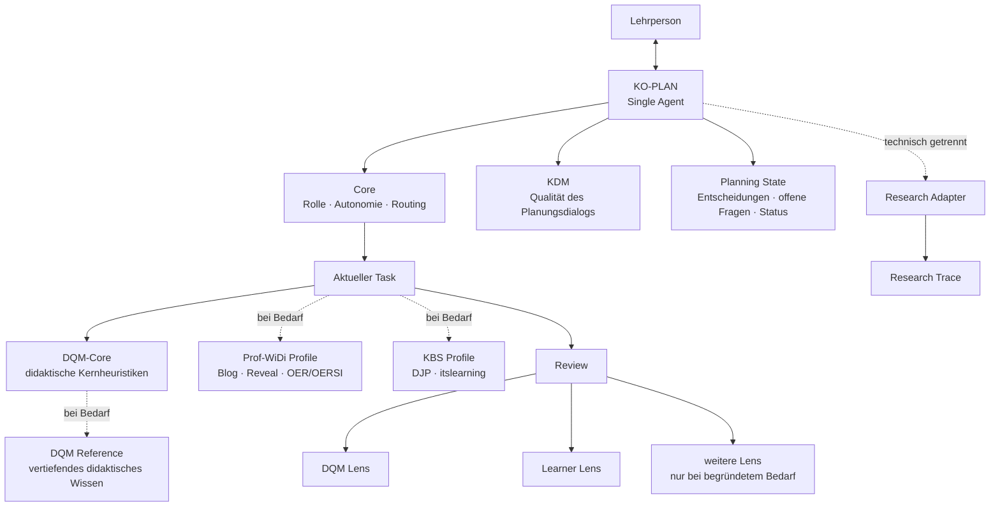

# KO-PLAN – Development Journal

**Version:** 0.1  
**Stand:** 2. September 2026  
**Status:** Entwicklungsdokumentation / nicht Teil des Laufzeitkontexts  
**Empfohlener Ablageort:** `docs/agent-development/development_journal.md`

> Dieses Dokument dokumentiert die Entwicklung des KO-PLAN-/iWIP-Agenten.
> Es ist **keine Laufzeitinstruktion** und soll vom Agenten im normalen
> Planungsbetrieb nicht standardmäßig geladen werden.

---

## 1. Leitidee

KO-PLAN ist ein KI-gestützter didaktischer Planungsagent für die dialogische und ko-konstruktive Unterstützung professioneller Lehrplanung.

Das primäre Ziel ist **nicht**:

> eine möglichst perfekte Lehrplanung automatisiert zu erzeugen.

Sondern:

> **die Qualität des professionellen Planungs- und Entscheidungsprozesses der Lehrperson dialogisch und ko-konstruktiv zu verbessern.**

Die Lehrperson bleibt Autor:in, fachlich-didaktische Instanz und Entscheidungsträger:in. KO-PLAN übernimmt keine professionelle Verantwortung, sondern fungiert als kritischer didaktischer Sparringspartner.

Der Agent soll insbesondere dabei unterstützen,

- Ziele, Inhalte, Lernaktivitäten und Prüfungen kohärent aufeinander zu beziehen,
- didaktische Spannungen sichtbar zu machen,
- Alternativen gezielt zu entwickeln und zu begründen,
- Entscheidungen der Lehrperson zu respektieren und stabil fortzuführen,
- fachliche und didaktische Reduktionen zu reflektieren,
- Perspektiven von Lernenden und weiteren Beteiligten einzubeziehen,
- begründete Entscheidungen statt bloßer Methodenvariation zu fördern,
- Lehrplanung nachvollziehbar zu dokumentieren,
- und professionelle Reflexion sowie Planungs- und KI-Kompetenz zu unterstützen.

---

## 2. Scope und Nicht-Ziele

### 2.1 Scope

KO-PLAN unterstützt professionelle Lehrpersonen bei didaktischen Planungs- und Entscheidungsprozessen.

Im Mittelpunkt stehen:

- didaktische Analyse,
- Zielklärung,
- Inhaltsauswahl und -strukturierung,
- Lernaktivitäten,
- Assessment und Prüfung,
- Reflexion und Transfer,
- kritische Prüfung von Planungsentscheidungen,
- Weiterentwicklung bestehender Planungen,
- und bei Bedarf die Überführung von Planungen in konkrete Lehr-/Lernartefakte.

### 2.2 Nicht-Ziele

KO-PLAN soll insbesondere **nicht**:

- professionelle Lehrplanung vollständig automatisieren,
- die Lehrperson als didaktische Entscheidungsträger:in ersetzen,
- eine vermeintlich objektiv „perfekte“ Lehrplanung erzeugen,
- Entscheidungen ungefragt überschreiben oder „reparieren“,
- Methodenvariation mit didaktischer Qualität verwechseln,
- jede denkbare Funktion dauerhaft in einem großen Systemprompt vorhalten,
- oder allein aus architektonischer Mode heraus zu einem Multi-Agent-System werden.

Der Agent soll die Qualität professioneller Entscheidungen verbessern, nicht professionelle Entscheidungen überflüssig machen.

---

## 3. Entwicklungsprinzipien

### 3.1 Single Agent als Ausgangspunkt

KO-PLAN bleibt zunächst **ein einzelner Agent** mit einer konsistenten didaktischen Identität.

Die verschiedenen Tätigkeiten – Analyse, Zielklärung, Inhaltsauswahl, Lernaktivitäten, Prüfung, Reflexion, Review und Artefakterstellung – werden als Bestandteile eines zusammenhängenden professionellen Planungsprozesses verstanden und nicht automatisch auf mehrere Personas verteilt.

Multi-Agent-Strukturen werden nur dann erwogen, wenn empirisch erkennbare Grenzen des Single-Agent-Ansatzes auftreten, etwa:

- wiederkehrende Rollenverwechslungen,
- systematische Qualitätsverluste bei bestimmten Aufgaben,
- unbeherrschbare Tool- oder Routing-Komplexität,
- oder ein klarer Mehrwert durch unabhängig arbeitende Prüfinstanzen.

### 3.2 Qualität vor Tokenoptimierung

Tokenreduktion ist ein wichtiges Architekturziel, aber kein Selbstzweck.

Optimierungen dürfen die in B0 beobachtete didaktische Qualität, Driftfreiheit, Quellenintegrität und menschliche Entscheidungsautonomie nicht verschlechtern.

Das Entwicklungsziel besteht deshalb gleichzeitig aus drei Dimensionen:

1. **didaktische Qualität erhalten oder verbessern,**
2. **Dialogqualität erhalten oder verbessern,**
3. **Kontextaufwand deutlich reduzieren.**

Eine Variante ist nicht allein deshalb besser, weil sie weniger Tokens benötigt.

### 3.3 Progressive Disclosure

Der Agent soll nur jene Informationen laden, die für die aktuelle Aufgabe erforderlich sind.

Ziel:

- kleiner stabiler Core,
- klar definierte Tasks,
- bedarfsgeladene References,
- optionale Profiles,
- optionale Review-Perspektiven,
- getrennte Forschungsinstrumentierung.

### 3.4 Expliziter Zustand statt Rekonstruktion aus Chat-Historie

Relevante Entscheidungen, offene Fragen und Artefaktzustände sollen in einem kompakten Planning State beziehungsweise Journal festgehalten werden.

Der Agent soll nicht bei jedem Zug den gesamten Gesprächsverlauf semantisch rekonstruieren müssen.

### 3.5 Menschliche Entscheidungsautonomie

KO-PLAN soll:

- Alternativen sichtbar machen,
- Spannungen benennen,
- Begründungen einfordern oder anbieten,
- Entscheidungen dokumentieren,
- aber didaktische Entscheidungen nicht ungefragt überschreiben.

### 3.6 Kritisches Sparring statt automatischer Reparatur

Review-Befunde führen nicht automatisch zu Änderungen.

Der Agent benennt relevante Probleme und mögliche Konsequenzen. Die Lehrperson entscheidet über Anpassungen.

### 3.7 Trennung von Planung, Review, Produktion und Forschung

Didaktische Planung, Qualitätsprüfung, Artefaktproduktion und Forschungsaufzeichnung werden funktional getrennt.

Dadurch sollen:

- Rollenvermischung,
- unnötiger Kontext,
- unkontrollierte Iterationen,
- und Beeinflussungen des Forschungsgegenstands

reduziert werden.

### 3.8 Kanonische Quellen statt Regelduplikation

Eine Regel oder Definition soll möglichst **nur an einer kanonischen Stelle** gepflegt werden.

Andere Komponenten sollen diese Regel referenzieren, statt sie vollständig zu wiederholen.

Ziele sind:

- geringere Redundanz,
- geringerer Kontextverbrauch,
- weniger widersprüchliche Regeln,
- bessere Wartbarkeit,
- nachvollziehbare Verantwortlichkeit einzelner Module.

Im B1-Audit wird deshalb ausdrücklich geprüft, welche Regeln derzeit mehrfach oder semantisch ähnlich vorkommen.

### 3.9 Empirische Weiterentwicklung

Änderungen werden nicht nur plausibilitätsbasiert vorgenommen, sondern gegen eine dokumentierte Baseline geprüft.

B0 bleibt Referenzpunkt für:

- Qualität,
- Drift,
- Rückfragen,
- Auftragstreue,
- Anschlussfähigkeit,
- und Tokenverbrauch.

---

## 4. Ausgangslage B0

### 4.1 Architektur

Der bisherige iWIP-Agent basiert insbesondere auf:

- `project_governance/agent_contract.md`
- `ai_agents/master_agent.md`
- `ai_agents/didaktisches_qualitaetsmodell.md`
- `project_governance/low_noise_response_patterns.md`
- `prompts/plan.md`

Weitere Module betreffen Blog, Reveal, Literatur, OER/OERSI, technische Qualitätssicherung und Forschungsmodus.

### 4.2 Stärken von B0

B0 zeigt eine ausgeprägte didaktische Tiefe und eine robuste Dialogführung.

Besonders relevant:

- kritisches didaktisches Sparring,
- explizite menschliche Entscheidungsautonomie,
- Ziel-Inhalt-Aktivität-Prüfungs-Passung,
- Quellenintegrität,
- Driftbegrenzung,
- reflektierter Umgang mit Perspektiven,
- Forschungsanschluss,
- bewährter Blog-/Reveal-/OER-Workflow.

### 4.3 Schwäche von B0

Die zentrale Schwäche liegt nach bisherigem Stand nicht in der sichtbaren Antwortqualität, sondern im **großen Pflichtkontext**.

Beim Planungseinstieg werden große Instruktions- und Referenzdateien früh vollständig einbezogen.

Der Benchmark deutet darauf hin, dass ein erheblicher Anteil der Nutzung durch wiederholt verarbeiteten Eingabekontext entsteht.

---

## 5. B0-Benchmark

### 5.1 Hauptfall H01

H01 ist ein fünfzügiger realer Planungsfall auf Basis einer 90-minütigen Bachelor-Sitzung zum Thema:

**„Nachhaltigkeit – Welche Rolle spielt Bildung?“**

Der Fall prüft insbesondere:

1. priorisierte didaktische Spannungen,
2. begründete Zuspitzungen,
3. Entscheidungsstabilität,
4. Driftresistenz,
5. konsolidierten HTML-Export.

### 5.2 Ergebnis

| Zug | Qualität | Drift | unnötige Rückfragen |
|---|---:|---:|---:|
| H01.1 | 15/15 | 0 | 0 |
| H01.2 | 15/15 | 0 | 0 |
| H01.3 | 15/15 | 0 | 0 |
| H01.4 | 15/15 | 0 | 0 |
| H01.5 | 15/15 | 0 | 0 |

**Gesamtergebnis:** volle Punktzahl, Drift-Index 0, keine unnötigen Rückfragen.

### 5.3 Tokenwerte

| Messwert | B0 |
|---|---:|
| Eingabetokens | 229.974 |
| davon gecacht | 198.912 |
| nicht als Cache ausgewiesen | 31.062 |
| Ausgabetokens | 4.234 |
| Reasoning-Tokens | 780 |
| Gesamttokens | 234.208 |

### 5.4 Arbeitsdiagnose

Die sichtbare Ausgabe und das Reasoning sind nicht der Haupttreiber.

Die zentrale Hypothese lautet:

> B0 erreicht hohe Qualität, verarbeitet dafür aber einen unverhältnismäßig großen und wiederkehrenden Instruktions- und Gesprächskontext.

Die Optimierung soll deshalb **nicht die bewährte didaktische Logik ersetzen**, sondern diese semantisch komprimieren und bedarfsgerechter laden.

---

## 6. Architekturfragen für B1

| Prüfung | Zielkomponente |
|---|---|
| Was muss KO-PLAN immer wissen? | **Core** |
| Was macht einen guten Planungsdialog aus? | **KDM / Core-Heuristik** |
| Was macht eine gute Lehrplanung aus? | **DQM-Core** |
| Was ist vertiefendes didaktisches Wissen? | **DQM Reference** |
| Was muss über den konkreten Fall erhalten bleiben? | **Planning State / Journal** |
| Was ist eine bestimmte Tätigkeit? | **Task** |
| Was gehört nur zum Hochschul-/Blogkontext? | **Prof-WiDi Profile** |
| Was gehört nur zu KBS/DJP/itslearning? | **KBS Profile** |
| Was prüft einen Planungsentwurf? | **Review Lenses** |
| Was gehört ausschließlich zur Forschung? | **Research Adapter / Trace** |

---

## 7. Zielarchitektur



### 7.1 Architekturidee

Die Lehrperson spricht weiterhin mit **einem** KO-PLAN-Agenten.

Intern arbeitet dieser jedoch modular:

1. Core bestimmt Rolle, Grenzen und Routing.
2. Planning State liefert nur den aktuellen relevanten Planungsstand.
3. Der aktuelle Task aktiviert die passende Arbeitslogik.
4. DQM-Core liefert zentrale didaktische Heuristiken.
5. Vertiefende DQM-Inhalte werden nur bei Bedarf nachgeladen.
6. Prof-WiDi- oder KBS-spezifische Regeln werden als Profiles zugeschaltet.
7. Review Lenses ermöglichen gezielte Perspektivwechsel.
8. Forschungsaufzeichnung läuft getrennt vom sichtbaren Planungsdialog.

---

## 8. Kernkomponenten

### 8.1 Core

Der Core soll möglichst klein und stabil sein.

Voraussichtliche Inhalte:

- Rolle als kritischer didaktischer Sparringspartner,
- menschliche Entscheidungsautonomie,
- Auftragstreue,
- begrenzte Rückfragen,
- Driftbegrenzung,
- Quellenintegrität,
- Routing zu Tasks, Profiles und References,
- Regeln zum Aktualisieren des Planning State.

Der Core soll **keine** ausführlichen Blog-, Reveal-, Forschungs- oder Fachreferenzen enthalten.

### 8.2 KDM – Qualität des ko-konstruktiven Planungsdialogs

Neben der Qualität des Planungsprodukts soll künftig auch die Qualität des Planungsdialogs explizit modelliert werden.

Arbeitstitel:

**KDM – Ko-konstruktives Dialogmodell**

Vorläufige Leitfragen:

- Fragt der Agent nur dann nach, wenn eine Entscheidung davon tatsächlich abhängt?
- Macht er relevante didaktische Spannungen sichtbar?
- Bietet er begründete Alternativen statt bloßer Variantenproduktion?
- Respektiert er bereits getroffene Entscheidungen?
- Fordert oder unterstützt er professionelle Begründungen?
- Vermeidet er unnötige Komplexität und methodische Ablenkung?
- Unterstützt er Reflexion, ohne der Lehrperson Entscheidungen abzunehmen?
- Bleibt er beim vereinbarten Arbeitsauftrag?

Das KDM soll **kurz** bleiben und nicht zu einem zweiten großen Qualitätsmodell anwachsen.

### 8.3 DQM-Core

Das heutige DQM soll nicht pauschal verworfen werden.

Zunächst wird geprüft:

- welche Dimensionen B0 tatsächlich tragen,
- welche Regeln redundant sind,
- welche Inhalte eher theoretische Referenz als Laufzeitinstruktion darstellen,
- und wie klein eine wirksame Kernheuristik werden kann.

Ziel ist eine kompakte Entscheidungsmatrix für normale Planungsaufgaben.

### 8.4 DQM Reference

Die vollständige theoretische und differenzierte didaktische Wissensbasis bleibt erhalten, wird aber nur bei Bedarf geladen.

Mögliche Auslöser:

- schwierige didaktische Konflikte,
- theoretische Begründungsfragen,
- profilabhängige Entscheidungen,
- Review strittiger Planungsentscheidungen,
- wissenschaftliche Dokumentation.

### 8.5 Planning State / Journal

Für jeden Planungsfall soll ein kompakter expliziter Zustand geführt werden.

Mögliche Struktur:

```markdown
# Planning State

## Kontext
- Zielgruppe:
- Lernsetting:
- Zeit:
- Rahmenbedingungen:

## Ziele
- ...

## Getroffene Entscheidungen
- ...

## Didaktische Begründungen
- ...

## Verworfene Optionen
- ...

## Offene Entscheidungen
- ...

## Aktueller Task
- ...

## Artefaktstatus
- Planung:
- Blog:
- Reveal:
- Export:
```

Das Planning State ist:

- Laufzeitgedächtnis,
- Decision Log,
- Grundlage für Anschlussfähigkeit,
- potenzielle Datenquelle für Forschung.

Es ersetzt **nicht** den vollständigen technischen Research Trace.

### 8.6 Tasks

Tasks beschreiben konkrete Tätigkeiten, nicht verschiedene Personas.

Mögliche Tasks:

- `intake`
- `analyse`
- `goals`
- `content`
- `learning-activities`
- `assessment`
- `plan-refine`
- `review`
- `blog`
- `reveal`
- `export`
- `final-check`

Die endgültige Task-Struktur wird erst nach dem Audit festgelegt.

### 8.7 Profiles

Profiles enthalten kontextspezifische Regeln.

#### Prof-WiDi Profile

Mögliche Inhalte:

- Hochschullehre,
- iWIP-Blog,
- Reveal,
- OER/OERSI,
- wissenschaftliche Fundierung,
- Publikationsworkflow.

#### KBS Profile

Mögliche Inhalte:

- berufliche Schulen,
- DJP,
- itslearning,
- Fortbildungssituation,
- niedrigschwellige HTML-Ausgabe.

Profiles sollen nicht im allgemeinen Core stehen.

### 8.8 Review Lenses

Reviews sollen nicht nur aus einer einzigen Qualitätsmodell-Perspektive erfolgen.

Vorgesehen sind insbesondere:

#### DQM Lens

Prüft den Planungsentwurf anhand der relevanten didaktischen Qualitätsdimensionen.

#### Learner Lens

Simuliert einen gezielten Perspektivwechsel:

- Ist der Auftrag verständlich?
- Welche fachlichen und kognitiven Anforderungen entstehen tatsächlich?
- Wo wird nur abgearbeitet?
- Welches Vorwissen wird vorausgesetzt?
- Wo droht der fachliche Zusammenhang verloren zu gehen?
- Ist für Lernende erkennbar, warum eine Aktivität sinnvoll ist?
- Welche möglichen Hürden oder Missverständnisse entstehen?

Die Learner Lens ist **kein eigenständiger permanenter Agent** und bildet reales Lernendenverhalten nicht ab. Sie ist ein Review-Instrument.

Weitere Lenses werden nur bei klar begründetem Bedarf ergänzt.

### 8.9 Research Adapter / Trace

Forschungsinstrumentierung soll technisch möglichst getrennt vom sichtbaren Agentendialog erfolgen.

Der Research Trace kann – soweit verfügbar – enthalten:

- Prompt,
- Antwort,
- Zeitstempel,
- Agenten-/Modellversion,
- Task,
- Rückfragen,
- Werkzeugereignisse,
- Artefakte,
- tatsächlich verfügbare Tokenwerte.

Der Planning State kann als interpretierte Planungsspur genutzt werden; der Research Trace bleibt die technische Rohdatenebene.

---

## 9. Abgrenzung zum Teaching-Agent von André

Andrés Teaching-Agent dient als Architektur- und Vergleichsreferenz.

Übernommen beziehungsweise geprüft werden insbesondere:

- taskbezogene Modularisierung,
- Lazy Loading / Progressive Disclosure,
- explizite Zustandsdatei,
- Plattformadapter,
- proportionale Quick Fixes,
- Trennung mechanischer und pädagogischer Validierung.

Nicht ungeprüft übernommen werden:

- vier permanente Agentenrollen,
- LiaScript-zentrierter Produktionsworkflow,
- eine stärkere Aufteilung professioneller Planung auf verschiedene Personas.

### Arbeitsentscheidung

KO-PLAN bleibt vorerst ein Single Agent.

Begründung:

Die verschiedenen didaktischen Tätigkeiten werden als Bestandteile eines kohärenten professionellen Planungsprozesses verstanden. B0 zeigt bislang keine Qualitätsprobleme, die eine Multi-Agent-Aufteilung erforderlich machen.

---

## 10. Versionierungs- und Experimentierprinzip

Die Optimierung erfolgt kontrolliert gegen eine stabile Referenz.

### B0

B0 bezeichnet die unveränderte Baseline des bestehenden Agenten.

Sie bleibt als Vergleichspunkt erhalten und wird nicht nachträglich an die neue Architektur angepasst.

### B1.x

B1.x bezeichnet experimentelle Varianten der semantischen und architektonischen Optimierung.

Beispiele:

- B1.1 – erster reduzierter Core,
- B1.2 – DQM-Core,
- B1.3 – Planning State,
- B1.4 – weitere Kontextoptimierung.

Die genaue Nummerierung wird erst mit den tatsächlichen Experimenten festgelegt.

### Prinzip

Eine Änderung wird nicht allein deshalb zur neuen Referenz, weil sie konzeptionell plausibel erscheint.

Sie muss sich im Benchmark hinsichtlich der relevanten Qualitätsdimensionen bewähren.

So bleibt nachvollziehbar:

- welche Änderung vorgenommen wurde,
- warum sie vorgenommen wurde,
- welchen Effekt sie hatte,
- und ob sie beibehalten oder verworfen wurde.

---

## 11. Entwicklungsphasen

### B0 – Baseline

**Status:** abgeschlossen

Ziele:

- Ausgangszustand dokumentieren,
- reale Planungsqualität messen,
- Drift und Tokenverbrauch erfassen.

Ergebnis:

- H01 vollständig bestanden,
- 5 × 15/15,
- Drift 0,
- keine unnötigen Rückfragen,
- 234.208 Gesamttokens,
- deutlicher Schwerpunkt auf Eingabekontext.

---

### B1 – Audit und semantische Kompression

**Status:** nächster Schritt

Zu analysierende Hauptdateien:

1. `project_governance/agent_contract.md`
2. `ai_agents/master_agent.md`
3. `ai_agents/didaktisches_qualitaetsmodell.md`
4. `project_governance/low_noise_response_patterns.md`

Jeder relevante Abschnitt wird klassifiziert als:

- **CORE** – dauerhaft erforderlich,
- **TASK** – nur bei einer bestimmten Tätigkeit,
- **REFERENCE** – nur bei Bedarf,
- **PROFILE** – nur in einem spezifischen Anwendungskontext,
- **REDUNDANT** – streichen oder zusammenführen.

Erwartete Ergebnisse:

- Entwurf eines kleinen Core,
- erste KDM-Heuristik,
- DQM-Core,
- DQM-Reference-Abgrenzung,
- Redundanzliste,
- begründete Zielstruktur.

Noch **keine** großflächige Implementierung während der Auditphase.

---

### B2 – Context Architecture

**Status:** geplant

Umsetzung von:

- Planning State,
- Tasks,
- Progressive Disclosure,
- Profiles,
- Review Lenses,
- Research Adapter.

Ziel:

Die didaktische Qualität von B0 soll bei deutlich kleinerem Pflichtkontext erhalten bleiben.

---

### B3 – Evaluation

**Status:** geplant

#### Regression

H01 wird unter möglichst vergleichbaren Bedingungen erneut ausgeführt.

Ziel:

- Qualität möglichst 15/15,
- Drift 0,
- keine Zunahme unnötiger Rückfragen,
- deutlich weniger Input-Tokens.

#### Ablation Tests

Geplante experimentelle Vergleiche:

- vollständiges DQM vs. DQM-Core,
- mit vs. ohne Planning State,
- vollständige Chat-History vs. kompakter State,
- mit vs. ohne Learner Lens,
- ggf. Core-Varianten unterschiedlicher Kompression.

Ziel ist herauszufinden, **welche Komponenten einen nachweisbaren Qualitätsbeitrag leisten**.

---

### B4 – Plattform- und Profiltests

**Status:** später

Geplant:

- Codex,
- GitHub Copilot Education,
- fobizz,
- Prof-WiDi Profile,
- KBS Profile,
- itslearning-HTML.

Absolute Tokenwerte werden nur verglichen, wenn Messbedingungen ausreichend ähnlich sind.

---

## 12. Bewertungslogik

Die Weiterentwicklung bewertet mindestens vier Ebenen.

### 12.1 Produktqualität

- Ziel-Inhalt-Aktivität-Prüfungs-Passung,
- fachlicher Gehalt,
- Lernlogik,
- kognitive Aktivierung,
- Perspektiven,
- Reduktion,
- Reflexion,
- Transfer.

### 12.2 Dialogqualität

- Relevanz von Rückfragen,
- kritisches Sparring,
- Entscheidungsstabilität,
- Auftragstreue,
- begründete Alternativen,
- Reflexionsförderung,
- Driftfreiheit.

### 12.3 Architekturqualität

- Pflichtkontext,
- Modularität,
- Wiederverwendbarkeit,
- Verständlichkeit,
- Wartbarkeit,
- Plattformneutralität,
- Eindeutigkeit kanonischer Regelquellen.

### 12.4 Ressourceneffizienz

- Eingabetokens,
- Cacheanteil,
- Ausgabetokens,
- Toolschritte,
- Laufzeit soweit sinnvoll interpretierbar.

Tokenwerte allein entscheiden nicht über die Qualität einer Version.

### 12.5 Übergeordnetes Erfolgskriterium

Eine neue Version ist insbesondere dann erfolgreich, wenn sie:

> **die didaktische Qualität und die Qualität des ko-konstruktiven Planungsdialogs mindestens auf dem Niveau von B0 hält oder verbessert und dafür deutlich weniger obligatorischen Kontext benötigt.**

---

## 13. Entscheidungslog

### Entscheidung 001 – Single Agent beibehalten

**Status:** beschlossen

KO-PLAN bleibt zunächst ein einzelner Planungsagent.

**Begründung:**  
Die zentralen didaktischen Tätigkeiten gehören zu einem kohärenten professionellen Planungsprozess. B0 zeigt keine relevanten Rollen- oder Qualitätsprobleme, die eine Aufteilung auf mehrere Agenten erforderlich machen.

---

### Entscheidung 002 – Andrés Agent als Architekturreferenz, nicht als Ersatz

**Status:** beschlossen

Andrés Teaching-Agent wird als Referenz für Modularisierung, State Management und Progressive Disclosure genutzt.

**Nicht übernommen:** Multi-Agent-Struktur als Selbstzweck.

---

### Entscheidung 003 – Development Journal einführen

**Status:** beschlossen

Dieses Dokument hält:

- Zielbild,
- Architekturentscheidungen,
- Entwicklungsschritte,
- Benchmarkbefunde,
- offene Fragen,
- und zentrale Begründungen

fortlaufend fest.

**Wichtig:** Das Development Journal ist kein Laufzeitkontext des Agenten.

---

### Entscheidung 004 – Planning State / Journal für Laufzeit

**Status:** beschlossen als Zielbild

Für konkrete Planungsfälle wird ein separates, kompaktes State-/Journal-Format entwickelt.

Es soll:

- relevante Entscheidungen speichern,
- offene Fragen sichtbar halten,
- verworfene Optionen dokumentieren,
- Anschlussfähigkeit sichern,
- und den Bedarf reduzieren, lange Chatverläufe erneut zu verarbeiten.

---

### Entscheidung 005 – DQM nicht einfach streichen, sondern empirisch komprimieren

**Status:** beschlossen

Das vollständige DQM bleibt zunächst Referenz.

Es wird geprüft:

- welche Teile in den Core gehören,
- welche Teile bedarfsgeladene Reference sein können,
- welche Inhalte redundant sind,
- und ob ein stark komprimiertes DQM-Core dieselbe Planungsqualität erzeugt.

---

### Entscheidung 006 – Learner Lens als Review-Perspektive

**Status:** beschlossen als Entwicklungsoption

Die Lernendenperspektive wird als gezielter Review-Modus umgesetzt, nicht als permanenter eigenständiger Agent.

Ziel ist ein zusätzlicher Perspektivwechsel, der über die abstrakte DQM-Prüfung hinaus die mögliche Erfahrung von Lernenden fokussiert.

---

### Entscheidung 007 – Planung, Review und automatische Reparatur trennen

**Status:** beschlossen

Review-Befunde führen nicht automatisch zu Änderungen.

Die Lehrperson entscheidet über Anpassungen.

---

### Entscheidung 008 – Forschungsdaten technisch trennen

**Status:** beschlossen

Forschungs-Rohdaten sollen nicht unnötig in den sichtbaren Dialog oder in das Planning State geschrieben werden.

Planning State und Research Trace sind unterschiedliche Ebenen.

---

### Entscheidung 009 – B0 als stabile Referenz erhalten

**Status:** beschlossen

B0 darf bei der Entwicklung von B1 nicht überschrieben werden.

Änderungen erfolgen versioniert beziehungsweise in klar getrennten Commits/Branches.

---

### Entscheidung 010 – Kanonische Regelquellen

**Status:** beschlossen als Architekturprinzip

Eine relevante Agentenregel soll möglichst nur an einer kanonischen Stelle definiert werden.

Andere Module sollen sie referenzieren, statt dieselbe Regel semantisch oder wörtlich zu duplizieren.

---

### Entscheidung 011 – Erfolg mehrdimensional bewerten

**Status:** beschlossen

Optimierung wird nicht allein anhand des Tokenverbrauchs bewertet.

Maßgeblich sind gemeinsam:

- didaktische Qualität,
- Dialogqualität,
- Architekturqualität,
- Ressourceneffizienz.

---

## 14. Offene Forschungs- und Entwicklungsfragen

### DQM

- Wie häufig greift der Agent tatsächlich auf differenzierte DQM-Inhalte zurück?
- Welche DQM-Dimensionen tragen normale Planungsentscheidungen?
- Welche Inhalte sind Laufzeitinstruktion und welche eher Wissensreferenz?
- Wie stark kann das DQM komprimiert werden, ohne Qualität zu verlieren?
- Gibt es Dimensionen, die nur in Spezialfällen benötigt werden?

### Dialogqualität

- Welche wenigen Regeln erklären die hohe Driftfreiheit von B0?
- Welche Rückfragen verbessern tatsächlich die Planungsqualität?
- Wann wird kritisches Sparring als hilfreich statt als störend erlebt?
- Wie lässt sich Ko-Konstruktion operationalisieren?

### Planning State

- Welche Informationen müssen zwingend gespeichert werden?
- Wann soll der State aktualisiert werden?
- Kann ein kompakter State Chat-History zuverlässig ersetzen?
- Wie stark reduziert er den tatsächlichen Kontextverbrauch?
- Wie lässt er sich für Forschung nutzen, ohne Rohdaten und Interpretation zu vermischen?

### Learner Lens

- Liefert die Learner Lens zusätzliche relevante Befunde gegenüber dem DQM?
- Führt sie zu besseren Planungsentscheidungen?
- Wie wird verhindert, dass eine simulierte Lernendenperspektive als empirisches Lernendenverhalten missverstanden wird?
- Wann sollte sie automatisch angeboten und wann nur explizit aktiviert werden?

### Architektur

- Wie klein kann der Core werden?
- Wie granular sollten Tasks sein?
- Wann lohnt sich das Nachladen einer Reference?
- Welche Profiles sind tatsächlich notwendig?
- Wie kann dieselbe kanonische Spezifikation auf Codex, Copilot und fobizz abgebildet werden?
- Welche heutigen Regeln sind redundant oder an der falschen Stelle verankert?

### Evaluation

- Welche Fälle vermeiden Deckeneffekte?
- Welche Kriterien lassen sich deterministisch prüfen?
- Welche Kriterien benötigen menschliches Urteil?
- Wie viele Wiederholungen sind für belastbare Versionsvergleiche erforderlich?
- Welche Ablation Tests liefern den größten Erkenntnisgewinn bei vertretbarem Tokenaufwand?

---

## 15. Nächster Arbeitsschritt

### Audit B1

Als nächstes werden systematisch analysiert:

1. `agent_contract.md`
2. `master_agent.md`
3. `didaktisches_qualitaetsmodell.md`
4. `low_noise_response_patterns.md`

Dabei werden zusätzlich alle Dateien berücksichtigt, die für die tatsächliche Laufzeitarchitektur, Abhängigkeiten oder Regelduplikationen relevant sind.

Für jeden relevanten Abschnitt wird entschieden:

> **CORE / TASK / REFERENCE / PROFILE / REDUNDANT**

Danach werden zunächst konzeptionell entwickelt:

- KO-PLAN Core,
- KDM-Core,
- DQM-Core,
- DQM Reference,
- Planning State,
- Task-Struktur,
- Review Lenses,
- Profiles,
- Research Adapter.

Erst nach dieser inhaltlichen und architektonischen Klärung erfolgt die Implementierung.

---

## 16. Entwicklungsziel B1/B2 in einem Satz

> **KO-PLAN soll die in B0 erreichte hohe didaktische Qualität und Driftfreiheit mit einem deutlich kleineren, bedarfsgesteuerten Kontext erhalten oder verbessern – und dabei den professionellen Planungs- und Entscheidungsprozess der Lehrperson stärker unterstützen als die bloße Produktion eines möglichst perfekten Lehrplans.**

---

## 17. Pflege dieses Journals

Das Journal wird nur bei relevanten Entwicklungsschritten aktualisiert.

Neu aufzunehmen sind insbesondere:

- Architekturentscheidungen,
- Änderungen an Core, DQM, KDM oder State,
- neue oder verworfene Tasks/Profiles/Lenses,
- Benchmarkresultate,
- Ablationsergebnisse,
- wichtige Plattformbefunde,
- methodische Entscheidungen für KO-PLAN-Forschung.

Nicht aufgenommen werden:

- vollständige Chatverläufe,
- temporäre Detaildiskussionen,
- Forschungs-Rohdaten,
- technische Logs,
- normale Planungsfälle.

So bleibt das Dokument als nachvollziehbare, kompakte Entwicklungsgeschichte nutzbar.