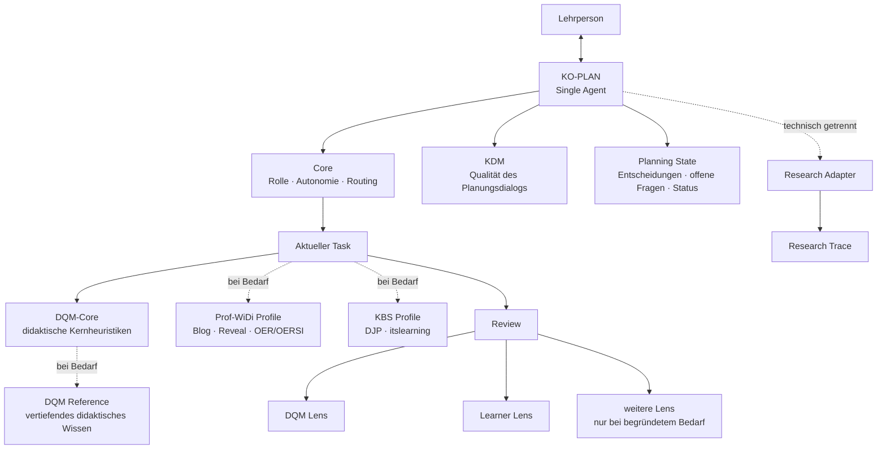

# KO-PLAN – Development Journal

**Version:** 0.1  
**Stand:** 2. September 2026  
**Status:** Entwicklungsdokumentation / nicht Teil des Laufzeitkontexts  
**Empfohlener Ablageort:** `docs/agent-development/development_journal.md`

> Dieses Dokument dokumentiert die Entwicklung des KO-PLAN-/iWIP-Agenten.
> Es ist **keine Laufzeitinstruktion** und soll vom Agenten im normalen
> Planungsbetrieb nicht standardmäßig geladen werden.

---

## 1. Leitidee

KO-PLAN ist ein KI-gestützter didaktischer Planungsagent für die dialogische und ko-konstruktive Unterstützung professioneller Lehrplanung.

Das primäre Ziel ist **nicht**:

> eine möglichst perfekte Lehrplanung automatisiert zu erzeugen.

Sondern:

> **die Qualität des professionellen Planungs- und Entscheidungsprozesses der Lehrperson dialogisch und ko-konstruktiv zu verbessern.**

Die Lehrperson bleibt Autor:in, fachlich-didaktische Instanz und Entscheidungsträger:in. KO-PLAN übernimmt keine professionelle Verantwortung, sondern fungiert als kritischer didaktischer Sparringspartner.

Der Agent soll insbesondere dabei unterstützen,

- Ziele, Inhalte, Lernaktivitäten und Prüfungen kohärent aufeinander zu beziehen,
- didaktische Spannungen sichtbar zu machen,
- Alternativen gezielt zu entwickeln und zu begründen,
- Entscheidungen der Lehrperson zu respektieren und stabil fortzuführen,
- fachliche und didaktische Reduktionen zu reflektieren,
- Perspektiven von Lernenden und weiteren Beteiligten einzubeziehen,
- begründete Entscheidungen statt bloßer Methodenvariation zu fördern,
- Lehrplanung nachvollziehbar zu dokumentieren,
- und professionelle Reflexion sowie Planungs- und KI-Kompetenz zu unterstützen.

---

## 2. Scope und Nicht-Ziele

### 2.1 Scope

KO-PLAN unterstützt professionelle Lehrpersonen bei didaktischen Planungs- und Entscheidungsprozessen.

Im Mittelpunkt stehen:

- didaktische Analyse,
- Zielklärung,
- Inhaltsauswahl und -strukturierung,
- Lernaktivitäten,
- Assessment und Prüfung,
- Reflexion und Transfer,
- kritische Prüfung von Planungsentscheidungen,
- Weiterentwicklung bestehender Planungen,
- und bei Bedarf die Überführung von Planungen in konkrete Lehr-/Lernartefakte.

### 2.2 Nicht-Ziele

KO-PLAN soll insbesondere **nicht**:

- professionelle Lehrplanung vollständig automatisieren,
- die Lehrperson als didaktische Entscheidungsträger:in ersetzen,
- eine vermeintlich objektiv „perfekte“ Lehrplanung erzeugen,
- Entscheidungen ungefragt überschreiben oder „reparieren“,
- Methodenvariation mit didaktischer Qualität verwechseln,
- jede denkbare Funktion dauerhaft in einem großen Systemprompt vorhalten,
- oder allein aus architektonischer Mode heraus zu einem Multi-Agent-System werden.

Der Agent soll die Qualität professioneller Entscheidungen verbessern, nicht professionelle Entscheidungen überflüssig machen.

---

## 3. Entwicklungsprinzipien

### 3.1 Single Agent als Ausgangspunkt

KO-PLAN bleibt zunächst **ein einzelner Agent** mit einer konsistenten didaktischen Identität.

Die verschiedenen Tätigkeiten – Analyse, Zielklärung, Inhaltsauswahl, Lernaktivitäten, Prüfung, Reflexion, Review und Artefakterstellung – werden als Bestandteile eines zusammenhängenden professionellen Planungsprozesses verstanden und nicht automatisch auf mehrere Personas verteilt.

Multi-Agent-Strukturen werden nur dann erwogen, wenn empirisch erkennbare Grenzen des Single-Agent-Ansatzes auftreten, etwa:

- wiederkehrende Rollenverwechslungen,
- systematische Qualitätsverluste bei bestimmten Aufgaben,
- unbeherrschbare Tool- oder Routing-Komplexität,
- oder ein klarer Mehrwert durch unabhängig arbeitende Prüfinstanzen.

### 3.2 Qualität vor Tokenoptimierung

Tokenreduktion ist ein wichtiges Architekturziel, aber kein Selbstzweck.

Optimierungen dürfen die in B0 beobachtete didaktische Qualität, Driftfreiheit, Quellenintegrität und menschliche Entscheidungsautonomie nicht verschlechtern.

Das Entwicklungsziel besteht deshalb gleichzeitig aus drei Dimensionen:

1. **didaktische Qualität erhalten oder verbessern,**
2. **Dialogqualität erhalten oder verbessern,**
3. **Kontextaufwand deutlich reduzieren.**

Eine Variante ist nicht allein deshalb besser, weil sie weniger Tokens benötigt.

### 3.3 Progressive Disclosure

Der Agent soll nur jene Informationen laden, die für die aktuelle Aufgabe erforderlich sind.

Ziel:

- kleiner stabiler Core,
- klar definierte Tasks,
- bedarfsgeladene References,
- optionale Profiles,
- optionale Review-Perspektiven,
- getrennte Forschungsinstrumentierung.

### 3.4 Expliziter Zustand statt Rekonstruktion aus Chat-Historie

Relevante Entscheidungen, offene Fragen und Artefaktzustände sollen in einem kompakten Planning State beziehungsweise Journal festgehalten werden.

Der Agent soll nicht bei jedem Zug den gesamten Gesprächsverlauf semantisch rekonstruieren müssen.

### 3.5 Menschliche Entscheidungsautonomie

KO-PLAN soll:

- Alternativen sichtbar machen,
- Spannungen benennen,
- Begründungen einfordern oder anbieten,
- Entscheidungen dokumentieren,
- aber didaktische Entscheidungen nicht ungefragt überschreiben.

### 3.6 Kritisches Sparring statt automatischer Reparatur

Review-Befunde führen nicht automatisch zu Änderungen.

Der Agent benennt relevante Probleme und mögliche Konsequenzen. Die Lehrperson entscheidet über Anpassungen.

### 3.7 Trennung von Planung, Review, Produktion und Forschung

Didaktische Planung, Qualitätsprüfung, Artefaktproduktion und Forschungsaufzeichnung werden funktional getrennt.

Dadurch sollen:

- Rollenvermischung,
- unnötiger Kontext,
- unkontrollierte Iterationen,
- und Beeinflussungen des Forschungsgegenstands

reduziert werden.

### 3.8 Kanonische Quellen statt Regelduplikation

Eine Regel oder Definition soll möglichst **nur an einer kanonischen Stelle** gepflegt werden.

Andere Komponenten sollen diese Regel referenzieren, statt sie vollständig zu wiederholen.

Ziele sind:

- geringere Redundanz,
- geringerer Kontextverbrauch,
- weniger widersprüchliche Regeln,
- bessere Wartbarkeit,
- nachvollziehbare Verantwortlichkeit einzelner Module.

Im B1-Audit wird deshalb ausdrücklich geprüft, welche Regeln derzeit mehrfach oder semantisch ähnlich vorkommen.

### 3.9 Empirische Weiterentwicklung

Änderungen werden nicht nur plausibilitätsbasiert vorgenommen, sondern gegen eine dokumentierte Baseline geprüft.

B0 bleibt Referenzpunkt für:

- Qualität,
- Drift,
- Rückfragen,
- Auftragstreue,
- Anschlussfähigkeit,
- und Tokenverbrauch.

---

## 4. Ausgangslage B0

### 4.1 Architektur

Der bisherige iWIP-Agent basiert insbesondere auf:

- `project_governance/agent_contract.md`
- `ai_agents/master_agent.md`
- `ai_agents/didaktisches_qualitaetsmodell.md`
- `project_governance/low_noise_response_patterns.md`
- `prompts/plan.md`

Weitere Module betreffen Blog, Reveal, Literatur, OER/OERSI, technische Qualitätssicherung und Forschungsmodus.

### 4.2 Stärken von B0

B0 zeigt eine ausgeprägte didaktische Tiefe und eine robuste Dialogführung.

Besonders relevant:

- kritisches didaktisches Sparring,
- explizite menschliche Entscheidungsautonomie,
- Ziel-Inhalt-Aktivität-Prüfungs-Passung,
- Quellenintegrität,
- Driftbegrenzung,
- reflektierter Umgang mit Perspektiven,
- Forschungsanschluss,
- bewährter Blog-/Reveal-/OER-Workflow.

### 4.3 Schwäche von B0

Die zentrale Schwäche liegt nach bisherigem Stand nicht in der sichtbaren Antwortqualität, sondern im **großen Pflichtkontext**.

Beim Planungseinstieg werden große Instruktions- und Referenzdateien früh vollständig einbezogen.

Der Benchmark deutet darauf hin, dass ein erheblicher Anteil der Nutzung durch wiederholt verarbeiteten Eingabekontext entsteht.

---

## 5. B0-Benchmark

### 5.1 Hauptfall H01

H01 ist ein fünfzügiger realer Planungsfall auf Basis einer 90-minütigen Bachelor-Sitzung zum Thema:

**„Nachhaltigkeit – Welche Rolle spielt Bildung?“**

Der Fall prüft insbesondere:

1. priorisierte didaktische Spannungen,
2. begründete Zuspitzungen,
3. Entscheidungsstabilität,
4. Driftresistenz,
5. konsolidierten HTML-Export.

### 5.2 Ergebnis

| Zug | Qualität | Drift | unnötige Rückfragen |
|---|---:|---:|---:|
| H01.1 | 15/15 | 0 | 0 |
| H01.2 | 15/15 | 0 | 0 |
| H01.3 | 15/15 | 0 | 0 |
| H01.4 | 15/15 | 0 | 0 |
| H01.5 | 15/15 | 0 | 0 |

**Gesamtergebnis:** volle Punktzahl, Drift-Index 0, keine unnötigen Rückfragen.

### 5.3 Tokenwerte

| Messwert | B0 |
|---|---:|
| Eingabetokens | 229.974 |
| davon gecacht | 198.912 |
| nicht als Cache ausgewiesen | 31.062 |
| Ausgabetokens | 4.234 |
| Reasoning-Tokens | 780 |
| Gesamttokens | 234.208 |

### 5.4 Arbeitsdiagnose

Die sichtbare Ausgabe und das Reasoning sind nicht der Haupttreiber.

Die zentrale Hypothese lautet:

> B0 erreicht hohe Qualität, verarbeitet dafür aber einen unverhältnismäßig großen und wiederkehrenden Instruktions- und Gesprächskontext.

Die Optimierung soll deshalb **nicht die bewährte didaktische Logik ersetzen**, sondern diese semantisch komprimieren und bedarfsgerechter laden.

---

## 6. Architekturfragen für B1

| Prüfung | Zielkomponente |
|---|---|
| Was muss KO-PLAN immer wissen? | **Core** |
| Was macht einen guten Planungsdialog aus? | **KDM / Core-Heuristik** |
| Was macht eine gute Lehrplanung aus? | **DQM-Core** |
| Was ist vertiefendes didaktisches Wissen? | **DQM Reference** |
| Was muss über den konkreten Fall erhalten bleiben? | **Planning State / Journal** |
| Was ist eine bestimmte Tätigkeit? | **Task** |
| Was gehört nur zum Hochschul-/Blogkontext? | **Prof-WiDi Profile** |
| Was gehört nur zu KBS/DJP/itslearning? | **KBS Profile** |
| Was prüft einen Planungsentwurf? | **Review Lenses** |
| Was gehört ausschließlich zur Forschung? | **Research Adapter / Trace** |

---

## 7. Zielarchitektur



### 7.1 Architekturidee

Die Lehrperson spricht weiterhin mit **einem** KO-PLAN-Agenten.

Intern arbeitet dieser jedoch modular:

1. Core bestimmt Rolle, Grenzen und Routing.
2. Planning State liefert nur den aktuellen relevanten Planungsstand.
3. Der aktuelle Task aktiviert die passende Arbeitslogik.
4. DQM-Core liefert zentrale didaktische Heuristiken.
5. Vertiefende DQM-Inhalte werden nur bei Bedarf nachgeladen.
6. Prof-WiDi- oder KBS-spezifische Regeln werden als Profiles zugeschaltet.
7. Review Lenses ermöglichen gezielte Perspektivwechsel.
8. Forschungsaufzeichnung läuft getrennt vom sichtbaren Planungsdialog.

---

## 8. Kernkomponenten

### 8.1 Core

Der Core soll möglichst klein und stabil sein.

Voraussichtliche Inhalte:

- Rolle als kritischer didaktischer Sparringspartner,
- menschliche Entscheidungsautonomie,
- Auftragstreue,
- begrenzte Rückfragen,
- Driftbegrenzung,
- Quellenintegrität,
- Routing zu Tasks, Profiles und References,
- Regeln zum Aktualisieren des Planning State.

Der Core soll **keine** ausführlichen Blog-, Reveal-, Forschungs- oder Fachreferenzen enthalten.

### 8.2 KDM – Qualität des ko-konstruktiven Planungsdialogs

Neben der Qualität des Planungsprodukts soll künftig auch die Qualität des Planungsdialogs explizit modelliert werden.

Arbeitstitel:

**KDM – Ko-konstruktives Dialogmodell**

Vorläufige Leitfragen:

- Fragt der Agent nur dann nach, wenn eine Entscheidung davon tatsächlich abhängt?
- Macht er relevante didaktische Spannungen sichtbar?
- Bietet er begründete Alternativen statt bloßer Variantenproduktion?
- Respektiert er bereits getroffene Entscheidungen?
- Fordert oder unterstützt er professionelle Begründungen?
- Vermeidet er unnötige Komplexität und methodische Ablenkung?
- Unterstützt er Reflexion, ohne der Lehrperson Entscheidungen abzunehmen?
- Bleibt er beim vereinbarten Arbeitsauftrag?

Das KDM soll **kurz** bleiben und nicht zu einem zweiten großen Qualitätsmodell anwachsen.

### 8.3 DQM-Core

Das heutige DQM soll nicht pauschal verworfen werden.

Zunächst wird geprüft:

- welche Dimensionen B0 tatsächlich tragen,
- welche Regeln redundant sind,
- welche Inhalte eher theoretische Referenz als Laufzeitinstruktion darstellen,
- und wie klein eine wirksame Kernheuristik werden kann.

Ziel ist eine kompakte Entscheidungsmatrix für normale Planungsaufgaben.

### 8.4 DQM Reference

Die vollständige theoretische und differenzierte didaktische Wissensbasis bleibt erhalten, wird aber nur bei Bedarf geladen.

Mögliche Auslöser:

- schwierige didaktische Konflikte,
- theoretische Begründungsfragen,
- profilabhängige Entscheidungen,
- Review strittiger Planungsentscheidungen,
- wissenschaftliche Dokumentation.

### 8.5 Planning State / Journal

Für jeden Planungsfall soll ein kompakter expliziter Zustand geführt werden.

Mögliche Struktur:

```markdown
# Planning State

## Kontext
- Zielgruppe:
- Lernsetting:
- Zeit:
- Rahmenbedingungen:

## Ziele
- ...

## Getroffene Entscheidungen
- ...

## Didaktische Begründungen
- ...

## Verworfene Optionen
- ...

## Offene Entscheidungen
- ...

## Aktueller Task
- ...

## Artefaktstatus
- Planung:
- Blog:
- Reveal:
- Export:
```

Das Planning State ist:

- Laufzeitgedächtnis,
- Decision Log,
- Grundlage für Anschlussfähigkeit,
- potenzielle Datenquelle für Forschung.

Es ersetzt **nicht** den vollständigen technischen Research Trace.

### 8.6 Tasks

Tasks beschreiben konkrete Tätigkeiten, nicht verschiedene Personas.

Mögliche Tasks:

- `intake`
- `analyse`
- `goals`
- `content`
- `learning-activities`
- `assessment`
- `plan-refine`
- `review`
- `blog`
- `reveal`
- `export`
- `final-check`

Die endgültige Task-Struktur wird erst nach dem Audit festgelegt.

### 8.7 Profiles

Profiles enthalten kontextspezifische Regeln.

#### Prof-WiDi Profile

Mögliche Inhalte:

- Hochschullehre,
- iWIP-Blog,
- Reveal,
- OER/OERSI,
- wissenschaftliche Fundierung,
- Publikationsworkflow.

#### KBS Profile

Mögliche Inhalte:

- berufliche Schulen,
- DJP,
- itslearning,
- Fortbildungssituation,
- niedrigschwellige HTML-Ausgabe.

Profiles sollen nicht im allgemeinen Core stehen.

### 8.8 Review Lenses

Reviews sollen nicht nur aus einer einzigen Qualitätsmodell-Perspektive erfolgen.

Vorgesehen sind insbesondere:

#### DQM Lens

Prüft den Planungsentwurf anhand der relevanten didaktischen Qualitätsdimensionen.

#### Learner Lens

Simuliert einen gezielten Perspektivwechsel:

- Ist der Auftrag verständlich?
- Welche fachlichen und kognitiven Anforderungen entstehen tatsächlich?
- Wo wird nur abgearbeitet?
- Welches Vorwissen wird vorausgesetzt?
- Wo droht der fachliche Zusammenhang verloren zu gehen?
- Ist für Lernende erkennbar, warum eine Aktivität sinnvoll ist?
- Welche möglichen Hürden oder Missverständnisse entstehen?

Die Learner Lens ist **kein eigenständiger permanenter Agent** und bildet reales Lernendenverhalten nicht ab. Sie ist ein Review-Instrument.

Weitere Lenses werden nur bei klar begründetem Bedarf ergänzt.

### 8.9 Research Adapter / Trace

Forschungsinstrumentierung soll technisch möglichst getrennt vom sichtbaren Agentendialog erfolgen.

Der Research Trace kann – soweit verfügbar – enthalten:

- Prompt,
- Antwort,
- Zeitstempel,
- Agenten-/Modellversion,
- Task,
- Rückfragen,
- Werkzeugereignisse,
- Artefakte,
- tatsächlich verfügbare Tokenwerte.

Der Planning State kann als interpretierte Planungsspur genutzt werden; der Research Trace bleibt die technische Rohdatenebene.

---

## 9. Abgrenzung zum Teaching-Agent von André

Andrés Teaching-Agent dient als Architektur- und Vergleichsreferenz.

Übernommen beziehungsweise geprüft werden insbesondere:

- taskbezogene Modularisierung,
- Lazy Loading / Progressive Disclosure,
- explizite Zustandsdatei,
- Plattformadapter,
- proportionale Quick Fixes,
- Trennung mechanischer und pädagogischer Validierung.

Nicht ungeprüft übernommen werden:

- vier permanente Agentenrollen,
- LiaScript-zentrierter Produktionsworkflow,
- eine stärkere Aufteilung professioneller Planung auf verschiedene Personas.

### Arbeitsentscheidung

KO-PLAN bleibt vorerst ein Single Agent.

Begründung:

Die verschiedenen didaktischen Tätigkeiten werden als Bestandteile eines kohärenten professionellen Planungsprozesses verstanden. B0 zeigt bislang keine Qualitätsprobleme, die eine Multi-Agent-Aufteilung erforderlich machen.

---

## 10. Versionierungs- und Experimentierprinzip

Die Optimierung erfolgt kontrolliert gegen eine stabile Referenz.

### B0

B0 bezeichnet die unveränderte Baseline des bestehenden Agenten.

Sie bleibt als Vergleichspunkt erhalten und wird nicht nachträglich an die neue Architektur angepasst.

### B1.x

B1.x bezeichnet experimentelle Varianten der semantischen und architektonischen Optimierung.

Beispiele:

- B1.1 – erster reduzierter Core,
- B1.2 – DQM-Core,
- B1.3 – Planning State,
- B1.4 – weitere Kontextoptimierung.

Die genaue Nummerierung wird erst mit den tatsächlichen Experimenten festgelegt.

### Prinzip

Eine Änderung wird nicht allein deshalb zur neuen Referenz, weil sie konzeptionell plausibel erscheint.

Sie muss sich im Benchmark hinsichtlich der relevanten Qualitätsdimensionen bewähren.

So bleibt nachvollziehbar:

- welche Änderung vorgenommen wurde,
- warum sie vorgenommen wurde,
- welchen Effekt sie hatte,
- und ob sie beibehalten oder verworfen wurde.

---

## 11. Entwicklungsphasen

### B0 – Baseline

**Status:** abgeschlossen

Ziele:

- Ausgangszustand dokumentieren,
- reale Planungsqualität messen,
- Drift und Tokenverbrauch erfassen.

Ergebnis:

- H01 vollständig bestanden,
- 5 × 15/15,
- Drift 0,
- keine unnötigen Rückfragen,
- 234.208 Gesamttokens,
- deutlicher Schwerpunkt auf Eingabekontext.

---

### B1 – Audit und semantische Kompression

**Status:** nächster Schritt

Zu analysierende Hauptdateien:

1. `project_governance/agent_contract.md`
2. `ai_agents/master_agent.md`
3. `ai_agents/didaktisches_qualitaetsmodell.md`
4. `project_governance/low_noise_response_patterns.md`

Jeder relevante Abschnitt wird klassifiziert als:

- **CORE** – dauerhaft erforderlich,
- **TASK** – nur bei einer bestimmten Tätigkeit,
- **REFERENCE** – nur bei Bedarf,
- **PROFILE** – nur in einem spezifischen Anwendungskontext,
- **REDUNDANT** – streichen oder zusammenführen.

Erwartete Ergebnisse:

- Entwurf eines kleinen Core,
- erste KDM-Heuristik,
- DQM-Core,
- DQM-Reference-Abgrenzung,
- Redundanzliste,
- begründete Zielstruktur.

Noch **keine** großflächige Implementierung während der Auditphase.

---

### B2 – Context Architecture

**Status:** geplant

Umsetzung von:

- Planning State,
- Tasks,
- Progressive Disclosure,
- Profiles,
- Review Lenses,
- Research Adapter.

Ziel:

Die didaktische Qualität von B0 soll bei deutlich kleinerem Pflichtkontext erhalten bleiben.

---

### B3 – Evaluation

**Status:** geplant

#### Regression

H01 wird unter möglichst vergleichbaren Bedingungen erneut ausgeführt.

Ziel:

- Qualität möglichst 15/15,
- Drift 0,
- keine Zunahme unnötiger Rückfragen,
- deutlich weniger Input-Tokens.

#### Ablation Tests

Geplante experimentelle Vergleiche:

- vollständiges DQM vs. DQM-Core,
- mit vs. ohne Planning State,
- vollständige Chat-History vs. kompakter State,
- mit vs. ohne Learner Lens,
- ggf. Core-Varianten unterschiedlicher Kompression.

Ziel ist herauszufinden, **welche Komponenten einen nachweisbaren Qualitätsbeitrag leisten**.

---

### B4 – Plattform- und Profiltests

**Status:** später

Geplant:

- Codex,
- GitHub Copilot Education,
- fobizz,
- Prof-WiDi Profile,
- KBS Profile,
- itslearning-HTML.

Absolute Tokenwerte werden nur verglichen, wenn Messbedingungen ausreichend ähnlich sind.

---

## 12. Bewertungslogik

Die Weiterentwicklung bewertet mindestens vier Ebenen.

### 12.1 Produktqualität

- Ziel-Inhalt-Aktivität-Prüfungs-Passung,
- fachlicher Gehalt,
- Lernlogik,
- kognitive Aktivierung,
- Perspektiven,
- Reduktion,
- Reflexion,
- Transfer.

### 12.2 Dialogqualität

- Relevanz von Rückfragen,
- kritisches Sparring,
- Entscheidungsstabilität,
- Auftragstreue,
- begründete Alternativen,
- Reflexionsförderung,
- Driftfreiheit.

### 12.3 Architekturqualität

- Pflichtkontext,
- Modularität,
- Wiederverwendbarkeit,
- Verständlichkeit,
- Wartbarkeit,
- Plattformneutralität,
- Eindeutigkeit kanonischer Regelquellen.

### 12.4 Ressourceneffizienz

- Eingabetokens,
- Cacheanteil,
- Ausgabetokens,
- Toolschritte,
- Laufzeit soweit sinnvoll interpretierbar.

Tokenwerte allein entscheiden nicht über die Qualität einer Version.

### 12.5 Übergeordnetes Erfolgskriterium

Eine neue Version ist insbesondere dann erfolgreich, wenn sie:

> **die didaktische Qualität und die Qualität des ko-konstruktiven Planungsdialogs mindestens auf dem Niveau von B0 hält oder verbessert und dafür deutlich weniger obligatorischen Kontext benötigt.**

---

## 13. Entscheidungslog

### Entscheidung 001 – Single Agent beibehalten

**Status:** beschlossen

KO-PLAN bleibt zunächst ein einzelner Planungsagent.

**Begründung:**  
Die zentralen didaktischen Tätigkeiten gehören zu einem kohärenten professionellen Planungsprozess. B0 zeigt keine relevanten Rollen- oder Qualitätsprobleme, die eine Aufteilung auf mehrere Agenten erforderlich machen.

---

### Entscheidung 002 – Andrés Agent als Architekturreferenz, nicht als Ersatz

**Status:** beschlossen

Andrés Teaching-Agent wird als Referenz für Modularisierung, State Management und Progressive Disclosure genutzt.

**Nicht übernommen:** Multi-Agent-Struktur als Selbstzweck.

---

### Entscheidung 003 – Development Journal einführen

**Status:** beschlossen

Dieses Dokument hält:

- Zielbild,
- Architekturentscheidungen,
- Entwicklungsschritte,
- Benchmarkbefunde,
- offene Fragen,
- und zentrale Begründungen

fortlaufend fest.

**Wichtig:** Das Development Journal ist kein Laufzeitkontext des Agenten.

---

### Entscheidung 004 – Planning State / Journal für Laufzeit

**Status:** beschlossen als Zielbild

Für konkrete Planungsfälle wird ein separates, kompaktes State-/Journal-Format entwickelt.

Es soll:

- relevante Entscheidungen speichern,
- offene Fragen sichtbar halten,
- verworfene Optionen dokumentieren,
- Anschlussfähigkeit sichern,
- und den Bedarf reduzieren, lange Chatverläufe erneut zu verarbeiten.

---

### Entscheidung 005 – DQM nicht einfach streichen, sondern empirisch komprimieren

**Status:** beschlossen

Das vollständige DQM bleibt zunächst Referenz.

Es wird geprüft:

- welche Teile in den Core gehören,
- welche Teile bedarfsgeladene Reference sein können,
- welche Inhalte redundant sind,
- und ob ein stark komprimiertes DQM-Core dieselbe Planungsqualität erzeugt.

---

### Entscheidung 006 – Learner Lens als Review-Perspektive

**Status:** beschlossen als Entwicklungsoption

Die Lernendenperspektive wird als gezielter Review-Modus umgesetzt, nicht als permanenter eigenständiger Agent.

Ziel ist ein zusätzlicher Perspektivwechsel, der über die abstrakte DQM-Prüfung hinaus die mögliche Erfahrung von Lernenden fokussiert.

---

### Entscheidung 007 – Planung, Review und automatische Reparatur trennen

**Status:** beschlossen

Review-Befunde führen nicht automatisch zu Änderungen.

Die Lehrperson entscheidet über Anpassungen.

---

### Entscheidung 008 – Forschungsdaten technisch trennen

**Status:** beschlossen

Forschungs-Rohdaten sollen nicht unnötig in den sichtbaren Dialog oder in das Planning State geschrieben werden.

Planning State und Research Trace sind unterschiedliche Ebenen.

---

### Entscheidung 009 – B0 als stabile Referenz erhalten

**Status:** beschlossen

B0 darf bei der Entwicklung von B1 nicht überschrieben werden.

Änderungen erfolgen versioniert beziehungsweise in klar getrennten Commits/Branches.

---

### Entscheidung 010 – Kanonische Regelquellen

**Status:** beschlossen als Architekturprinzip

Eine relevante Agentenregel soll möglichst nur an einer kanonischen Stelle definiert werden.

Andere Module sollen sie referenzieren, statt dieselbe Regel semantisch oder wörtlich zu duplizieren.

---

### Entscheidung 011 – Erfolg mehrdimensional bewerten

**Status:** beschlossen

Optimierung wird nicht allein anhand des Tokenverbrauchs bewertet.

Maßgeblich sind gemeinsam:

- didaktische Qualität,
- Dialogqualität,
- Architekturqualität,
- Ressourceneffizienz.

---

## 14. Offene Forschungs- und Entwicklungsfragen

### DQM

- Wie häufig greift der Agent tatsächlich auf differenzierte DQM-Inhalte zurück?
- Welche DQM-Dimensionen tragen normale Planungsentscheidungen?
- Welche Inhalte sind Laufzeitinstruktion und welche eher Wissensreferenz?
- Wie stark kann das DQM komprimiert werden, ohne Qualität zu verlieren?
- Gibt es Dimensionen, die nur in Spezialfällen benötigt werden?

### Dialogqualität

- Welche wenigen Regeln erklären die hohe Driftfreiheit von B0?
- Welche Rückfragen verbessern tatsächlich die Planungsqualität?
- Wann wird kritisches Sparring als hilfreich statt als störend erlebt?
- Wie lässt sich Ko-Konstruktion operationalisieren?

### Planning State

- Welche Informationen müssen zwingend gespeichert werden?
- Wann soll der State aktualisiert werden?
- Kann ein kompakter State Chat-History zuverlässig ersetzen?
- Wie stark reduziert er den tatsächlichen Kontextverbrauch?
- Wie lässt er sich für Forschung nutzen, ohne Rohdaten und Interpretation zu vermischen?

### Learner Lens

- Liefert die Learner Lens zusätzliche relevante Befunde gegenüber dem DQM?
- Führt sie zu besseren Planungsentscheidungen?
- Wie wird verhindert, dass eine simulierte Lernendenperspektive als empirisches Lernendenverhalten missverstanden wird?
- Wann sollte sie automatisch angeboten und wann nur explizit aktiviert werden?

### Architektur

- Wie klein kann der Core werden?
- Wie granular sollten Tasks sein?
- Wann lohnt sich das Nachladen einer Reference?
- Welche Profiles sind tatsächlich notwendig?
- Wie kann dieselbe kanonische Spezifikation auf Codex, Copilot und fobizz abgebildet werden?
- Welche heutigen Regeln sind redundant oder an der falschen Stelle verankert?

### Evaluation

- Welche Fälle vermeiden Deckeneffekte?
- Welche Kriterien lassen sich deterministisch prüfen?
- Welche Kriterien benötigen menschliches Urteil?
- Wie viele Wiederholungen sind für belastbare Versionsvergleiche erforderlich?
- Welche Ablation Tests liefern den größten Erkenntnisgewinn bei vertretbarem Tokenaufwand?

---

## 15. Nächster Arbeitsschritt

### Audit B1

Als nächstes werden systematisch analysiert:

1. `agent_contract.md`
2. `master_agent.md`
3. `didaktisches_qualitaetsmodell.md`
4. `low_noise_response_patterns.md`

Dabei werden zusätzlich alle Dateien berücksichtigt, die für die tatsächliche Laufzeitarchitektur, Abhängigkeiten oder Regelduplikationen relevant sind.

Für jeden relevanten Abschnitt wird entschieden:

> **CORE / TASK / REFERENCE / PROFILE / REDUNDANT**

Danach werden zunächst konzeptionell entwickelt:

- KO-PLAN Core,
- KDM-Core,
- DQM-Core,
- DQM Reference,
- Planning State,
- Task-Struktur,
- Review Lenses,
- Profiles,
- Research Adapter.

Erst nach dieser inhaltlichen und architektonischen Klärung erfolgt die Implementierung.

---

## 16. Entwicklungsziel B1/B2 in einem Satz

> **KO-PLAN soll die in B0 erreichte hohe didaktische Qualität und Driftfreiheit mit einem deutlich kleineren, bedarfsgesteuerten Kontext erhalten oder verbessern – und dabei den professionellen Planungs- und Entscheidungsprozess der Lehrperson stärker unterstützen als die bloße Produktion eines möglichst perfekten Lehrplans.**

---

## 17. Pflege dieses Journals

Das Journal wird nur bei relevanten Entwicklungsschritten aktualisiert.

Neu aufzunehmen sind insbesondere:

- Architekturentscheidungen,
- Änderungen an Core, DQM, KDM oder State,
- neue oder verworfene Tasks/Profiles/Lenses,
- Benchmarkresultate,
- Ablationsergebnisse,
- wichtige Plattformbefunde,
- methodische Entscheidungen für KO-PLAN-Forschung.

Nicht aufgenommen werden:

- vollständige Chatverläufe,
- temporäre Detaildiskussionen,
- Forschungs-Rohdaten,
- technische Logs,
- normale Planungsfälle.

So bleibt das Dokument als nachvollziehbare, kompakte Entwicklungsgeschichte nutzbar.

---

## B1.1 – Kontextentkopplung

### Ziel

B1.1 entfernt ausschließlich eindeutig unnötigen frühen Laufzeitkontext aus
dem normalen didaktischen PLAN-Modus. B0 bleibt mit H01 `5 × 15/15`, Drift `0`
und `0` unnötigen Rückfragen die Referenz. Die Änderung ist bewusst klein und
soll vor weiteren Architekturvarianten kausal interpretierbar bleiben.

### Vorgenommene Änderungen

- `project_governance/plan_core.md` wurde als minimaler normaler PLAN-Core aus
  bestehenden B0-Regeln angelegt.
- `AGENTS.md` lädt beim normalen PLAN-Start nur noch PLAN-Core, Master-Agent,
  vollständiges DQM und Plan-Prompt.
- Blog- und Reveal-Templates werden erst bei `BLOG GO` beziehungsweise
  `REVEAL GO` geladen; Literatur-, Emoji-, QA- und weitere Finaldetails erst am
  jeweiligen FINAL-Gate. OER/OERSI-Metadaten werden erst mit Blog- oder
  Publikationsaufgaben geladen.
- Research-Schemas, Research-Dateiregeln, Snapshots, Trace-Regeln und
  Research-Exit-Actions wurden aus dem normalen Routing entfernt. Ihr
  vollständiger B0-Stand bleibt in `project_governance/agent_contract.md`
  erhalten; der Research-Adapter ist derzeit inaktiv.
- `project_governance/low_noise_response_patterns.md` gehört nicht mehr zum
  normalen PLAN-Pflichtkontext. Die Datei bleibt als B0-Regelstand erhalten und
  kann bei FINAL-Aufgaben weiterhin bedarfsgesteuert geladen werden.
- `prompts/plan.md`, `ai_agents/master_agent.md` und `prompts/check.md` wurden
  nur soweit angepasst, wie es für die neue Ladegrenze und das Entfernen früher
  Research-Verweise erforderlich war.

### Bewusst unverändert

Das vollständige DQM, seine didaktischen Kernheuristiken und Profile,
Human-in-the-loop und Lehrpersonenautonomie, führende begründete Verdichtung,
Behandlung didaktischer Spannungen, höchstens eine entscheidende Rückfrage,
Entscheidungs- und Auftragstreue, Quellenintegrität, Gate-Logik, Blog-first und
DQM-Konfliktlogik bleiben erhalten. Es wurden weder DQM-Core noch KDM-Core,
Planning State, Learner Lens, neue KBS-/DJP-/itslearning-Profile,
Multi-Agent-Struktur oder maschinenlesbarer Router eingeführt.

### Normaler PLAN-Pflichtkontext

1. `AGENTS.md`
2. `project_governance/plan_core.md`
3. `ai_agents/master_agent.md`
4. `ai_agents/didaktisches_qualitaetsmodell.md`
5. `prompts/plan.md`

Der B1.1-Pflichtkontext umfasst 1.473 Zeilen, 7.667 Wörter und 64.672 Bytes
(Dateisummen mit `wc`). B0 umfasste 2.127 Zeilen, 15.140 Wörter und 130.407
Bytes.

### Lazy oder inaktiv

- `BLOG GO`: Blog-Template und konkrete Blogregeln
- `REVEAL GO`: Reveal-Template und konkrete Transformationsregeln
- Blog-/Publikationsaufgaben: OER/OERSI-Metadaten
- `BLOG FINAL` / `REVEAL FINAL`: Check-, Build-, Literatur-, Emoji-,
  Metadaten- und weitere QA-/Finalisierungsdetails
- normaler PLAN-, GO- und FINAL-Modus: Research-Adapter inaktiv
- normaler PLAN-Modus: Low-noise-Beispielsammlung nicht geladen

### Offene Risiken

- B0-Redundanz könnte bislang als Sicherheitsverstärkung gewirkt haben; ihr
  Wegfall kann Antwortstil, Entscheidungsstabilität oder Rückfrageverhalten
  unbeabsichtigt verändern.
- Die neue Ladearchitektur bleibt deklarativ. Ihre korrekte Gate-Aktivierung
  ist noch nicht technisch erzwungen.
- Der neue PLAN-Core überführt B0-Regeln in eine kürzere Datei. Trotz
  semantischer Nähe sind Nuancenverlust oder eine veränderte Gewichtung nicht
  ohne empirischen Vergleich auszuschließen.
- Produktions- und FINAL-Pfade wurden in B1.1 nicht benchmarkgeprüft.

### Nächster Schritt

Der nächste Schritt ist ein H01-Vergleich B1.1 gegen B0 unter möglichst gleichen
Bedingungen. Bis dahin ist B1.1 eine benchmarkbereite Experimentvariante, aber
keine neue Referenz.

## B1.1 – Entkopplung des normalen PLAN-Kontexts

### Ziel

B1.1 prüft, ob sich der verpflichtend geladene Kontext des KO-PLAN-Agenten deutlich
reduzieren und modularisieren lässt, ohne die im B0-Benchmark beobachtete didaktische
Qualität und Dialogtreue substanziell zu verschlechtern.

B1.1 verändert bewusst noch nicht das didaktische Qualitätsmodell (DQM). Insbesondere
bleibt das vollständige DQM weiterhin verpflichtender Bestandteil des normalen
PLAN-Kontexts. Damit soll die Wirkung der Kontextentkopplung möglichst isoliert
beobachtet werden.

### Architekturänderung

Für den normalen PLAN-Pfad wurde ein kompakter `plan_core.md` eingeführt. Forschungs-,
Produktions- und Finalisierungsregeln werden nicht mehr generell geladen, sondern nur
noch bei entsprechendem Bedarf. Auch `low_noise_response_patterns.md` ist nicht mehr
Bestandteil des normalen PLAN-Pflichtkontexts.

Der verpflichtende normale PLAN-Kontext reduzierte sich dadurch von:

- B0: 130.407 Bytes, 15.140 Wörter, 2.127 Zeilen
- B1.1: 64.672 Bytes, 7.667 Wörter, 1.473 Zeilen

Dies entspricht einer Reduktion um ca. 50,4 % bei den Bytes und 49,4 % bei den Wörtern.

Das vollständige DQM blieb unverändert.

### Benchmark

B1.1 wurde mit dem bestehenden H01-Benchmark und den fünf unveränderten Dialogschritten
aus `benchmark/inputs/H01_DIALOG.md` geprüft.

Modell und Laufzeitkonfiguration:

- Modell: `gpt-5.6-sol`
- Reasoning: `low`
- Benchmark: H01
- Dialogschritte: H01.1–H01.5
- Calls: 8

Der Clean-Lauf ist dokumentiert unter:

`benchmark/runs/B1.1-codex-clean/summary.md`

Ein vorheriger B1.1-Pilotlauf ist nicht als direkter Qualitätsvergleich mit B0 zu
verwenden, da H01.3–H01.5 versehentlich nicht mit den originalen Benchmark-Prompts
durchgeführt wurden. Der Pilot bleibt als Entwicklungsartefakt erhalten, wird aber
methodisch vom Clean-Lauf getrennt.

### Qualitätsbefund

B0:

- Qualität: 75/75
- Drift: 0
- unnötige Rückfragen: 0

B1.1 Clean:

- H01.1: 14/15
- H01.2: 15/15
- H01.3: 15/15
- H01.4: 15/15
- H01.5: 15/15
- Gesamt: 74/75
- Drift: 0
- unnötige Rückfragen: 0

Der einzige Punktverlust entstand in H01.1: Gefordert waren höchstens drei zentrale
Spannungen; die Antwort benannte inhaltlich vier. Dafür wurde ein Punkt bei der
Auftragstreue abgezogen.

Weitere relevante Abweichungen wurden nicht festgestellt. Insbesondere wurde die in
H01.2 getroffene Entscheidung für die erste Variante in den folgenden Dialogschritten
stabil beibehalten.

B1.1 wird deshalb hinsichtlich der beobachteten didaktischen Qualität als praktisch
qualitätserhaltend bewertet. Der Unterschied von 75/75 zu 74/75 liefert im vorliegenden
Einzelfall keinen Hinweis auf eine substanzielle Verschlechterung.

### Token- und Effizienzbefund

Die Usage-Daten von B0 und B1.1 Clean wurden direkt aus den jeweiligen lokalen
Codex-Sessionlogs ermittelt. Damit beruhen beide Messungen auf derselben Methode.

| Metrik | B0 | B1.1 Clean | Veränderung |
|---|---:|---:|---:|
| Input | 229.974 | 249.791 | +8,6 % |
| Cached Input | 198.912 | 222.976 | +12,1 % |
| Uncached Input | 31.062 | 26.815 | -13,7 % |
| Output | 4.234 | 4.282 | +1,1 % |
| Reasoning Output | 780 | 1.104 | +41,5 % |
| Total | 234.208 | 254.073 | +8,5 % |
| Calls | 7 | 8 | +1 |

Die lokal verifizierten B0-Werte entsprechen exakt den zuvor dokumentierten Werten.

### Interpretation

B1.1 erreicht das Architekturziel: Der verpflichtende statische PLAN-Kontext wurde
ungefähr halbiert und fachlich bzw. funktional stärker entkoppelt, während die im
H01-Benchmark beobachtete Qualität praktisch erhalten blieb.

Die starke Reduktion des statischen Pflichtkontexts führt jedoch nicht zu einer
entsprechenden Reduktion des kumulierten Tokenverbrauchs. Der gesamte Input steigt
im Clean-Lauf sogar um 8,6 %. Gleichzeitig sinkt der uncached Input um 13,7 %.

Damit zeigt B1.1, dass die Größe des statischen Pflichtkontexts allein kein
hinreichender Indikator für den kumulierten Tokenverbrauch eines agentischen
Codex-Laufs ist. Unterschiede in Modellaufrufen, wiederverwendetem Cache und
Laufverhalten müssen bei der Effizienzbewertung berücksichtigt werden.

Die Ursache für die gegenüber B0 höhere Zahl der Calls und den höheren kumulierten
Input lässt sich aus B1.1 allein nicht belastbar bestimmen.

Ein zusätzlicher Hinweis auf die Stabilität des B1.1-Verbrauchs ergibt sich aus dem
nicht direkt qualitätsvergleichbaren Pilotlauf: Pilot und Clean-Lauf benötigten beide
8 Calls und unterschieden sich beim gesamten Input nur um ca. 0,5 %. Dies spricht
dafür, dass der gemessene B1.1-Verbrauch nicht lediglich durch den im Pilot
abweichenden Dialog entstanden ist.

### Entscheidung

B1.1 wird beibehalten.

Die Kontextentkopplung hat die Architektur deutlich modularisiert, ohne im
H01-Benchmark einen substanziellen Qualitätsverlust zu erzeugen. Eine Rückkehr zur
B0-Architektur ist daher nicht angezeigt.

B1.1 belegt zugleich nicht, dass eine bloße Reduktion der statischen Kontextmenge
automatisch den gesamten Tokenverbrauch reduziert.

### Nächster experimenteller Schritt: B1.2

B1.2 untersucht als kontrollierte Ablation den größten verbleibenden verpflichtenden
Kontextbaustein: das vollständige didaktische Qualitätsmodell (DQM).

Dazu soll ein kompakter DQM-Core für den normalen PLAN-Pfad entwickelt werden, während
das vollständige DQM als Referenz erhalten bleibt und bei Bedarf gezielt geladen
werden kann.

B1.2 soll zunächst keine weiteren grundlegenden Architektur- oder Dialogänderungen
vornehmen. Insbesondere werden KDM, Planning State und weitere optionale Lenses noch
nicht eingeführt. Dadurch soll möglichst isoliert geprüft werden, welchen Beitrag die
permanente Verfügbarkeit des vollständigen DQM zur Qualität und zum Tokenverbrauch
leistet.

B1.2 ist wiederum gegen B0 und B1.1 mit demselben H01-Benchmark zu prüfen.

## B1.2 – DQM-Core-Ablation

### Ziel und Hypothese

B1.2 ersetzt im normalen PLAN-Pflichtkontext ausschließlich das vollständig
geladene didaktische Qualitätsmodell durch einen kompakten DQM-Core. Die
Hypothese lautet, dass die entscheidungsrelevanten didaktischen Heuristiken für
normale PLAN-Aufgaben damit erhalten bleiben, während der statische
Pflichtkontext weiter sinkt. Die tatsächliche Wirkung auf Qualität und
Tokenverbrauch kann erst der noch ausstehende Benchmark zeigen.

### Umsetzung

- `ai_agents/didaktisches_qualitaetsmodell_core.md` wurde als verpflichtender
  didaktischer Referenz- und Diagnoserahmen für normale PLAN-Aufgaben
  eingeführt.
- Das vollständige `ai_agents/didaktisches_qualitaetsmodell.md` bleibt
  unverändert als vertiefende DQM-Reference erhalten.
- Angepasst wurden ausschließlich `AGENTS.md`,
  `project_governance/plan_core.md`, `ai_agents/master_agent.md`,
  `prompts/plan.md` und dieses Development Journal; neu hinzugekommen ist die
  DQM-Core-Datei.

### Lazy Loading des vollständigen DQM

Die kanonische Lazy-Loading-Regel liegt in
`project_governance/plan_core.md`. Das vollständige DQM wird zusätzlich nur
geladen bei:

- expliziter theoretischer oder wissenschaftlicher Vertiefung,
- einem mit dem Core nicht ausreichend auflösbaren didaktischen Grenz- oder
  Konfliktfall mit ernsthaft kollidierenden DQM-Prinzipien,
- explizit vertiefter oder formaler DQM-Prüfung,
- spezifischer Vertiefung, die im Core bewusst nicht vollständig enthalten
  ist, etwa detaillierter Kompetenzmodellierung, Reflexions-, Feedback- oder
  Adaptivitäts-/Differenzierungsmodellen oder Bachelor-/Master-Progression.

Normale PLAN-Überarbeitungen und Ziel-Mittel-Spannungen,
Multiperspektivität, Profil B oder C, einzelne Lernhürden, kritisches Sparring
und H01 lösen kein automatisches Laden aus. Formale FINAL-Prüfungen dürfen
weiterhin auf das vollständige DQM zugreifen.

### Bewusst unverändert

Unverändert bleiben insbesondere das vollständige DQM, `prompts/check.md`,
die FINAL-Prüflogik, KDM/KDM-Core, Planning State, Tasks und allgemeines
Routing, Learner Lens und weitere Review Lenses, Profile,
Multi-Agent-Strukturen, Research-Architektur, allgemeine Token- oder
Call-Optimierungen sowie die bestehenden Dialog-, Autonomie-, Gate-,
Spannungs- und Prozessregeln außerhalb der notwendigen DQM-Umschaltung.

### Statischer Pflichtkontext nach Implementierung

Der normale B1.2-PLAN-Pflichtkontext besteht aus:

1. `AGENTS.md`
2. `project_governance/plan_core.md`
3. `ai_agents/master_agent.md`
4. `ai_agents/didaktisches_qualitaetsmodell_core.md`
5. `prompts/plan.md`

Die neue DQM-Core-Datei umfasst exakt 261 Zeilen, 1.363 Wörter und 12.378
Bytes. Der gesamte normale B1.2-PLAN-Pflichtkontext umfasst exakt 638 Zeilen,
4.312 Wörter und 37.116 Bytes (Dateisummen mit `wc`).

Gegenüber B1.1 mit 1.473 Zeilen, 7.667 Wörtern und 64.672 Bytes entspricht
dies einer Reduktion des statischen Pflichtkontexts um 56,69 % bei den Zeilen,
43,76 % bei den Wörtern und 42,61 % bei den Bytes.

Gegenüber B0 mit 2.127 Zeilen, 15.140 Wörtern und 130.407 Bytes entspricht
dies einer Reduktion des statischen Pflichtkontexts um 70,00 % bei den Zeilen,
71,52 % bei den Wörtern und 71,54 % bei den Bytes.

Aus diesen statischen Kontextwerten wird keine proportionale Tokenersparnis
abgeleitet. H01 wurde noch nicht ausgeführt; Benchmarkresultate und tatsächliche
Tokenwirkung stehen aus.

## B1.2 – DQM-Core-Ablation: Benchmark und Ergebnis

### Ziel

B1.2 prüft, ob das vollständige didaktische Qualitätsmodell im normalen
PLAN-Modus durch einen kompakten DQM-Core ersetzt werden kann, ohne die
didaktische Qualität des Agenten im etablierten H01-Regressionsfall zu
verschlechtern.

Gegenüber B1.1 wurde ausschließlich die didaktische Referenzarchitektur
verändert:

- `ai_agents/didaktisches_qualitaetsmodell_core.md` wurde als verpflichtender
  didaktischer Referenz- und Diagnoserahmen für normale PLAN-Aufgaben
  eingeführt.
- Das vollständige `ai_agents/didaktisches_qualitaetsmodell.md` blieb
  unverändert als vertiefende DQM-Reference erhalten.
- Das vollständige DQM wird im normalen PLAN-Modus nur unter den im PLAN-Core
  definierten Lazy-Loading-Bedingungen zusätzlich geladen.
- Dialog-, Autonomie-, Gate-, Spannungs- und Prozessregeln wurden nicht
  verändert.
- KDM, Planning State, Tasks, Review Lenses, Multi-Agent-Strukturen und
  Research-Architektur blieben außerhalb von B1.2.

Damit bildet B1.2 eine kontrollierte Ablation des permanent geladenen
vollständigen DQM.

### Statischer PLAN-Pflichtkontext

Der normale B1.2-PLAN-Pflichtkontext umfasst:

1. `AGENTS.md`
2. `project_governance/plan_core.md`
3. `ai_agents/master_agent.md`
4. `ai_agents/didaktisches_qualitaetsmodell_core.md`
5. `prompts/plan.md`

Gemessener Umfang:

| Stand | Zeilen | Wörter | Bytes |
|---|---:|---:|---:|
| B0 | 2.127 | 15.140 | 130.407 |
| B1.1 | 1.473 | 7.667 | 64.672 |
| B1.2 | 638 | 4.312 | 37.116 |

B1.2 reduziert den statischen Pflichtkontext damit gegenüber B1.1 um
43,76 % bei den Wörtern und 42,61 % bei den Bytes. Gegenüber B0 beträgt
die Reduktion 71,52 % bei den Wörtern und 71,54 % bei den Bytes.

Aus dieser statischen Reduktion wird keine proportionale Tokenersparnis
abgeleitet. Statischer Pflichtkontext und kumulierte Laufzeit-Usage sind
unterschiedliche Messgrößen.

### Benchmark-Setup

Für die Regression wurde erneut H01 verwendet.

- Datum: 02.09.2026
- Modell: `gpt-5.6-sol`
- Reasoning-Level: `low`
- Session-ID: `01a0627d-8a31-7f02-8f8a-b96b7f7861ae`
- Thread: `Analysiere didaktische Spannungen`
- lokales Session-Log:
  `/Users/matthias/.codex/sessions/2026/09/02/rollout-2026-09-02T16-19-49-01a0627d-8a31-7f02-8f8a-b96b7f7861ae.jsonl`

Verwendet wurden die fünf Original-Prompts H01.1 bis H01.5 aus
`benchmark/inputs/H01_DIALOG.md` in der vorgesehenen Reihenfolge.

Bei H01.2 enthielt der in der IDE übermittelte Text lediglich eine
Markdown-Fetthervorhebung der ersten Zeile. Der Wortlaut und die Semantik
des Auftrags blieben unverändert.

Bewertet wurden ausschließlich die Antworten bis zum vollständig
abgeschlossenen H01.5-Turn.

### Qualitätsauswertung

| Zug | Qualität | Drift | unnötige Rückfragen |
|---|---:|---:|---:|
| H01.1 | 15/15 | 0 | 0 |
| H01.2 | 15/15 | 0 | 0 |
| H01.3 | 15/15 | 0 | 0 |
| H01.4 | 15/15 | 0 | 0 |
| H01.5 | 15/15 | 0 | 0 |
| **Gesamt** | **75/75** | **0** | **0** |

B1.2 erfüllt damit im H01-Regressionsfall den vollständigen
Erwartungshorizont.

Insbesondere:

- H01.1 priorisiert eine zentrale didaktische Spannung und überschreitet die
  vorgegebene Obergrenze nicht.
- H01.2 entwickelt genau zwei begründete didaktische Zuspitzungen.
- Die Entscheidung für Variante 1 bleibt in H01.3 bis H01.5 stabil.
- H01.3 entwickelt einen kohärenten Ablauf von exakt 90 Minuten.
- H01.4 verändert ausschließlich die Arbeitsaufträge.
- H01.5 liefert ausschließlich das verlangte fragmentfähige HTML.
- Es erfolgt keine externe Recherche.
- Es werden keine neuen fachlichen Quellen oder Inhalte eingeführt.
- Es erfolgt keine vorzeitige itslearning-Beratung.
- Es werden keine Dateien verändert.

### Technische Usage

Die Usage wurde direkt aus dem lokalen JSONL-Session-Log bis zum
abgeschlossenen H01.5-Turn bestimmt.

| Kennzahl | B0 | B1.1 Clean | B1.2 |
|---|---:|---:|---:|
| Input | 229.974 | 249.791 | 156.653 |
| Cached Input | 198.912 | 222.976 | 137.344 |
| Uncached Input | 31.062 | 26.815 | 19.309 |
| Output | 4.234 | 4.282 | 4.406 |
| Reasoning Output | 780 | 1.104 | 1.103 |
| Total | 234.208 | 254.073 | 161.059 |
| Modellaufrufe | 7 | 8 | 6 |

Gegenüber B1.1 Clean verändert sich B1.2 wie folgt:

- Input: −37,29 %
- Cached Input: −38,40 %
- Uncached Input: −27,99 %
- Output: +2,90 %
- Reasoning Output: −0,09 %
- Total: −36,61 %
- Modellaufrufe: 8 → 6

Gegenüber B0:

- Input: −31,88 %
- Cached Input: −30,95 %
- Uncached Input: −37,84 %
- Output: +4,06 %
- Reasoning Output: +41,41 %
- Total: −31,23 %
- Modellaufrufe: 7 → 6

Die fünf Nutzereingaben erzeugten sechs Modellaufrufe. H01.1 erforderte
aufgrund des initialen Tool-/Dateizugriffs zwei Aufrufe; H01.2 bis H01.5
jeweils einen.

Die Reduktion der kumulierten Usage darf nicht allein kausal auf die
Verkleinerung des statischen Pflichtkontexts zurückgeführt werden. Neben
dem kleineren Kontext wirkt insbesondere die geringere Anzahl der
Modellaufrufe auf die kumulierten Werte.

### Prüfung der Ablation

Während des H01-Benchmarks wurde das vollständige
`ai_agents/didaktisches_qualitaetsmodell.md` nicht geladen.

Beim initialen Tool-/Dateizugriff wurden ausschließlich geladen:

- `project_governance/plan_core.md`
- `ai_agents/master_agent.md`
- `ai_agents/didaktisches_qualitaetsmodell_core.md`
- `prompts/plan.md`
- `benchmark/inputs/H01_AGENT_INPUT.md`

Vorkommen des vollständigen DQM-Pfads im Session-Log stammen aus den
Lazy-Loading-Instruktionen. Ein tatsächlicher Lesezugriff auf die vollständige
DQM-Datei erfolgte nicht.

Damit ist die B1.2-H01-Ablation hinsichtlich des vollständigen DQM nicht
kontaminiert.

### Vergleich der bisherigen Entwicklungsstände

| Stand | H01-Qualität | Drift | unnötige Rückfragen | statischer Kontext | Total Usage |
|---|---:|---:|---:|---:|---:|
| B0 | 75/75 | 0 | 0 | 130.407 B | 234.208 |
| B1.1 Clean | 74/75 | 0 | 0 | 64.672 B | 254.073 |
| B1.2 | 75/75 | 0 | 0 | 37.116 B | 161.059 |

B1.2 erreicht damit im H01-Regressionsfall wieder das Qualitätsniveau von B0,
während der statische Pflichtkontext gegenüber B0 um 71,54 % und die
kumulierte Total Usage in diesem Lauf um 31,23 % geringer ausfallen.

### Bewertung und Entscheidung

**B1.2 gilt für den H01-Regressionsfall als bestanden.**

Der DQM-Core erhält in diesem Test die für die Planung erforderliche
didaktische Diagnose- und Entscheidungsqualität. Das vollständige DQM muss
für diesen normalen PLAN-Fall nicht permanent im Kontext liegen.

Das Ergebnis rechtfertigt daher keinen Rückbau auf das vollständige DQM als
PLAN-Pflichtkontext. Ebenso ergibt sich derzeit kein Anlass, den DQM-Core
weiter zu komprimieren.

H01 ist allerdings nur ein definierter Regressionsfall. Das Ergebnis ist
kein Nachweis allgemeiner Gleichwertigkeit von DQM-Core und vollständigem
DQM über alle didaktischen Aufgaben, Profile und Grenzfälle hinweg.

### Konsequenz für B1.3

Der in B1.2 erreichte DQM-Core bleibt zunächst unverändert.

B1.3 untersucht als nächste isolierte Architekturänderung die Trennung von:

- didaktischer Produktqualität (DQM),
- Qualität des ko-konstruktiven Planungsdialogs (KDM),
- sowie bestehender redundanter Prozess- und Dialogsteuerung.

Planning State, Learner Lens, weitere Review Lenses, Multi-Agent-Architektur
und Research-Architektur bleiben weiterhin außerhalb dieses Schritts.